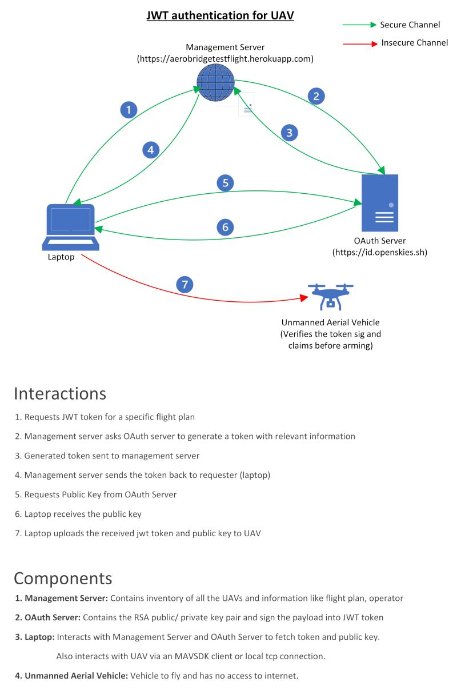

# Aerobridge Trusted Flight

## Introduction
This PR utilizes open standards (OAUTH and JWTs) to implement a basic flight permissioning mechanism. Conceptually the permissioning works in the following way: 
1. A JWT token issued against a operation
2. The JWT token, the public key of the auth server and the full chain certificate of the auth server (three items) are sent to the vehicle
3. The submodule then verifies the three and arms the drone. 

All of the actions above can be done manually but for sake of convenience and standardinzing these we use the Aerobridge Management server. The permissions are issued by via the Aerobridge Managmement Server. The server keeps track of data on missions, plans and operations and the associated permissions. In addition, Aerobridge has user management capabilities and a API to interact with the GCS that is utilized here. The sample script provides a demonstration how the API works. 

Aerobridge Trusted Flight is a mechanism to tranfer a "one time / time limited permission" via a JWT tokens to ArduPilot. We call this security layer as Trusted Flight. The following diagrams show how the mechanism works: 

1. Conceptual flow (Source: [Rhythm Chopra / LinkedIn](https://www.linkedin.com/posts/rhythm-chopra-923667102_authentication-security-opensource-activity-7035557389210644480-Hs3B))
    

        
    

2. Basic flow with the management server
    

        
    

3. Preflight checks -> Transfers the JWT token from Aerobridge Management Server which issues the flight permission to the GCS.
4. Flow with management server
    

        
    

## Pre-requisites
In order for this to work, you will need to transfer a "root of trust" to the ROMFS on the drone. In this case, the domain of the auth server which issues the JWT token validated by Let's Encrypt and we install the Let's encrypt root certificate on the droe.

## Pre-flight checks script
The [preflight checks python script](1_pre_flight_checks_load_operation.py) communicates with the drone and the Aerobridge Management Server. You will need a working instance of Aerobridge Management Server, for this purpose we will use our [Aerobridge Testflight](https://aerobridgetestflight.herokuapp.com) the digital infrastructure helps in issuing the JWT associates it with a operation. You can of course do this by yourself by hand but Aerobridge provides a standard way to communicate and make these manual commands easy. 

In the backend in addition to Aerobridge Management server you will also need OAUTH server, e.g. an instance of Flight Passport (or any other OAUTH server). The environment file will specify the end points to verify the public key data of the OAUTH server. To get support you can reach out to our Discord Channel via https://opensource.aerobridge.io

#### aerobridgetools.py 
This is a helper class to communicate with the Aerobridge Management server to download PEM files

#### data_definitions.py
A class to define data downloaded from Aerobridge

#### 1_pre_flight_checks_load_operation.py
A script to download the flight operation details and communicate with the drone

## More information
- For more information re the management server see blog post here: https://blog.openskies.sh/articles/aerobridge-trusted-flight/
- For technical introduction see these two blog posts: 
    - https://medium.com/@rhythm8/a-journey-to-offline-jwt-authentication-ebc7859f0246 
    - https://medium.com/@rhythm8/using-certificate-chain-of-trust-to-verify-jwt-offline-ab3d4c3f0322
