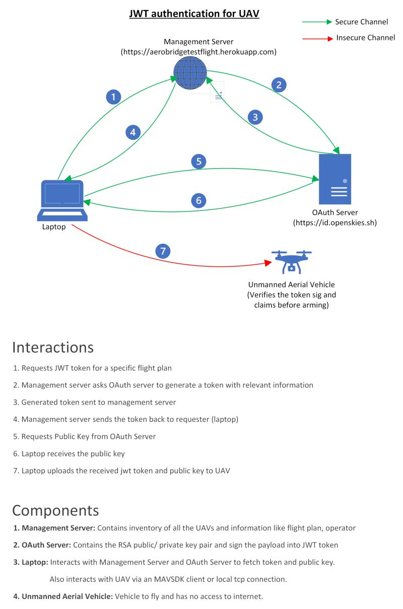
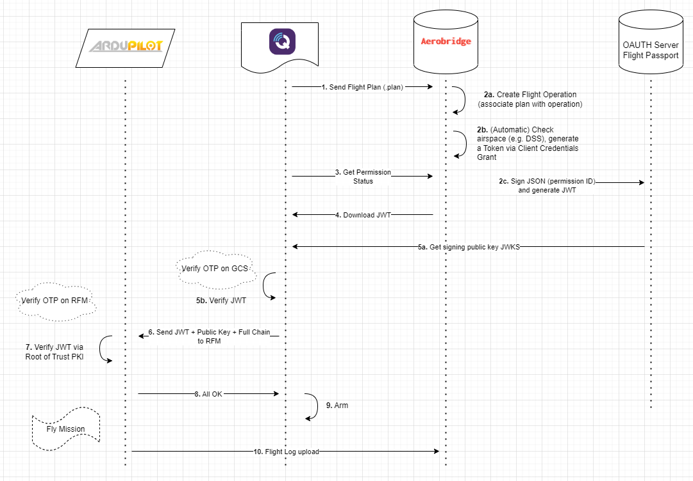
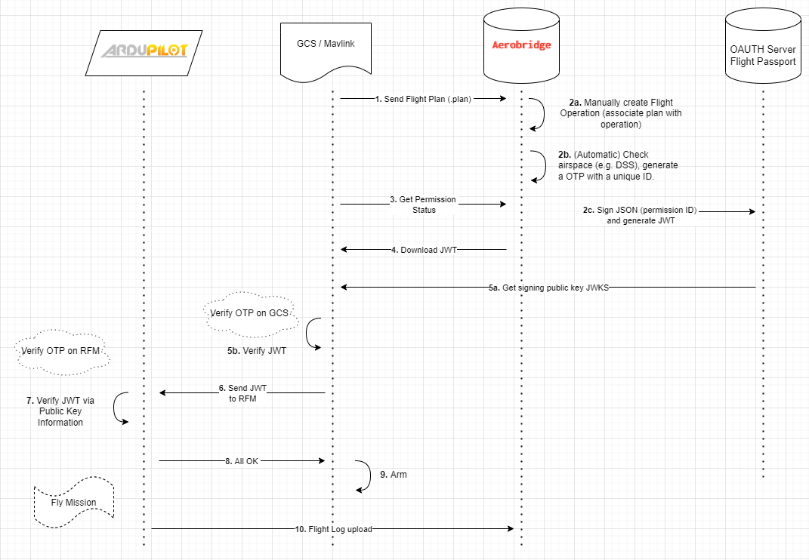

# Aerobridge Trusted Flight

## Introduction
This PR utilizes open standards (OAUTH and JWTs) to implement a basic flight permissioning mechanism. Conceptually the permissioning works in the following way: 
1. A JWT token issued against a operation
2. The JWT token and the full chain certificate of the auth server are sent to the vehicle
3. The submodule then verifies the three and arms the drone. 

All of the actions above can be done manually but for sake of convenience and standardizing these we use the Aerobridge Management server. The permission artifacts are issued by the Aerobridge Management Server. The server keeps track of data on missions, plans & operations and the associated permissions. In addition, Aerobridge has user management capabilities and an API to interact with the GCS that is utilized here. The sample script provides a demonstration how the API works.

Aerobridge Trusted Flight is a mechanism to transfer a "one time / time limited permission" via a JWT tokens to ArduPilot. We call this security layer as Trusted Flight. To enhance the security aspect of Trusted Flights, it's highly recommended to use secure bootloader by [Creating Tamperproof Firmware](https://ardupilot.org/dev/docs/secure-firmware.html). The following diagrams show how the mechanism of transferring and validating permission artifacts work:

1. Conceptual flow (Source: [Rhythm Chopra / LinkedIn](https://www.linkedin.com/posts/rhythm-chopra-923667102_authentication-security-opensource-activity-7035557389210644480-Hs3B))
    <p align="center">
        
    </p>

2. Basic flow with the management server
    <p align="center">
        
    </p>
3. Preflight checks -> Transfers the JWT token from Aerobridge Management Server which issues the flight permission to the GCS.
4. Flow with management server
    <p align="center">
        
    </p>

## Pre-requisites
In order for this to work, you will need to transfer the "root of trust" to the ROMFS on the drone. In this case, the domain of the auth server which issues the JWT token validated by Let's Encrypt and we install the Let's encrypt root certificate on the drone.

## Pre-flight checks script
The [preflight checks python script](pre_flight_checks_load_operation.py) communicates with the drone and the Aerobridge Management Server. You will need a working instance of Aerobridge Management Server, for this purpose we will use our [Aerobridge Testflight](https://aerobridgetestflight.herokuapp.com) the digital infrastructure helps in issuing the JWT associates it with a operation. You can of course do this by yourself by hand but Aerobridge provides a standard way to communicate and make these manual commands easy. 

In the backend in addition to Aerobridge Management server you will also need an OAUTH server, e.g. an instance of Flight Passport (or any other OAUTH server). The .env file will specify the end points to verify the public key data of the OAUTH server. To get support you can reach out to our Discord Channel via https://opensource.aerobridge.io

#### aerobridgetools.py 
This contains a helper class to communicate with the Aerobridge Management server to download PEM files

#### data_definitions.py
This defines Models for data downloaded from Aerobridge

#### pre_flight_checks_load_operation.py
A script to download the flight operation details and communicate with the drone

## Local testing
> [!CAUTION]
> Only intended for isolated testing. Not to use in real use-cases

In order to understand the proof of concept and overall working of the Trusted Flights flow in an isolated manner without any interactions with Aerobridge Management Server or any external source, we provide a few helper scripts that can be used to generate self signed certificate, certificate chains and token locally.

> [!CAUTION]
> Only intended for isolated testing. Not to use in real use-cases
> In the read world scenario the Root Certificate, Certificate Chain, JWT Token will be provided by the Auth Server and not generated locally to ensure the end-to-end trusted chain.

#### Steps for testing trusted flights locally
1. Move to scripts directory
    ```
    cd Tools/scripts/AP_AerobridgeTrustedFlight/
    ```
2. Generate self signed root certificate in `/tmp/trusted_flight_test` directory
    ```
    ./generate_root_cert.py /tmp/trusted_flight_test
    ```
3. Generate certificate chain and JWT token for trusted flights with 3 intermediate CAs (could be any number of intermediate CAs)
    ```
    ./generate_ca_chain_and_token.py /tmp/trusted_flight_test 3
    ```
4. Validate generate certs and tokens. This step is not essential for trusted flight workflow and only performs initialy sanity checks on generated artifacts.
    ```
    ./validate_ca_chain_and_token.py /tmp/trusted_flight_test
    ``` 
5. Build and test Trusted Flights in SITL (ArduCopter)
    - Copy `/tmp/trusted_flight_test/ca_chain.crt` and `/tmp/trusted_flight_test/token` to `ArduCopter/trusted_flight` 
        ```
        cd /path/to/ardupilot/root/ArduCopter
        mkdir trusted_flight
        cp /tmp/trusted_flight_test/ca_chain.crt trusted_flight/
        cp /tmp/trusted_flight_test/token trusted_flight/
        ```
    - Build and run SITL
        ```
        ../Tools/autotest/sim_vehicle.py --console --map --osd --trusted-flight-issuer=leaf.cname --trusted-flight-root-certificate=/tmp/trusted_flight_test/root_ca/certificate.crt
        ```
    - Arm via console
        ```
        arm throttle
        ```

6. Build and test Trusted Flights on CubeOrange
    - Build and upload firmware to CubeOrange
        ```
        cd /path/to/ardupilot/root
        ./waf clean
        ./waf configure --board CubeOrange --trusted-flight-issuer=leaf.cname --trusted-flight-root-certificate=/tmp/trusted_flight_test/root_ca/certificate.crt
        ./waf --targets bin/arducopter --upload
        ```
    - Upload `/tmp/trusted_flight_test/ca_chain.crt` and `/tmp/trusted_flight_test/token` to `/APM/trusted_flight` directory on CubeOrange
    - Arm the vehicle.

> [!NOTE]
> In case the token expires by the time you ARM the vehicle, you can override the TTL for token/ certificate and other parameters in [utils/constants.py](utils/constants.py) as per requirement

## More information
- For more information re the management server see blog post here: https://blog.openskies.sh/articles/aerobridge-trusted-flight/
- For technical introduction see these two blog posts: 
    - https://medium.com/@rhythm8/a-journey-to-offline-jwt-authentication-ebc7859f0246 
    - https://medium.com/@rhythm8/using-certificate-chain-of-trust-to-verify-jwt-offline-ab3d4c3f0322
