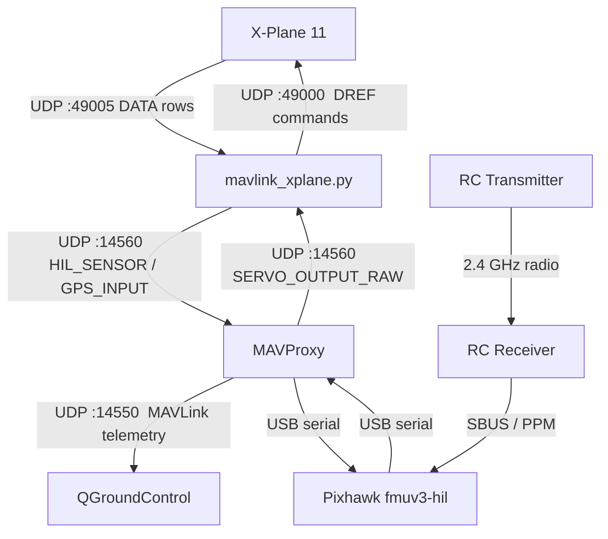
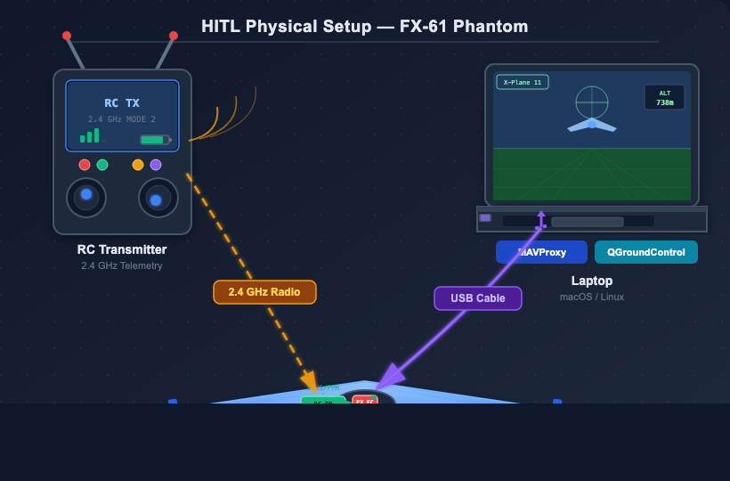

# HITL Setup — ArduPlane fmuv3-hil + X-Plane 11

Hardware-in-the-Loop (HITL) using a Pixhawk v2 (fmuv3) running custom
ArduPlane firmware. X-Plane provides the flight model; the Pixhawk runs
the real autopilot code with sensor data injected over MAVLink.

---

## Architecture



---

## Physical Setup



---

## Prerequisites

```bash
pip3 install pymavlink mavproxy
```

- **Firmware**: ArduPlane built for `fmuv3-hil` (includes HIL_SENSOR handling
  and embedded `defaults.parm`).  Flash once via Mission Planner or
  `uploader.py`.
- **X-Plane 11**: running, with a fixed-wing aircraft loaded, sim unpaused.
  In X-Plane → Settings → Net Connections → Data:
  - Send data to IP `127.0.0.1` port `49005`
  - Receive commands on port `49000` (default)

---

## Step 1 — Connect Pixhawk via USB

Plug the Pixhawk into the laptop with a USB cable.

Find the serial port:

```bash
# macOS
ls /dev/tty.usbmodem*

# Linux
ls /dev/ttyACM*
```

Note the port, e.g. `/dev/tty.usbmodem1101`.

---

## Step 2 — Run MAVProxy (serial → UDP mux)

MAVProxy bridges the USB serial link and fans out MAVLink to both
QGroundControl and the bridge script.

```bash
mavproxy.py \
  --master /dev/tty.usbmodem1101 \
  --baudrate 115200 \
  --out udp:127.0.0.1:14550 \
  --out udp:127.0.0.1:14560 \
  --daemon
```

- Replace `/dev/tty.usbmodem1101` with your actual port.
- `--daemon` keeps MAVProxy in the background (omit to keep it in the
  foreground for debugging).
- Leave this terminal open / running before starting anything else.

Confirm it connects — you should see heartbeat lines or no error output.

---

## Step 3 — Run QGroundControl

Open **QGroundControl**.  It will auto-connect to `UDP :14550`.

You should see:
- Vehicle connected (ArduPlane)
- Parameters loaded
- Flight mode displayed (e.g. MANUAL)

QGC is used for flight planning, mode changes, and parameter tuning.
It does **not** need to be started before MAVProxy.

---

## Step 4 — Run mavlink_xplane.py

```bash
cd /path/to/ardupilot

python3 mavlink_xplane.py \
  --pixhawk udp:127.0.0.1:14560 \
  --xplane-host 127.0.0.1 \
  --xplane-port 49000 \
  --bind-port 49005 \
  --gps-rate 5 \
  --hil-rate 100
```

Add `--debug` to print attitude, sensor, and DREF values every 5 s.

### Expected startup output

```
[MAV] Connecting to udp:127.0.0.1:14560 …
[MAV] Heartbeat  sysid=1  compid=0
[XP]  Listening on :49005  →  ('127.0.0.1', 49000)
[XP]  Parking brake SET
[XP]  DSEL rows [1, 3, 4, 16, 17, 20, 21]

Running — Ctrl+C to stop

[XP]  X-Plane 11 (build 115501)
[XP]  First DREF → ('127.0.0.1', 49000)
[GPS] lat=-6.900300  lon=107.575200  alt=738.0 m  hdg=103.0°
[SRV] ail=1500 elev=1500 thr=1100 rud=1500  (50 msg/s)
```

### Troubleshooting

| Symptom | Likely cause | Fix |
|---|---|---|
| `[wait] No X-Plane DATA@` | X-Plane not sending data | Check Net Connections in X-Plane; unpause sim |
| `[XP] First DREF` never prints | No SERVO_OUTPUT_RAW from FC | Check MAVProxy is running; FC is armed or ARMING_REQUIRE=0 |
| Controls don't move in X-Plane | Override DREFs lost | Wait up to 5 s for automatic refresh; reload X-Plane aircraft |
| EKF not initialising | GPS_INPUT not accepted | Verify GPS1_TYPE=14 in QGC parameters |
| Heading wrong | Hardware compass active | Verify COMPASS_USE=0,1,2 are set (embedded in defaults.parm) |

---

## Step 5 — Run X-Plane 11

1. Open **X-Plane 11** and load a fixed-wing aircraft at the target airport.

2. Configure network output (only needed once — X-Plane saves the setting):
   - Go to **Settings → Net Connections → Data**
   - Under **Send network data output**, enable and set:
     - IP address: `127.0.0.1`
     - Port: `49005`
   - Under **Accept network data input**, port should be `49000` (default).

3. Enable the required DATA@ rows in X-Plane's **Data Output** panel
   (**Settings → Data Output**).  Tick **"Send data over the net"** for each row:

   | Row # | Name | Fields used |
   |---|---|---|
   | 1 | Frame rate | sim time (elapsed seconds) |
   | 3 | Speeds | IAS (knots) → diff pressure for airspeed sensor |
   | 4 | G-load | body-frame accelerations (x, y, z) |
   | 16 | Angular velocities | roll/pitch/yaw rate → gyro |
   | 17 | Pitch, roll, heading | attitude + true heading → GPS yaw |
   | 20 | Lat, lon, altitude | GPS position |
   | 21 | Loc, vel, dist | NED velocity → GPS velocity |

   Rows that are **not** ticked will not be sent and the bridge will silently
   use stale/zero values for those sensors.

3. **Unpause** the simulation (press `P` or click the pause button).

Once unpaused, `mavlink_xplane.py` will start receiving `DATA@` packets and
inject sensor data into the Pixhawk.  You should see `[GPS]` lines updating
every second and the aircraft attitude in QGC matching X-Plane.

---

## Parameter notes

All required parameters are embedded in `defaults.parm` and applied
automatically on first boot with clean EEPROM.  Key values:

| Parameter | Value | Purpose |
|---|---|---|
| `GPS1_TYPE` | 14 | Accept GPS_INPUT MAVLink messages |
| `ARSPD_TYPE` | 100 | SITL airspeed backend (reads HIL_SENSOR diff pressure) |
| `EK3_SRC1_YAW` | 2 | Yaw from GPS_INPUT heading field |
| `COMPASS_USE` | 0 | Disable hardware compass fusion |
| `SCHED_LOOP_RATE` | 100 | Allow 50 Hz SERVO_OUTPUT_RAW stream |
| `BRD_SAFETY_DEFLT` | 0 | Disable safety switch requirement |

To reset parameters to defaults (e.g. after flashing new firmware):

```bash
# In MAVProxy console
param set FORMAT_VERSION 0
reboot
```

---

## Stopping

1. `Ctrl+C` in the `mavlink_xplane.py` terminal.
2. Close QGroundControl.
3. `Ctrl+C` in the MAVProxy terminal (or `quit` in the MAVProxy console).
