# ArduPilot Air Sensor Library

This library is an abstraction over the various air sensing libraries to provide a common interface for retrieving sensor data that describes the wind. In the future, 
it could provide other data such as temperature, humidity, turbulence, and provide the autopilot with data on adverse 
weather conditions such as rain, fog or clouds that may impact flight safety.

# Architecture

This follows the battery monitor and GPS architecture with different types such as AP_Battery_Scripting.

```mermaid
---
title: ArduPilot Air Sensor Class Hierarchy
---
classDiagram

    class Type {
        <<enumeration>>
        NONE = 0
        AIRSPEED = 1
        WINDVANE = 2
        SCRIPT = 3
        SITL = 4
        DRONECAN = 5
        EAHRS = 6
        MAV = 7
    }

    class State {
        <<struct>>
        Vector3f airspeed
        bool has_temperature
        float temperature
        bool has_pressure
        float pressure
    }

    class Params {
        <<struct>>
        Array[Type]
    }

    class AP_AirSensor {
        +bool enabled(const uint8_t i) const
        +bool healthy(const uint8_t i) const
        +void update()
        +uint8_t num_sensors() const
        +bool get_temperature(uint8_t i, float &temperature) const
        +bool get_pressure(uint8_t i, float &pressure) const
        +bool can_calibrate() const
        +CalibrationState get_calibration_state() const
        +enum Type configured_type(uint8_t instance) const
        +Vector3f get_airspeed(const uint8_t i) const
        +static AP_AirSensor* get_singleton()
        -Array[State] state[AIR_SENSOR_MAX_SENSORS]
        -AP_AirSensorBackend* sensor[AIR_SENSOR_MAX_SENSORS]
    }

    class AP_AirSensorBackend {
        +AP_AirSensorBackend AP_AirSensorBackend(AP_AirSensor &_sensor, AP_AirSensor::Params &_params, AP_AirSensor:State &_state)
        +void update()
        +void calibrate(bool in_startup)
        +Type configured_type(uint8_t instance) const
        +bool get_temperature(uint8_t i, float &temperature) const
    }

    %%note for AP_AirSensorAirspeed "The AirSensor backend for AP_Airspeed"
    class AP_AirSensorAirspeed {
        +^bool enabled(const uint8_t i) const
        +^void update()
        +^bool healthy(const uint8_t i) const
        +^Vector3f get_airspeed(const uint8_t i) const
    }

    class AP_AirSensorWindVane {
        +^bool enabled(const uint8_t i) const
        +^void update()
        +^bool healthy(const uint8_t i) const
        +^Vector3f get_airspeed(const uint8_t i) const
    }

    class AP_AirSensorScripting {
        +^bool enabled(const uint8_t i) const
        +^void update()
        +^bool healthy(const uint8_t i) const
        +^Vector3f get_airspeed(const uint8_t i) const
    }

    class AP_AirSensorSITL {
        +^bool enabled(const uint8_t i) const
        +^void update()
        +^bool healthy(const uint8_t i) const
        +^Vector3f get_airspeed(const uint8_t i) const
    }

    class AP_AirSensorDroneCAN {
        +^bool enabled(const uint8_t i) const
        +^void update()
        +^bool healthy(const uint8_t i) const
        +^Vector3f get_airspeed(const uint8_t i) const
    }

    class AP_AirSensorEAHRS {
        +^bool enabled(const uint8_t i) const
        +^void update()
        +^bool healthy(const uint8_t i) const
        +^Vector3f get_airspeed(const uint8_t i) const
    }

    class AP_AirSensorMAV {
        +^bool enabled(const uint8_t i) const
        +^void update()
        +^bool healthy(const uint8_t i) const
        +^Vector3f get_airspeed(const uint8_t i) const
    }

    AP_AirSensorBackend <|-- AP_AirSensorAirspeed
    AP_AirSensorBackend <|-- AP_AirSensorWindVane
    AP_AirSensorBackend <|-- AP_AirSensorScripting
    AP_AirSensorBackend <|-- AP_AirSensorSITL
    AP_AirSensorBackend <|-- AP_AirSensorDroneCAN
    AP_AirSensorBackend <|-- AP_AirSensorEAHRS
    AP_AirSensorBackend <|-- AP_AirSensorMAV

    AP_AirSensor *-- Type : "enum"
    AP_AirSensor *-- State : "state"
    AP_AirSensor *-- "AIR_SENSOR_MAX_SENSORS" AP_AirSensorBackend
```

# Scripting

The scripting support is intended to allow for quick adoption of new air sensors.
This is similar to the following drivers:
* AP_Camera_Scripting
* AP_EFI_Scripting
* AP_Mount_Scripting
* AP_Proximity_Scripting
* AP_BattMonitor_Scripting
* AP_MotorsMatrix_6DoF_Scripting