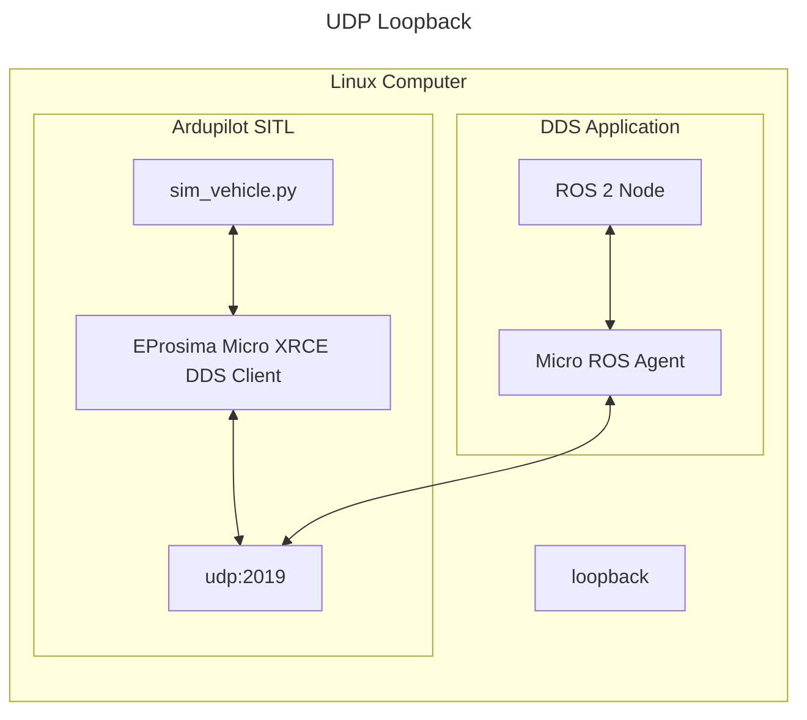
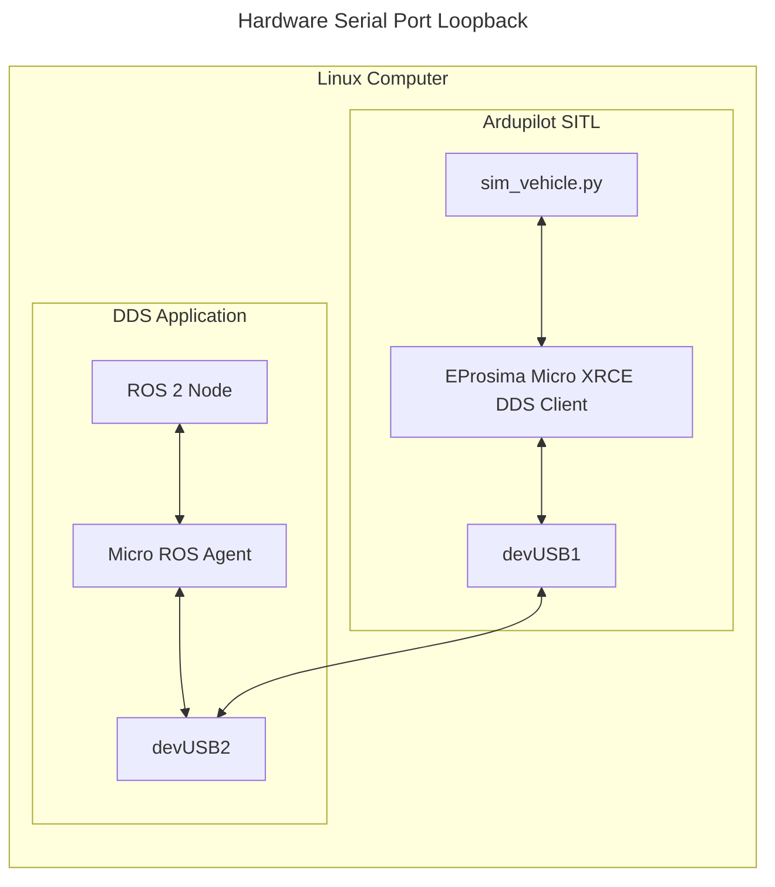

# Testing with DDS/micro-Ros

## Architecture

Ardupilot contains the DDS Client library, which can run as SITL. Then, the DDS application runs a ROS 2 node, an eProsima Integration Service, and the MicroXRCE Agent. The two systems communicate over serial or UDP.






## Installing Build Dependencies

While DDS support in Ardupilot is mostly through git submodules, another tool needs to be available on your system: Micro XRCE DDS Gen.

Follow the wiki [here](https://ardupilot.org/dev/docs/ros2.html#installation-ubuntu) to set up your environment.

### Serial Only: Set up serial for SITL with DDS

On Linux, creating a virtual serial port will be necessary to use serial in SITL, because of that install socat.

```
sudo apt-get update
sudo apt-get install socat
```

## Setup ardupilot for SITL with DDS

Set up your [SITL](https://ardupilot.org/dev/docs/setting-up-sitl-on-linux.html).
Run the simulator with the following command. If using UDP, the only parameter you need to set it `DDS_ENABLE`.

| Name | Description | Default |
| - | - | - |
| DDS_ENABLE | Set to 1 to enable DDS, or 0 to disable | 1 |
| SERIAL1_BAUD | The serial baud rate for DDS | 57 |
| SERIAL1_PROTOCOL | Set this to 45 to use DDS on the serial port | 0 |
```console
# Wipe params till you see "AP: ArduPilot Ready"
# Select your favorite vehicle type
sim_vehicle.py -w -v ArduPlane --console -DG --enable-dds

# Only set this for Serial, which means 115200 baud
param set SERIAL1_BAUD 115
# See libraries/AP_SerialManager/AP_SerialManager.h AP_SerialManager SerialProtocol_DDS_XRCE
param set SERIAL1_PROTOCOL 45
```

DDS is currently enabled by default, if it's part of the build. To disable it, run the following and reboot the simulator.
```
param set DDS_ENABLE 0
REBOOT
```

## Setup ROS 2 and micro-ROS

Follow the steps to use the microROS Agent

- Install ROS Humble (as described here)

  - https://docs.ros.org/en/humble/Installation/Ubuntu-Install-Debians.html

- Install geographic_msgs
  ```console
  sudo apt install ros-humble-geographic-msgs
  ```

- Install and run the microROS agent (as described here). Make sure to use the `humble` branch.
  - Follow [the instructions](https://micro.ros.org/docs/tutorials/core/first_application_linux/) for the following:

    - Do "Installing ROS 2 and the micro-ROS build system"
      - Skip the docker run command, build it locally instead
    - Skip "Creating a new firmware workspace"
    - Skip "Building the firmware"
    - Do "Creating the micro-ROS agent"
    - Source your ROS workspace

## Using the ROS 2 CLI to Read Ardupilot Data

After your setups are complete, do the following:
- Source the ROS 2 installation
  ```console
  source /opt/ros/humble/setup.bash
  ```

Next, follow the associated section for your chosen transport, and finally you can use the ROS 2 CLI.

### UDP (recommended for SITL)

- Run the microROS agent
  ```console
  cd ardupilot/libraries/AP_DDS
  ros2 run micro_ros_agent micro_ros_agent udp4 -p 2019
  ```
- Run SITL (remember to kill any terminals running ardupilot SITL beforehand)
  ```console
  sim_vehicle.py -v ArduPlane -DG --console --enable-dds
  ```

### Serial

- Start a virtual serial port with socat. Take note of the two `/dev/pts/*` ports. If yours are different, substitute as needed.
  ```console
  socat -d -d pty,raw,echo=0 pty,raw,echo=0
  >>> 2023/02/21 05:26:06 socat[334] N PTY is /dev/pts/1
  >>> 2023/02/21 05:26:06 socat[334] N PTY is /dev/pts/2
  >>> 2023/02/21 05:26:06 socat[334] N starting data transfer loop with FDs [5,5] and [7,7]
  ```
- Run the microROS agent
  ```console
  cd ardupilot/libraries/AP_DDS
  # assuming we are using tty/pts/2 for DDS Application
  ros2 run micro_ros_agent micro_ros_agent serial -b 115200 -D /dev/pts/2
  ```
- Run SITL (remember to kill any terminals running ardupilot SITL beforehand)
  ```console
  # assuming we are using /dev/pts/1 for Ardupilot SITL
  sim_vehicle.py -v ArduPlane -DG --console --enable-dds -A "--serial1=uart:/dev/pts/1"
  ```

## Use ROS 2 CLI

You should be able to see the agent here and view the data output.

```bash
$ ros2 node list
/ardupilot_dds
```

```bash
$ ros2 topic list -v
Published topics:
 * /ap/battery/battery0 [sensor_msgs/msg/BatteryState] 1 publisher
 * /ap/clock [rosgraph_msgs/msg/Clock] 1 publisher
 * /ap/geopose/filtered [geographic_msgs/msg/GeoPoseStamped] 1 publisher
 * /ap/gps_global_origin/filtered [geographic_msgs/msg/GeoPointStamped] 1 publisher
 * /ap/imu/experimental/data [sensor_msgs/msg/Imu] 1 publisher
 * /ap/navsat/navsat0 [sensor_msgs/msg/NavSatFix] 1 publisher
 * /ap/pose/filtered [geometry_msgs/msg/PoseStamped] 1 publisher
 * /ap/tf_static [tf2_msgs/msg/TFMessage] 1 publisher
 * /ap/time [builtin_interfaces/msg/Time] 1 publisher
 * /ap/twist/filtered [geometry_msgs/msg/TwistStamped] 1 publisher
 * /parameter_events [rcl_interfaces/msg/ParameterEvent] 1 publisher
 * /rosout [rcl_interfaces/msg/Log] 1 publisher

Subscribed topics:
 * /ap/cmd_gps_pose [ardupilot_msgs/msg/GlobalPosition] 1 subscriber
 * /ap/cmd_vel [geometry_msgs/msg/TwistStamped] 1 subscriber
 * /ap/joy [sensor_msgs/msg/Joy] 1 subscriber
 * /ap/tf [tf2_msgs/msg/TFMessage] 1 subscriber
```

```bash
$ ros2 topic hz /ap/time
average rate: 50.115
        min: 0.012s max: 0.024s std dev: 0.00328s window: 52
```

```bash
$ ros2 topic echo /ap/time
sec: 1678668735
nanosec: 729410000
```

```bash
$ ros2 service list
/ap/arm_motors
/ap/mode_switch
---
```

The static transforms for enabled sensors are also published, and can be received like so:

```bash
ros2 topic echo /ap/tf_static --qos-depth 1 --qos-history keep_last --qos-reliability reliable --qos-durability transient_local --once
```

In order to consume the transforms, it's highly recommended to [create and run a transform broadcaster in ROS 2](https://docs.ros.org/en/humble/Concepts/About-Tf2.html#tutorials).

## Using ROS 2 services

The `AP_DDS` library exposes services which are automatically mapped to ROS 2 
services using appropriate naming conventions for topics and message and service
types. An earlier version of `AP_DDS` required the use of the eProsima
[Integration Service](https://github.com/eProsima/Integration-Service) to map
the request / reply topics from DDS to ROS 2, but this is no longer required.

List the available services:

```bash
$ ros2 service list -t
/ap/arm_motors [ardupilot_msgs/srv/ArmMotors]
/ap/mode_switch [ardupilot_msgs/srv/ModeSwitch]
```

Call the arm motors service:

```bash
$ ros2 service call /ap/arm_motors ardupilot_msgs/srv/ArmMotors "{arm: True}"
requester: making request: ardupilot_msgs.srv.ArmMotors_Request(arm=True)

response:
ardupilot_msgs.srv.ArmMotors_Response(result=True)
```

Call the mode switch service:

```bash
$ ros2 service call /ap/mode_switch ardupilot_msgs/srv/ModeSwitch "{mode: 4}"
requester: making request: ardupilot_msgs.srv.ModeSwitch_Request(mode=4)

response:
ardupilot_msgs.srv.ModeSwitch_Response(status=True, curr_mode=4)
```
 
## Contributing to `AP_DDS` library

### Adding DDS messages to Ardupilot

Unlike the use of ROS 2 `.msg` files, since Ardupilot supports native DDS, the message files follow [OMG IDL DDS v4.2](https://www.omg.org/spec/IDL/4.2/PDF).
This package is intended to work with any `.idl` file complying with those extensions.

Over time, these restrictions will ideally go away.

To get a new IDL file from ROS 2, follow this process:

```bash
cd ardupilot
source /opt/ros/humble/setup.bash

# Find the IDL file
find /opt/ros/$ROS_DISTRO -type f -wholename \*builtin_interfaces/msg/Time.idl

# Create the directory in the source tree if it doesn't exist similar to the one found in the ros directory
mkdir -p libraries/AP_DDS/Idl/builtin_interfaces/msg/

# Copy the IDL
cp /opt/ros/humble/share/builtin_interfaces/msg/Time.idl libraries/AP_DDS/Idl/builtin_interfaces/msg/

# Build the code again with the `--enable-dds` flag as described above
```

If the message is custom for ardupilot, first create the ROS message in `Tools/ros2/ardupilot_msgs/msg/GlobalPosition.msg`.
Then, build ardupilot_msgs with colcon.
Finally, copy the IDL folder from the install directory into the source tree.

### Rules for adding topics and services

Topics and services available from `AP_DDS` are automatically mapped into ROS 2
provided a few rules are followed when defining the entries in the
topic and service tables.

#### ROS 2 message and service interface types

ROS 2 message and interface definitions are mangled by the `rosidl_adapter` when
mapping from ROS 2 to DDS to avoid naming conflicts in the C/C++ libraries.
The ROS 2 object `namespace::Struct` is mangled to `namespace::dds_::Struct_`
for DDS. The table below provides some example mappings: 

| ROS 2 | DDS |
| --- | --- |
| `rosgraph_msgs::msg::Clock` | `rosgraph_msgs::msg::dds_::Clock_` |
| `sensor_msgs::msg::NavSatFix` | `sensor_msgs::msg::dds_::NavSatFix_` |
| `ardupilot_msgs::srv::ArmMotors_Request` | `ardupilot_msgs::srv::dds_::ArmMotors_Request_` |
| `ardupilot_msgs::srv::ArmMotors_Response` | `ardupilot_msgs::srv::dds_::ArmMotors_Response_` |

Note that a service interface always requires a Request / Response pair.

#### ROS 2 topic and service names

The ROS 2 design article: [Topic and Service name mapping to DDS](https://design.ros2.org/articles/topic_and_service_names.html) describes the mapping of ROS 2 topic and service
names to DDS. Each ROS 2 subsystem is provided a prefix when mapped to DDS.
The request / response pair for services require an additional suffix.

| ROS 2 subsystem | DDS Prefix | DDS Suffix |
| --- | --- | --- |
| topics | rt/ | |
| service request | rq/ | Request |
| service response | rr/ | Reply |
| service | rs/ | |
| parameter | rp/ | |
| action | ra/ | |

The table below provides example mappings for topics and services 

| ROS 2 | DDS |
| --- | --- |
| ap/clock | rt/ap/clock |
| ap/navsat/navsat0 | rt/ap/navsat/navsat0 |
| ap/arm_motors | rq/ap/arm_motorsRequest, rr/ap/arm_motorsReply |

Refer to existing mappings in [`AP_DDS_Topic_Table`](https://github.com/ArduPilot/ardupilot/blob/master/libraries/AP_DDS/AP_DDS_Topic_Table.h)
and [`AP_DDS_Service_Table`](https://github.com/ArduPilot/ardupilot/blob/master/libraries/AP_DDS/AP_DDS_Service_Table.h)
for additional details.

### Development Requirements

Astyle is used to format the C++ code in AP_DDS. This is required for CI to pass the build.
See [Tools/CodeStyle/ardupilot-astyle.sh](../../Tools/CodeStyle/ardupilot-astyle.sh).

```bash
./Tools/CodeStyle/ardupilot-astyle.sh libraries/AP_DDS/*.h libraries/AP_DDS/*.cpp
```

Pre-commit is used for other things like formatting python and XML code.
This will run the tools automatically when you commit. If there are changes, just add them back your staging index and commit again.

1. Install [pre-commit](https://pre-commit.com/#installation) python package.
1. Install ArduPilot's hooks in the root of the repo, then commit like normal
  ```bash
  cd ardupilot
  pre-commit install
  git commit
  ```

## Testing DDS on Hardware

### With Serial

The easiest way to test DDS is to make use of some boards providing two serial interfaces over USB such as the Pixhawk 6X.
The [Pixhawk6X/hwdef.dat](../AP_HAL_ChibiOS/hwdef/Pixhawk6X/hwdef.dat) file has this info.
```
SERIAL_ORDER OTG1 UART7 UART5 USART1 UART8 USART2 UART4 USART3 OTG2
```

For example, build, flash, and set up OTG2 for DDS
```bash
./waf configure --board Pixhawk6X --enable-dds
./waf plane --upload
mavproxy.py --console
param set DDS_ENABLE 1
# Check the hwdef file for which port is OTG2
param set SERIAL8_PROTOCOL 45
param set SERIAL8_BAUD 115
reboot
```

Then run the Micro ROS agent
```bash
cd /path/to/ros2_ws
source install/setup.bash
cd src/ardupilot/libraries/AP_DDS
ros2 run micro_ros_agent micro_ros_agent serial -b 115200 -D /dev/serial/by-id/usb-ArduPilot_Pixhawk6X_210028000151323131373139-if02
```

If connection fails, instead of running the Micro ROS agent, debug the stream
```bash
python3 -m serial.tools.miniterm /dev/serial/by-id/usb-ArduPilot_Pixhawk6X_210028000151323131373139-if02  115200 --echo --encoding hexlify
```

The same steps can be done for physical serial ports once the above works to isolate software and hardware issues.
