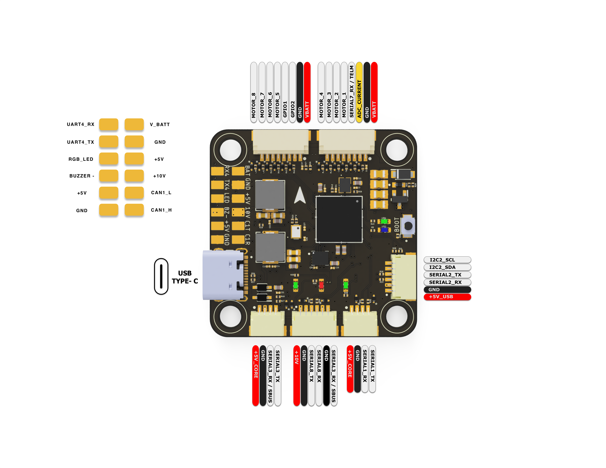

# AEDROX H7 Flight Controller

## Features

- STM32H743 microcontroller
- ICM42688-P IMU with external clock
- DPS368 barometer
- 10V 2.3A BEC, GPIO controlled; 5V 2.3A BEC
- Flash Memory
- 6x UART
- 9sx PWM
- 1x I2C
- 1x CAN
- 2x GPIOs

## Pinout

## UART Mapping

 - SERIAL0 -> USB
 - SERIAL1 -> UART1 (MAVLink2, DMA-enabled)
 - SERIAL2 -> UART2 (GPS, DMA-enabled)
 - SERIAL3 -> UART3 (RCIN, DMA-enabled) 
 - SERIAL4 -> UART4 (MAVLink2, DMA-enabled)
 - SERIAL7 -> UART7 (ESC Telemetry, DMA-enabled)
 - SERIAL8 -> UART8 (DisplayPort, DMA-enabled)

## RC Input

The default RC input is configured on the UART3 (RX3/SBUS). Non SBUS,  single wire serial inputs can be directly tied to RX3 if SBUS pin is left unconnected. RC could  be applied instead at a different UART port such as UART4 or UART8, and set the protocol to receive RC data: ``SERIALn_PROTOCOL = 23`` and change SERIAL3 _Protocol to something other than '23'.

- PPM is supported.  
- SBUS/DSM/SRXL connects to the RX3 pin.  
- FPort requires connection to TX3. Set :ref:`SERIAL3_OPTIONS<SERIAL3_OPTIONS>` = 7  
- CRSF/ELRS also requires both TX3 and RX3 connections and provides telemetry automatically.

## OSD Support

Onboard OSD using OSD_TYPE 1 (MAX7456 driver) is supported by default. Simultaneously, DisplayPort OSD is available on the HD VTX connector.

## VTX Support

The SH1.0-6P connector supports a DJI Air Unit / HD VTX connection. Protocol defaults to DisplayPort. Pin 1 of the connector is 10v so be careful not to connect this to a peripheral requiring 5v. DisplayPort OSD is enabled by default on SERIAL8.

## VTX power control

GPIO 83 controls the VTX BEC output to pins marked "12V" and is included on the HD VTX connector. Setting this GPIO low removes voltage supply to this pin/pad. By default RELAY3 is configured to control this pin and sets the GPIO high.

## PWM Output

The SPEDIX F405 supports up to 9 PWM (8 + LED) outputs. The pads for motor output
M1 to M8 are provided on both the motor connectors and on separate pads, plus
M9 on a separate pad for LED strip (default configuration) or another PWM output.

The PWM is in 4 groups:

* PWM 1-4 in group1
* PWM 5-8 in group2
* PWM 9 (LED) in group3

Channels within the same group need to use the same output rate. If
any channel in a group uses DShot then all channels in the group need
to use DShot. Channels 1-8 support bi-directional dshot.

## Battery Monitoring

The board has a internal voltage sensor and connections on the ESC connector for an external current sensor input.
The voltage sensor can handle up to 6S LiPo batteries.

The default battery parameters are:

 - :ref:BATT_MONITOR<BATT_MONITOR> = 4
 - :ref:BATT_VOLT_PIN<BATT_VOLT_PIN__AP_BattMonitor_Analog> = 10
 - :ref:BATT_CURR_PIN<BATT_CURR_PIN__AP_BattMonitor_Analog> = 11 (CURR pin)
 - :ref:BATT_VOLT_MULT<BATT_VOLT_MULT__AP_BattMonitor_Analog> = 11.0
 - :ref:BATT_AMP_PERVLT<BATT_AMP_PERVLT__AP_BattMonitor_Analog> = 40

## Compass

The AEDROXH7 does not have a built-in compass, but you can attach an external compass using I2C on the SDA and SCL connector.

## GPIOs

The numbering of the GPIOs for PIN variables in ardupilot is:

 - GPIO1 pin is ArduPilot GPIO 81
 - GPIO2 pin is ArduPilot GPIO 82

## Physical

- Mounting: 30.5 x 30.5mm, 4mm
- Dimensions: 38 x 38 x 5 mm
- Weight: 8.5g

## Firmware

Firmware for the AEDROXH7 is available from [ArduPilot Firmware Server](https://firmware.ardupilot.org) under the `AEDROXH7` target.

## Loading Firmware

To flash firmware initially, connect USB while holding the bootloader button and use DFU to load the `with_bl.hex` file. Subsequent updates can be applied using `.apj` files through a ground station.
