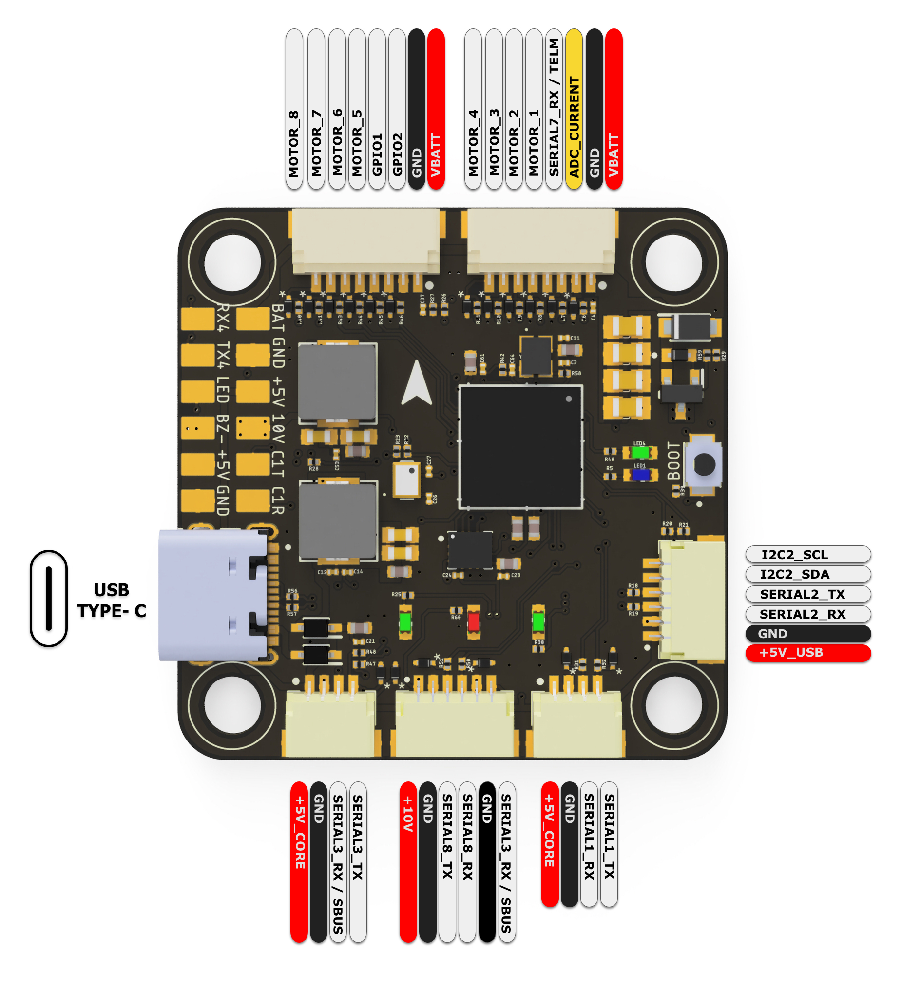

# AEDROX H7 Flight Controller

## Features

- STM32H743 microcontroller
- ICM42688-P IMU with external clock
- DPS368 barometer
- 10V 2.3A BEC, GPIO controlled; 5V 2.3A BEC
- Flash Memory
- 6x UART
- 8x PWM
- 1x I2C
- 1x SPI
- 1x SWD
- 2x GPIOs

## Pinout

## UART Mapping

 - SERIAL0 -> USB
 - SERIAL1 -> UART1 (MAVLink2, DMA-enabled)
 - SERIAL2 -> UART2 (GPS, DMA-enabled)
 - SERIAL3 -> UART3 (RCIN, DMA-enabled) 
 - SERIAL4 -> UART4 (MAVLink2, DMA-enabled)
 - SERIAL5 -> UART7 (ESC Telemetry, DMA-enabled)
 - SERIAL6 -> UART8 (MAVLink2, DMA-enabled)

## RC Input

The default RC input is configured on the UART3 (SBUS). Non SBUS,  single wire serial inputs can be directly tied to RX3 if SBUS pin is left unconnected. RC could  be applied instead at a different UART port such as UART1, UART4 or UART8, and set the protocol to receive RC data: `SERIALn_PROTOCOL=23` and change SERIAL3 _Protocol to something other than '23'.

## VTX Support

The SH1.0-6P connector supports a DJI Air Unit / HD VTX connection. Protocol defaults to DisplayPort. Pin 1 of the connector is 10v so be careful not to connect this to a peripheral requiring 5v.

## PWM Output

The AEDROXH7 supports up to 8 PWM outputs. All channels support bi-directional DShot.

PWM outputs are grouped and every group must use the same output protocol:

1, 2, 3, 4 are Group1;

5, 6, 7, 8 are Group 2;

## Battery Monitoring

The board has a internal voltage sensor and connections on the ESC connector for an external current sensor input.
The voltage sensor can handle up to 6S LiPo batteries.

The default battery parameters are:

 - BATT_MONITOR 4
 - BATT_VOLT_PIN 10
 - BATT_CURR_PIN 11
 - BATT_VOLT_MULT 11
 - BATT_CURR_SCALE 40

## Compass

The AEDROXH7 does not have a built-in compass, but you can attach an external compass using I2C on the SDA and SCL connector.

## GPIOs

The remaining 3 outputs (labelled AUX1 to AUX3) are the "auxiliary" outputs. These are directly attached to the STM32H743.

The numbering of the GPIOs for PIN variables in ardupilot is:

 - AUX1 - PA2 - 81
 - AUX2 - PA3 - 82
 - AUX3 - PB12 - 83  #10V power supply ON/OFF switch

## Physical

- Mounting: 30.5 x 30.5mm, 4mm
- Dimensions: 38 x 38 x 5 mm
- Weight: 8.5g

## Ports Connector

IMAGE / CONNECTION DIAGRAM

## Loading Firmware

Initial firmware load can be done with DFU by plugging in USB with the bootloader button pressed. Then you should load the "with_bl.hex" firmware, using your favorite DFU loading tool. #STM32CUBE recommended

Once the initial firmware is loaded you can update the firmware using any ArduPilot ground station software. Updates should be done with the "*.apj" firmware files.
