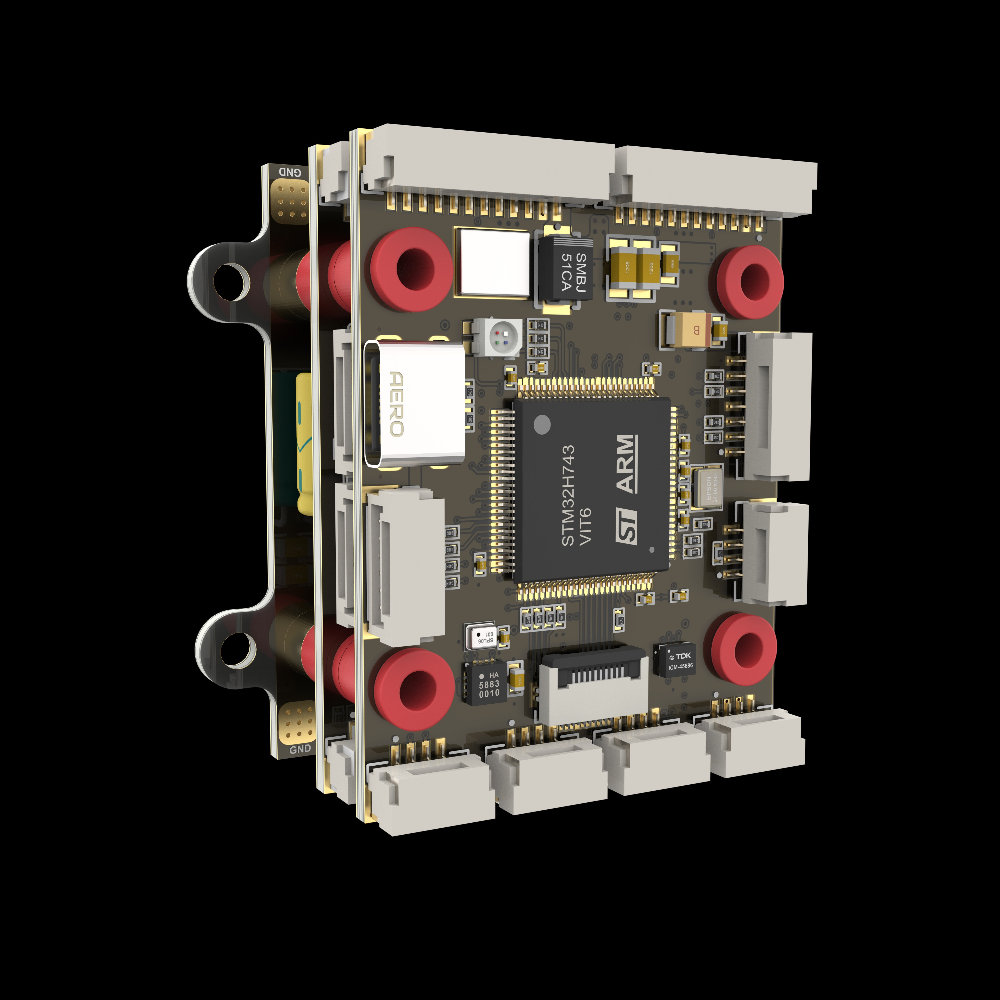

# AEROFOX-H7 Flight Controller

The AEROFOX-H7 is a flight controller produced by AEROFOX(http://aerofox.cn)

## Features
    Processor
        STM32H743

    Sensors
        ADIS16470 (appears in the advanced version)
        ICM45686 (appears in the advanced version)
        ICM42688
        QMC5883L
        SPL06-001

    Power
        2S-12S (MAX60V) Lipo input voltage
        5V BEC for system power supply( 5V peripheral current limit 1.2A)
        5V/12V BEC for VTX( Current limit 2.5A, need strong heat dissipation)
        Dual power automatic switching and condition monitoring
        
    Interfaces
        16x PWM output
        7x UARTs for RC, TELEM, GPS and other peripherals
        2x I2C ports for external compass, airspeed, baro
        2x CAN port
        4x Relay output
        4x ADC input

    FPC connector
        The connector includes an SPI, an I2C, an PWM IMU heating control pin.

## Pinout

## UART Mapping

All UARTs, except UART1, are DMA enabled. UART corresponding to each SERIAL port, and its default protocol, are shown below:
- SERIAL0 -> USB (MAVLink2)
- SERIAL1 -> UART7 (ESC Telemetry)
- SERIAL2 -> UART4 (User configured)
- SERIAL3 -> UART5 (User configured)
- SERIAL4 -> USART2 (User configured)
- SERIAL5 -> USART1 (GPS)
- SERIAL6 -> UART8 (RCIN)
- SERIAL7 -> USART3 (MAVLink2)

## RC Input

SERIAL 6 is configured for RC input by default and is compatible with all ArduPilot supported protocols except PPM. For protocols requiring half-duplex serial to transmit telemetry (such as FPort) you should set SERAIL6_OPTIONS = 4 (Half-Duplex)

## PWM Output

The AEROFOXH7 support up to 16PWM outputs. All pins support DShot. Outputs 1-8 support bi-directional DShot.

The 16 PWM outputs are in 9 groups:

- PWM 1,2 in group1
- PWM 3,4  in group2
- PWM 5,6  in group3
- PWM 7,8 in group4
- PWM 9,10  in group5
- PWM 11  in group6
- PWM 12 in group7
- PWM 13,14 in group8
- PWM 15,16 in group9

Channels within the same group need to use the same output rate. If any channel in a group uses DShot, then all channels in that group need to use DShot.

## Battery Monitoring

The board has a builting voltage and current sensor. The voltage sensor can handle up
to 12S LiPo batteries.

### The power A is onboard voltage sensor
It is enabled by default and has the following parameters set by default:s
- BATT_MONITOR 4
- BATT_VOLT_PIN 19
- BATT_CURR_PIN 9
- BATT_VOLT_MULT 21
- BATT_AMP_PERVL 40

### The power B is external PMU input
An additional power monitor input is provided and can be enabled by setting:
- BATT_MONITOR 4, then reboot and set the following:
- BATT_VOLT_PIN 10
- BATT_CURR_PIN 11
- BATT_VOLT_MULT 34
- BATT_AMP_PERVLT should be set as required by the specific monitor used

## Compass

A 5883L compass is installed inside the H7 flight control. When high current devices such as ESC and BEC are installed under the flight control board, the on-board compass is usually disabled and an external compass used mounted to minimize motor current effects.

## Loading Firmware
The board comes pre-installed with an ArduPilot compatible bootloader, allowing the
loading of *.apj firmware files with any ArduPilot compatible ground station. The
hardware also supports the PX4 Betaflight INAV firmware, which needs to be changed with STlink.

