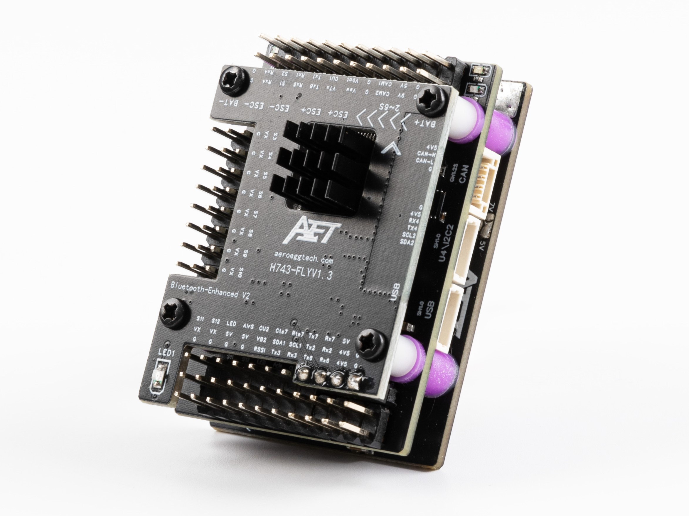
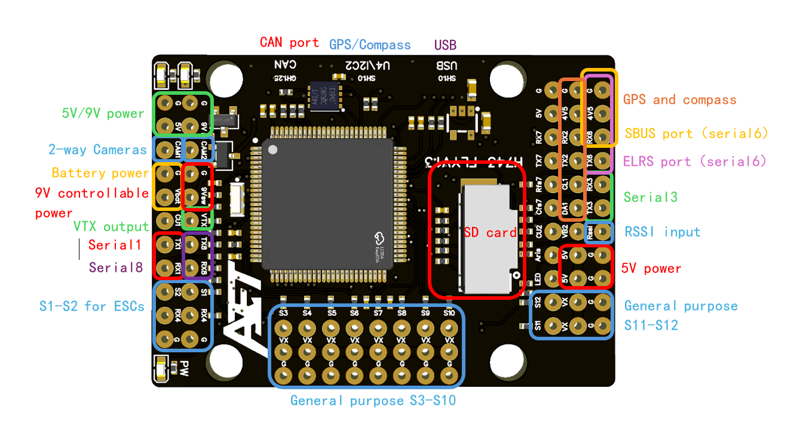
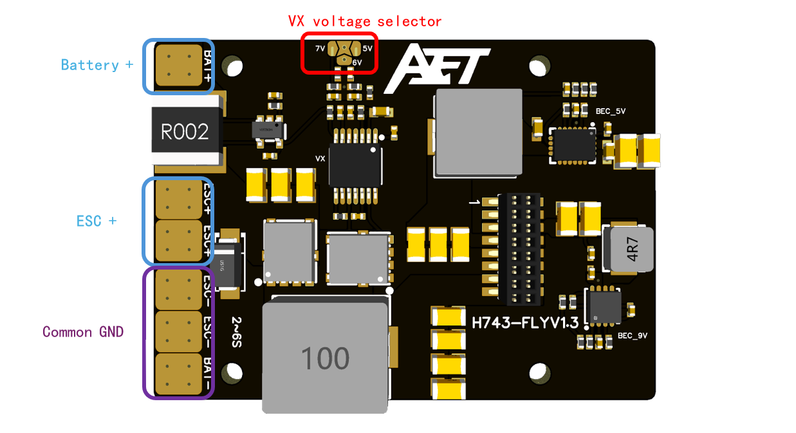

# AET-H743-Basic Flight Controller

The AET-H743-Basic is a flight controller designed and produced by AeroEggTech

## Features

 - STM32H743 microcontroller
 - Dual ICM42688P IMUs
 - 13 PWM / Dshot outputs
 - 8 UARTs, one with CTS/RTS flow control pins
 - 1 CAN
 - Dedicated USB board
 - DPS310 or SPL06 barometer
 - 5V/6V/7V 10A Servo rail BEC
 - 9V 2A BEC for VTX, GPIO controlled
 - 5V 4A BEC
 - MicroSD Card Slot
 - 2-way camera input
 - AT7456E OSD
 - 2 I2Cs

## Physical

## Mechanical

 - Dimensions: 36 x 47 x 17 mm
 - Weight: 45g

## Power supply

The AET-H743-Basic supports 2-6s Li battery input. It has 3 ways of BEC, which result in 6 ways of power supplys. Please see the table below.

| Power symbol | Power source | Max power (current) |
|--------------|--------------|---------------------|
| 5V | from 5V BEC | 20W (4A) |
| 9V | from 9V BEC | 18W (2A) |
| 9Vsw | from 9V BEC, controlled by MCU with an NPN MOS | 10W (1A) |
| 4V5 | from USB or 5V BEC, with a diode | 5W (1A) |
| VX | from Servo rail VX BEC, default 5V, can be changed to 6V or 7V | 50W (10A) |
| BAT | directly from battery | (5A) |

## Loading Firmware

Initial firmware load can be done with DFU by plugging in USB with the bootloader button pressed. Then you should load the "with_bl.hex" firmware, using your favorite DFU loading tool, such as Mission Planner.

Once the initial firmware is loaded you can update the firmware using any ArduPilot ground station software. Updates should be done with the "\*.apj" firmware files.

## UART Mapping

All UARTs are DMA capable.

 - SERIAL0 -> USB
 - SERIAL1 -> UART1 (MAVLink2)
 - SERIAL2 -> UART2 (GPS)
 - SERIAL3 -> UART3 (MAVLink2)
 - SERIAL4 -> UART4 (GPS2, RX4 is also available as ESC telem if protocol is changed for this UART)
 - SERIAL5 -> USB (SLCAN)
 - SERIAL6 -> UART6 (RCIN)
 - SERIAL7 -> UART7 (MAVLink2, Integrated Bluetooth module)
 - SERIAL8 -> UART8 (User)

## RC Input

The default RC input is configured on the UART6 and supports all RC protocols except PPM. The SBUS pin is inverted and connected to RX6. RC can be attached to any UART port as long as the serial port protocol is set to `SERIALn_PROTOCOL=23` and SERIAL6_Protocol is changed to something other than '23'.

## OSD Support

The AET-H743-Basic supports onboard analog SD OSD using a AT7456 chip. The analog VTX should connect to the VTX pin.

## PWM Output

The AET-H743-Basic supports up to 13 PWM outputs.

All the channels support DShot.

Outputs are grouped and every output within a group must use the same output protocol:

1, 2 are Group 1;

3, 4, 5, 6 are Group 2;

7, 8, 9, 10 are Group 3;

11, 12 are Group 4;

13(LED) is Group 5;

Output 13 can be used as LED neopixel output;

## Battery Monitoring

The board has two internal voltage sensors and one integrated current sensor, and a second external current sensor input.

The voltage sensors can handle up to 6S LiPo batteries.

The first voltage/current sensor is enabled by default and the pin inputs for the second, unenabled sensor are also set by default:
* BATT_MONITOR 4
* BATT_VOLT_PIN 10
* BATT_CURR_PIN 11
* BATT_VOLT_MULT 11
* BATT_CURR_SCALE 40
* BATT2_VOLT_PIN 18
* BATT2_CURR_PIN 7
* BATT2_VOLT_MULT 11

## Compass

The AET-H743-Basic has no built-in compass, so if needed, you should use an external compass.

## Analog cameras

The AET-H743-Basic supports up to 2 cameras, connected to pin CAM1 and CAM2. You can select the video signal to VTX from camera by an RC channel. Set the parameters below:

- RELAY2_FUNCTION = 1
- RELAY_PIN2 = 82
- RC8_OPTION = 34

## 9V switch

The 9Vsw power supply can be controlled by an RC channel. Set the parameters below:

- RELAY1_FUNCTION = 1
- RELAY_PIN = 81
- RC7_OPTION = 28

## Bluetooth

The AET-H743-Basic support both legacy bluetooth SPP and BLE serial. The bluetooth uses UART7 as serial port. Search for `AET-H743-SPP` or `AET-H743-BLE` to connect.

Note: you should connect a battery to the board so the bluetooth module can work.
