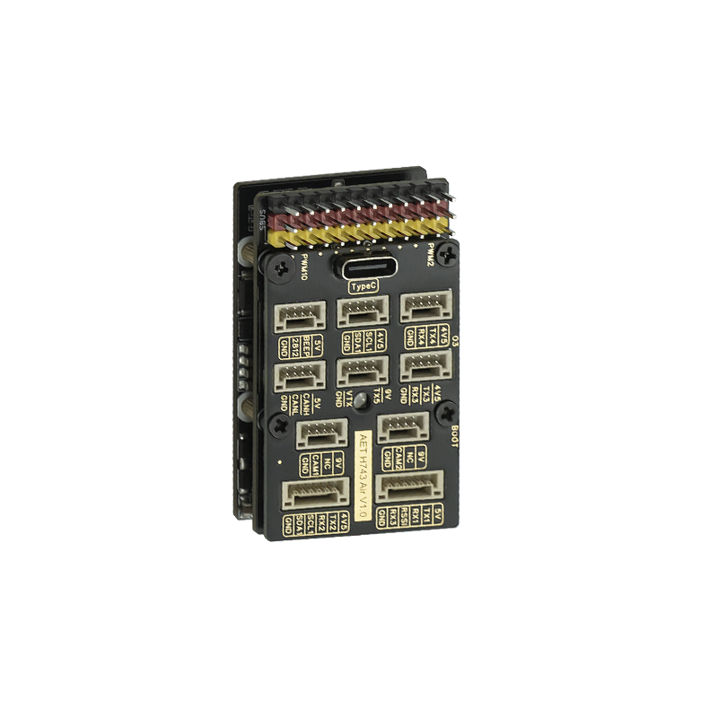
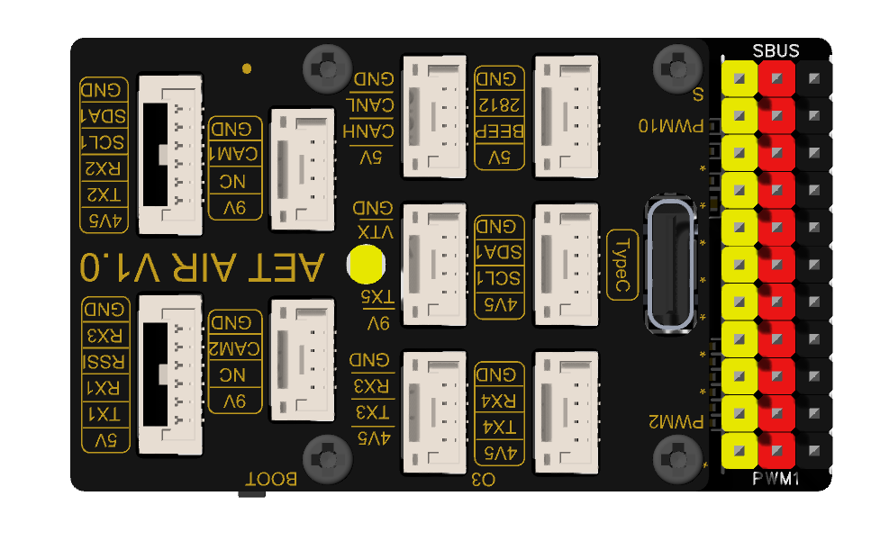
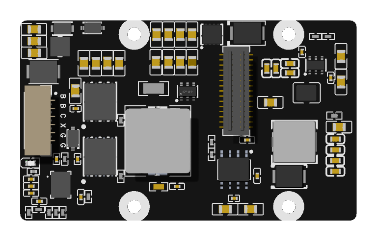

# AET-H743-Air Flight Controller

The AET-H743-Air is a flight controller designed and produced by AeroEggTech, based on the STM32H743 microcontroller.

## Features

- STM32H743 (400MHz) microcontroller
- Dual BMI270 IMUs (SPI)
- AT7456E OSD
- 11 PWM / Dshot outputs (one dedicated to WS2812 LED)
- 5 main UARTs (USART1, USART2, USART3, UART4, UART5) + optional USART6 (shared with PWM1/PWM2)
- 1 CAN bus
- USB-C (virtual COM port)
- DPS310 / SPL06 barometer (I2C)
- MicroSD card slot (SPI)
- 2 I2C buses
- External flash (CSNP1GCR01-BOW)
- RGB LED (WS2812) on PWM11
- Beeper
- 5V/3.3V power outputs

## Physical

## Mechanical

- Dimensions: 52 x 31 x 20 mm
- Weight: 55kg

## Power supply

The AET-H743-Air supports 2-6S LiPo battery input. It provides 5V (2A) and 3.3V outputs for peripherals. Please refer to the manufacturer's documentation for exact power distribution.

## Loading Firmware

Initial firmware load can be done with DFU by plugging in USB with the bootloader button pressed. Then you should load the "with_bl.hex" firmware using your favorite DFU loading tool (e.g., Mission Planner).

Once the initial firmware is loaded, you can update the firmware using any ArduPilot ground station software. Updates should be done with the `*.apj` firmware files.

## UART Mapping

All UARTs are DMA capable unless noted.

| UART    | Function          | Parameter                         |
|---------|-------------------|-----------------------------------|
| SERIAL0 | USB (OTG1)        | Console / MAVLink                 |
| SERIAL1 | USART1            | MAVLink2 (default)                |
| SERIAL2 | USART2            | GPS (SERIAL2_PROTOCOL = 5)        |
| SERIAL3 | USART3            | Telemetry (115200)                |
| SERIAL4 | UART4             | GPS2 / User (115200)              |
| SERIAL5 | UART5             | User                              |
| SERIAL6 | USART6 (optional) | Not assigned by default (shared with PWM1/PWM2) |

> USART6 pins (PC6, PC7) are shared with PWM1 and PWM2, so enabling USART6 will disable those PWM outputs. By default USART6 is disabled in hardware definition.

## RC Input

RC input can be configured on any free UART by setting `SERIALn_PROTOCOL = 23`. There is no dedicated PPM input pin. For example, USART2 can be used as RC input by changing `SERIAL2_PROTOCOL` to 23.

## OSD Support

The AET-H743-Air supports onboard analog OSD using an AT7456E chip. The analog VTX should be connected to the designated VTX pin.

## PWM Output

The AET-H743-Air supports up to 11 PWM outputs.

All channels support DShot.

Output grouping (for protocol consistency):

| Output | Pin   | Timer    | Group | Notes                     |
|--------|-------|----------|-------|---------------------------|
| 1      | PC6   | TIM8_CH1 | 1     | Shared with USART6 TX     |
| 2      | PC7   | TIM8_CH2 | 1     | Shared with USART6 RX     |
| 3      | PC8   | TIM8_CH3 | 1     |                           |
| 4      | PD12  | TIM4_CH1 | 2     |                           |
| 5      | PD13  | TIM4_CH2 | 2     |                           |
| 6      | PD14  | TIM4_CH3 | 2     |                           |
| 7      | PA0   | TIM5_CH1 | 3     |                           |
| 8      | PA1   | TIM5_CH2 | 3     |                           |
| 9      | PA2   | TIM5_CH3 | 3     |                           |
| 10     | PA3   | TIM5_CH4 | 3     |                           |
| 11     | PA8   | TIM1_CH1 | 4     | WS2812 LED (NeoPixel)     |

> To use DShot, all outputs in the same group must use the same protocol (e.g., DShot300/600/1200). Output 11 is typically used for WS2812 LED, not for motor/servo.

## Battery Monitoring

The board has two internal voltage sensors and two current sensor inputs (one onboard, one external). Default parameters:

- `BATT_MONITOR` = 4 (Analog)
- `BATT_VOLT_PIN` = 10 (PC0)
- `BATT_CURR_PIN` = 11 (PC1)
- `BATT_VOLT_SCALE` = 11.0
- `BATT_CURR_SCALE` = 40.0
- `BATT2_VOLT_PIN` = 4 (PC4)
- `BATT2_CURR_PIN` = 34 (PB0)
- `BATT2_VOLT_SCALE` = 11.0

The voltage sensors can handle up to 6S LiPo batteries.

## Compass

The AET-H743-Air has no built-in compass. Use an external I2C compass on I2C1 or I2C2. Autoprobing is enabled.

## WS2812 LED (NeoPixel)

The PWM output 11 (PA8) is dedicated to WS2812 LED control. To use it:

1. Connect WS2812 LED strip data line to PA8.
2. Set `NTF_LED_TYPES` = 256 (NeoPixel) in Mission Planner.
3. Set `NTF_LED_LEN` to the number of LEDs.
4. Set `SERVO11_FUNCTION` = 94 (NeoPixel).

The LED will indicate flight status (e.g., red when disarmed, green when armed).

## I2C Buses

- I2C1: PB6 (SCL), PB7 (SDA) – internal barometer, can also connect external compass.
- I2C2: PB10 (SCL), PB11 (SDA) – external compass/GPS.

## SPI Devices

| Device   | Bus  | CS      | Notes                     |
|----------|------|---------|---------------------------|
| BMI270   | SPI1 | PA4     | Primary IMU               |
| BMI270   | SPI4 | PE11    | Secondary IMU             |
| AT7456E  | SPI2 | PB12    | OSD                       |
| Flash    | SPI3 | PD7     | External flash memory     |

## CAN Bus

One CAN interface (CAN1) is available on pins PD0 (RX), PD1 (TX). The CAN silent pin is PD3.

## Bluetooth

There is no built‑in Bluetooth module on AET-H743-Air. An external Bluetooth module can be connected to any free UART (e.g., USART3) with `SERIAL3_PROTOCOL = 2` (MAVLink2).

## Firmware

- **Target board name**: `AET_H743_Air`
- **Default parameters**: See `defaults.parm` (if provided)
- **Bootloader**: Provided by `hwdef-bl.dat`. Generate with `Tools/scripts/build_bootloaders.py AET_H743_Air`

## License

This hardware definition is released under the terms of the GNU General Public License v3.

## Credits

- AeroEggTech (AET)
- ArduPilot community
