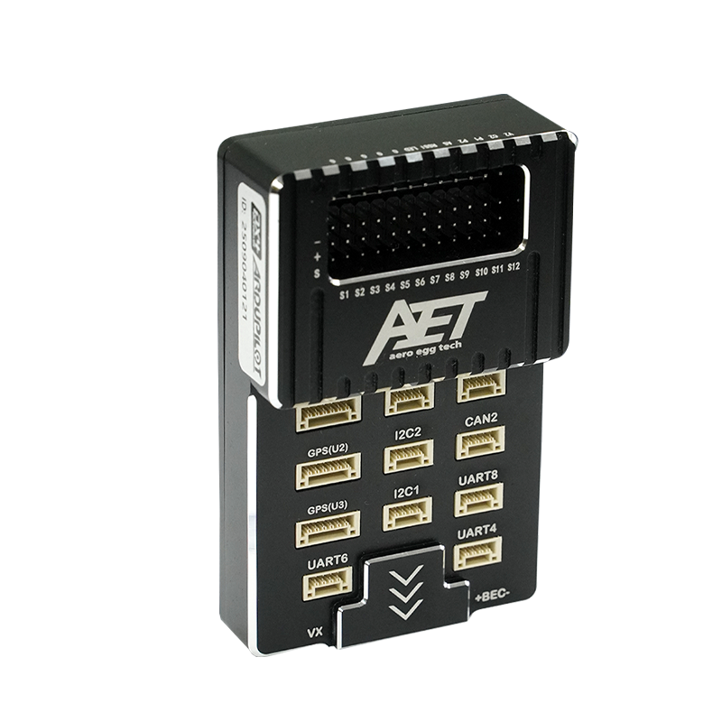

# AET-U7 Flight Controller

The AET-U7 is a high-performance flight controller designed and produced by AeroEggTech, based on the STM32H743 microcontroller. It features triple IMU redundancy, built‑in compass, and extensive I/O for professional drones.

## Features

- STM32H743 (400MHz) microcontroller
- Triple IMU: ICM45686, ICM42688 (primary), ICM42688 (backup)
- Built‑in IST8310 compass
- AT7456E OSD (if applicable – not explicitly defined, but likely supported via SPI2/SPI3)
- 13 PWM / Dshot outputs (one dedicated to WS2812 LED)
- 8 UARTs (USART1, USART2, USART3, UART4, USART6, UART7, UART8, plus OTG2)
- 1 CAN bus
- USB‑C (virtual COM port)
- Barometers: SPL06 (I2C) and ICP201XX (I2C)
- MicroSD card slot
- 2 I2C buses
- WS2812 LED on PWM13
- Beeper
- 5V/3.3V power outputs

## Physical

## Mechanical

- Dimensions: 50 mm long, 82 mm wide, 21 mm high
- Weight: 76g

## Power supply

The AET-U7 features a built‑in Power Management Unit (PMU) and multiple BEC outputs for powering the flight controller and peripherals.

| Item | Rating / Specification |
|------|--------------------------|
| PMU Input Voltage Range | Up to 50.4V (12S LiPo), transient up to 60V |
| PMU Current Sensor Range | 120A maximum |
| BEC 5V Output Current | 5A continuous |
| BEC VX (Servo Rail) Voltage | Selectable 5V or 7.2V |
| BEC VX Output Current | 5A continuous |

## Loading Firmware

Initial firmware load can be done with DFU by plugging in USB with the bootloader button pressed. Then you should load the "with_bl.hex" firmware using your favorite DFU loading tool (e.g., Mission Planner).

Once the initial firmware is loaded, you can update the firmware using any ArduPilot ground station software. Updates should be done with the `*.apj` firmware files.

## UART Mapping

All UARTs are DMA capable unless noted.

| UART    | Function          | Parameter                         |
|---------|-------------------|-----------------------------------|
| SERIAL0 | USB (OTG1)        | Console / MAVLink                 |
| SERIAL1 | USART1            | MAVLink2 (default)                |
| SERIAL2 | USART2            | GPS (SERIAL2_PROTOCOL = 5)        |
| SERIAL3 | USART3            | Telemetry (115200)                |
| SERIAL4 | UART4             | GPS2 / User (default GPS)         |
| SERIAL5 | OTG2 (USB)        | (reserved for SLCAN)              |
| SERIAL6 | USART6            | RCIN (default)                    |
| SERIAL7 | UART7             | MAVLink2 (with CTS/RTS)           |
| SERIAL8 | UART8             | User                              |

> USART6 is dedicated to RC input by default (`SERIAL6_PROTOCOL = 23`). To use it as a regular UART, change the protocol accordingly.

## RC Input

RC input is configured on USART6 by default (`SERIAL6_PROTOCOL = 23`). It supports all common RC protocols (SBUS, DSM, etc.). The RX6 pin (PC7) is used. RC can be attached to any other UART by setting `SERIALn_PROTOCOL = 23`.

## OSD Support

The AET-U7 supports onboard analog OSD using an AT7456E chip (connected to SPI2/SPI3). The analog VTX should be connected to the designated VTX pin.

## PWM Output

The AET-U7 supports up to 13 PWM outputs.

All channels support DShot.

Output grouping (for protocol consistency):

| Output | Pin   | Timer    | Group | Notes                     |
|--------|-------|----------|-------|---------------------------|
| 1      | PB0   | TIM8_CH2N| 1     |                           |
| 2      | PB1   | TIM8_CH3N| 1     |                           |
| 3      | PA0   | TIM5_CH1 | 2     |                           |
| 4      | PA1   | TIM5_CH2 | 2     |                           |
| 5      | PA2   | TIM5_CH3 | 2     |                           |
| 6      | PA3   | TIM5_CH4 | 2     |                           |
| 7      | PD12  | TIM4_CH1 | 3     |                           |
| 8      | PD13  | TIM4_CH2 | 3     |                           |
| 9      | PD14  | TIM4_CH3 | 3     |                           |
| 10     | PD15  | TIM4_CH4 | 3     |                           |
| 11     | PE5   | TIM15_CH1| 4     |                           |
| 12     | PE6   | TIM15_CH2| 4     |                           |
| 13     | PA8   | TIM1_CH1 | 5     | WS2812 LED                |

> To use DShot, all outputs in the same group must use the same protocol (e.g., DShot300/600/1200). Output 13 is typically used for WS2812 LED.

## Battery Monitoring

The board has two voltage sensors and two current sensor inputs (one onboard, one external). Default parameters:

- `BATT_MONITOR` = 4 (Analog)
- `BATT_VOLT_PIN` = 10 (PC0)
- `BATT_CURR_PIN` = 11 (PC1)
- `BATT_VOLT_SCALE` = 26.0
- `BATT_CURR_SCALE` = 40.0
- `BATT2_VOLT_PIN` = 18 (PA4)
- `BATT2_CURR_PIN` = 7 (PA7)
- `BATT2_VOLT_SCALE` = 26.0

The voltage sensors can handle up to 6S LiPo batteries.

## Compass

The AET-U7 includes a built‑in IST8310 compass on the internal I2C bus (`COMPASS IST8310 I2C:ALL_INTERNAL:0x0E true ROTATION_YAW_180`). External compasses can also be connected via I2C1 or I2C2.

## I2C Buses

- I2C1: PB6 (SCL), PB7 (SDA) – internal barometer/compass
- I2C2: PB10 (SCL), PB11 (SDA) – external devices

## SPI Devices

| Device   | Bus  | CS      | Notes                     |
|----------|------|---------|---------------------------|
| ICM45686 | SPI2 | PB12    | Primary IMU               |
| ICM42688 | SPI3 | PC13    | Secondary IMU             |
| ICM42688 | SPI4 | PE11    | Backup IMU                |
| OSD      | (not defined, possibly SPI1/5) | - | Not explicitly listed     |

## CAN Bus

One CAN interface (CAN1) is available on pins PD0 (RX), PD1 (TX). The CAN silent pin is PD3.

## WS2812 LED (NeoPixel)

The PWM output 13 (PA8) is dedicated to WS2812 LED control. To use it:

1. Connect WS2812 LED strip data line to PA8.
2. Set `NTF_LED_TYPES` = 256 (NeoPixel) in Mission Planner.
3. Set `NTF_LED_LEN` to the number of LEDs.
4. Set `SERVO13_FUNCTION` = 94 (NeoPixel).

The LED will indicate flight status (e.g., red when disarmed, green when armed).

## Firmware

- **Target board name**: `AET_U7`
- **Default parameters**: See `defaults.parm`
- **Bootloader**: Provided by `hwdef-bl.dat`. Generate with `Tools/scripts/build_bootloaders.py AET_U7`

## License

This hardware definition is released under the terms of the GNU General Public License v3.

## Credits

- AeroEggTech (AET)
- ArduPilot community
