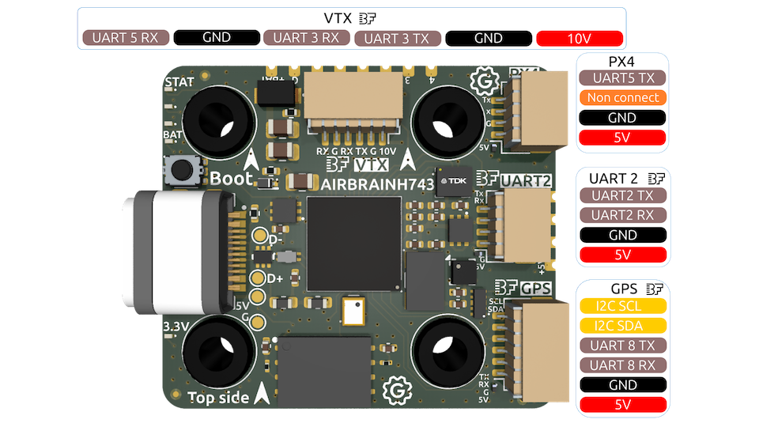
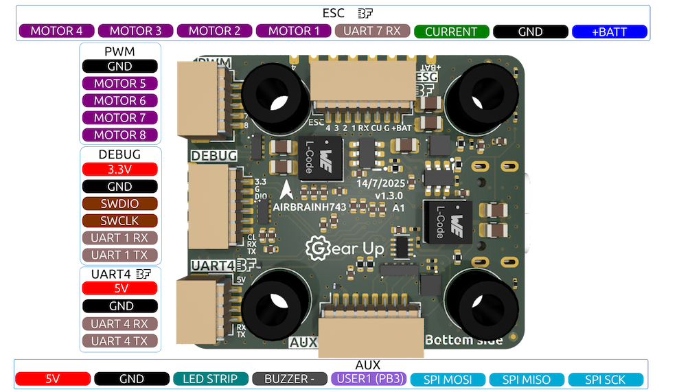

# AIRBRAINH743 Flight Controller

The AIRBRAINH743 is a flight controller designed and produced by [Gear Up](https://takeyourgear.com/).

## Features

 - MCU - STM32H743xx 32-bit processor running at 480 MHz
 - IMU - Invensense ICM-42688-P
 - Barometer - DPS368
 - Magnetometer - LIS2MDL
 - 128 Mbytes flash-based logging
 - Battery input voltage: 3S-10S
 - BEC 5V 2A
 - BEC 10V 2.5A
 - 7x UARTs
 - 9x PWM Outputs (8 Motor Output, 1 LED)

 ## Pinout
 
 
 

## UART Mapping

The UARTs are marked RX and TX in the above pinouts. The RX pin is the
receive pin. The TX pin is the transmit pin .

 - SERIAL0 -> USB (MAVLink2)
 - SERIAL1 -> USART1 (None)
 - SERIAL2 -> USART2 (RCIN, DMA-enabled)
 - SERIAL3 -> USART3 (MSP DisplayPort, DMA-enabled)
 - SERIAL4 -> UART4 (GPS, DMA-enabled)
 - SERIAL5 -> UART5 (None, DMA-enabled)
 - SERIAL7 -> UART7 (ESCTelemetry)
 - SERIAL8 -> UART8 (GPS2, DMA-enabled)

## RC Input

The default RC input is configured on USART2. RC could  be applied instead to a different UART port,  and set
the protocol to receive RC data ``SERIALn_PROTOCOL`` = 23 and change :ref:`SERIAL2 _PROTOCOL <SERIAL2 _PROTOCOL>`
to something other than '23'. For rc protocols other than unidirectional, the USART2_TX pin will need to be used:

 - FPort would require :ref:`SERIAL2_OPTIONS<SERIAL2_OPTIONS>` be set to "15".
 - CRSF would require :ref:`SERIAL2_OPTIONS<SERIAL2_OPTIONS>` be set to "0".
 - SRXL2 would require :ref:`SERIAL2_OPTIONS<SERIAL2_OPTIONS>` be set to "4" and connects only the TX pin.

The HD VTX connector contains UART5 RX for SBUS. To use this connector for SBUS set :ref:`SERIAL2 _PROTOCOL <SERIAL2 _PROTOCOL>`
to something other than '23' and set :ref:`SERIAL5 _PROTOCOL <SERIAL5 _PROTOCOL>` to '23'

## PWM Output

The AIRBRAINH743 supports up to 9 PWM or DShot outputs. The pads for motor output
M1 to M9 are provided on both the motor connectors and on separate pads, plus
separate pads for LED strip and other PWM outputs.

The PWM is in 4 groups:

 - PWM 1-4   in group1
 - PWM 5-6   in group2
 - PWM 7-8   in group3
 - PWM 9   in group4 (defaulted to Serial LED protocol)

Channels within the same group need to use the same output rate. If
any channel in a group uses DShot then all channels in the group need
to use DShot. Channels 1-8 support bi-directional dshot.

## Battery Monitoring

The board has a internal voltage sensor and connections on the ESC connector for an external current sensor input.
The voltage sensor can handle up to 6S LiPo batteries.

The default battery parameters are:

 - :ref:`BATT_MONITOR<BATT_MONITOR>` = 4
 - :ref:`BATT_VOLT_PIN<BATT_VOLT_PIN__AP_BattMonitor_Analog>` = 4
 - :ref:`BATT_CURR_PIN<BATT_CURR_PIN__AP_BattMonitor_Analog>` = 8 (CURRENT pin)
 - :ref:`BATT_VOLT_MULT<BATT_VOLT_MULT__AP_BattMonitor_Analog>` = 15.0
 - :ref:`BATT_AMP_PERVLT<BATT_AMP_PERVLT__AP_BattMonitor_Analog>` = 101.0

## Compass

The AIRBRAINH743 has builtin compass. You can also attach an external compass using I2C on the SDA and SCL pads.

## Loading Firmware

Firmware for these boards can be found `here <https://firmware.ardupilot.org>`__ in sub-folders labeled "AIRBRAINH743".

Initial firmware load can be done with DFU by plugging in USB with the
bootloader button pressed. Then you should load the "with_bl.hex"
firmware, using your favourite DFU loading tool.

Once the initial firmware is loaded you can update the firmware using
any ArduPilot ground station software. Updates should be done with the
*.apj firmware files.
