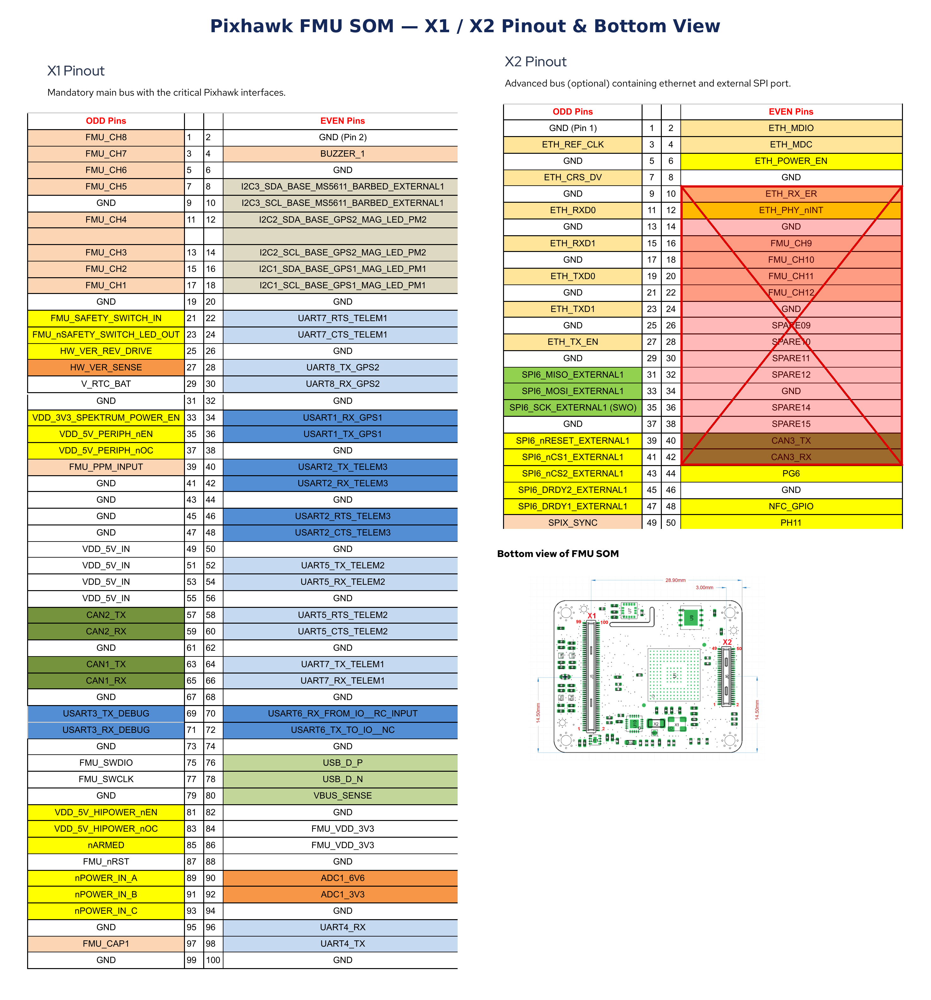

# ARKV6S Flight Controller

[ARK Electronics](https://arkelectron.com/product/arkv6s/)

The ARKV6S is a low-cost, single-IMU variant of the [ARKV6X](../ARKV6X), based on the [Pixhawk Autopilot Bus (PAB) Form Factor](https://github.com/pixhawk/Pixhawk-Standards/blob/master/DS-010%20Pixhawk%20Autopilot%20Bus%20Standard.pdf). It plugs into any PAB-compatible carrier board.

## Features

### Processor

- STM32H743IIK6 32-bit processor
- 480MHz
- 2MB Flash
- 1MB RAM

### Sensors

- Invensense IIM-42653 Industrial IMU with heater resistor
- Bosch BMP390 Barometer
- ST IIS2MDC Magnetometer
- FRAM (for parameter storage)

### Power

- 5V input
- 500mA (300mA for main system, 200mA for heater)

### Form Factor

- [Pixhawk Autopilot Bus (PAB) Form Factor](https://github.com/pixhawk/Pixhawk-Standards/blob/master/DS-010%20Pixhawk%20Autopilot%20Bus%20Standard.pdf)
- Size: 36 x 29 x 5 mm
- Weight: 5.0 g


## Pinout

The ARKV6S pinout conforms to the [Pixhawk V6X standard](https://github.com/pixhawk/Pixhawk-Standards/blob/master/DS-010%20Pixhawk%20Autopilot%20Bus%20Standard.pdf).



## UART Mapping

| Name    | Function              |
|:--------|:----------------------|
| SERIAL0 | USB                   |
| SERIAL1 | UART7 (Telem1)        |
| SERIAL2 | UART5 (Telem2)        |
| SERIAL3 | USART1 (GPS1)         |
| SERIAL4 | UART8 (GPS2)          |
| SERIAL5 | USART2 (Telem3)       |
| SERIAL6 | UART4                 |
| SERIAL7 | USART3 (Debug)        |
| SERIAL8 | USART6 (RC Input)     |
| SERIAL9 | OTG2 (MAVLink2)       |

All UARTs support DMA. Any UART may be re-tasked by changing its protocol parameter. The Telem1, Telem2, and Telem3 ports have RTS/CTS pins, the other UARTs do not have RTS/CTS.

USART6 may alternatively be wired to an IOMCU on a carrier board. To use it for the IOMCU instead of as a direct serial RC input, edit `hwdef.dat` to uncomment the `IOMCU_UART USART6` line and switch to the alternate `SERIAL_ORDER` line.

## CAN

The ARKV6S exposes two independent CAN buses on the PAB connector. The PHY is held in reset until firmware enables it. Both CAN drivers are enabled by default (`CAN_P1_DRIVER` = `1`, `CAN_P2_DRIVER` = `1`) for DroneCAN peripherals.

## Ethernet

The ARKV6S has built-in 100 Mbit Ethernet (RMII PHY: Microchip LAN8742A). The PHY is held in reset until firmware enables it via GPIO 113. The RMII signals are routed to the PAB connector for the carrier board to break out to a connector.

## microSD

A microSD socket on the carrier board is supported with the FATFS filesystem, used for parameter and dataflash logging.

## RC Input

By default, RC input is configured on USART6 (`SERIAL8_PROTOCOL` = `23`). It supports all RC protocols except PPM. A separate timer input (TIM8_CH1) is also available for unidirectional RC protocols. See [Radio Control Systems](https://ardupilot.org/copter/docs/common-rc-systems.html) for details for a specific RC system.

## Battery Monitoring

The board supports an INA226 digital power monitor on I2C1 (`HAL_BATT_MONITOR_DEFAULT = 21`) by default as the first monitor. Additional analog voltage/current inputs may be available on the carrier board used for this module.

## Compass

This autopilot has a built-in compass. The compass is the IIS2MDC. Often this internal compass is disabled due to power interference and a remotely located compass is used.

## IMU Heater

The ARKV6S has a 1W heater that keeps the IIM-42653 IMU warm in extreme conditions. The heater target temperature defaults to 45 °C and can be tuned with `BRD_IMUHEAT_*` parameters.

## PWM Output

PWM outputs are provided through the module connector. PWM 1-6 are capable of PWM and DShot (including bi-directional DShot).  PWM 7-8 are PWM-only since they have no DMA. Outputs in the same timer group must use the same protocol:

- PWM 1-4 Group1 (TIM5)
- PWM 5-6 Group2 (TIM4)
- PWM 7-8 Group3 (TIM12, no DMA)

## Loading Firmware

The bootloader is flashed with an ST-Link. Pre-built bootloader binaries can be found at the [ArduPilot firmware server](https://firmware.ardupilot.org/Tools/Bootloaders/).

```bash
st-flash write ARKV6S_bl.bin 0x08000000
```

Once the bootloader is installed you can update the firmware using any ArduPilot ground station software. Firmware can be found at the [ArduPilot firmware server](https://firmware.ardupilot.org/) in folders labeled "ARKV6S". Updates should be done with the `*.apj` firmware files.
