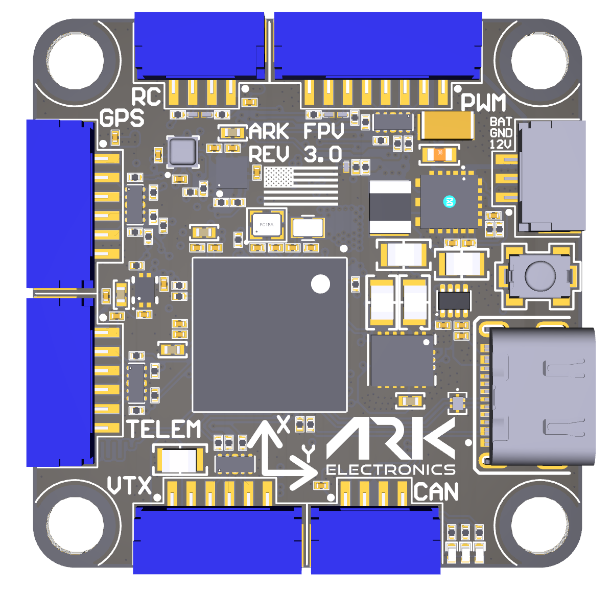
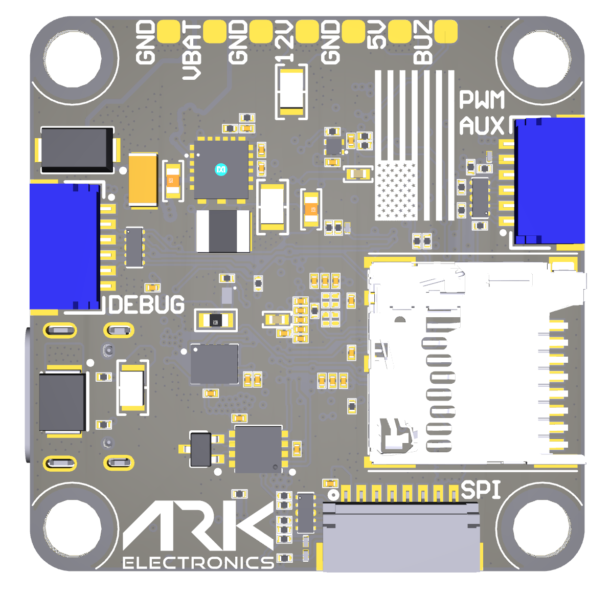

# ARK FPV Flight Controller

https://arkelectron.com/product/ark-fpv-flight-controller/


## Features
#### Processor
- STM32H743 32-bit processor
- 480MHz
- 2MB Flash
- 1MB RAM
#### Sensors
- Invensense IIM-42653 Industrial IMU with heater resistor
- Bosch BMP390 Barometer
- ST IIS2MDC Magnetometer
#### Power
- 5.5V - 54V (2S - 12S) input
- 12V, 2A output
- 5V, 2A output. 300ma for main system, 200ma for heater
#### Interfaces
- **Micro SD**
- **USB-C**
  - VBUS In, USB
- **PWM**
  - VBAT In, Analog Current Input, Telem RX, 4x PWM and Bidirectional-DSHOT capable
  - JST-GH 8 Pin
- **PWM AUX**
  - 5x PWM and Bidirectional-DSHOT capable
  - JST-SH 6 Pin
- **RC Input**
  - 5V Out, UART
  - JST-GH 4 Pin
- **POWER AUX**
  - 12V Out, VBAT In/Out
  - JST-GH 3 Pin
- **TELEM**
  - 5V Out, UART with flow control
  - JST-GH 6 Pin
- **GPS**
  - 5V Out, UART, I2C
  - JST-GH 6 Pin
- **CAN**
  - 5V Out, CAN
  - JST-GH 4 Pin
- **VTX**
  - 12V Out, UART TX/RX, UART RX
  - JST-GH 6 Pin
- **SPI** (OSD or External IMU)
  - 5V Out, SPI
  - JST-SH 8 Pin
- **DEBUG**
  - 3.3V Out, UART, SWD
  - JST-SH 6 Pin

##### Dimensions
- Size: 3.6 × 3.6 × 0.8 cm
- Weight: 7.5g with MicroSD card

## Pinout



#### PWM UART4 - 8 Pin JST-GH
| Pin | Signal Name     | Voltage      |
|-----|-----------------|--------------|
| 1   | VBAT IN         | 5.5V-54V     |
| 2   | CURR_IN_EXT     | 3.3V         |
| 3   | UART4_RX_EXT    | 3.3V         |
| 4   | FMU_CH1_EXT     | 3.3V         |
| 5   | FMU_CH2_EXT     | 3.3V         |
| 6   | FMU_CH3_EXT     | 3.3V         |
| 7   | FMU_CH4_EXT     | 3.3V         |
| 8   | GND             | GND          |

#### RC - 4 Pin JST-GH
| Pin | Signal Name         | Voltage |
|-----|---------------------|---------|
| 1   | 5.0V               | 5.0V    |
| 2   | USART6_RX_IN_EXT    | 3.3V    |
| 3   | USART6_TX_OUTPUT_EXT| 3.3V    |
| 4   | GND                | GND     |

#### PWM AUX - 6 Pin JST-SH
| Pin | Signal Name     | Voltage |
|-----|-----------------|---------|
| 1   | FMU_CH5_EXT     | 3.3V    |
| 2   | FMU_CH6_EXT     | 3.3V    |
| 3   | FMU_CH7_EXT     | 3.3V    |
| 4   | FMU_CH8_EXT     | 3.3V    |
| 5   | FMU_CH9_EXT     | 3.3V    |
| 6   | GND             | GND     |

#### POWER AUX - 3 Pin JST-GH
| Pin | Signal Name | Voltage      |
|-----|-------------|--------------|
| 1   | 12.0V       | 12.0V        |
| 2   | GND         | GND          |
| 3   | VBAT IN/OUT | 5.5V-54V     |

#### CAN - 4 Pin JST-GH
| Pin | Signal Name | Voltage |
|-----|-------------|---------|
| 1   | 5.0V        | 5.0V    |
| 2   | CAN1_P      | 5.0V    |
| 3   | CAN1_N      | 5.0V    |
| 4   | GND         | GND     |

#### GPS - 6 Pin JST-GH
| Pin | Signal Name         | Voltage |
|-----|---------------------|---------|
| 1   | 5.0V                | 5.0V    |
| 2   | USART1_TX_GPS1_EXT  | 3.3V    |
| 3   | USART1_RX_GPS1_EXT  | 3.3V    |
| 4   | I2C1_SCL_GPS1_EXT   | 3.3V    |
| 5   | I2C1_SDA_GPS1_EXT   | 3.3V    |
| 6   | GND                 | GND     |

#### TELEM - 6 Pin JST-GH
| Pin | Signal Name           | Voltage |
|-----|-----------------------|---------|
| 1   | 5.0V                 | 5.0V    |
| 2   | UART7_TX_TELEM1_EXT  | 3.3V    |
| 3   | UART7_RX_TELEM1_EXT  | 3.3V    |
| 4   | UART7_CTS_TELEM1_EXT | 3.3V    |
| 5   | UART7_RTS_TELEM1_EXT | 3.3V    |
| 6   | GND                  | GND     |

#### VTX - 6 Pin JST-GH
Note: connector pinout not in same order as standard HD VTX cabling
| Pin | Signal Name           | Voltage |
|-----|-----------------------|---------|
| 1   | 12.0V                | 12.0V   |
| 2   | GND                  | GND     |
| 3   | UART5_TX_TELEM2_EXT  | 3.3V    |
| 4   | UART5_RX_TELEM2_EXT  | 3.3V    |
| 5   | USART2_RX_TELEM3_EXT | 3.3V    |
| 6   | GND                  | GND     |

#### SPI (OSD or IMU) - 8 Pin JST-SH
| Pin | Signal Name         | Voltage |
|-----|---------------------|---------|
| 1   | 5.0V                | 5.0V    |
| 2   | SPI6_SCK_EXT        | 3.3V    |
| 3   | SPI6_MISO_EXT       | 3.3V    |
| 4   | SPI6_MOSI_EXT       | 3.3V    |
| 5   | SPI6_nCS1_EXT       | 3.3V    |
| 6   | SPI6_DRDY1_EXT      | 3.3V    |
| 7   | SPI6_nRESET_EXT     | 3.3V    |
| 8   | GND                 | GND     |

#### Flight Controller Debug - 6 Pin JST-SH
| Pin | Signal Name     | Voltage |
|-----|-----------------|---------|
| 1   | 3V3_FMU        | 3.3V    |
| 2   | USART4_TX_DEBUG | 3.3V    |
| 3   | USART4_RX_DEBUG | 3.3V    |
| 4   | FMU_SWDIO      | 3.3V    |
| 5   | FMU_SWCLK      | 3.3V    |
| 6   | GND            | GND     |


## UART Mapping

|Name|Function|
|:-|:-|
|SERIAL0|USB|
|SERIAL1|UART7 (Telem)|
|SERIAL2|UART5 (DisplayPort HD VTX)|
|SERIAL3|USART1 (GPS1)|
|SERIAL4|USART2 (User, SBUS pin on HD VTX, RX only)|
|SERIAL5|UART4 (ESC Telem, RX only)|
|SERIAL6|USART6 (RC Input)|
|SERIAL7|OTG2 (SLCAN)|

All UARTS support DMA. Any UART may be re-tasked by changing its protocol parameter.

## RC Input

RC input is configured on the RX6 (UART6_RX) pin. It supports all RC protocols except PPM. See :ref:`Radio Control Systems <common-rc-systems>` for details for a specific RC system. :ref:`SERIAL6_PROTOCOL<SERIAL6_PROTOCOL>` is set to “23”, by default, to enable this.

- SBUS/DSM/SRXL connects to the RX6 pin.
- FPort requires connection to TX6 and :ref:`SERIAL6_OPTIONS<SERIAL2_OPTIONS>` be set to “7”.
- CRSF also requires a TX6 connection, in addition to RX6, and automatically provides telemetry. Set :ref:`SERIAL6_OPTIONS<SERIAL6_OPTIONS>`
- SRXL2 requires a connection to TX6 and automatically provides telemetry. Set :ref:`SERIAL6_OPTIONS<SERIAL6_OPTIONS>` to “4”. =3.

## Battery Monitoring

The board has a internal voltage sensor and connections on the ESC connector for an external current sensor input. The board supports up to 12S LiPo batteries.

The default battery parameters are:

- BATT_MONITOR 4
- BATT_VOLT_PIN 9
- BATT_CURR_PIN 12
- BATT_VOLT_SCALE 21
- BATT_AMP_PERVLT 120

## Compass
This autopilot has a built-in compass. The compass is the IIS2MDC

## OSD Support

This flight controller has an MSP-DisplayPort output on a 6-pin DJI-compatible JST SH.

## Motor Output

All outputs are capable of PWM and DShot. Motors 1-4 are capable of Bidirectional-DSHOT. All outputs in the motor groups below must be either PWM or DShot:
- Motors 1-4  Group1 (TIM5)
- Motors 5-8  Group2 (TIM8)
- Motor 9     Group3 (TIM4)

## Loading Firmware

Initial firmware load can be done with DFU by plugging in USB with the
BOOT button pressed. You can then load the bootloader using your favorite DFU tool.
The bootloader can be found at https://firmware.ardupilot.org/Tools/Bootloaders/

Once the initial firmware is loaded you can update the firmware using
any ArduPilot ground station software. Updates should be done with the
*.apj firmware files*.

Alternatively you can build the firmware from source
```
./waf configure --board ARK_FPV --bootloader
./waf bootloader
```
And flash the bootloader with your st-link to 0x08000000.
Then build the firmware and upload it via USB-C
```
./waf configure --board ARK_FPV
./waf copter --upload
```
