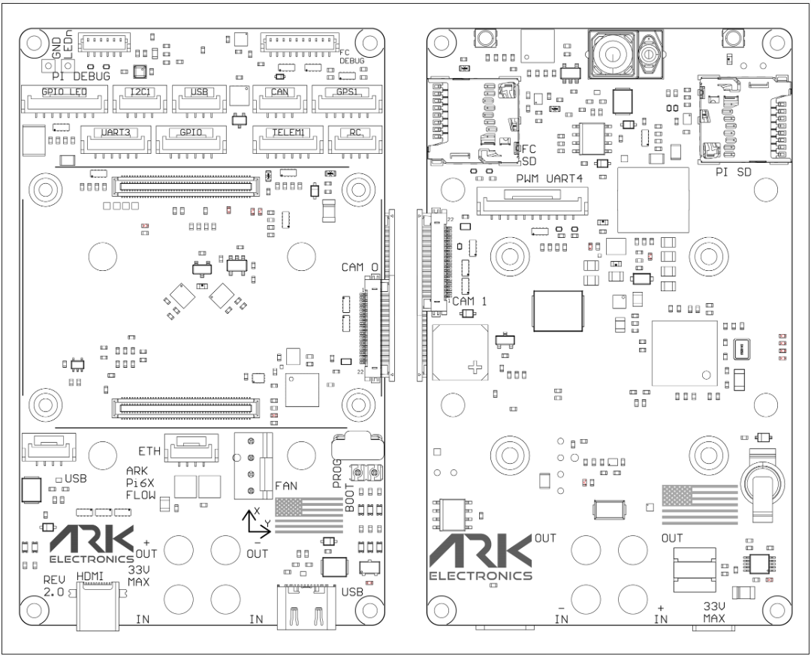

# ARK Pi6X Flight Controller
https://arkelectron.com/product/ark-pi6x/

## Features
#### Processor
- STM32H743 32-bit processor
- 480MHz
- 2MB Flash
- 1MB RAM
- DF40HC connector for RPI external co=processor (required) which is compatible with the Pi CM4 and CM5
#### Sensors
- 2x Invensense ICM-42688p IMU with heater resistor
- Bosch BMP390 Barometer
- ST IIS2MDC Magnetometer
- INA226 Voltage/Current Monitor
- Buzzer
#### Power
- 5.5V - 25.2V (2S - 6S) input
- 5V, 2A output. 300ma for main system, 200ma for heater
#### Interfaces
- **Micro SD**
- **PWM + UART4**
  - 8x PWM and Bidirectional-DSHOT capable, UART4 RX/TX
  - JST-GH 11 Pin
- **RC**
  - 5V Out, UART
  - JST-GH 4 Pin
- **TELEM1**
  - 5V Out, UART with flow control
  - JST-GH 6 Pin
- **GPS**
  - 5V Out, USART1, I2C1
  - JST-GH 6 Pin
- **CAN**
  - 5V Out, CAN
  - JST-GH 4 Pin
- **DEBUG**
  - 3.3V Out, USART3, SWD
  - JST-SH 6 Pin

##### Dimensions
- Size: 91.5mm x 56mm
- Weight: 41g

## Pinout

#### PWM + UART4 - 11 Pin JST-GH
| Pin | Signal Name     | Voltage      |
|-----|-----------------|--------------|
| 1   | FMU_CH1_EXT     | 3.3V         |
| 2   | FMU_CH2_EXT     | 3.3V         |
| 3   | FMU_CH3_EXT     | 3.3V         |
| 4   | FMU_CH4_EXT     | 3.3V         |
| 5   | FMU_CH5_EXT     | 3.3V         |
| 6   | FMU_CH6_EXT     | 3.3V         |
| 7   | FMU_CH7_EXT     | 3.3V         |
| 8   | FMU_CH8_EXT     | 3.3V         |
| 9   | UART4_TX_EXT    | 3.3V         |
| 10  | UART4_RX_EXT    | 3.3V         |
| 11  | GND             | GND          |

#### RC - 4 Pin JST-GH
| Pin | Signal Name          | Voltage |
|-----|----------------------|---------|
| 1   | 5.0V                 | 5.0V    |
| 2   | USART6_RX_IN_EXT     | 3.3V    |
| 3   | USART6_TX_OUTPUT_EXT | 3.3V    |
| 4   | GND                  | GND     |

#### CAN - 4 Pin JST-GH
| Pin | Signal Name | Voltage |
|-----|-------------|---------|
| 1   | 5.0V        | 5.0V    |
| 2   | CAN1_P      | 5.0V    |
| 3   | CAN1_N      | 5.0V    |
| 4   | GND         | GND     |

#### GPS - 6 Pin JST-GH
| Pin | Signal Name         | Voltage |
|-----|---------------------|---------|
| 1   | 5.0V                | 5.0V    |
| 2   | USART1_TX_GPS1_EXT  | 3.3V    |
| 3   | USART1_RX_GPS1_EXT  | 3.3V    |
| 4   | I2C1_SCL_GPS1_EXT   | 3.3V    |
| 5   | I2C1_SDA_GPS1_EXT   | 3.3V    |
| 6   | GND                 | GND     |

#### TELEM1 - 6 Pin JST-GH
| Pin | Signal Name           | Voltage |
|-----|-----------------------|---------|
| 1   | 5.0V                 | 5.0V    |
| 2   | UART7_TX_TELEM1_EXT  | 3.3V    |
| 3   | UART7_RX_TELEM1_EXT  | 3.3V    |
| 4   | UART7_CTS_TELEM1_EXT | 3.3V    |
| 5   | UART7_RTS_TELEM1_EXT | 3.3V    |
| 6   | GND                  | GND     |

#### Flight Controller Debug - 10 Pin JST-SH
| Pin | Signal Name        | Voltage |
|-----|--------------------|---------|
| 1   | 3V3_FMU            | 3.3V    |
| 2   | USART3_TX_DEBUG    | 3.3V    |
| 3   | USART3_RX_DEBUG    | 3.3V    |
| 4   | FMU_SWDIO          | 3.3V    |
| 5   | FMU_SWCLK          | 3.3V    |
| 6   | SPI6_SCK_EXTERNAL1 | 3.3V    |
| 7   | NFC_GPIO           | 3.3V    |
| 8   | PD15               | 3.3V    |
| 9   | FMU_NRST           | 3.3V    |
| 10  | GND                | GND     |

## UART Mapping

|Name|Function|
|:-|:-|
|SERIAL0|USB (Internally connected to RPI, use RPI to configure autopilot)|
|SERIAL1|UART7 (Telem1)|
|SERIAL2|UART5 (Internally connected)|
|SERIAL3|USART1 (GPS1)|
|SERIAL4|UART4 (ESC Telem)|
|SERIAL6|USART6 (RC Input)|

All UARTs support DMA except for UART4. Any UART may be re-tasked by changing its protocol parameter.

Ports marked _Internal_ are connected directly to the Raspberry Pi.

## RC Input

RC input is configured on the RX6 (UART6_RX) pin. It supports all RC protocols except PPM. See :ref:`Radio Control Systems <common-rc-systems>` for details for a specific RC system. :ref:`SERIAL6_PROTOCOL<SERIAL6_PROTOCOL>` is set to “23”, by default, to enable this.

- SBUS/DSM/SRXL connects to the RX6 pin.
- FPort requires connection to TX6 and :ref:`SERIAL6_OPTIONS<SERIAL6_OPTIONS>` be set to “7”.
- CRSF also requires a TX6 connection, in addition to RX6, and automatically provides telemetry.
- SRXL2 requires a connection to TX6 and automatically provides telemetry. Set :ref:`SERIAL6_OPTIONS<SERIAL6_OPTIONS>` to “4”.

## Battery Monitoring
The board has an integrated INA226 digital power monitor. The board supports up to 6S LiPo batteries.

The default battery parameters are:

- BATT_MONITOR 21

## Compass
This autopilot has a built-in compass. The compass is the IIS2MDC. Often this internal compass is disabled due to power interference and a remotely located compass is used.

## Motor Output

All outputs are capable of PWM and DShot. Motors 1-4 are configured as Bidirectional-DSHOT by default. All outputs in the motor groups below must be either PWM or DShot:
- Motors 1-4  Group1 (TIM5)
- Motors 5-6  Group2 (TIM4)
- Motors 7-8  Group3 (TIM12)

## Loading Firmware

Firmware can be loaded directly with SWD using the 10pin DEBUG port. Alternatively you can update the firmware over the USB interface which is connected directly to the Raspberry Pi. You can use the [uploader.py](https://github.com/ArduPilot/ardupilot/blob/master/Tools/scripts/uploader.py) flashing script from the Pi, or use the [software tools providied by ARK](https://github.com/ARK-Electronics/ARK-OS).
