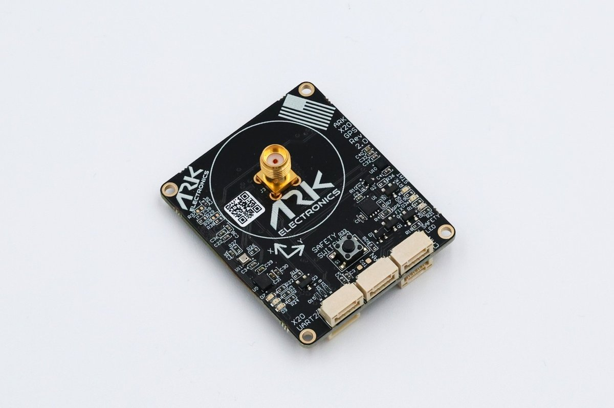
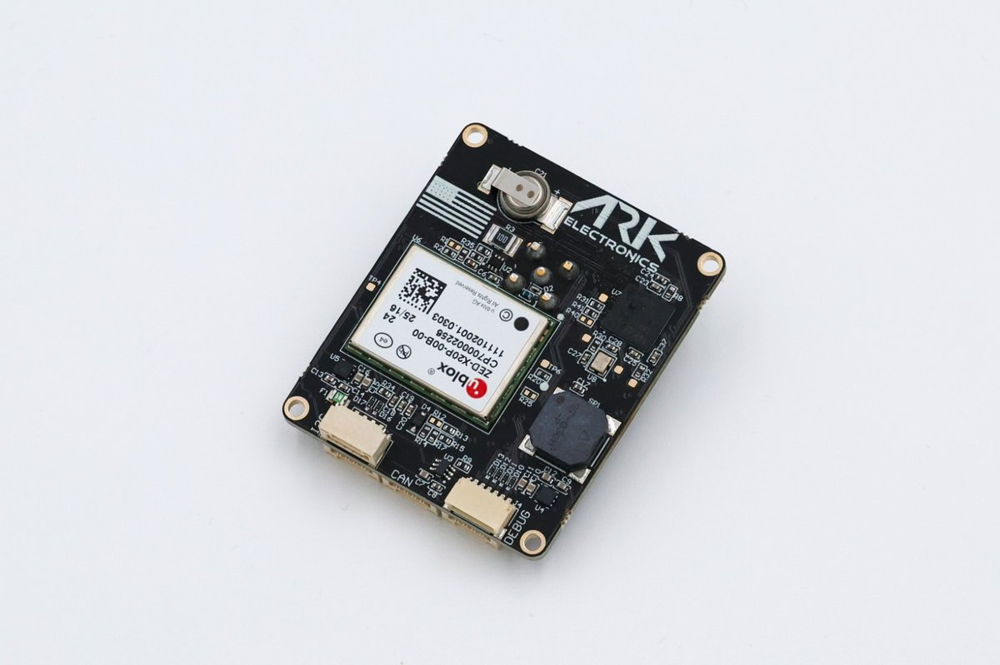

# ARK X20 RTK GPS

[ARK Electronics](https://arkelectron.com/product/ark-x20-rtk-gps/)

USA-built, NDAA-compliant DroneCAN RTK GPS module with a u-blox ZED-X20P all-band receiver, magnetometer, barometer, IMU, buzzer, and safety switch. This board runs [AP_Periph](https://ardupilot.org/dev/docs/ap-peripheral-landing-page.html) firmware.





## Features

### Processor

- STM32F412VGH6 microcontroller
- 100 MHz
- 1 MB Flash
- 256 KB RAM

### Sensors

- u-blox ZED-X20P all-band high-precision GNSS (L1/L2/L5/L6, RTK / PPP-RTK / PPP, up to 25 Hz)
- ST IIS2MDC magnetometer
- Bosch BMP390 barometer
- Invensense ICM-42688-P 6-axis IMU (present on hardware; not published over DroneCAN by this AP_Periph build)

### Other

- Safety button and safety LED
- Buzzer
- RGB system status LED
- GPS fix and RTK status LEDs
- Dual Pixhawk-standard CAN connectors with software-controlled termination
- USA built / NDAA compliant

### Power

- 5V supply
- 144 mA average, 157 mA max

### Dimensions

- Without antenna: 48.0 x 40.0 x 15.4 mm, 13.0 g
- With antenna: 48.0 x 40.0 x 51.0 mm, 43.5 g

## Pinout

### CAN1 / CAN2 — 4 Pin JST-GH (dual, paralleled)

Two identical Pixhawk-standard CAN connectors share the same bus.

| Pin | Signal | Voltage |
|-----|--------|---------|
| 1   | 5V     | 5.0V    |
| 2   | CAN_P  | 5.0V    |
| 3   | CAN_N  | 5.0V    |
| 4   | GND    | GND     |

### GPS UART2 + Timepulse — 4 Pin JST-GH

Direct access to the ZED-X20P UART2 and TIMEPULSE output (also routed to the MCU for PPS capture).

| Pin | Signal    | Voltage |
|-----|-----------|---------|
| 1   | TXD2      | 3.3V    |
| 2   | RXD2      | 3.3V    |
| 3   | TIMEPULSE | 3.3V    |
| 4   | GND       | GND     |

### I2C2 Expansion — 4 Pin JST-GH

External I2C expansion bus (I2C1 is used internally for the magnetometer and barometer).

| Pin | Signal          | Voltage        |
|-----|-----------------|----------------|
| 1   | 5.0V Out        | 5.0V (500 mA)  |
| 2   | I2C2_SCL        | 3.3V           |
| 3   | I2C2_SDA        | 3.3V           |
| 4   | GND             | GND            |

### Debug — 6 Pin JST-SH

Pixhawk-standard debug connector (console UART + SWD).

| Pin | Signal    | Voltage |
|-----|-----------|---------|
| 1   | 3.3V      | 3.3V    |
| 2   | USART2_TX | 3.3V    |
| 3   | USART2_RX | 3.3V    |
| 4   | SWDIO     | 3.3V    |
| 5   | SWCLK     | 3.3V    |
| 6   | GND       | GND     |

## UART Mapping (AP_Periph)

| Port    | Function                                      |
|---------|-----------------------------------------------|
| USART1  | ZED-X20P host UART (GPS, internal)            |
| USART2  | Debug console on the Debug connector          |

## DroneCAN / Autopilot Configuration

Connect either CAN connector to the autopilot CAN bus with a standard 4-pin JST-GH cable. Enable DroneCAN on the autopilot, for example:

| Parameter         | Value | Description              |
|-------------------|-------|--------------------------|
| `CAN_P1_DRIVER`   | 1     | Enable CAN1 driver       |
| `CAN_D1_PROTOCOL` | 1     | DroneCAN                 |
| `GPS1_TYPE`       | 9     | DroneCAN GPS             |
| `GPS_AUTO_CONFIG` | 2     | Auto-config DroneCAN GPS |

`GPS_AUTO_CONFIG=2` is appropriate when the module is running AP_Periph. Leave it at the default of `1` if the node is still on stock PX4 cannode firmware.

The node advertises as `org.ardupilot.ARK_X20_GPS` and provides GPS, magnetometer, barometer, buzzer, and safety-button services over DroneCAN.

### Dual GPS / GPS for Yaw (Moving Baseline)

Two ARK X20 modules on the same CAN bus can provide GPS yaw:

| Parameter         | Value | Description                     |
|-------------------|-------|---------------------------------|
| `GPS1_TYPE`       | 22    | DroneCAN moving-baseline base   |
| `GPS2_TYPE`       | 23    | DroneCAN moving-baseline rover  |
| `GPS_AUTO_CONFIG` | 2     | Auto-config DroneCAN GPS        |
| `GPS_AUTO_SWITCH` | 1     | Best GPS (do **not** use Blend) |
| `EK3_SRC1_YAW`    | 2     | GPS yaw (or 3 for GPS+compass)  |

Set `GPS1_MB_TYPE` / `GPS1_MB_OFS_*` for the antenna baseline, and use `GPS1_CAN_OVRIDE` / `GPS2_CAN_OVRIDE` if node IDs need pinning. See [GPS for Yaw](https://ardupilot.org/copter/docs/common-gps-for-yaw.html).

## Loading Firmware

The ARK X20 RTK GPS ships with the PX4 DroneCAN bootloader, which is compatible with ArduPilot `*.apj` firmware. For ArduPilot use, flash the AP_Periph image for this board.

Firmware builds are published on the [ArduPilot firmware server](https://firmware.ardupilot.org/AP_Periph/) under folders labeled **`ARK_X20_GPS`**.

Typical update path with the [DroneCAN GUI Tool](https://dronecan.github.io/GUI_Tool/Overview/):

1. Connect the module (CAN adapter or via an autopilot SLCAN/MAVLink CAN bridge).
2. Update the node with `AP_Periph.apj` from the `ARK_X20_GPS` folder.
3. Optionally set the node parameter `FLASH_BOOTLOADER` to `1` so future updates use the ArduPilot AP_Periph bootloader (after AP_Periph is running).

The ArduPilot bootloader can also be written over SWD using an ST-LINK. Prebuilt binaries are on the [firmware server](https://firmware.ardupilot.org/Tools/Bootloaders/) and in-tree at `Tools/bootloaders/ARK_X20_GPS_bl.bin`:

```bash
st-flash write ARK_X20_GPS_bl.bin 0x08000000
```

To build from source:

```bash
./waf configure --board ARK_X20_GPS
./waf AP_Periph
```

```bash
Tools/scripts/build_bootloaders.py ARK_X20_GPS
```

## More Information

- [Product page](https://arkelectron.com/product/ark-x20-rtk-gps/)
- [ARK documentation](https://docs.arkelectron.com/gps/ark-x20-rtk-gps)
- [Hardware / 3D models](https://github.com/ARK-Electronics/ARK_X20_GPS)
- [AP_Periph overview](https://ardupilot.org/dev/docs/ap-peripheral-landing-page.html)
- [DroneCAN GPS setup](https://ardupilot.org/copter/docs/common-uavcan-setup-advanced.html)
