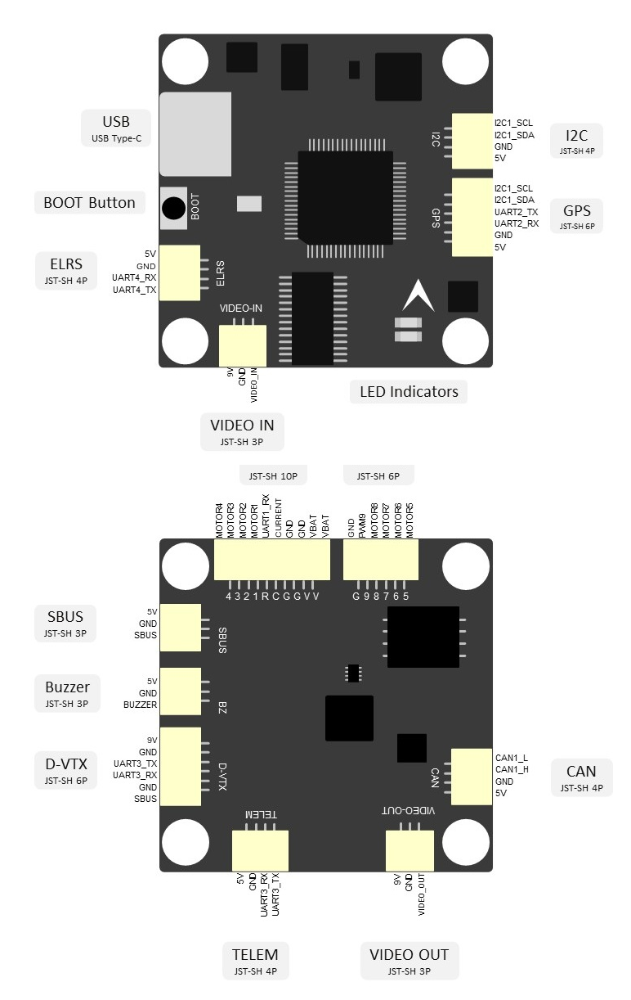
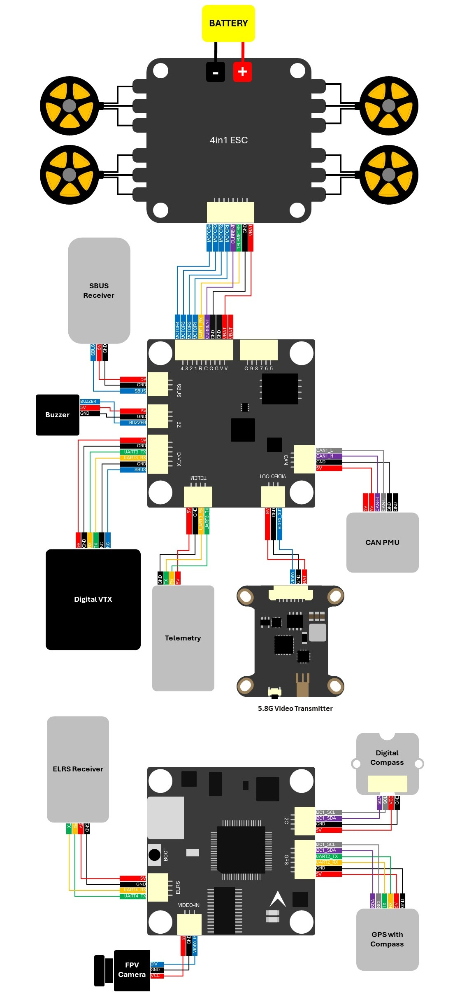
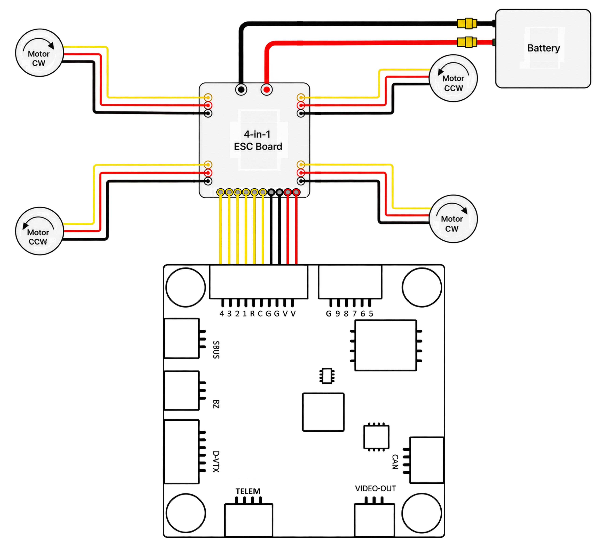
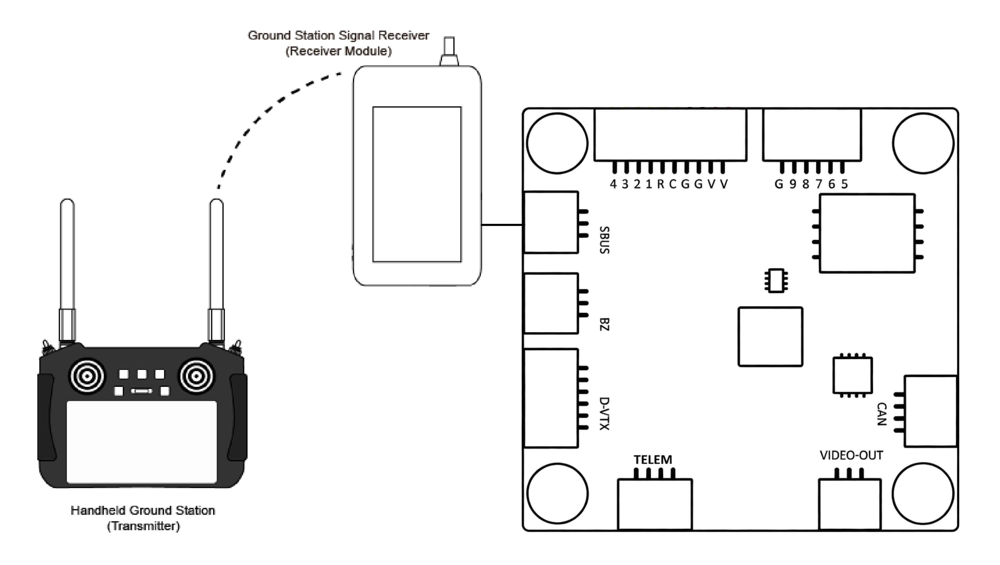

# Accton FPV G-FF4

The FPV G-FF4 is a compact flight controller for FPV, fixed-wing, UAV, and VTOL applications. It features an STM32F405RGT6 flight-control MCU, ICM-42688-P IMU, integrated barometer and compass, optional AT7456E analog OSD, and on-board SPI NAND flight-log storage. It supports ArduPilot, Betaflight, and iNAV.

For more information, visit [Accton-IoT FPV G-FF4](https://www.accton-iot.com/godwit/g-ff4-b.html).

## Specifications

### Processor

- STM32F405RGT6 (Arm Cortex-M4, 168 MHz)
- 1 MB Flash
- 192 KB RAM

### Sensors

- ICM-42688-P IMU (accelerometer and gyroscope)
- DPS368 barometer
- IST8310 compass

### Power

- Input voltage: 3S to 6S LiPo
- 5 V / 3 A BEC
- 9 V / 3 A BEC for the VTX
- Built-in voltage and current sensing

### External Ports

- 1 CAN bus (CAN1)
- 1 USB Type-C port
- 1 GPS port (UART2) and 1 I2C port
- 1 CRSF / ELRS receiver port (UART4)
- 1 SBUS RC input port (UART5 RX only)
- TELEM and D-VTX ports (shared UART3)
- 1 ESC telemetry input (UART1 RX only)
- 1 analog video input and 1 analog video output
- 1 buzzer port
- 9 PWM outputs (PWM1-PWM8 for motor / ESC outputs, plus PWM9 for auxiliary PWM or NeoPixel LED)

### Storage

- 2 Gbit MX35LF2GE4AD SPI NAND flash for flight logs

### Physical

- Dimensions: 36 mm x 36 mm x 10 mm
- Mounting holes: 30.5 mm x 30.5 mm, M4
- Weight: 10 g

## Where to Buy

- [Accton-IoT FPV G-FF4](https://www.accton-iot.com/godwit/g-ff4-b.html)
- [sales@accton-iot.com](mailto:sales@accton-iot.com)

## Pinout

## Wiring Diagram

## UART Mapping

| Serial# | Default protocol | Port | TX DMA | RX DMA | Notes |
| --- | --- | --- | --- | --- | --- |
| SERIAL0 | USB console / telemetry | OTG1 | N/A | N/A | USB virtual serial port |
| SERIAL1 | ESC telemetry | USART1 | ✗ | ✗ | Main ESC connector: RX only |
| SERIAL2 | GPS | USART2 | ✗ | ✗ | GPS connector |
| SERIAL3 | DJI FPV | USART3 | ✗ | ✗ | TELEM and D-VTX share UART3 |
| SERIAL4 | CRSF | UART4 | ✗ | ✗ | ELRS connector |
| SERIAL5 | RC input | UART5 | N/A | ✗ | RX only; SBUS connector and D-VTX pin 6 share the Q1-inverted input |

## PWM Output

This board provides nine PWM outputs, all of which support standard PWM output. PWM1 to PWM8 are intended for motors / ESCs; PWM9 can be used as an auxiliary PWM output or for a NeoPixel / LED strip.

PWM outputs are grouped as follows:

- TIM8: PWM1 to PWM4 (Main ESC)
- TIM3: PWM5 to PWM8 (Ext ESC)
- TIM1: PWM9 (auxiliary PWM / NeoPixel LED)

Outputs within the same timer group must use the same update rate. If any output in a group uses DShot, all other outputs in that group must also use DShot.

## RC Input

The SBUS connector uses SERIAL5 by default (`SERIAL5_PROTOCOL=23`). SERIAL4 is connected to the ELRS connector and defaults to `SERIAL4_PROTOCOL=29`.

To use an ELRS receiver for RC input, set `SERIAL5_PROTOCOL=-1` and `SERIAL4_PROTOCOL=23`, then reboot. Use only one active RC receiver.

See [ArduPilot Radio Control Systems](https://ardupilot.org/plane/docs/common-rc-systems.html) for receiver setup guidance.

## OSD Support

The board supports an AT7456E analog OSD through SPI2. Analog OSD operation requires the corresponding OSD hardware to be populated and the analog video path to be connected.

## Digital VTX Support

The DJI O3 / Telemetry interface is mapped to SERIAL3 (USART3) and defaults to the DJI FPV protocol at 115200 baud. RELAY1 controls its 9 V supply as described below.

## VTX Power Control

RELAY1 on GPIO81 / PB2 controls the VTX 9 V BEC enable input. PB2 high enables the BEC; PB2 low disables it. The board-level default is ON (`RELAY1_DEFAULT=1`).

The bootloader keeps PB2 low, so VTX power remains off during DFU or SD-card flashing.

## GPIOs and Analog Inputs

| GPIO | Function | Notes |
| --- | --- | --- |
| GPIO50-GPIO57 | PWM1-PWM8 | Motor / ESC outputs |
| GPIO58 | PWM9 / NeoPixel LED | Auxiliary PWM or LED-strip output |
| GPIO80 | Buzzer | Active-high buzzer output |
| GPIO81 | VTX 9 V BEC enable | RELAY1 control |
| GPIO88 | ICM-42688-P clock input | Output held low |
| GPIO90 | Blue LED | Status LED |
| GPIO91 | Green LED | Status LED |

The board has no analog RSSI input; CRSF link quality is provided by the serial protocol.

## Power Connection and Battery Monitoring

The board uses built-in analog voltage and current sensing by default, so a CAN PMU is not required. The supported battery input range is 3S to 6S LiPo.

The default battery-monitor parameters are:

- BATT_MONITOR = 4
- BATT_VOLT_PIN = 10
- BATT_CURR_PIN = 11
- BATT_VOLT_MULT = 11.0
- BATT_AMP_PERVLT = 40.0

Calibrate the voltage and current parameters for the installed hardware.

## GPS/Compass

The board has an on-board IST8310 compass and DPS368 barometer; GPS uses SERIAL2.

To reduce magnetic interference from the aircraft power system, use an external I2C compass integrated with the GPS and connect it to the GPS or I2C connector.

## Flight Log Storage

Flight logs are stored in the on-board 2 Gbit MX35LF2GE4AD SPI NAND flash device.

## Firmware

The G-FF4 ships with an ArduPilot-compatible bootloader and ArduPilot firmware pre-installed. Firmware updates can be loaded as `.apj` files using any ArduPilot-compatible ground-control station. Once official ArduPilot builds for the G-FF4 are released, they will be available in folders labeled `AcctonGodwit_GFF4` on the [ArduPilot firmware server](https://firmware.ardupilot.org/).

## Loading Firmware

For normal updates, load an `.apj` firmware file using an ArduPilot-compatible ground-control station. The DFU button is reserved for recovery. If recovery is required, use STM32 DFU mode to load the appropriate `*_with_bl.hex` image.

## More Information and Support

- Product information: [Accton-IoT FPV G-FF4](https://www.accton-iot.com/godwit/g-ff4-b.html)
- Sales: [sales@accton-iot.com](mailto:sales@accton-iot.com)
- Technical support: [support@accton-iot.com](mailto:support@accton-iot.com)
