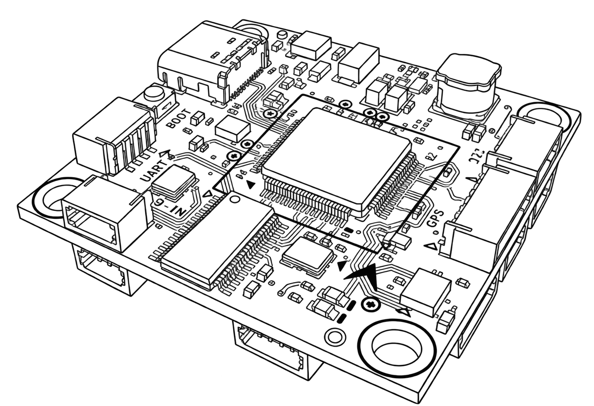
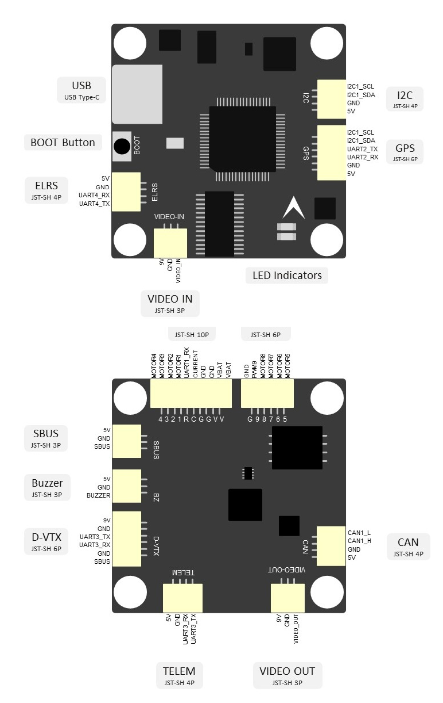
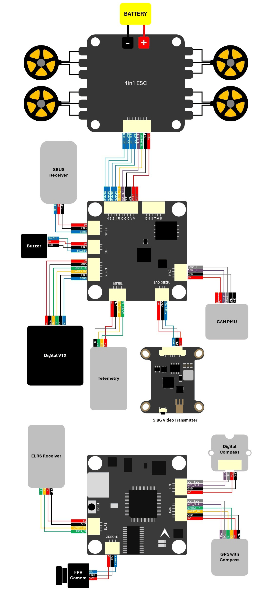
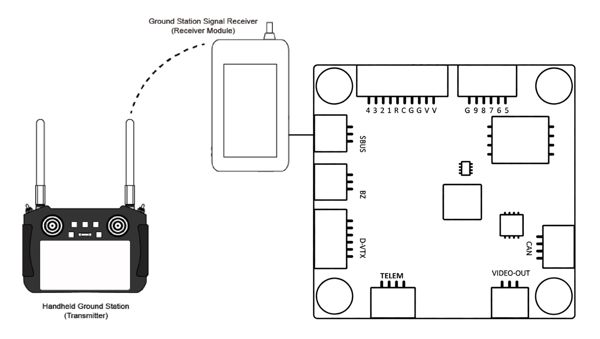

# Accton FPV G-FF4

The FPV G-FF4 is a compact flight controller for FPV, fixed-wing, UAV, and VTOL applications. It features an STM32F405RGT6 flight-control MCU, ICM-42688-P IMU, integrated barometer and compass, AT7456E analog OSD, and on-board SPI NAND flight-log storage. It supports ArduPilot, Betaflight, and iNAV.

For more information, visit [Accton-IoT FPV G-FF4](https://www.accton-iot.com/godwit/g-ff4-b.html).

## Specifications

### Processor

- STM32F405RGT6 (Arm Cortex-M4, 168 MHz)
- 1 MB Flash
- 192 KB RAM

### Sensors

- ICM-42688-P IMU (accelerometer and gyroscope)
- DPS368 barometer
- IST8310 compass

### Power

- Input voltage: 3S to 6S LiPo
- 5 V / 3 A BEC
- 9 V / 3 A BEC for the VTX and FPV camera
- Built-in battery voltage sensing; battery current sensing uses the current output of the external ESC

### External Ports

- 1 CAN bus (CAN1)
- 1 USB Type-C port
- 1 GPS port (UART2) and 1 I2C port
- 1 ELRS receiver port (UART4)
- 1 SBUS RC input port (UART5 RX only)
- TELEM and D-VTX ports (shared UART3)
- 1 ESC telemetry input (UART1 RX only)
- 1 analog video input and 1 analog video output
- 1 buzzer port
- 9 PWM outputs (PWM1-PWM8 for motor / ESC outputs, plus PWM9 for auxiliary PWM or NeoPixel LED)

### Storage

- 2 Gbit MX35LF2GE4AD SPI NAND flash for flight logs

### Physical

- Dimensions: 36 mm x 36 mm x 10 mm
- Mounting holes: 30.5 mm x 30.5 mm, M4
- Weight: 10 g

## Where to Buy

- [Accton-IoT FPV G-FF4](https://www.accton-iot.com/godwit/g-ff4-b.html)
- [sales@accton-iot.com](mailto:sales@accton-iot.com)

## Pinout

## Wiring Diagram

## UART Mapping

| Serial# | Default protocol | Port | TX DMA | RX DMA | Notes |
| --- | --- | --- | --- | --- | --- |
| SERIAL0 | USB console / telemetry | OTG1 | N/A | N/A | USB virtual serial port |
| SERIAL1 | ESC telemetry | USART1 | ✗ | ✗ | Main ESC connector: RX only |
| SERIAL2 | GPS | USART2 | ✗ | ✗ | GPS connector |
| SERIAL3 | MSP DisplayPort | USART3 | ✗ | ✓ | TELEM and D-VTX connectors share UART3; only one of the two can be used at a time. To use MAVLink telemetry on TELEM, first change `SERIAL3_PROTOCOL` (and set `OSD_TYPE2` to `0`). |
| SERIAL4 | MAVLink2 | UART4 | ✗ | ✗ | ELRS connector; DMA is not enabled on this port: UART4_RX would need the only TIM3_UP stream (PWM5-PWM8 would lose DShot) and UART4_TX would share a stream with SPI2_TX. Alternate RC input, see RC Input |
| SERIAL5 | RC input | UART5 | N/A | ✗ | RX only; SBUS connector and D-VTX pin 6 share the Q1-inverted input. UART5_RX would need the stream used by SPI3_RX, so DMA is not available |

## PWM Output

This board provides nine PWM outputs. PWM1 to PWM8 are intended for motors / ESCs; PWM9 can be used as an auxiliary PWM output or for a NeoPixel / LED strip (`SERVO9_FUNCTION` defaults to 120, NeoPixel).

| Output | Connector | Pad label | Timer group |
| --- | --- | --- | --- |
| PWM1-PWM4 | Main ESC | `1` to `4` | TIM8 |
| PWM5-PWM8 | 6-pin PWM connector | `5` to `8` | TIM3 |
| PWM9 | 6-pin PWM connector | `9` | TIM1 |

All outputs in the same timer group must use the same output protocol. If any output in a group uses DShot, all other outputs in that group must also use DShot. All nine outputs are DShot capable; bidirectional DShot is not available on this board.

## RC Input

The default RC input is SBUS on UART5 (`SERIAL5`, `SERIAL5_PROTOCOL=23`). Connect the receiver to the SBUS connector.

To use an ELRS receiver instead, connect it to the ELRS connector on UART4 (`SERIAL4`; see `wiring.png` for the connection). Set `SERIAL4_PROTOCOL` to `23` (RC Input) and `SERIAL5_PROTOCOL` to `-1` (Disabled), then reboot the flight controller. Only one serial port can be configured for RC input at a time.

To switch back to SBUS, set `SERIAL5_PROTOCOL` to `23` and restore `SERIAL4_PROTOCOL` to its intended setting, then reboot.

See [ArduPilot Radio Control Systems](https://ardupilot.org/plane/docs/common-rc-systems.html) for receiver setup guidance.

## OSD Support

The on-board AT7456E analog OSD on SPI2 defaults to `OSD_TYPE=1`. The `VIDEO-IN` connector takes the FPV camera and the `VIDEO-OUT` connector feeds an analog 5.8G VTX.

Warning: the power pin of the `VIDEO-IN` connector is 9 V, not 5 V. Do not connect a 5 V-only camera to it. This pin is on the same RELAY1-switched 9 V rail as the `VIDEO-OUT` and `D-VTX` connectors.

USART3 (`SERIAL3`) defaults to MSP DisplayPort and `OSD_TYPE2` defaults to `5` (MSP DisplayPort), so the analog OSD and the DisplayPort OSD on the D-VTX connector run simultaneously.

Note: if `SERIAL3_PROTOCOL` is ever changed from MSP DisplayPort, `OSD_TYPE2` must be set to `0`, or a pre-arm failure will result.

## Digital VTX Support

The D-VTX connector uses UART3 (`SERIAL3`; `UART3_TX` and `UART3_RX` pins), which is shared with the TELEM connector. The firmware defaults to `SERIAL3_PROTOCOL=42` (MSP DisplayPort) and `OSD_TYPE2=5`, which enables DisplayPort OSD on the second OSD instance, for example for a DJI O3 Air Unit.

If `SERIAL3_PROTOCOL` is changed from MSP DisplayPort, set `OSD_TYPE2` to `0` to avoid a pre-arm failure.

## VTX Power Control

RELAY1 on GPIO 81 controls the 9 V supply of the D-VTX, VIDEO-IN and VIDEO-OUT connectors, so turning RELAY1 off also powers down the FPV camera and the analog VTX. The default is ON (`RELAY1_DEFAULT=1`), so the rail is enabled as soon as the flight firmware starts.

The bootloader keeps the rail off while it is running. Note that the VTX draws power and can overheat whenever the board is powered, including on the bench, and can interfere with other pilots' video. Turn RELAY1 off when the VTX is not needed.

## GPIOs and Analog Inputs

| Pin | GPIO Number |
| --- | --- |
| PWM1 | 50 |
| PWM2 | 51 |
| PWM3 | 52 |
| PWM4 | 53 |
| PWM5 | 54 |
| PWM6 | 55 |
| PWM7 | 56 |
| PWM8 | 57 |
| PWM9 | 58 |
| Buzzer | 80 |
| VTX PWR (RELAY1) | 81 |

The board has no analog RSSI input; CRSF link quality is provided by the serial protocol.

## Power Connection and Battery Monitoring

The board has an internal voltage sensor and a current sensor input on the Main ESC connector (`C` pin) for the ESC's current sensor. The voltage sensor can handle up to 6S LiPo batteries.

The default battery-monitor parameters are:

- BATT_MONITOR = 4
- BATT_VOLT_PIN = 10
- BATT_CURR_PIN = 11
- BATT_VOLT_MULT = 11.0
- BATT_AMP_PERVLT = 40.0 (will need to be adjusted to match the current sensor of the ESC you attach)

## Compass

The G-FF4 has a built-in IST8310 compass. Due to potential interference, the autopilot is usually used with an external I2C compass as part of a GPS/Compass combination, connected to the GPS or I2C connector.

## Flight Log Storage

Flight logs are stored in the on-board 2 Gbit MX35LF2GE4AD SPI NAND flash device.

## Loading Firmware

The G-FF4 ships with an ArduPilot-compatible bootloader. To load ArduPilot firmware, connect the board to a ground control station (Mission Planner or QGroundControl or MAVProxy, plus others can be used) and use it to load the "\<vehicle\>.apj" file from the `AcctonGodwit_GFF4` folder on the [ArduPilot firmware server](https://firmware.ardupilot.org).

For recovery, hold the BOOT button (front face, next to the USB-C connector) while connecting USB, then use STM32CubeProgrammer to load the "\*\*\*_with_bl.hex" file.

## More Information and Support

- Technical support: [support@accton-iot.com](mailto:support@accton-iot.com)
