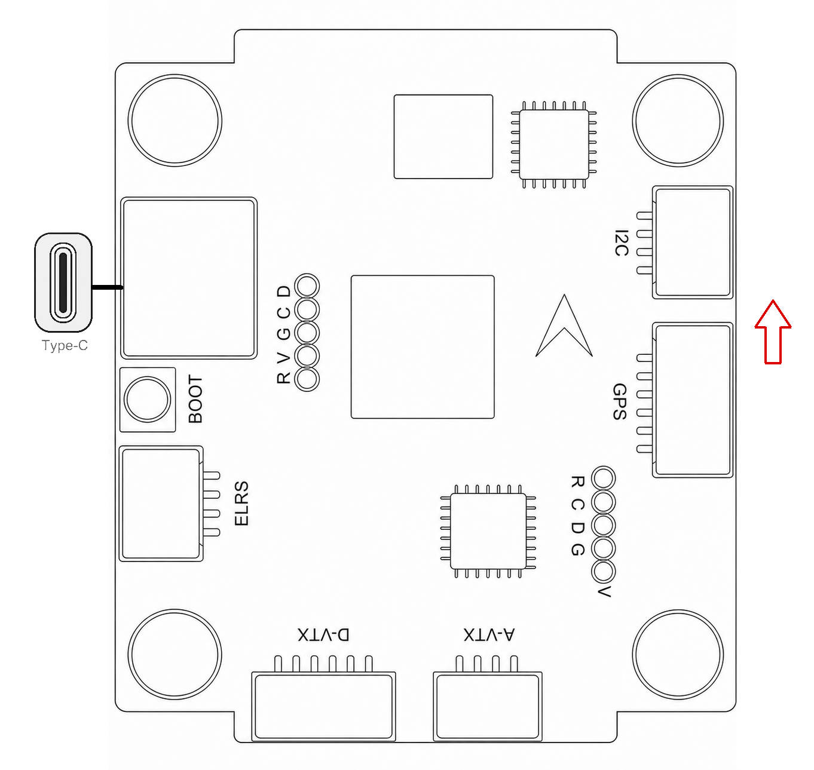
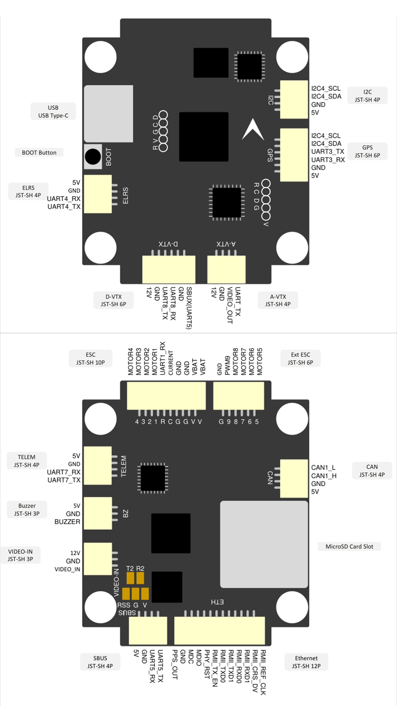
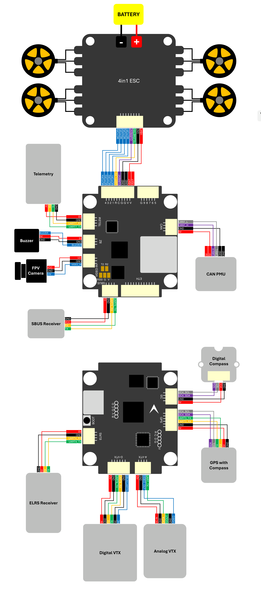
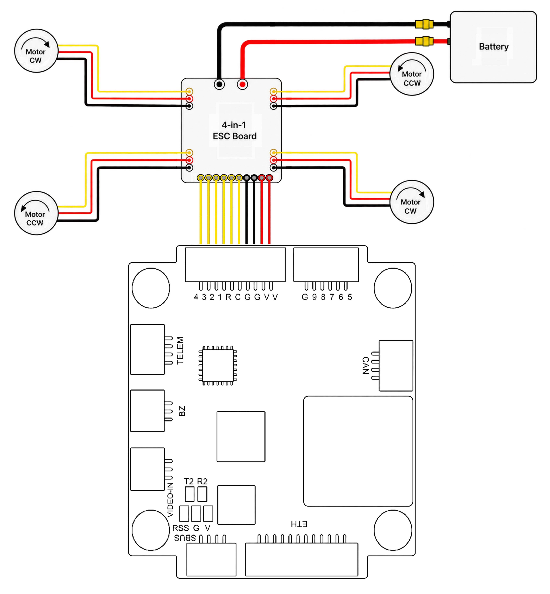
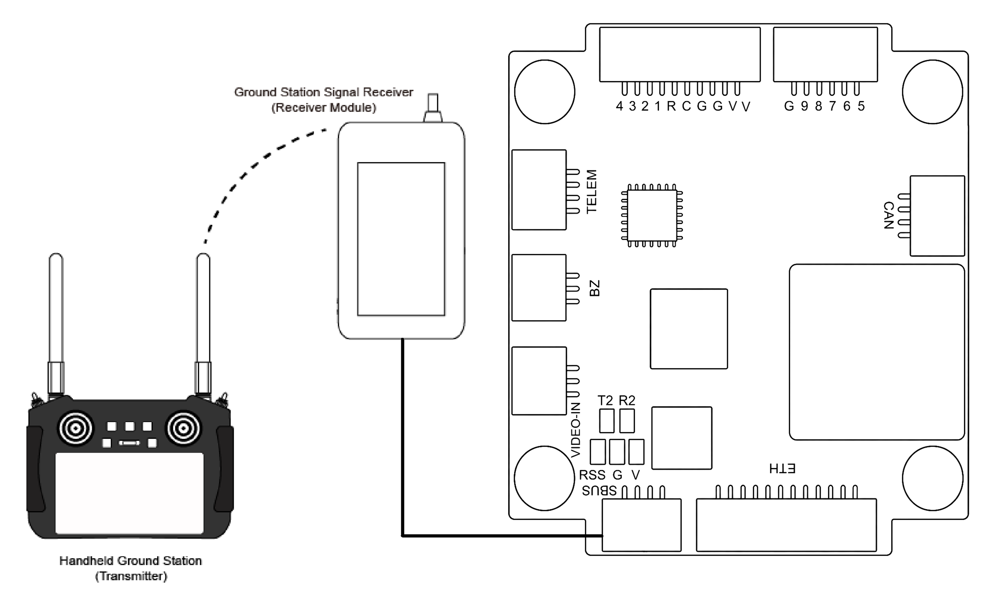
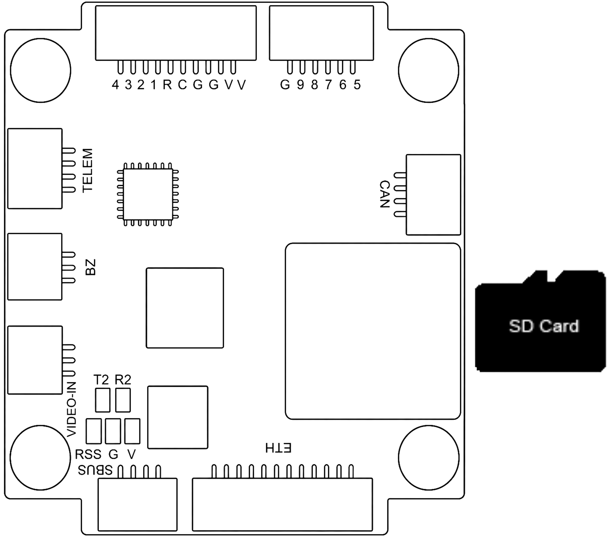

# Accton FPV G-FH7

The FPV G-FH7 is a compact flight controller designed for fixed-wing, UAV,
and VTOL applications. It adopts an STM32H753 flight-management processor,
dual IMUs, an integrated barometer and compass, and solder-free connectors
for flexible system integration. The board supports ArduPilot, PX4,
Betaflight, and iNAV flight-control software.

Visit [Accton-IoT FPV G-FH7](https://www.accton-iot.com/godwit/g-fh7.html)
for more information.

## Specifications

### **Processor**

- STM32H753VIH6 (Arm Cortex-M7, 480MHz)

### **Sensors**

- TDK InvenSense ICM-42688-P
- STMicroelectronics LSM6DSK320X
- DPS368 Barometric Pressure Sensor
- IST8310 Geomagnetic Sensor

### **Power**

- Input voltage: up to 12S LiPo
- BEC output: 5 V/3 A and 12 V/3 A (supports power-saving mode)
- Static power consumption: 110 mA at 5 V
- microSD card for blackbox data logging

### **External ports**

- 1 CAN port
- 7 UARTs (6x available by connectors, 1x available by soldering pads)
- 9 PWM outputs: 8 motor outputs and 1 user-defined output
- 1 I2C port
- 3 ADC inputs (battery voltage, battery current, and analog RSSI)
- 2 LED indicators
- Software-based analog OSD
- Buzzer, video input, and video output interfaces
- USB Type-C with DFU button
- Ethernet RMII and PPS by connector (reserved for future use)

### **Size and Dimensions**

- 36 x 42 x 8.63 mm
- M4 mounting holes
- Weight: 10.6 g

## Where to Buy

Product information and availability are provided on the
[Accton-IoT FPV G-FH7 product page](https://www.accton-iot.com/godwit/g-fh7.html).

## Pinout

Refer to the
[FPV G-FH7 product page](https://www.accton-iot.com/godwit/g-fh7.html)
and the
[FPV G-FH7 datasheet](https://www.accton-iot.com/godwit/assets/doc/DS-Godwit%20FPV%20G-FH7.pdf)
for the latest board information and interface definition.

## Interface Summary

| Interface | Function |
| --------- | -------- |
| `ESC` / `Ext ESC` | Connect the ESC and motor system. |
| `GPS` | Connect a GPS module. |
| `SBUS` / `ELRS` | Connect an RC receiver. |
| `TELEM` | Connect a telemetry radio or MAVLink device. |
| `CAN` | Connect CAN peripherals. |
| `I2C` | Connect external I2C sensors. |
| `VIDEO-IN` | Connect the analog video input. |
| `A-VTX` / `D-VTX` | Connect the supported video transmitter interface. |

## UART Mapping

| Serial#   | Protocol      | Port     | Notes               |
| --------- | ------------- | -------- | ------------------- |
| `SERIAL1` | Telemetry     | `UART7`  | Telemetry connector |
| `SERIAL2` | UART          | `USART2` | External pad        |
| `SERIAL3` | GPS           | `USART3` | GPS connector       |
| `SERIAL4` | MAVLink       | `UART4`  | Mission computer    |
| `SERIAL5` | RC Input      | `UART5`  | SBUS receiver       |
| `SERIAL6` | D-VTX         | `UART8`  | D-VTX connector     |
| `SERIAL7` | ESC Telemetry | `USART1` | ESC telemetry       |

## Wiring Diagram

Refer to the
[FPV G-FH7 product page](https://www.accton-iot.com/godwit/g-fh7.html)
and the
[FPV G-FH7 datasheet](https://www.accton-iot.com/godwit/assets/doc/DS-Godwit%20FPV%20G-FH7.pdf)
for the latest wiring and connector information.

## PWM Output

`PWM1`-`PWM8` are motor outputs. `PWM1`-`PWM4` are assigned to TIM1, and `PWM5`-`PWM8` are assigned to TIM8. `PWM1`-`PWM8` support bidirectional output configuration. `PWM9` is a user-defined output for the NeoPixel / LED strip.

- `PWM1`-`PWM4`: motor outputs
- `PWM5`-`PWM8`: motor outputs
- `PWM9`: user-defined output / NeoPixel LED strip

## RC Input

The default RC input is SBUS on `SERIAL5`. Connect the receiver according to
the G-FH7 board documentation.

## GPS/Compass

GPS is assigned to `SERIAL3`. The on-board IST8310 compass and DPS368
barometer are connected through I2C.

## SD Card

The board supports a microSD card for blackbox and flight-log storage.

## Firmware

The G-FH7 supports ArduPilot, PX4, Betaflight, and iNAV. The ArduPilot
firmware target is `AcctonGodwit_GFH7`.

To upgrade firmware use any ArduPilot-compatible ground control station.
Firmware for the GFH7 will be available in folders labeled
`AcctonGodwit_GFH7` on the
[ArduPilot firmware server](https://firmware.ardupilot.org/) once board
support is included in an ArduPilot firmware release.

## More Information and Support

- [Accton-IoT FPV G-FH7](https://www.accton-iot.com/godwit/g-fh7.html)
- [sales@accton-iot.com](mailto:sales@accton-iot.com)
- [support@accton-iot.com](mailto:support@accton-iot.com)
