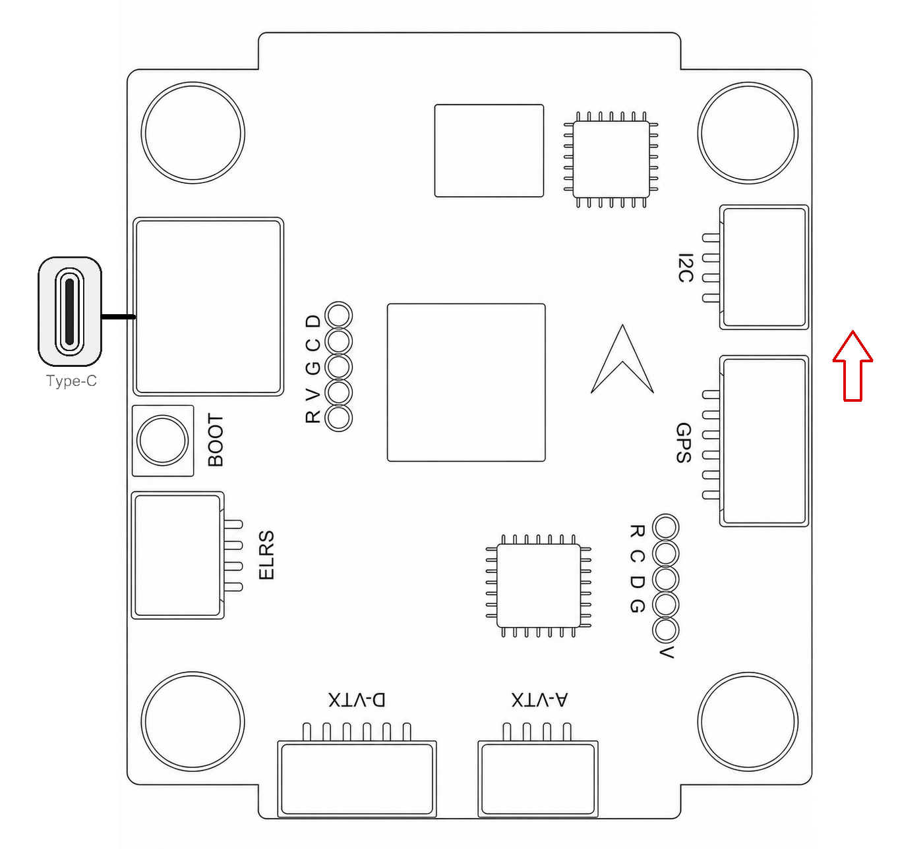
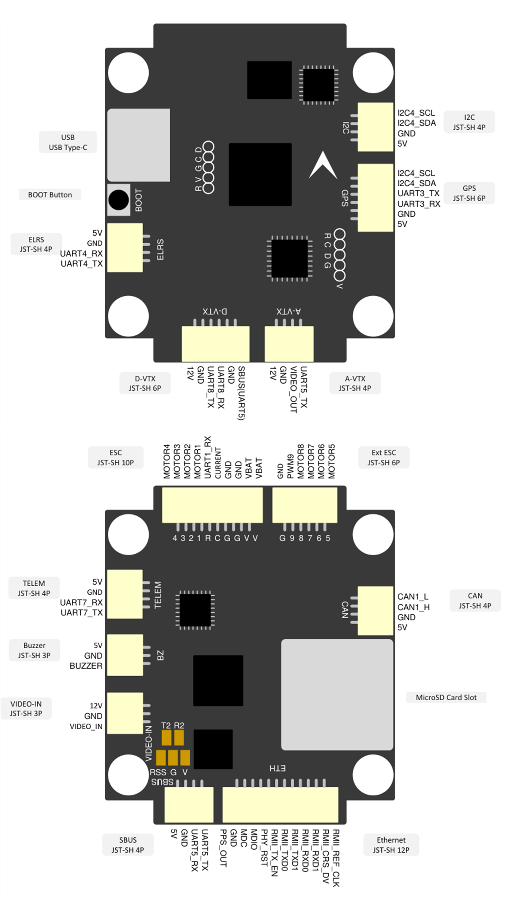
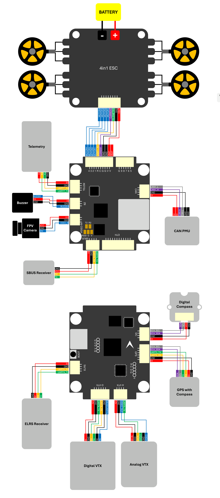
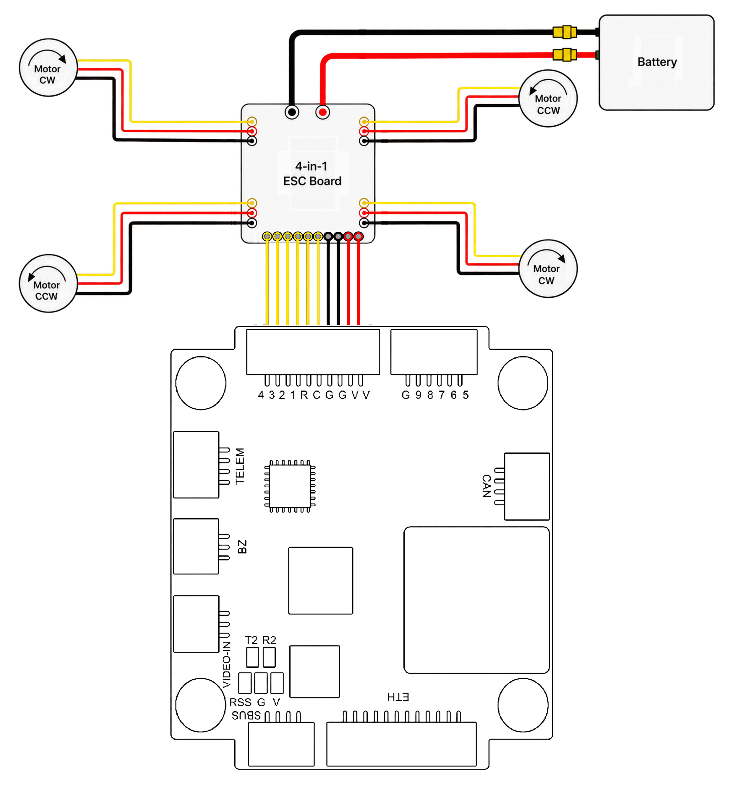
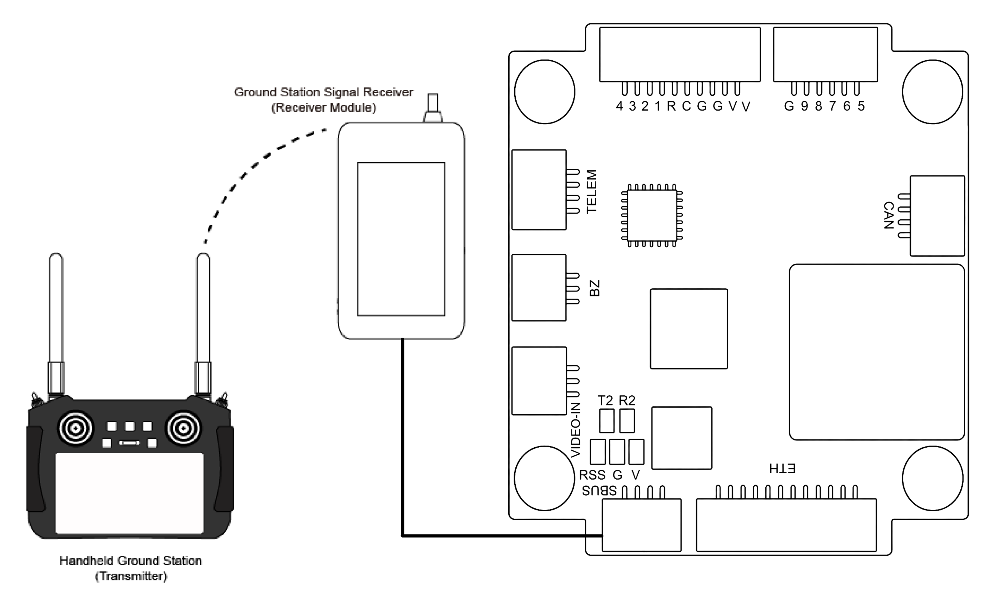
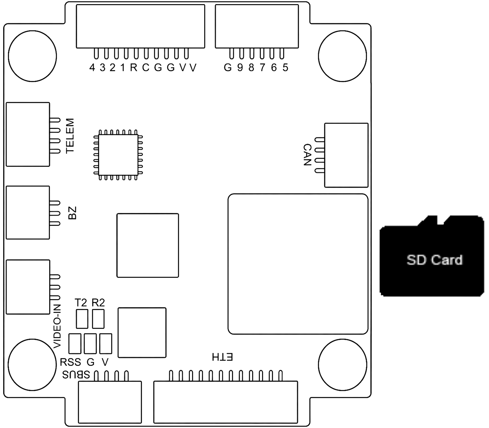

# Accton FPV G-FH7

The FPV G-FH7 is a compact flight controller designed for fixed-wing, UAV,
and VTOL applications. It adopts an STM32H753 flight-management processor,
dual IMUs, an integrated barometer and compass, and solder-free connectors
for flexible system integration. The board supports ArduPilot, PX4,
Betaflight, and iNAV flight-control software.

Visit [Accton-IoT FPV G-FH7](https://www.accton-iot.com/godwit/g-fh7.html)
for more information.

## Specifications

### **Processor**

- STM32H753VIH6 (Arm Cortex-M7, 480MHz)

### **Sensors**

- TDK InvenSense ICM-42688-P
- STMicroelectronics LSM6DSK320X
- DPS368 Barometric Pressure Sensor
- IST8310 Geomagnetic Sensor

### **Power**

- Input voltage: up to 12S LiPo
- BEC output: 5 V/3 A and 12 V/3 A (supports power-saving mode)
- Static power consumption: 110 mA at 5 V
- microSD card for blackbox data logging

### **External ports**

- 1 CAN port
- 7 UARTs (6x available by connectors, 1x available by soldering pads)
- 9 PWM outputs: 8 motor outputs and 1 user-defined output
- 1 I2C port
- 3 ADC inputs (battery voltage, battery current, and analog RSSI)
- 2 LED indicators
- Software-based analog OSD
- Buzzer, video input, and video output interfaces
- USB Type-C with DFU button
- Ethernet RMII and PPS by connector (reserved for future use)

### **Size and Dimensions**

- 36 x 42 x 8.63 mm
- M4 mounting holes
- Weight: 10.6 g

## Where to Buy

- [Accton-IoT FPV G-FH7](https://www.accton-iot.com/godwit/g-fh7.html)
- [sales@accton-iot.com](mailto:sales@accton-iot.com)

## Pinout

Refer to the
[FPV G-FH7 product page](https://www.accton-iot.com/godwit/g-fh7.html)
and the
[FPV G-FH7 datasheet](https://www.accton-iot.com/godwit/assets/doc/DS-Godwit%20FPV%20G-FH7.pdf)
for the latest board information and interface definition.

## Interface Summary

| Interface | Function |
| --------- | -------- |
| `ESC` / `Ext ESC` | Connect the ESC and motor system. |
| `GPS` | Connect a GPS module. |
| `SBUS` / `ELRS` | Connect an RC receiver. |
| `TELEM` | Connect a telemetry radio or MAVLink device. |
| `CAN` | Connect CAN peripherals. |
| `I2C` | Connect external I2C sensors. |
| `VIDEO-IN` | Connect the analog video input. |
| `A-VTX` / `D-VTX` | Connect the supported video transmitter interface. |

## Wiring Diagram

Refer to the
[FPV G-FH7 product page](https://www.accton-iot.com/godwit/g-fh7.html)
and the
[FPV G-FH7 datasheet](https://www.accton-iot.com/godwit/assets/doc/DS-Godwit%20FPV%20G-FH7.pdf)
for the latest wiring and connector information.

## UART Mapping

| Serial# | Default protocol | Port | TX DMA | RX DMA | Connector role and notes |
| ------- | ---------------- | ---- | ------ | ------ | ------------------------ |
| `SERIAL0` | MAVLink2 | USB |  |  | USB connection |
| `SERIAL1` | MAVLink2 | `UART7` | No | No | TELEM connector |
| `SERIAL2` | MAVLink2 | `USART2` | No | No | External pad |
| `SERIAL3` | GPS | `USART3` | Yes | Yes | GPS connector |
| `SERIAL4` | MAVLink2 | `UART4` | Yes | Yes | ELRS receiver; alternate RC input after disabling `SERIAL5` RCIN. |
| `SERIAL5` | RCIN | `UART5` | No | No | SBUS connector; `UART5_RX` receives SBUS and is also wired to D-VTX pin 6. `UART5_TX` is shared with SBUS pin 4 and A-VTX `UART_TX`. |
| `SERIAL6` | MSP DisplayPort | `UART8` | No | No | D-VTX connector. |
| `SERIAL7` | ESC Telemetry | `USART1` | No | No | ESC connector exposes USART1 RX (PA10) only; USART1 TX (PA9) is a test point. |

## PWM Output

`PWM1`-`PWM8` are motor outputs. `PWM1`-`PWM4` are assigned to TIM1, and `PWM5`-`PWM8` are assigned to TIM8. `PWM1`-`PWM8` support bidirectional output configuration. `PWM9` is a user-defined output for the NeoPixel / LED strip.

- `PWM1`-`PWM4`: motor outputs
- `PWM5`-`PWM8`: motor outputs
- `PWM9`: user-defined output / NeoPixel LED strip

PWM outputs are arranged in three timer groups: PWM1-PWM4 (TIM1), PWM5-PWM8 (TIM8), and PWM9 (TIM2). All outputs in a timer group must use the same output protocol. If a group uses DShot, every output in that group must use DShot.

PWM9 is physically on Ext ESC connector pin 9 and may be used as a user-defined or NeoPixel output.

## RC Input

The default RC input is SBUS on UART5 (`SERIAL5`). Connect the receiver to the SBUS connector.

To use an ELRS receiver instead, connect it to the ELRS receiver connector on UART4 (`SERIAL4`). Using Mission Planner or QGroundControl over USB or another telemetry link, set `SERIAL4_PROTOCOL` to `23` (RC Input) and `SERIAL5_PROTOCOL` to `-1` (Disabled), then reboot the flight controller. Only one serial port can be configured for RC input at a time.

To switch back to SBUS, set `SERIAL5_PROTOCOL` to `23`, restore `SERIAL4_PROTOCOL` to its intended setting, then reboot.

For setup details on common RC systems, including CRSF and ELRS, see the [common-rc-systems documentation](https://ardupilot.org/plane/docs/common-rc-systems.html).

## OSD Support

The on-board SPI OSD uses an STM32G431 running AT7456E-compatible firmware and defaults to `OSD_TYPE=1` for analog OSD. UART8 (`SERIAL6`) defaults to MSP DisplayPort. To run the analog OSD and a DisplayPort OSD simultaneously, set `OSD_TYPE2=5`.

## Analog VTX Support

The A-VTX connector `UART_TX` is `UART5_TX`, shared with SBUS pin 4. `SERIAL5` defaults to RCIN, so SmartAudio/Tramp control is not configured by default.

## Digital VTX Support

The D-VTX connector uses UART8 (`SERIAL6`; PE1 TX and PE0 RX) for its digital link and is intended for digital VTX OSD. The firmware defaults to `SERIAL6_PROTOCOL=42` (MSP DisplayPort). Set `OSD_TYPE2=5` to enable DisplayPort OSD on the second OSD instance.

If `SERIAL6_PROTOCOL` is changed from MSP DisplayPort, set `OSD_TYPE2` to `0` to avoid a pre-arm failure.

## VTX Power Control

The VTX 12V rail is controlled by Relay 1. It is off while the bootloader is running and is enabled by default once the flight firmware starts. Use Relay 1 to turn VTX power off or on.

## GPIOs and Analog Inputs

### RSS Analog Input

The `RSS` pad is PB1 / ADC1 and is mapped to `RSSI_ANA_PIN=5`. To use an analog receiver RSSI voltage, set `RSSI_TYPE` to `1` (AnalogPin); RSSI is disabled by default.

### UART2 Solder Pads

The `T2` and `R2` solder pads are `SERIAL2`: T2 is PD5 / USART2 TX and R2 is PA3 / USART2 RX. `SERIAL2` defaults to MAVLink2 and has no TX or RX DMA.

### External Five-Pad Test Points

The top face has two unpopulated five-pad test/debug groups for manufacturing, debugging, or hardware verification:

- `R V G C D`: STM32H753 (H7) test/debug pads.
- `R C D G V`: OSD co-processor test/debug pads.

They are not general user interfaces. Do not connect wiring or apply power, and do not use them as GPIO, UART, or I2C interfaces. Individual pad nets and functions are not publicly defined.

### Board-Reserved GPIOs

The following GPIOs are assigned to board functions and are not general-purpose external GPIOs:

- GPIO80 / PE12: buzzer
- GPIO81 / PC12: 12V VTX rail enable (Relay1 default)
- GPIO82 / PE3: IMU heater enable
- GPIO84 / PA15: SD card detect
- GPIO88 / PD14: IMU clock input
- GPIO90 / PE10 and GPIO91 / PC13: blue and green status LEDs

## Power Connection and Battery Monitoring

The G-FH7 provides onboard analog voltage and current sensing. The product specification rates the battery input at up to 12S LiPo.

ArduPilot configures the first battery monitor by default as analog voltage and current monitoring (type 4):

- `BATT1_VOLT_PIN=10` (PC0 / ADC1) with `BATT1_VOLT_MULT=17.0`
- `BATT1_CURR_PIN=9` (PB0 / ADC1) with `BATT1_AMP_PERVLT=40.0`

Calibrate `BATT1_AMP_PERVLT` against the installed current sensor as needed.

## Compass

The G-FH7 has a built-in IST8310 compass. Due to potential interference, the autopilot is usually used with an external I2C compass as part of a GPS/Compass combination, connected to the GPS or I2C connector.

## SD Card

The board supports a microSD card for blackbox and flight-log storage.

## Firmware

The G-FH7 supports ArduPilot, PX4, Betaflight, and iNAV. The ArduPilot
firmware target is `AcctonGodwit_GFH7`.

To upgrade firmware use any ArduPilot-compatible ground control station.
Firmware for the GFH7 will be available in folders labeled
`AcctonGodwit_GFH7` on the
[ArduPilot firmware server](https://firmware.ardupilot.org/) once board
support is included in an ArduPilot firmware release.

## Loading Firmware

The G-FH7 ships with an ArduPilot-compatible bootloader.

For normal firmware updates, use Mission Planner to load the GFH7-specific `.apj` firmware.

Use the BOOT button while connecting USB to enter STM32 DFU mode only for bootloader recovery or reinstallation, then flash the bootloader.

## More Information and Support

- [Accton-IoT FPV G-FH7](https://www.accton-iot.com/godwit/g-fh7.html)
- [sales@accton-iot.com](mailto:sales@accton-iot.com)
- [support@accton-iot.com](mailto:support@accton-iot.com)
