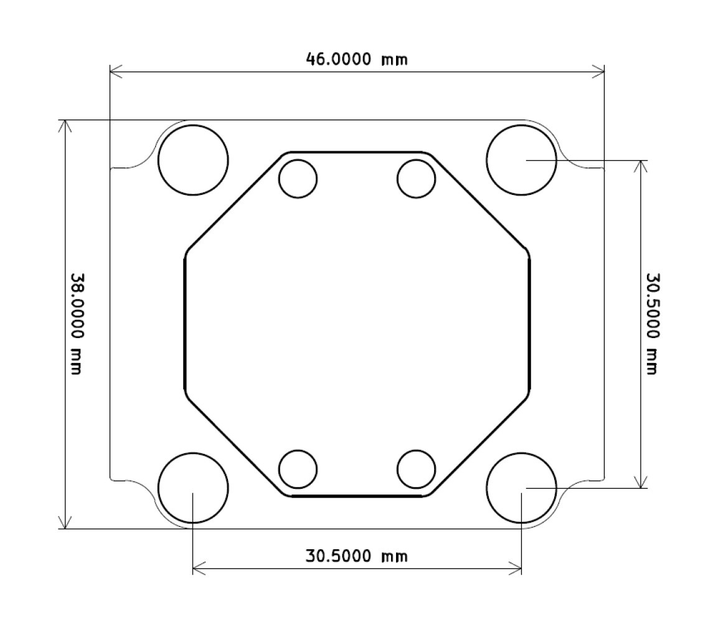

# Radian Flight Controller

## Overview

The **Radian** by [Aerium](https://www.aerium.co.il) is a compact, high-performance flight controller designed for professional multirotors, fixed-wing aircraft, and VTOL platforms. Built to Pixhawk standards, it supports ArduPilot, PX4, and Betaflight firmware, ensuring flexibility across a wide range of applications.

Engineered for reliability and versatility, the Radian integrates advanced sensors, robust power management, and extensive I/O—all within a compact 46 × 38 mm carrier board. The detachable core module, measuring just 32 × 32 mm, enables seamless integration into embedded systems where space is at a premium.

Explore the [Aerium Radian product page](https://www.aerium.co.il/product-page/radian) for detailed specifications, imagery, and purchase options.

## Technical Specifications

- **Processor:** STM32F405RG – ARM Cortex-M4 @ 168 MHz with FPU, 1 MB Flash, 192 KB SRAM  
- **IMUs:** Bosch BMI270 and TDK ICM42688P  
- **Barometers:** Bosch BMP260 and ST LPS22HBTR  
- **Compasses:** Bosch BMM150 and ST LIS3MDL  
- **Firmware Support:** ArduPilot, PX4, and Betaflight  
- **Power Input:** Dual redundant power inputs up to 60V with integrated eFuse, voltage sensing, and DC-DC conversion  
- **Interfaces:**
  - 3 × UART (3.3V TTL)
  - 1 × CAN (DroneCAN / CAN-FD)
  - 2 × I2C (only 1 exposed on the FPV carrier board)
  - 3 × SPI (internal)
  - 1 × RC input
  - 8 × PWM/servo outputs
  - 1 × microSD card slot (for logging)
- **Weight:** Approximately 20 g  
- **Dimensions:**
  - **Carrier board:** 46 × 38 mm (M4 mounting holes for M3 dampers, 30.5 × 30.5 mm spacing)  
  - **Radian core module:** 32 × 32 mm (M2 mounting holes with integrated standoffs)

## Purchase

- Available at the [Aerium online store](https://www.aerium.co.il/product-page/radian)

## Connectors and Pinouts

For detailed pin definitions and usage, refer to the [Radian documentation portal](https://aerium.bitbucket.io/documentation/Product%20Manuals/Radian/).

## UART Port Mapping

| ArduPilot SERIALx | Connector | UART/Default Protocol                   | DMA           |
|-------------------|-----------|-----------------------------------------|---------------|
| SERIAL1           | TELEM1    | USART6, MAVLINK2                        | DMA Enabled   |
| SERIAL2           | TELEM2    | USART3, MAVLINK2                        | DMA Enabled   |
| SERIAL3           | GPS       | UASRT 1, GPS                            | No DMA        |

## Alt Config
the RadianF405 supports alternate board configuration that converts SERIAL2/USART3 to and I2C port according to the following pinout:

| BRD_ALT_CONFIG=0  | BRD_ALT_CONFIG=1 |
|-------------------|------------------|
| TELEM2_TX         | I2C2_SCL         |
| TELEM2_RX         | I2C2_SDA         |

## PWM / Servo Outputs

- Supports 8 PWM or servo outputs
- Functions can be assigned using `SERVOx_FUNCTION` parameters in supported firmware
- The outputs are grouped as follows:
  - PWM 1-3 in group1
  - PWM 4-6 in group2
  - PWM 7,8 in group3
- Channels within the same group must use the same protocol, ie if any channel in a group uses DShot then all channels in the group need to use DShot.  

The following outputs support Bi_Directional DShot, all others support PWM or DShot only:
  - PWM 1
  - PWM 2
  - PWM 3
  - PWM 6

## RC Input

- RC input is on the PPM_IN pin.It supports all ArduPilot compatible uni-directional protocols. Bi-Directional RC protocols, such as CRSF, need to use a full UART whose ``SERIALx_PROTOCOL`` is set to "23". For that case:

- PPM is not supported.
- FPort requires an external bi-directional inverter (see :ref:`common-fport-receivers`)
- CRSF/ELRS automatically provides telemetry. UART must support DMA capability.
- SRXL2 automatically provides telemetry. Set ``SERIALx_OPTIONS`` to “4”.

- For more setup information, consult the :ref:`ArduPilot RC systems guide <common-rc-systems>`

## Power supply & Battery Monitoring

- Supports dual redundanct 3S-14S battery input
- Dual onboard voltage sensors for independent monitoring of both power inputs  
- Supports external voltage and current monitoring through power connectors  
- Default firmware configurations are pre-mapped to the correct pins  
- Use onboard VSense jumpers to toggle between internal 19:1 divider and external (Default) sensing for each input
- Voltage and current scalers can be adjusted for precise measurements  

Warning! voltage/current sensor inputs by default are 3.3V input full scale.

| Power symbol | Power source | Max power (current) |
|--------------|--------------|---------------------|
| 5V           | from 5V BEC  | 20W (4A)            |
| BAT          | from battery | (5A)                |

the default paramters for the battery monitors:

 - :ref:BATT_MONITOR<BATT_MONITOR> = 4
 - :ref:BATT_VOLT_PIN<BATT_VOLT_PIN__AP_BattMonitor_Analog> = 10
 - :ref:BATT_CURR_PIN<BATT_CURR_PIN__AP_BattMonitor_Analog> = 11
 - :ref:BATT_VOLT_MULT<BATT_VOLT_MULT__AP_BattMonitor_Analog> = 1 (3.3V in will display as 1 Volt by default)
 - :ref:BATT_AMP_PERVLT<BATT_AMP_PERVLT__AP_BattMonitor_Analog> = 1 (3.3V in will display as 1 Amp by default)

 - :ref:BATT2_MONITOR<BATT_MONITOR> = 4
 - :ref:BATT2_VOLT_PIN<BATT_VOLT_PIN__AP_BattMonitor_Analog> = 12
 - :ref:BATT2_CURR_PIN<BATT_CURR_PIN__AP_BattMonitor_Analog> = 11
 - :ref:BATT2_VOLT_MULT<BATT_VOLT_MULT__AP_BattMonitor_Analog> = 1 (3.3V in will display as 1 Volt by default)
 - :ref:BATT2_AMP_PERVLT<BATT_AMP_PERVLT__AP_BattMonitor_Analog> = 1 (3.3V in will display as 1 Amp by default)
 
## Compass Configuration

Includes dual onboard compass modules for redundancy. However, onboard compasses are often subject to large EM impacts from the power circuitry and battery and are oftem disabled and an external compass used which can be located away from interference. Additional external compasses can be connected via the I2C interface

## RSSI/Analog Airspeed Input

- The board does not have analog inputs (ADC pins) dedicated for RSSI and Airspeed sensor
- If the RC protocol embedds RSSI, then set :ref:`RSSI_TYPE<RSSI_TYPE>` = 3.

## Firmware
Firmware for the Aerium-Radian-F405 can be found `here <https://firmware.ardupilot.org>`_ in sub-folders labeled “Aerium-Radian-F405".

## Loading Firmware

Initial firmware load can be done with DFU by plugging in USB with the bootloader button pressed. Then you should load the "with_bl.hex" firmware, using your favorite DFU loading tool.

Once the initial firmware is loaded you can update the firmware using any ArduPilot ground station software. Updates should be done with the "*.apj" firmware files.

## Support & Community

- **Technical Support:** [Aerium Contact Page](https://www.aerium.co.il/contact)  
- **Community Forum:** [ArduPilot Discourse](https://discuss.ardupilot.org)  
- **Documentation:** [ArduPilot Wiki](https://ardupilot.org)
