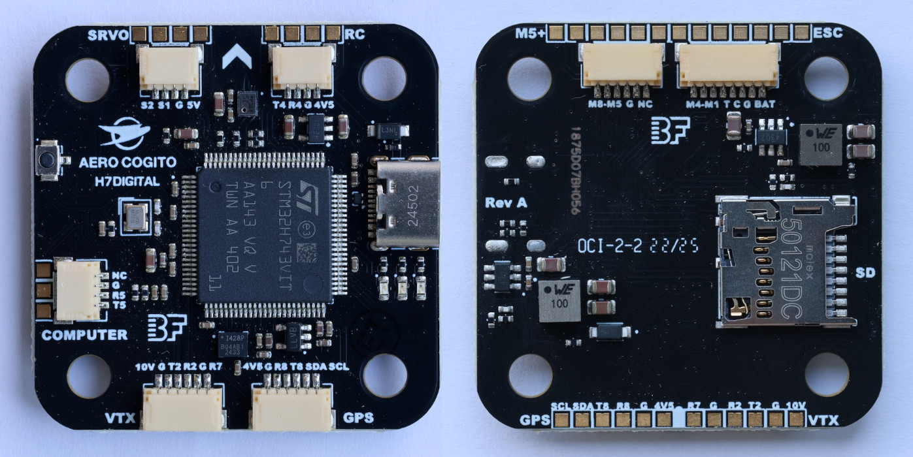

# AeroCogito H7-Digital Flight Controller

https://www.aerocogito.com/store/p/h7-digital

The AeroCogito H7-Digital is a **NDAA-compliant**, high-performance flight controller featuring the STM32H743 processor and designed from the ground up for use with companion flight computers like the Raspberry Pi and Nvidia Jetson.

## Features

- NDAA-compliant design
- Optimized for use with companion computers (Raspberry Pi, Jetson)
- Digital HD VTX only (OpenIPC, DJI, Walksnail, HDZero)
- BetaFlight standard JST-SH connectors
- 10 PWM outputs
- Software-controlled 10V VTX power

## Specifications

- **MCU**: STM32H743 @ 480MHz
- **Memory**: 1MB RAM, 2MB Flash
- **IMU**: ICM-42688-P 6-axis, with isolated power rail and additional filtering
- **Baro**: DPS368
- **Size**: 41mm x 41mm (30.5mm mounting)
- **Input**: 3S-6S (11.1V - 25.2V)
- **5V BEC**: 2.5A peak, 2A continuous
- **10V BEC**: 2.5A peak, 2A continuous

## Pinout

## UART Mapping

The UARTs are marked Rn and Tn in the above pinouts. The Rn pin is the receive pin for UARTn. The Tn pin is the transmit pin for UARTn.

| **Serial#** | **Port** | **Protocol**  | **Notes**                               |
|-------------|----------|---------------|-----------------------------------------|
| SERIAL0     | OTG1     | USB-FS        | USB Type-C connector                    |
| SERIAL1     | UART5    | MAVLink2      | Companion/Telemetry, DMA-enabled        |
| SERIAL2     | UART2    | DisplayPort   | MSP OSD, DMA-enabled                    |
| SERIAL3     | UART8    | GPS           | DMA-enabled                             |
| SERIAL4     | UART4    | RCIN          | SBUS/CRSF/ELRS, DMA-enabled             |
| SERIAL5     | UART3    | ESC Telemetry | RX only on ESC pin T                    |
| SERIAL6     | UART7    | NONE          | RX only on R7 for DJI, DMA-enabled      |

Note: in order to use SERIAL6 for SBUS input on HD VTX connector, SERIAL 4 must not be used for RC, its protocol changed from "23", and SERIAL6_PROTOCOL changed to "23".

## Connectors
The H7-Digital uses JST-SH connectors adhering to the [BetaFlight Connector Standard](https://betaflight.com/docs/development/manufacturer/connector-standard#jst-sh-series-as-standard-for-connectors)
- 8-pin JST-SH (ESC)
- 6-pin JST-SH (Motors 5-8, GPS/Compass, VTX)
- 4-pin JST-SH (Servos, RC Input, Companion Computer/Telemetry)

### ESC Connector (PWM Output 1-4)
| Pin | Label | Signal    | Voltage               |
|-----|-------|-----------|-----------------------|
| 1   | BAT   | VBAT      | 11.1V - 25.2V (3S-6S) |
| 2   | G     | GND       | GND                   |
| 3   | C     | Current   | 3.3V                  |
| 4   | T     | Telemetry | 3.3V                  |
| 5   | M1    | M1        | 3.3V                  |
| 6   | M2    | M2        | 3.3V                  |
| 7   | M3    | M3        | 3.3V                  |
| 8   | M4    | M4        | 3.3V                  |

### Motors 5-8 Connector (PWM Output 5-8)
| Pin | Label | Signal             | Voltage  |
|-----|-------|--------------------|----------|
| 1   | NC    | Not Connected (NC) | None     |
| 2   | G     | GND                | GND      |
| 3   | M5    | M5                 | 3.3V     |
| 4   | M6    | M6                 | 3.3V     |
| 5   | M7    | M7                 | 3.3V     |
| 6   | M8    | M8                 | 3.3V     |

### Servos Connector (PWM Output 9-10)
| Pin | Label | Signal | Voltage |
|-----|-------|--------|---------|
| 1   | 5V    | PWR    | 5V      |
| 2   | G     | GND    | GND     |
| 3   | S1    | S1     | 3.3V    |
| 4   | S2    | S2     | 3.3V    |

### GPS/Compass Connector (UART8 + I2C4)
| Pin | Label | Signal | Voltage |
|-----|-------|--------|---------|
| 1   | 4V5   | PWR    | 4.5V    |
| 2   | G     | GND    | GND     |
| 3   | R8    | RX     | 3.3V    |
| 4   | T8    | TX     | 3.3V    |
| 5   | SDA   | SDA    | 3.3V    |
| 6   | SCL   | SCL    | 3.3V    |

*4.5V pads will receive power from either USB or battery*

### Companion Computer/Telemetry Connector (UART5)
| Pin | Label | Signal             | Voltage       |
|-----|-------|--------------------|---------------|
| 1   | NC    | Not Connected (NC) | None          |
| 2   | G     | GND                | GND           |
| 3   | R5    | RX                 | 3.3V          |
| 4   | T5    | TX                 | 3.3V          |

### RC Input Connector (UART4)
| Pin | Label | Signal | Voltage |
|-----|-------|--------|---------|
| 1   | 4V5   | PWR    | 4.5V    |
| 2   | G     | GND    | GND     |
| 3   | R4    | RX     | 3.3V    |
| 4   | T4    | TX     | 3.3V    |

*4.5V pads will receive power from either USB or battery*

### VTX/DisplayPort Connector (UART2)
| Pin | Label | Signal | Voltage |
|-----|-------|--------|---------|
| 1   | 10V   | PWR    | 10V     |
| 2   | G     | GND    | GND     |
| 3   | T2    | TX     | 3.3V    |
| 4   | R2    | RX     | 3.3V    |
| 5   | G     | GND    | GND     |
| 6   | R7    | RX     | 3.3V    |

## Companion Computer Setup
The H7-Digital is designed for companion computer integration via UART5 (SERIAL1). See [ArduPilot - Companion Computers](https://ardupilot.org/dev/docs/companion-computers.html)

### Hardware Connection

Connect your companion computer (e.g. Raspberry Pi, Nvidia Jetson) to the Companion Computer/Telemetry Connector labeled `COMPUTER` on the board:
- Pin 2 (GND) → Companion GND
- Pin 3 (RX) → Companion TX
- Pin 4 (TX) → Companion RX

### Software Configuration for Companion Computer

- Default: `SERIAL1_PROTOCOL = 2` (MAVLink2)
- Default: `SERIAL1_BAUD = 115` (115200 baud)
- For high-bandwidth applications, consider `SERIAL1_BAUD = 921` (921600 baud)
- Note: Higher baud rates require short, shielded cables and good electrical design.

## RC Input

RC input is configured by default on UART4 (SERIAL4). It supports all standard protocols (SBUS, CRSF/ELRS, DSM, PPM).

## OSD Support

The H7-Digital supports **digital HD VTX only** via MSP DisplayPort on UART2 (SERIAL2). There is no analog OSD chip on this board.

Compatible digital systems:
- OpenIPC
- DJI
- Walksnail
- HDZero

Defaults set to:
- `OSD_TYPE = 5` (MSP DisplayPort)
- `SERIAL2_PROTOCOL = 42` (DisplayPort)

## PWM Output

The H7-Digital supports up to 10 PWM outputs. All motor outputs support DShot (150/300/600) as well as PWM/OneShot.

Bidirectional DShot supported on motors 1-8.

**Note**: All outputs in the same group must use the same protocol:
- Group 1 (M1-M4): Must all be the same (e.g., all DShot300)
- Group 2 (M5-M8): Must all be the same
- Group 3 (S1-S2): Must all be the same

### Motor Outputs (Outputs 1-8)
| Output | Pin  | Group |
|--------|------|-------|
| M1     | PE9  | 1     |
| M2     | PE11 | 1     |
| M3     | PE13 | 1     |
| M4     | PE14 | 1     |
| M5     | PD12 | 2     |
| M6     | PD13 | 2     |
| M7     | PD14 | 2     |
| M8     | PD15 | 2     |

### Servo Outputs (Outputs 9-10)
| Output | Pin | Group |
|--------|-----|-------|
| S1     | PC6 | 3     |
| S2     | PC7 | 3     |

## Battery Monitoring

The board has built-in voltage and current monitoring:

- **Voltage Sensing**: default scale - 11.0
- **Current Sensing**: default scale - 18.0

Default battery monitoring parameters:
- `BATT_MONITOR = 4` (Voltage and Current)
- `BATT_VOLT_PIN = 16`
- `BATT_CURR_PIN = 17`

## Compass

The H7-Digital does not have a built-in compass, but you can attach an external compass using I2C on the SDA and SCL pads.

ArduPilot-supported compass modules will be auto-detected.

## LED

The H7-Digital has three status LEDs:

| LED  | Pin  | Function                     |
|------|------|------------------------------|
| LED0 | PD8  | **BLUE**  (Primary Status)   |
| LED1 | PB15 | **GREEN** (Secondary Status) |
| LED2 | PB14 | **AMBER** (Tertiary Status)  |

## Barometer

Barometer is a DPS368 connected via I2C1 (address 0x76).

## IMU Sensor

The H7-Digital uses an ICM-42688-P 6-axis IMU connected via SPI1 with an isolated power rail for improved performance.
- Default Rotation: `ROLL_180_YAW_90` (adjust if mounting the flight controller in a nonstandard orientation)

## SD Card

The board includes a microSD card slot connected via SDMMC1 for:
- Blackbox logging
- Parameter storage backup
- Flashing firmware

Recommended: Class 10 or UHS-1 cards for reliable performance.

## Relay Outputs

**RELAY2**: 10V VTX Power Control (PE2) (GPIO: 80) 
- Can be toggled via RC switch or mission commands
- Default: ON (HIGH)
- Assign `RELAY2 ON/OFF` function to RC channel for manual control

## ESC Telemetry

ESC telemetry is supported on UART3 (T on the ESC connector) (RX only):
- Default protocol: AM32/BLHeli32/BLHeli_S telemetry
- Set `SERIAL5_PROTOCOL = 16` (ESC Telemetry)
- Provides RPM, voltage, current, and temperature data

## Firmware

### ArduPilot

Firmware can be downloaded from the [ArduPilot firmware server](https://firmware.ardupilot.org) under the `AeroCogito-H7Digital` target.

Board Identification:
- **ArduPilot Board ID**: AP_HW_AeroCogito-H7Digital (*4300*)
- **Manufacturer ID**: AeroCogito

## Loading Firmware

### Initial Firmware Load

The board comes pre-installed with BetaFlight. To run ArduPilot, flash the board-specific ArduPilot firmware (`-bl.hex` file). Subsequent updates can be applied using `.apj` files through a ground station, or from the SD card via `.abin` files (see [Loading Firmware via SD Card](https://ardupilot.org/plane/docs/common-install-sdcard.html#common-install-sdcard))

To flash the firmware and bootloader, use the firmware flashing function of BetaFlight Configurator, INAV or STM32CubeProgrammer and flash with a locally downloaded firmware file.

### Entering DFU Mode

1. Power off the board
2. Hold the BOOT button
3. Connect USB
4. The DFU LED (Amber) will illuminate when in DFU mode
5. Use your chosen firmware flashing utility to flash

Note: The 10V BEC (VTX power) is disabled in bootloader mode.

### First Boot

1. Configure frame type and motor ordering
2. Perform initial calibration (accelerometer/compass)
3. Configure RC input and OSD
4. Assign RC channels to servos/relays

## Troubleshooting

### Board Not Recognized via USB
- Ensure USB Type-C cable supports data (not charge-only)
- Windows users: Install drivers using [ImpulseRC Driver Fixer](https://impulserc.com/pages/downloads)

### No OSD Display
- Verify `OSD_TYPE = 5` (MSP DisplayPort)
- Check `SERIAL2_PROTOCOL = 42`
- Ensure TX/RX connections to VTX are correct
- Ensure `RELAY2` not toggled to `LOW` (turns off 10V BEC)
- Note: This board has no analog OSD

### GPS Not Working
- Check `SERIAL3_PROTOCOL = 5` (GPS)
- Verify 4.5V-5V power to GPS module
- Ensure TX/RX are not swapped

### ESC Telemetry Not Working
- Verify `SERIAL5_PROTOCOL = 16`
- ESC telemetry wire must connect to T
- Check if ESC hardware & ESC firmware supports telemetry

### Motor Outputs Not Working
- Verify `MOT_PWM_TYPE` for DShot configuration
- Check `SERVO_BLH_AUTO = 1` for BLHeli passthrough
- Ensure motor protocol matches ESC capabilities
- Remember: All outputs in same group must use same protocol (see [PWM Output](#pwm-output))

## Support

For technical support and product updates:
- **Manufacturer**: AeroCogito
- **Email**: support@aerocogito.com
- **Website**: [aerocogito.com](https://aerocogito.com)