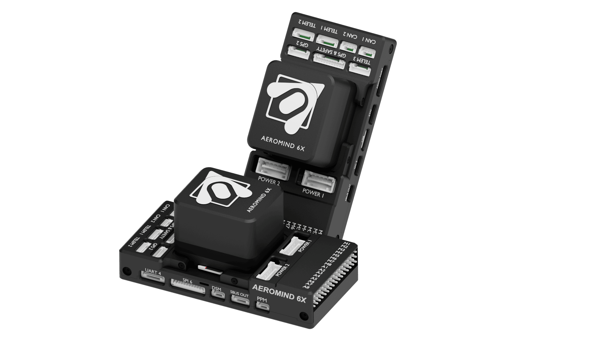

# Aeromind6X Flight Controller

The **Aeromind6X** flight controller is a cutting-edge, indigenous solution developed by [Arkin Labs Private Limited](https://www.arkinlabs.in/). 
Featuring **Triple Redundant IMUs** and **Integrated High-Speed Ethernet**, it offers high reliability and fast data handling for advanced UAV applications. It also integrates with an **M3 Coprocessor**, allowing sensor expansion and future upgrades.

---

## Specifications

### Main Processors
- **FMU Processor**: STM32H753  
  - 32-bit Arm® Cortex®-M7 @ 480 MHz  
  - 2 MB Flash / 1 MB RAM  
- **Co-Processor**: STM32F10x  
- **IO Processor**: STM32F103  
  - 32-bit Arm® Cortex®-M3 @ 24 MHz  
  - 8 KB SRAM  

### Security
- NXP EdgeLock SE051  
  - IEC62443-4-2 certified  
  - CC EAL6+ certified secure element  
  - 46 KB user memory (up to 104 KB customizable)  
  - AES / 3DES encryption

### Onboard Sensors
- Accelerometer / Gyroscope: 3x ICM-4568 (Rev. 8)  
- Magnetometer: PNI RM3100  
- Barometer: 2x ICP20100  

### Electrical
- Input Voltage: up to 6 V  
- USB Input: 4.75 V – 5.25 V  

### Mechanical
- Weight: 150 g  
- Dimensions: 94 × 46 × 38 mm  

---

## Interfaces

### Debug Ports
- FMU-Debug  
- IO-Debug  

### Communication Interfaces
- Ethernet  
- 3x Telemetry Ports (TELEM1, TELEM2, TELEM3)  
- 2x CAN (UAVCAN)  

### Actuator Outputs
- 8x Main Outputs (via IO Processor)  
- 8x Auxiliary Outputs (direct from FMU)  

### RC Input
- SBUS  
- PPM  
- DSM  
- RSSI  

### Power Inputs
- 2x SMBUS (I2C)  
- 2x UAVCAN  
- SBUS In  
- PPM In  

### Other Ports
- 2x USB Ports  
  - 1x USB Type-C  
  - 1x JST-GH  
- 1x TF Card Slot (MicroSD, for flight logs)  

---

## Pinout

---

## UART Mapping

| SERIAL Port | UART Interface | Label / Function     | Flow Control |
|-------------|----------------|----------------------|---------------|
| SERIAL1     | UART7          | TELEM1/MAVLink2| Yes           |
| SERIAL2     | UART5          | TELEM2/MAVLink2| Yes           |
| SERIAL3     | UART1          | GPS1                 | No            |
| SERIAL4     | UART8          | GPS2                 | No            |
| SERIAL5     | USART2         | TELEM3/MAVLink2| Yes           |
| SERIAL6     | UART4          | UART4 (General Use)  | No            |
| SERIAL7     | USART3         | FMU_DEBUG            | No            |

> **Note**: All UARTS are DMA capable. UART7, USART2, and UART5 support hardware flow control.

---

## RC Input

RC input supports SBUS, PPM, and DSM protocols with dedicated ports available for each. For bi-directional protocols, UART4 or other telemetry ports can be configured to handle the connection. For more details, refer to: https://ardupilot.org/plane/docs/common-rc-systems.html

---

## PWM Outputs

Supports up to **16 PWM outputs**:

- **Main Outputs (M1–M8)**: via STM32F103 IO Processor  
- **Auxiliary Outputs (A1–A8)**: via STM32H753 FMU 

> **Note:** All outputs support both PWM and DShot protocols, except for outputs **A7** and **A8**, which are PWM-only. Outputs **M1–M8** are bi-directional DShot capable.
---
## Battery Monitoring

Includes **two I2C power monitor ports** using 6-pin connectors. Configuration is defaulted for the first monitor to be INA2XX I2C type power monitor.

---

## Compass

An internal compass is provided by a RM3100  sensor. Often this compass is disabled and an externally positioned  compass used to avoid power interference.

---

## Analog Ports

Includes two native ADC inputs:

- ADC3V3  ArduPilot pin designation is "13"
- ADC6V6  ArduPilot pin designation is "12"
Refer to the **Pinout Diagram** above for details.

---

## GPIOs

Below is the mapping of GPIO labels to their respective GPIO numbers:

| Label         | GPIO Number |
|---------------|-------------|
| A(1)          | 50          |
| A(2)          | 51          |
| A(3)          | 52          |
| A(4)          | 53          |
| A(5)          | 54          |
| A(6)          | 55          |
| A(7)          | 56          |
| A(8)          | 57          |
| FMU_CAP1      | 58          |
| NFC_GPIO      | 60          |
| SPEKTRUM_PWR  | 73          |
| ALARM         | 77          |
| MAIN(1)       | 101         |
| MAIN(2)       | 102         |
| MAIN(3)       | 103         |
| MAIN(4)       | 104         |
| MAIN(5)       | 105         |
| MAIN(6)       | 106         |
| MAIN(7)       | 107         |
| MAIN(8)       | 108         |

---

## Firmware

Firmware is available via the [ArduPilot Firmware Server](https://firmware.ardupilot.org) under the `Aeromind6X` target.

---

## Loading Firmware

The board ships with an ArduPilot-compatible bootloader, allowing you to load `.apj` firmware files using any ArduPilot-compatible Ground Control Station (GCS) such as **Mission Planner** or **QGroundControl**.

---

## Where to Buy

- Official Product Page: [Aeromind6X](https://www.arkinlabs.in/aeromind-6x)  
- Order from [here](https://www.arkinlabs.in/shop/aeromind-6x-160)

---

## More Information

- [Aeromind6X Documentation](http://docs.arkinlabs.in/)  
- [Aeromind6X Datasheet](https://drive.google.com/file/d/1MtB74p9gjB4ahHdhjlCy_APepJ_ad_wq/view)
