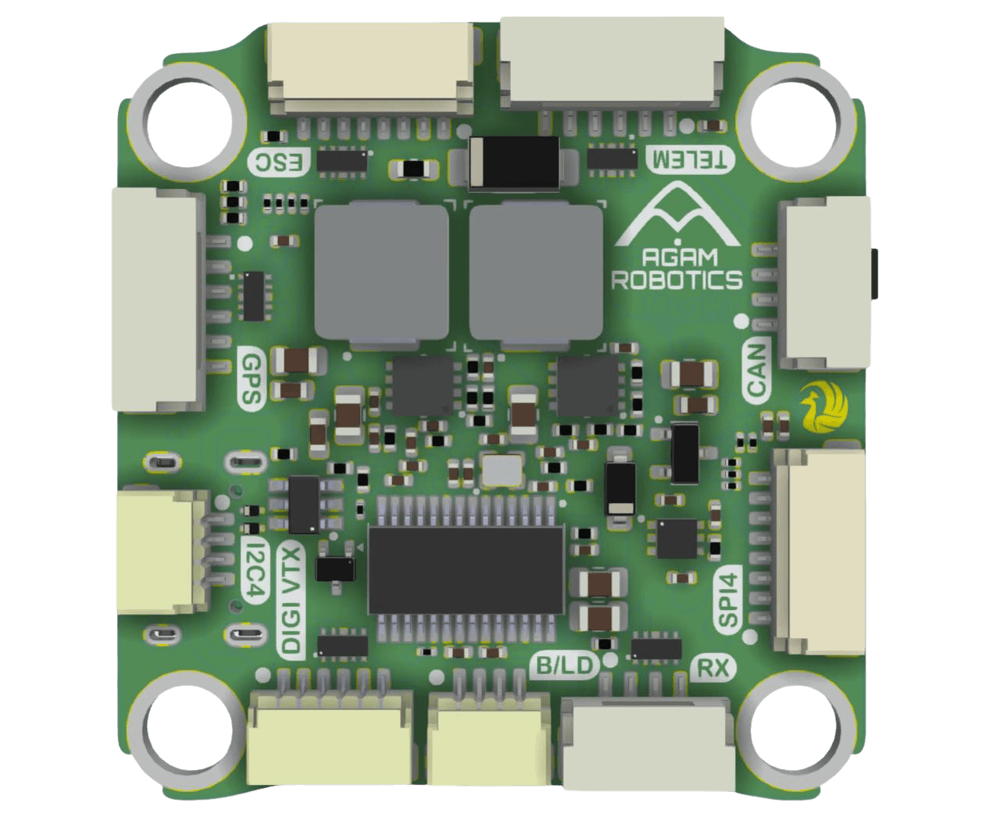
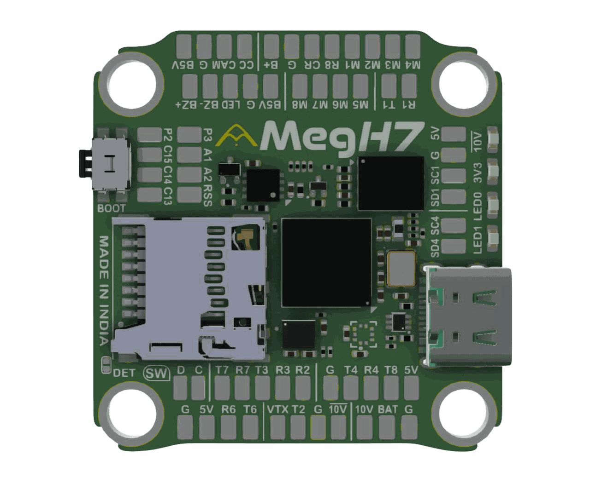

# Agam MegH7 v1.2 Flight Controller

The Agam MegH7 is a flight controller manufactured by
[Agam Robotics](https://www.agamrobotics.com), built around the STM32H743
processor. It uses a solderless, plug-and-play connector layout for the main
peripherals while still breaking out exposed solder pads for advanced custom
wiring.

## Where to Buy

The Agam MegH7 is available directly from
[Agam Robotics](https://www.agamrobotics.com/product-page/agam-megh7).

More details at [Product Page](https://www.agamrobotics.com/agammegh7).

## Specifications

- Processor

  - STM32H743 32-bit processor, Cortex-M7, 480MHz
  - 2MB Flash, 1MB RAM
  - MAX7456-compatible (AT7456E) analog OSD

- Sensors

  - IMU: TDK InvenSense ICM-45686 (SPI)
  - Barometer: Bosch BMP390, SPL06 also probed as an alternate (I2C)
  - No built-in compass; supported external compasses (e.g. QMC5883L) are
    auto-detected on the I2C bus

- Interfaces

  - Full-size MicroSD card slot (Blackbox logging)
  - USB-C
  - 9 PWM/DShot outputs (8 motor outputs + 1 LED)
  - 7 UARTs, one with flow control
  - 1 CAN bus
  - I2C ×2, SPI ×1
  - ESC connector with current-sense and ESC telemetry input
  - Analog camera input / analog VTX output
  - HD digital VTX connector with 10V BEC
  - Boot/DFU button
  - SWD debug pads

- Power

  - Integrated voltage/current battery monitor
  - Input voltage: 2S-8S LiPo
  - 5V @ 3A continuous BEC for board/peripherals
  - 10V @ 3A continuous BEC for HD video systems

- Dimensions

  - Size: 37.5 x 39 x 8.8 mm
  - Mounting: 30.5 x 30.5 mm pattern, Ø4mm holes with Ø3mm vibration
    grommets
  - Weight: 10.00 gms

## Pinout

All plug-and-play connectors are on the top of the board and are labelled on
the silkscreen: ESC, TELEM, GPS, CAN, I2C4, DIGI VTX, SPI4, RX and B/LD.

The bottom of the board exposes solder pads for the same signals plus the
analog camera and VTX pads, the analog inputs, and the spare user IO pads. The
signal pads are labelled on the silkscreen and are described in the sections
below; the remaining pads are power and ground.

The bootloader button is marked `BOOT`. Alongside the microSD slot, `DET` is a
test point for the card-detect signal, and the two pads marked `D` and `C`
beneath the boxed `SW` label are the ARM serial-wire debug interface (SWDIO
and SWCLK respectively).

## Connectors

The GPS, TELEM, CAN and RX connectors are JST-GH 1.25mm. The ESC, DIGI VTX,
SPI4, I2C4 and B/LD connectors are JST-SH 1.0mm.

Signal pins are 3.3V.

### ESC (8 pin)

|Pin |Signal                      |Volt |
|----|----------------------------|-----|
|1   |VBAT                        |VBAT |
|2   |GND                         |GND  |
|3   |Current sense               |3.3V |
|4   |ESC telemetry (RX8, SERIAL7)|3.3V |
|5   |M1                          |3.3V |
|6   |M2                          |3.3V |
|7   |M3                          |3.3V |
|8   |M4                          |3.3V |

### GPS (6 pin)

|Pin |Signal            |Volt |
|----|------------------|-----|
|1   |+5V               |+5V  |
|2   |TX1 (SERIAL1)     |3.3V |
|3   |RX1 (SERIAL1)     |3.3V |
|4   |SCL (I2C bus 1)   |3.3V |
|5   |SDA (I2C bus 1)   |3.3V |
|6   |GND               |GND  |

### TELEM (6 pin)

|Pin |Signal        |Volt |
|----|--------------|-----|
|1   |+5V           |+5V  |
|2   |TX7 (SERIAL6) |3.3V |
|3   |RX7 (SERIAL6) |3.3V |
|4   |CTS           |3.3V |
|5   |RTS           |3.3V |
|6   |GND           |GND  |

### RX (4 pin)

|Pin |Signal        |Volt |
|----|--------------|-----|
|1   |TX6 (SERIAL5) |3.3V |
|2   |RX6 (SERIAL5) |3.3V |
|3   |+5V           |+5V  |
|4   |GND           |GND  |

### CAN (4 pin)

|Pin |Signal |Volt |
|----|-------|-----|
|1   |+5V    |+5V  |
|2   |CAN H  |3.3V |
|3   |CAN L  |3.3V |
|4   |GND    |GND  |

### DIGI VTX (6 pin)

|Pin |Signal            |Volt |
|----|------------------|-----|
|1   |+10V              |+10V |
|2   |GND               |GND  |
|3   |TX2 (SERIAL2)     |3.3V |
|4   |RX2 (SERIAL2)     |3.3V |
|5   |GND               |GND  |
|6   |SBUS (RX3, SERIAL3)|3.3V |

Pin 1 is +10V on the same RELAY1-switched rail as the analog VTX `10V` pad, so
VTX Power Control below switches the HD air unit as well. Take care not to
connect it to a peripheral expecting 5V.

### SPI4 (8 pin)

|Pin |Signal |Volt |
|----|-------|-----|
|1   |+5V    |+5V  |
|2   |SCK    |3.3V |
|3   |MISO   |3.3V |
|4   |MOSI   |3.3V |
|5   |CS     |3.3V |
|6   |DRDY   |3.3V |
|7   |EXTI   |3.3V |
|8   |GND    |GND  |

### I2C4 (4 pin)

|Pin |Signal          |Volt |
|----|----------------|-----|
|1   |+5V             |+5V  |
|2   |SCL (I2C bus 2) |3.3V |
|3   |SDA (I2C bus 2) |3.3V |
|4   |GND             |GND  |

### B/LD (4 pin)

|Pin |Signal                  |Volt |
|----|------------------------|-----|
|1   |+5V                     |+5V  |
|2   |`BZ-`, the switched side |3.3V |
|3   |LED strip data (WS2812) |3.3V |
|4   |GND                     |GND  |

## UART Mapping

The UARTs are marked Rn and Tn on the exposed solder pads. The Rn pad is the
receive pin for UARTn, the Tn pad is the transmit pin.

|Port |UART   |Connector       |Pads   |Default protocol |TX DMA |RX DMA |
|-----|-------|----------------|-------|-----------------|-------|-------|
|0    |USB    |USB-C           |       |MAVLink2         |  ✘    |   ✘   |
|1    |USART1 |GPS             |T1, R1 |GPS              |  ✔    |   ✔   |
|2    |USART2 |DIGI VTX        |T2, R2 |None             |  ✔    |   ✔   |
|3    |USART3 |DIGI VTX (SBUS) |T3, R3 |None             |  ✘    |   ✘   |
|4    |UART4  |                |T4, R4 |None             |  ✘    |   ✘   |
|5    |USART6 |RX              |T6, R6 |RCIN             |  ✔    |   ✔   |
|6    |UART7  |TELEM           |T7, R7 |MAVLink2         |  ✔    |   ✔   |
|7    |UART8  |ESC             |T8, R8 |ESC Telemetry    |  ✔    |   ✔   |
|8    |USB    |USB-C           |       |SLCAN            |  ✘    |   ✘   |

Only SERIAL6 (UART7, the TELEM connector) has CTS/RTS flow-control pins
broken out. All DMA-enabled UARTs share a single TX DMA stream.

SERIAL8 is a second USB CDC endpoint on the same physical USB-C connector,
not a separate port. It defaults to SLCAN so the CAN bus can be reached from
a PC without a dedicated USB-CAN adapter. `CAN_SLCAN_CPORT` is set to 1 by
default, so SLCAN becomes available as soon as the CAN driver is enabled with
`CAN_P1_DRIVER` = 1. SLCAN is automatically disabled while armed.

## RC Input

RC receivers connect to the **RX** connector, wired to SERIAL5 (USART6,
R6/T6 pads), with `SERIAL5_PROTOCOL` defaulting to "23" (RCIN). This is a
full UART, so it supports UART-based RC protocols (SBUS, CRSF/ELRS, FPort,
SRXL2, IBUS).

The required `SERIALx_OPTIONS` value (invert/half-duplex/etc.) depends on
the receiver protocol — see
[RC Protocols](https://ardupilot.org/copter/docs/common-rc-systems.html) for
the settings needed for your specific receiver.

The Digital VTX connector also carries an SBUS input, wired to SERIAL3, for
HD systems that pass RC through from the air unit. To use it set
`SERIAL3_PROTOCOL` to "23" and change `SERIAL5_PROTOCOL` to something else.

## PWM Outputs

The Agam MegH7 provides 9 PWM/DShot outputs: M1-M8 for motors/servos (on the
ESC connector and as exposed pads), plus a 9th output on the LED pad intended
for a WS2812 addressable LED strip.

Outputs sharing a timer form a group. Channels within the same group must use
the same output rate, and if any channel in a group uses DShot then every
channel in that group must use DShot. The groups are:

|Group |Timer |Outputs         |
|------|------|----------------|
|1     |TIM8  |M1, M2          |
|2     |TIM5  |M3, M4, M5, M6  |
|3     |TIM4  |M7, M8          |
|4     |TIM1  |M9 (LED pad)    |

Note that the timer groups do not line up with the M1-M4 / M5-M8 physical pad
layout: M5 and M6 share TIM5 with M3 and M4, so M1-M4 cannot be driven at a
different rate/protocol from M5-M6.

The 9th output is set up for an addressable LED strip by default:
`SERVO9_FUNCTION` is 120 (NeoPixel1) and `NTF_LED_TYPES` includes the
NeoPixel bit, so notification patterns are driven out on the LED pad with no
further setup. Connect the strip's data line to the LED pin on the B/LD
connector, or to the `LED` pad.

## OSD Support

An onboard MAX7456-compatible analog OSD (AT7456E) is enabled by default,
connected on SPI3.

## Analog Video

The AT7456E sits in the analog video path between the camera and the video
transmitter, so the OSD overlay is added to whatever the camera produces.

The analog camera pads are a group of four:

|Pad  |Signal                                 |
|-----|---------------------------------------|
|B5V  |5V supply for the camera               |
|G    |Ground                                 |
|CAM  |Composite video input from the camera  |
|CC   |Camera control                         |

The composite video output, carrying the OSD overlay, is on the separate
`VTX` pad on the opposite edge of the board, grouped with a ground pad, a
`10V` pad on the switched VTX rail (see VTX Power Control below), and the
`T2` pad for VTX control protocols such as SmartAudio or Tramp.

The `T2` pad and the DIGI VTX connector are both wired to SERIAL2, so analog
VTX control and HD DisplayPort are mutually exclusive: `SERIAL2_PROTOCOL` can
select SmartAudio (37) or Tramp (44) for an analog VTX, or MSP DisplayPort
(42) for an HD VTX, but only one of them can be active at a time.

Video in and video out are analog signals wired to the AT7456E rather than to
the processor, so they need no configuration beyond the OSD itself, which is
enabled by default.

## Camera Control

The CC pin is a GPIO (pin 88) and is assigned by default to RELAY2
functionality. This pin can be controlled via GCS, or by RC transmitter using
the [Auxiliary Function](https://ardupilot.org/copter/docs/common-auxiliary-functions.html)
feature (`RCx_OPTION` = 34).

## HD VTX Support

The Digital VTX connector provides a 10V BEC for HD systems such as the DJI
Air Unit and Caddx Vista. That supply is the RELAY1-switched rail, so the air
unit can be powered down in flight the same way as an analog VTX (see VTX
Power Control below).

DisplayPort OSD is not enabled by default. To drive an HD VTX OSD on the
Digital VTX UART, set `SERIAL2_PROTOCOL` to 42 (MSP DisplayPort) and
`OSD_TYPE2` to 5 (MSP DisplayPort), which runs it alongside the onboard
analog OSD.

SERIAL2 is shared with the analog VTX control pad `T2`, so doing this rules
out SmartAudio or Tramp control of an analog VTX (see Analog Video above).

## VTX Power Control

The 10V regulator runs whenever the battery is connected. GPIO 81 (PINIO1, pin
PE5) drives a high-side switch downstream of it, gating the 10V supply to the
video systems, and is assigned to RELAY1 — so VTX power can be switched from an
RC switch (`RCx_OPTION` = 28), a mission `DO_SET_RELAY` command, or a GCS
button.

Relay ON powers the VTX. `RELAY1_DEFAULT` is 1, so the VTX is on at boot.

RELAY1 switches the supply to both video systems: the `10V` pad in the analog
VTX group, and pin 1 of the Digital VTX connector. On the silkscreen this
switched rail is written as `10V` with an overbar, distinguishing it from the
plain `10V` pad, which is the regulator's unswitched output and is live
whenever the board is powered. The 10V indicator LED is on the switched rail,
so it follows the relay.

## User IO Pads

The pads marked `P2`, `P3` and `C13`, `C14`, `C15` are general purpose IO,
usable for any custom RELAY or scripting GPIO function:

|Pad  |GPIO |
|-----|-----|
|P2   | 82  |
|P3   | 83  |
|C13  | 84  |
|C14  | 85  |
|C15  | 86  |

`C13`-`C15` are backup-domain pins with limited drive strength, so they are
suitable for logic-level signalling only and should not drive loads directly.

## I2C

Two I2C buses are available for external devices:

|Bus |Available on                                       |
|----|---------------------------------------------------|
|1   |the GPS connector, and the `SD1` / `SC1` pads       |
|2   |the I2C4 connector, and the `SD4` / `SC4` pads      |

External I2C devices such as a compass, airspeed sensor or rangefinder can be
connected to either bus.

## External SPI

The SPI4 connector supports a Pixart PMW3901 or PAA3905 optical flow sensor.
Set `FLOW_TYPE` to 2 (Pixart) to enable it.

## Buzzer and LED Strip Port

The `B/LD` connector (see Connectors above) carries both the buzzer and the
addressable LED strip. The same signals are broken out on the bottom of the
board as the `B5V`, `BZ+`, `BZ-`, `LED` and `G` pads. `BZ+` is the 5V rail and
`BZ-` is the switched side, so a buzzer connects between the two.

The buzzer is driven by GPIO 32 through a transistor that switches the low
side, and is enabled by default. The LED strip output is PWM 9, set up for
WS2812 by default (see PWM Outputs above).

## LEDs

Two software-controlled status LEDs are fitted, marked `LED0` and `LED1` on
the right-hand edge of the board:

|LED  |Colour |GPIO |Function                                    |
|-----|-------|-----|--------------------------------------------|
|LED0 |Blue   | 90  |ArduPilot notify, and bootloader activity   |
|LED1 |Red    | 91  |ArduPilot notify                            |

Both are active low. The pins are driven low at power-up, so the LEDs light
before ArduPilot starts and the notification patterns then take over. LED0 is
also the bootloader's LED, so it is the one that flashes while firmware is
being loaded.

Two further LEDs on the same edge are power rail indicators, wired to their
rails rather than to the processor:

|Marking |Indicates                                                  |
|--------|-----------------------------------------------------------|
|`10V`   |the switched VTX rail is powered, so it follows RELAY1      |
|`3V3`   |the 3.3V logic rail is present                             |

An external addressable LED strip is driven from PWM 9 — see PWM Outputs and
Buzzer and LED Strip Port above.

## Compass

The Agam MegH7 has no built-in compass. An external compass is required for
compass-enabled flight modes, and supported modules connected to either I2C
bus are detected automatically.

## RSSI

If the RSSI pad, marked `RSS`, is used for analog RSSI input, set
`RSSI_ANA_PIN` to "8" and `RSSI_TYPE` to "1" (or "3" if the RC protocol
provides embedded RSSI telemetry instead).

## Analog Input

The pads marked `A1` (ADC-EXT1) and `A2` (ADC-EXT2) are spare analog inputs:

|Pad  |Analog pin |
|-----|-----------|
|A1   | 4         |
|A2   | 18        |

Both pads connect directly to the processor with no voltage divider, so their
input must not exceed 3.3V. Assign either pad to whichever analog function is
needed, for example `ARSPD_PIN` = 4 for an analog airspeed sensor on `A1`.

## GPIOs

|Function            |GPIO Number |
|--------------------|------------|
|M1 (PWM1)           | 50         |
|M2 (PWM2)           | 51         |
|M3 (PWM3)           | 52         |
|M4 (PWM4)           | 53         |
|M5 (PWM5)           | 54         |
|M6 (PWM6)           | 55         |
|M7 (PWM7)           | 58         |
|M8 (PWM8)           | 59         |
|M9 / LED (PWM9)     | 62         |
|Buzzer/Alarm        | 32         |
|PINIO1 (VTX on/off) | 81         |
|PINIO2 (P2 pad)     | 82         |
|PINIO3 (P3 pad)     | 83         |
|C13 pad             | 84         |
|C14 pad             | 85         |
|C15 pad             | 86         |
|SPI4 EXTI pad       | 87         |
|CC (camera control) | 88         |
|SPI4 DRDY pad       | 89         |
|LED0 (blue)         | 90         |
|LED1 (red)          | 91         |

## Battery Monitoring

The board has an integrated voltage sensor and a connection on the ESC
connector for an external current sensor input. The same three signals are
broken out as solder pads next to the motor pads: `B+` is battery positive,
`G` is ground and `CR` is the current sensor input.

The default battery parameters are:

- BATT_MONITOR = 4
- BATT_VOLT_PIN = 10
- BATT_CURR_PIN = 11
- BATT_VOLT_MULT = 11.0
- BATT_AMP_PERVLT = 40 (will need to be adjusted for whichever current
  sensor is attached)

Rated input: 2S-8S LiPo.

## Firmware

Firmware for the Agam MegH7 is available from the
[ArduPilot firmware server](https://firmware.ardupilot.org) under the
`Agam_MegH7` target.

## Loading Firmware

To load ArduPilot firmware, hold the boot button or pull the boot pad low
while powering up the board. Then use the STM32CubeProgrammer app or other
DFU utility to load the `Agam_MegH7_bl.bin` file. Subsequently, a GCS can
update firmware using the `*.apj` files.

The bootloader also listens on SERIAL4, the `T4` and `R4` pads, so firmware
can be loaded over serial as well as over USB.
