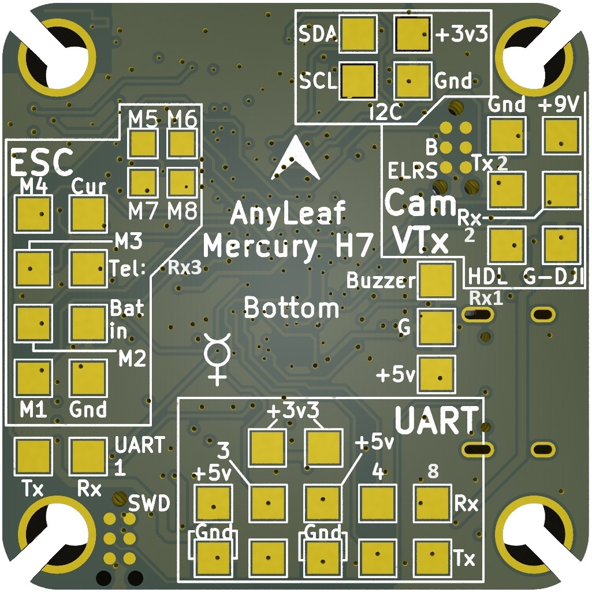
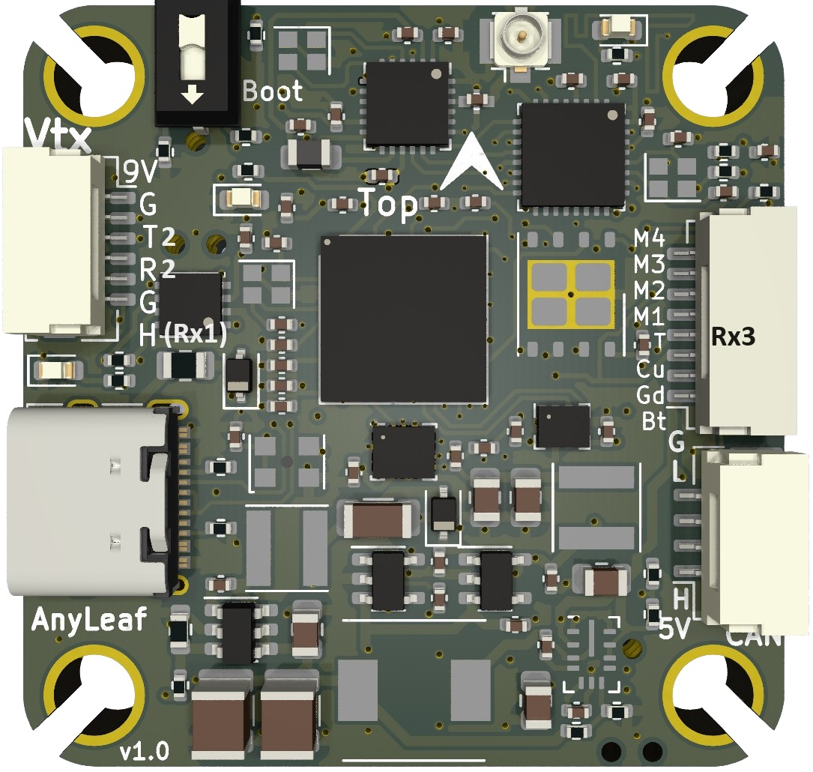

# AnyLeaf Mercury H7 Flight Controller

The Mercury H7 is a flight controller produced by [AnyLeaf](http://www.anyleaf.org/).

## Features
    Processor
        STM32H743 32-bit processor
    Sensors
        ICM42688 Acc/Gyro with dedicated 32.768kHz crystal
        DPS310 barometer
    Power
        2S - 6S Lipo input voltage with voltage monitoring
        9V, 3A supply for powering video transmitters
        5V, 2A supply for powering servos and electronics
        3.3V, 500mA supply for powering electronics
    Interfaces
        8x Bidirectional-DSHOT, or PWM-capable motor outputs
        1x CAN-FD port for external peripherals
        1x DJI-format Vtx connector
        4x UARTs/serial for external peripherals, 3 of which are available by default
        1x I2C bus for external peripherals
        USB-C port
        All UARTs support hardware inversion
        Onboard ExpressLRS radio transceiver for control and/or telemetry data.
    Dimensions
        Size: 37.5 x 37.5mm
        Weight: 8g

## Pinout

Pins and connector values are labeled on the flight controller PCB, with the following exceptions:
- The onboard ELRS transceiver is connected to pins PA2 (FC Tx) and PA3 (FC Rx), on UART2.
- ESC telemetry is connected to UART3 Rx (PD9)
- OSD HDL (DJI hand controller interop) is connected to UART1 Rx (PB7)

## UART Mapping
 All UARTs are DMA capable
 
 - SERIAL0 -> USB
 - SERIAL1 -> UART1 (External pads, and RX1 on DJI connector SBUS pin; defaulted to MAVLINK2)
 - SERIAL2 -> UART2 (DJI Connector telemetry; defaulted to DisplayPort)
 - SERIAL3 -> UART3 (ESC connector telemetry pin, or external pad; defaulted to ESC telemetry)
 - SERIAL4 -> USART4 (External pads; GPS protocol by default)
 - SERIAL5 -> UART7 (Onboard ELRS receiver only, RCIN protocol)
 - SERIAL6 -> UART8 (USER, External pads)

## Can FD port

This flight controller includes a 4-pin DroneCAN standard CAN port. It's capable of 64-byte frames,
and up to 5Mbps data rates. It's useful for connecting GPS devices, compasses, power monitoring, sensors, motors, servos, and other CAN peripherals.

## RC Input

This flight controller includes a 2.4Ghz ExpressLRS transceiver, capable of receiving control input, and transmitting or receiving MavLink telemetry. To enable all ELRS features, either RC5 channel should be setup as an ARM switch (there are several RC5_OPTIONS that can do this) or by mapping the transmitter's Channel 5 to reflect ARM status from telemetry. See: https://youtu.be/YO2yA1fmZBs for an axample.

SBUS on the DJI connector may be used if SERIAL5_PROTOCOL is changed to 0 and SERIAL1_PROTOCOL is changed to 23 for RC input.
   
## OSD Support

This flight controller has an MSP-DisplayPort output on a 6-pin DJI-compatible JST SH port re-configured.

## Motor Output

Motor 1-8 is capable of bidirectional DSHOT and PWM.

All outputs in the motor groups below must be either PWM or DShot:
Motors 1-4  Group1
Motors 5-6  Group2
Motors 7-8  Group3

## Magnetometer

This flight controller does not have a built-in magnetometer, but you can attach an external one using the CAN connector, or the I2C pads on the bottom.

## Loading Firmware
Firmware for these boards can be found at https://firmware.ardupilot.org in sub-folders labeled “Anyleaf H7”.

Initial firmware load can be done with DFU by plugging in USB with the
boot button pressed. Then you should load the "AnyleafH7_bl.hex"
firmware, using your favourite DFU loading tool.

Subsequently, you can update firmware using Mission Planner or QGroundControl.

