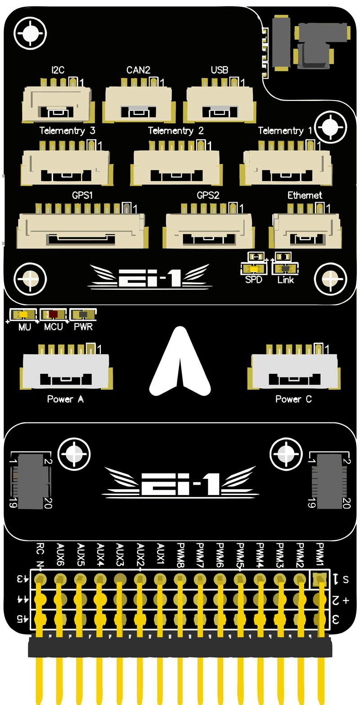
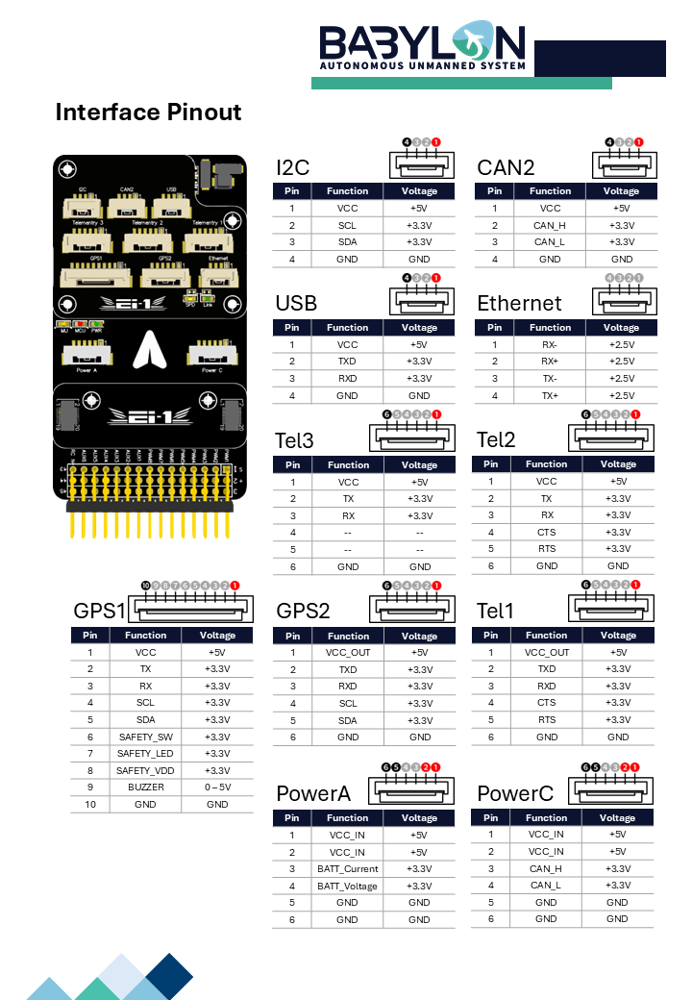

# BBL-Ei-1 Flight Controller

The BBL-Ei-1 is a flight controller produced by [BABYLON-AUS](https://www.babylon-aus.com).

## Features

- STM32H747XI microcontroller (ArduPilot runs on the Cortex-M7 core), 2MB flash
- 3 IMUs: one ICM-42688-P and two ICM-45686
- 2 barometers: two MS5611
- Builtin RM3100 magnetometer
- 32KB FRAM for parameter storage
- microSD card slot
- 2 USB ports (USB Type-C and JST-GH)
- 10/100 ethernet port
- 7 UARTs plus USB
- 14 PWM outputs
- RC input
- 2 CAN ports
- I2C port, plus I2C on both GPS ports
- Safety switch, safety LED and buzzer on the GPS1 port
- 2 power inputs: Power A (analog) and Power C (DroneCAN)
- Power input voltage: 4.3V to 5.4V
- Dimensions: 83.5mm x 48mm x 16mm
- Weight: 56g

## Where to Buy

Contact [BABYLON-AUS](https://www.babylon-aus.com).

## Pinout

Pin 1 of each connector is marked on the board.

### Telemetry 1 and Telemetry 2 ports

| Pin | Signal | Voltage |
| --- | ------ | ------- |
| 1 | VCC | +5V |
| 2 | TX (OUT) | +3.3V |
| 3 | RX (IN) | +3.3V |
| 4 | CTS | +3.3V |
| 5 | RTS | +3.3V |
| 6 | GND | GND |

### Telemetry 3 port

| Pin | Signal | Voltage |
| --- | ------ | ------- |
| 1 | VCC | +5V |
| 2 | TX (OUT) | +3.3V |
| 3 | RX (IN) | +3.3V |
| 4 | not connected | - |
| 5 | not connected | - |
| 6 | GND | GND |

### GPS1 port

| Pin | Signal | Voltage |
| --- | ------ | ------- |
| 1 | VCC | +5V |
| 2 | TX (OUT) | +3.3V |
| 3 | RX (IN) | +3.3V |
| 4 | SCL | +3.3V |
| 5 | SDA | +3.3V |
| 6 | SAFETY_SW | +3.3V |
| 7 | SAFETY_LED | +3.3V |
| 8 | SAFETY_VDD | +3.3V |
| 9 | BUZZER | 0-5V |
| 10 | GND | GND |

### GPS2 port

| Pin | Signal | Voltage |
| --- | ------ | ------- |
| 1 | VCC | +5V |
| 2 | TX (OUT) | +3.3V |
| 3 | RX (IN) | +3.3V |
| 4 | SCL | +3.3V |
| 5 | SDA | +3.3V |
| 6 | GND | GND |

### I2C port

| Pin | Signal | Voltage |
| --- | ------ | ------- |
| 1 | VCC | +5V |
| 2 | SCL | +3.3V |
| 3 | SDA | +3.3V |
| 4 | GND | GND |

### CAN2 port

| Pin | Signal | Voltage |
| --- | ------ | ------- |
| 1 | VCC | +5V |
| 2 | CAN_H | +3.3V |
| 3 | CAN_L | +3.3V |
| 4 | GND | GND |

### USB port

| Pin | Signal | Voltage |
| --- | ------ | ------- |
| 1 | VCC | +5V |
| 2 | TXD | +3.3V |
| 3 | RXD | +3.3V |
| 4 | GND | GND |

### Ethernet port

| Pin | Signal | Voltage |
| --- | ------ | ------- |
| 1 | RX- | +2.5V |
| 2 | RX+ | +2.5V |
| 3 | TX- | +2.5V |
| 4 | TX+ | +2.5V |

### Power A port

| Pin | Signal | Voltage |
| --- | ------ | ------- |
| 1 | VCC_IN | +5V |
| 2 | VCC_IN | +5V |
| 3 | BATT_CURRENT | +3.3V |
| 4 | BATT_VOLTAGE | +3.3V |
| 5 | GND | GND |
| 6 | GND | GND |

### Power C port

| Pin | Signal | Voltage |
| --- | ------ | ------- |
| 1 | VCC_IN | +5V |
| 2 | VCC_IN | +5V |
| 3 | CAN_H | +3.3V |
| 4 | CAN_L | +3.3V |
| 5 | GND | GND |
| 6 | GND | GND |

The CAN bus on the Power C port is CAN1.

## UART Mapping

The UARTs are marked RX and TX in the above tables. The RX pin is the receive pin for the autopilot and the TX pin is the transmit pin.

| Port | UART | Default protocol | Notes |
| ---- | ---- | ---------------- | ----- |
| SERIAL0 | USB | MAVLink2 | |
| SERIAL1 | USART2 | MAVLink2 | Telemetry 1, RTS/CTS, DMA-enabled |
| SERIAL2 | USART6 | MAVLink2 | Telemetry 2, RTS/CTS, DMA-enabled |
| SERIAL3 | USART1 | GPS | GPS1 |
| SERIAL4 | UART4 | GPS | GPS2 |
| SERIAL5 | UART8 | None | DSM/SBUS RC, RX DMA-enabled |
| SERIAL6 | UART7 | None | Telemetry 3 |
| SERIAL7 | USART3 | None | Companion computer, DMA-enabled |
| SERIAL8 | USB | MAVLink2 | Second USB interface |

## RC Input

RC input is configured on the RC IN pin, at one end of the servo rail. All ArduPilot supported unidirectional RC protocols can be input here, including PPM and SBUS.

For bi-directional or half-duplex protocols, such as CRSF/ELRS, a full UART has to be used. For example, to use the Telemetry 3 port (SERIAL6):

- `SERIAL6_PROTOCOL` should be set to "23".
- CRSF/ELRS need no further settings.
- SRXL2 also requires `SERIAL6_OPTIONS` be set to "4" and connects only the TX pin.
- FPort also requires `SERIAL6_OPTIONS` be set to "7".

## PWM Output

The BBL-Ei-1 supports up to 14 PWM outputs. On the servo rail they are marked PWM1 to PWM8 (outputs 1 to 8) and AUX1 to AUX6 (outputs 9 to 14).

The 14 PWM outputs are in 4 groups:

- PWM 1-4 in group1 (TIM5)
- PWM 5-8 in group2 (TIM4)
- PWM 9-12 in group3 (TIM1)
- PWM 13 and 14 in group4 (TIM12)

Channels within the same group need to use the same output rate. If any channel in a group uses DShot then all channels in the group need to use DShot.

Outputs 1 to 12 support DShot. Outputs 13 and 14 support PWM only. Bi-directional DShot is not supported.

## GPIOs

The 14 PWM outputs can be used as GPIOs (relays, buttons, RPM etc). To use them you need to set the output's SERVOx_FUNCTION to -1. See the GPIOs page in the ArduPilot documentation for more information.

The numbering of the GPIOs for use in the PIN parameters in ArduPilot is:

| Output | GPIO |
| ------ | ---- |
| PWM1 | 50 |
| PWM2 | 51 |
| PWM3 | 52 |
| PWM4 | 53 |
| PWM5 | 54 |
| PWM6 | 55 |
| PWM7 | 56 |
| PWM8 | 57 |
| AUX1 | 58 |
| AUX2 | 59 |
| AUX3 | 60 |
| AUX4 | 61 |
| AUX5 | 62 |
| AUX6 | 63 |

## Analog Inputs

The BBL-Ei-1 has 4 analog inputs. There is no analog RSSI or analog airspeed input.

- ADC Pin16 -> Battery Voltage (Power A)
- ADC Pin2 -> Battery Current (Power A)
- ADC Pin15 -> 5V supply sense
- ADC Pin10 -> 3.3V supply sense

## Battery Monitoring

The board has two power inputs. Power C is for a DroneCAN power module on CAN1 and Power A is for an analog power module.

By default the board is configured for a DroneCAN power module on Power C:

- `CAN_P1_DRIVER` = 1
- `BATT_MONITOR` = 8

To use an analog power module on Power A set `BATT_MONITOR` to 4. The following defaults are already set:

- `BATT_VOLT_PIN` = 16
- `BATT_CURR_PIN` = 2
- `BATT_VOLT_MULT` = 18.0
- `BATT_AMP_PERVLT` = 24.0

The correct scaling values depend on the power module which is connected.

## Compass

The BBL-Ei-1 has a builtin RM3100 compass. An external compass can be connected using the I2C pins on the GPS1 or GPS2 ports, or the I2C port.

## Loading Firmware

Firmware for this board can be found at the [ArduPilot firmware server](https://firmware.ardupilot.org) in sub-folders labeled "BBL-Ei-1".

The board comes pre-installed with an ArduPilot compatible bootloader, allowing the loading of *.apj firmware files with any ArduPilot compatible ground station.
