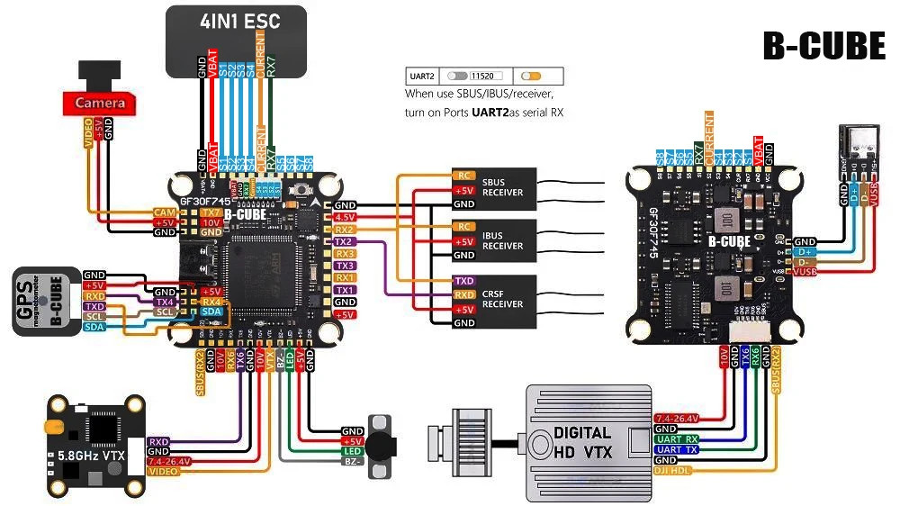

# B-CUBE F745 V2 Flight Controller

The B-CUBE F745 V2 Flight Controller is sold by [Aliexpress](https://it.aliexpress.com/item/1005008279741542.html).

## Features

- STM32F745 MCU (STM32F7xx family)  
- ICM-42688-P IMU (Invensense v3) via SPI4  
- DPS310 Barometer via I2C (address 0x76)  
- AT7456E OSD via SPI2  
- 16MB Blackbox flash (Dataflash on SPI1)  
- Supports 3-8S LiPo input voltage (11.4V – 36V)  
- Dual BEC: 5V/2.5A and 10V/2A (USER1)  
- Current and voltage sensing on ADC pins PC2 (current) and PC3 (voltage)  
- RSSI analog input on PC5  
- Buzzer output on PD15  
- LED output on PA2  
- USB Type-C connector  
- DFU bootloader button supported  
- Size: 36 x 36 mm  
- Mounting holes: 30.5 x 30.5 mm (M4)  
- Weight: 8.8 g

## Pinout

## UART Mapping

The UART ports and their default assignments are:

- **USART1**: PA9 (TX), PA10 (RX) – No DMA  
- **USART2**: PD5 (TX), PD6 (RX)  
- **USART3 (GPS1)**: PB10 (TX), PB11 (RX)  
- **UART4 (GPS2)**: PA0 (TX), PA1 (RX) – No DMA  
- **USART6 (RC input)**: PC6 (TX), PC7 (RX) – Default serial6 protocol: RCIN, baud 115  
- **UART7 (ESC telemetry)**: PE8 (TX), PE7 (RX) – RX only, No DMA  

**Note:** UART6 is typically used for RC input (Serial Protocol RCIN) at 115 baud.

## ESC Signal Outputs

PWM/DShot capable motor outputs are:

- M1: PB1 (TIM3_CH4)  
- M2: PE9 (TIM1_CH1)  
- M3: PB0 (TIM3_CH3)  
- M4: PE11 (TIM1_CH2)  
- M5: PC9 (TIM8_CH4) (No DMA)  
- M6: PA3 (TIM5_CH4)  

## Compass

The B-CUBE F745 V2 does **not** have a built-in compass, but an external compass can be connected via I2C (pins PB6=SCL, PB7=SDA).

## Loading Firmware

Initial firmware load can be done via DFU mode by plugging in USB while holding the bootloader button. Load the "with_bl.hex" firmware using your preferred DFU tool.

**Important:** Disconnect any GPS module during flashing as it may prevent entering DFU mode.

After initial flashing, firmware updates can be performed using any ArduPilot ground station software with the *.apj files.
