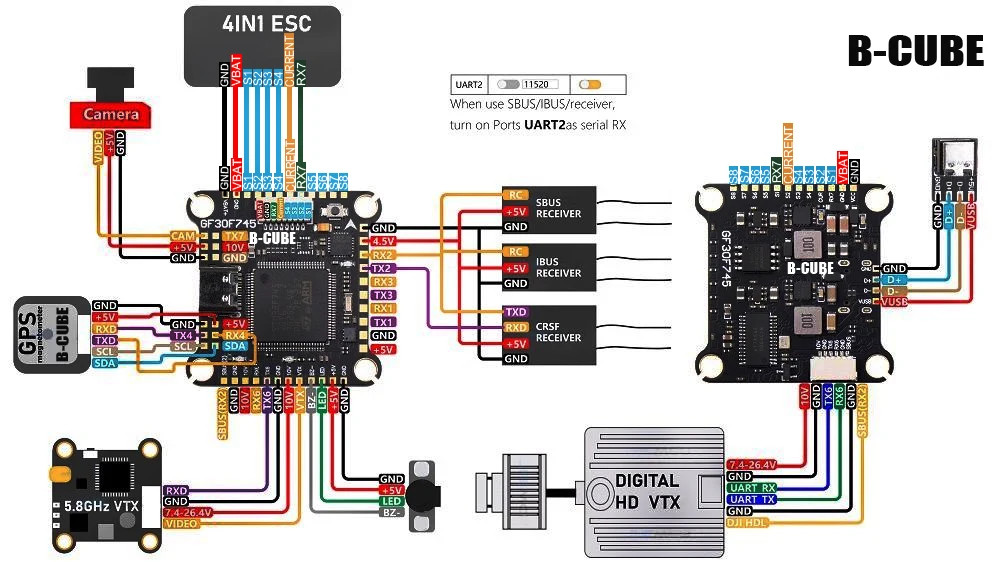

# B-CUBE F745 V2

The B-CUBE F745 V2 Flight Controller is a compact, high-performance autopilot designed for FPV and custom builds.

## Where to Buy

Available from [Aliexpress](https://it.aliexpress.com/item/1005008279741542.html)

## Specifications

- **Processor**
  - STM32F745 32-bit processor
  - 1MB Flash
  - 16MB Blackbox flash (M25P16 Dataflash on SPI1)
  - AT7456E OSD (on SPI2)

- **Sensors**
  - Invensense ICM-42688-P IMU (on SPI4)
  - DPS310 Barometer (on I2C1)

- **Interfaces**
  - USB Type-C
  - 6 PWM Outputs (5 with DShot and Bi-Dir DShot support)
  - 6 UARTs / USARTs
  - 2 I2C buses (I2C1 and I2C4)
  - Current, Voltage, and Analog RSSI inputs
  - Buzzer output
  - Status LED

- **Power**
  - Input voltage: 3-8S LiPo (11.4V - 36V)
  - Dual BEC: 5V/2.5A and 10V/2A

- **Dimensions**
  - Size: 36 x 36 mm
  - Mounting holes: 30.5 x 30.5 mm (M4)
  - Weight: 8.8 g

## Pinout

<!-- Insert additional pinout images here if available -->
Please refer to the silk screen markings on the board for pad definitions.

## UART Mapping

The UARTs are configured and mapped as follows:

| Port   | UART   | Protocol   | TX DMA | RX DMA | Notes |
|--------|--------|------------|--------|--------|-------|
| 0      | OTG1   | MAVLink2   | ✘      | ✘      | USB |
| 1      | USART1 | MAVLink2   | ✘      | ✘      | |
| 2      | USART2 | MAVLink2   | ✔      | ✔      | |
| 3      | USART3 | GPS1       | ✔      | ✔      | |
| 4      | UART4  | GPS2       | ✘      | ✘      | |
| 6      | USART6 | RCIN       | ✔      | ✔      | Default RC input |
| 7      | UART7  | ESC Telemetry | ✘ | ✘      | RX only |

*Note: Serial 6 is conventionally used for RC input, defaulted to protocol 23 (RCIN).*

## RC Input

By default, the RC input is mapped to USART6 (RX pad). This interface supports all ArduPilot compatible RC systems including SBUS, CRSF, and FPort. USART6 has DMA enabled, satisfying the requirements for protocols like CRSF/ELRS and SRXL2.

## PWM Outputs

The B-CUBE F745 V2 controller supports 6 PWM outputs. The outputs support normal PWM output formats.
Outputs 1-4 and 6 support DShot and Bi-Directional DShot.
Output 5 does not have DMA assigned, so it does not support DShot.

The PWM outputs are grouped by timers:

- Outputs 1, 4 are in group1 (TIM3)
- Outputs 2, 3 are in group2 (TIM1)
- Output 5 is in group3 (TIM8)
- Output 6 is in group4 (TIM5)

Channels within the same group need to use the same output rate. If any channel in a group uses DShot, then all channels in the group need to use DShot.

## GPIOs

The hardware features the following custom GPIO mappings:

| Pin | GPIO Number |
|--------------|-------------|
| PWM(1)       | 50          |
| PWM(2)       | 51          |
| PWM(3)       | 52          |
| PWM(4)       | 53          |
| PWM(5)       | 54          |
| PWM(6)       | 55          |
| ALARM/BUZZER | 77          |

## OSD Support

On-board analog OSD (using the AT7456E) is supported and enabled by default.

## Compass

The B-CUBE F745 V2 does not have a built-in compass. However, it can connect robustly to an external compass module (e.g. QMC5883L) via the unpopulated pads for I2C1 (PB6=SCL, PB7=SDA).

## Battery Monitor

The board has internal voltage sensing and an input pad for an external current sensor.
Default parameters are configured for standard battery sensing:

- BATT_MONITOR = 4
- BATT_VOLT_PIN = 13
- BATT_CURR_PIN = 12
- BATT_VOLT_MULT = 10.9
- BATT_AMP_PERVLT = 28.5

## RSSI

Analog RSSI input is available on pad PC5. Set `RSSI_ANA_PIN` to 15.

## Firmware

Firmware for the B-CUBE F745 V2 will be available from the [ArduPilot Firmware Server](https://firmware.ardupilot.org/) under the `BCubeF745v2`.

## Loading Firmware

Initial firmware loading requires entering DFU mode by holding the bootloader button while plugging in the USB. Use a DFU tool like Betaflight Configurator or STM32CubeProgrammer to flash the `with_bl.hex` firmware file.

**Important:** Disconnect any GPS modules or other peripherals during flashing, as they may prevent the board from entering DFU mode.

Subsequent updates can be applied securely using the `.apj` firmware files through your preferred ground control station.
