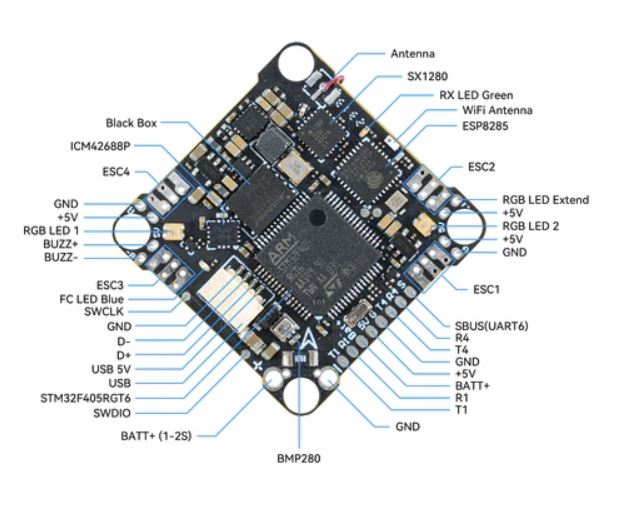

# BETAFPV F405 AIO Flight Controller

The BETAFPV F405 AIO is a flight controller produced by [BETAFPV](https://betafpv.com/collections/brushless-flight-controller/products/f4-1s-12a-aio-brushless-flight-controller-v3-0).

## Features

 - MCU: STM32F405RGT6, 168MHz
 - Gyro: ICM42688-P
 - 16Mb Onboard Flash
 - BEC output: 5V, 2A@4V
 - Barometer: BMP280
 - OSD: AT7456E
 - 5 UARTS: (UART1, UART3, UART4, UART5, UART6)
 - 5 PWM outputs (4 motor outputs used internally for integrated 4-in-1 ESC and 1 integrated LED)
 - Integrated 4-in-1 BlueJay ESC

## Pinout

## UART Mapping

The UARTs are marked Rn and Tn in the above pinouts. The Rn pin is the
receive pin for UARTn. The Tn pin is the transmit pin for UARTn.
|Name|Pin|Function|
|:-|:-|:-|
|SERIAL0|COMPUTER|USB|
|SERIAL1|RX1/TX1|UART1 (GPS, DMA-enabled)|
|SERIAL3|TX3/RX3|UART3 (ELRS, internal)
|SERIAL4|TX4/RX4|UART4 (DJI)|
|SERIAL5|RX5|UART5 (RX-only)|
|SERIAL6|RX6|UART6 (SBUS, RX-only, inverted, DMA-enabled)|

## RC Input

RC input is configured on the on-board ELRS on UART3 or through (UART6_RX/UART6_TX) pins. It supports all serial RC protocols.

## OSD Support

The BETAFPV F405 AIO supports OSD using OSD_TYPE 1 (MAX7456 driver).

## PWM Output

The BETAFPV F405 AIO has 4 PWM outputs internally connected to its 4-in-1 ESC. The pads for motor output are M1 to M4 on the board. All 4 outputs support bi-directional DShot and DShot, as well as all PWM types. The default configuration is for bi-directional DShot using the already installed BlueJay firmware.

The PWM are in in two groups:

 - PWM 1-2 in group1
 - PWM 3-4 in group2
 - PWM 5 in group3
 - PWM 6 in group4
 - PWM 7 in group5

Channels within the same group need to use the same output rate. If
any channel in a group uses DShot then all channels in the group need
to use DShot.

## Battery Monitoring

The board has a builtin voltage sensor and a current sensor input tied to its 4 in 1 ESC current sensor. The voltage sensor can handle up to 6S
LiPo batteries.

The correct battery setting parameters are:

 - BATT_MONITOR 4
 - BATT_VOLT_PIN 12
 - BATT_VOLT_MULT 10.9
 - BATT_CURR_PIN 13
 - BATT_CURR_MULT 50

These are set by default in the firmware and shouldn't need to be adjusted

## Compass

The BETAFPV F405 AIO does not have a builtin compass.

## NeoPixel LED

The board includes a NeoPixel LED on the underside which is pre-configured to output ArduPilot sequences. This is the seventh PWM output.

## Loading Firmware

Initial firmware load can be done with DFU by plugging in USB with the
bootloader button pressed. Then you should load the "with_bl.hex"
firmware, using your favourite DFU loading tool.

Once the initial firmware is loaded you can update the firmware using
any ArduPilot ground station software. Updates should be done with the
*.apj firmware files.
