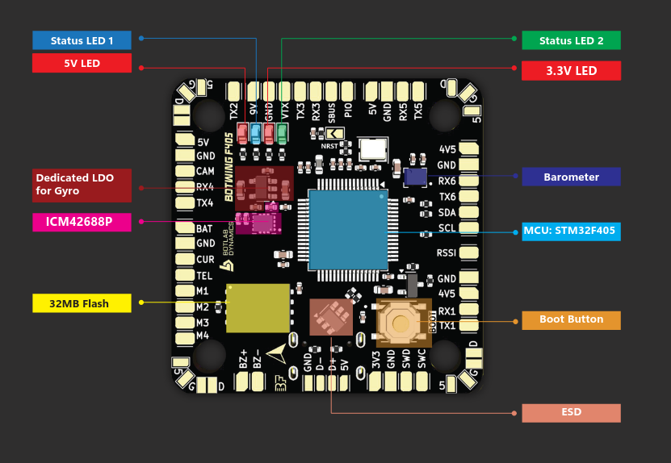
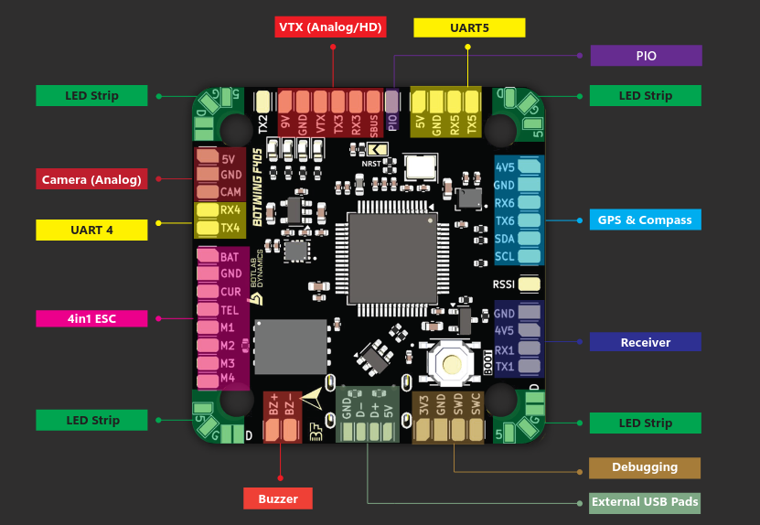
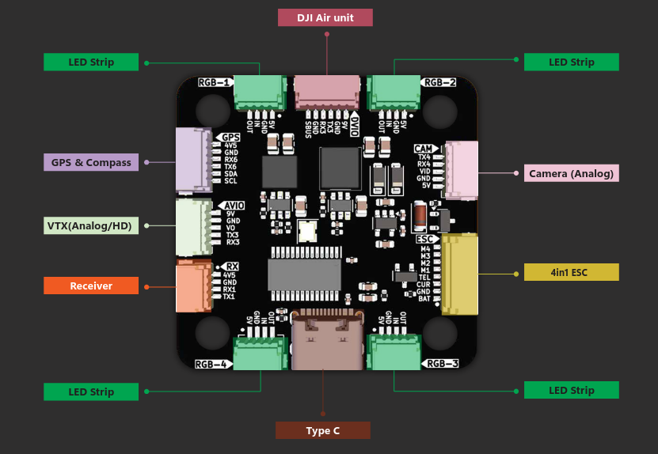
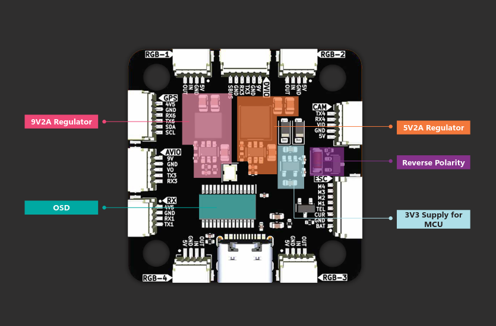
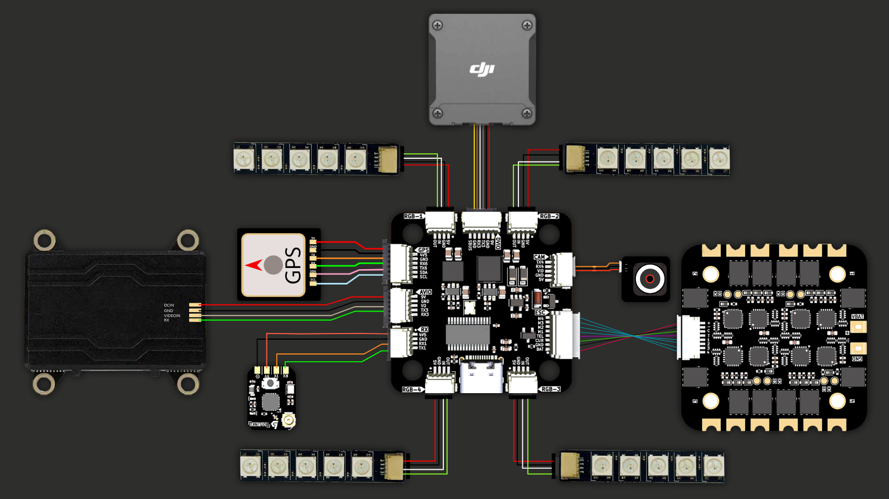

# BOTWINGF405 Flight Controller

The BOTWINGF405 is a compact, high-performance flight controller developed for fixed-wing and FPV applications. Designed for reliability and flexibility, it integrates essential sensors and features for smooth flight and rich telemetry, produced by [BOTLAB DYNAMICS](https://www.botlabdynamics.store/).

## Features

### Processor

* STM32F405RGT6, 168 MHz, 1MB flash
* 24MHz external crystal

### Sensors

* ICM42688P Accelerometer/Gyroscope
* DPS310 Barometer
* Optional External Compass (AK8963 supported)

### Power

* 2S–6S LiPo input with onboard voltage and current monitoring
* BEC Outputs:
  * 5V @ 2.0A
  * 9V @ 2.0A, GPIO controlled 

### Storage

* 32MB onboard dataflash for logging
* JEDEC-compatible SPI Flash (W25Q256)

### Interfaces

* 6x UARTs (for GPS, telemetry, RC, camera, etc.)
* I2C port for barometer and external compass
* USB OTG port (USB connector)
* 5 configured PWM outputs (4 for motors, 1 for RGB LED)
* 1x RC input (SBUS, PPM or CRSF/ELRS selectable)

### External Connections

* 6-pin JST-GH for GPS/Compass
* 6-pin JST-GH for HD VTXX or other peripherals
* 8-pin JST-GH for ESC
* 4-pin JST-GH for Receiver input
* 5-pin JST-GH for User
* 5-pin JST-GH for Camera Input
* 4 x 4-pin JST-GH for LED Strip-NEOPIXEL

## Wiring Diagram

## UART Mapping

The UARTs default protocol and serial port assigments are:

* SERIAL0 -> USB
* SERIAL1 -> USART1 (DMA capable,RX tied to SBUS RC input and pin used as an interrupt input, but can be used as normal UART if :ref:`BRD_ALT_CONFIG =1` ) 
* SERIAL2 -> USART2 (ESC Telemetry)
* SERIAL3 -> USART3 (DisplayPort, TX DMA Capable)
* SERIAL4 -> UART4  (USER, TX DMA Capable)
* SERIAL5 -> UART5  (USER, TX DMA Capable)
* SERIAL6 -> USART6 (GPS) 

## RC Input

The RX1 input by default is mapped to a timer input instead of UART`1, and can be used for all ArduPilot supported unidirectional receiver protocols. The SBUS pads are inverted and tied to this input and should not be connected to anything if the RX1 is used. Bi-directional procols such as CRSF/ELRS and SRXL2 which require a true UART connection to both R1 and TX1 (see below). FPort with tlemetery also requires a full UART AND an external bi-directional inverter.

To allow CRSF and embedded telemetry available in Fport, CRSF, and SRXL2 receivers, the RX1 pin must be configured to be used as true UART RX pin for use with bi-directional systems by setting the :ref:`BRD_ALT_CONFIG<BRD_ALT_CONFIG>` to “1” so it becomes the SERIAL1 port’s RX input pin.ref:`SERIAL1_PROTOCOL<SERIAL1_PROTOCOL>` is alreaddy set by deault to “23” to allow RC reciever connection to UART1.

With this option:
* PPM is not supported.
* FPort requires connection to TX1 via an external bi-directional and :ref:`SERIAL1_OPTIONS<SERIAL1_OPTIONS>` be set to “7”.
* CRSF also requires a TX1 connection, in addition to R6, and automatically provides telemetry. Set :ref:`SERIAL1_OPTIONS<SERIAL1_OPTIONS>` to “0”.
* SRXL2 requires a connection to T1 and automatically provides telemetry. Set :ref:`SERIAL1_OPTIONS<SERIAL1_OPTIONS>` to “4”.

Any UART can be used for RC system connections in ArduPilot also, and is compatible with all protocols except PPM. See :ref:`common-rc-systems` for more details.

## OSD Support

The BOTWINGF405 includes an internal AT7456E OSD enabled for analog video. Simultaneous DisplayPort operation is enabled by default on UART3

## PWM Outputs

All motor/servo outputs are Dshot and PWM capable. M1-4 are also BDshot capable. However, mixing Dshot, serial LED, and normal PWM operation for outputs is restricted into groups, ie. enabling Dshot for an output in a group requires that ALL outputs in that group be configured and used as Dshot, rather than PWM outputs.

PWM 1,2 in group1

PWM 3,4 in group2

PWM 5 (LED) group3

## Battery Monitoring
The board has a built-in voltage sensor and external current sensor input. The current
sensor can read up to 120 Amps. The voltage sensor can handle up to 6S LiPo batteries.
The default battery monitor parameters are:

* :ref:`BATT_MONITOR<BATT_MONITOR>` 4
* :ref:`BATT_VOLT_PIN<BATT_VOLT_PIN__AP_BattMonitor_Analog>` 11 
* :ref:`BATT_CURR_PIN<BATT_CURR_PIN__AP_BattMonitor_Analog>` 13
* :ref:`BATT_VOLT_MULT<BATT_VOLT_MULT__AP_BattMonitor_Analog>` 11.0
* :ref:`BATT_AMP_PERVLT<BATT_AMP_PERVLT__AP_BattMonitor_Analog>` 37 (may need adjustment depending on external current sensor used)

## Compass

There is no onboard compass. External compass modules can be connected via I2C (SCL/SDA pads).

## VTX Power Control

GPIO81 controls 9V video BEC output. Set GPIO high to enable 9V for connected devices. RELAY1 is configured by default to control this GPIO.

## GPIO

The PIO pad is setup as a user GPIO (GPIO82) by default, controlled by RELAY2.

## RSSI 
Analog RSSI input is via pin 12.  Set :ref:`RSSI_ANA_PIN<RSSI_ANA_PIN>` to "12" and :ref:`RSSI_TYPE<RSSI_TYPE>` to "1" to enable its use.

## LEDs and Buzzer

* LED0 (GPIO0)
* ED1 (GPIO1)
* Buzzer (GPIO80)

## Logging

* 32MB onboard SPI flash for data logging
* Uses JEDEC-compatible `AP_Logger_Flash_JEDEC` driver

## Loading Firmware

Firmware for the autopilot can be found `here <https://firmware.ardupilot.org>`__ in sub-folders labeled "BOTWINGF405".

Initial firmware load can be done with DFU by plugging in USB with the
bootloader button pressed. Then you should load the "with_bl.hex"
firmware, using your favourite DFU loading tool.

Once the initial firmware is loaded you can update the firmware using
any ArduPilot ground station software. Updates should be done with the
\*.apj firmware files.

**Note:** SWD access for development/debugging available on PA13/PA14.
