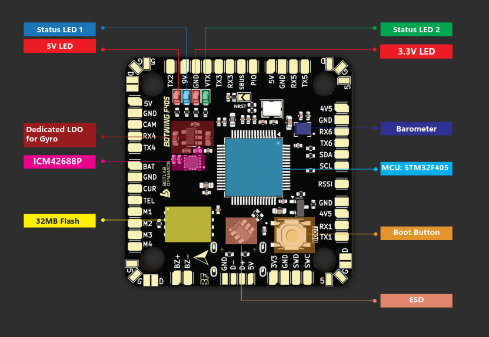
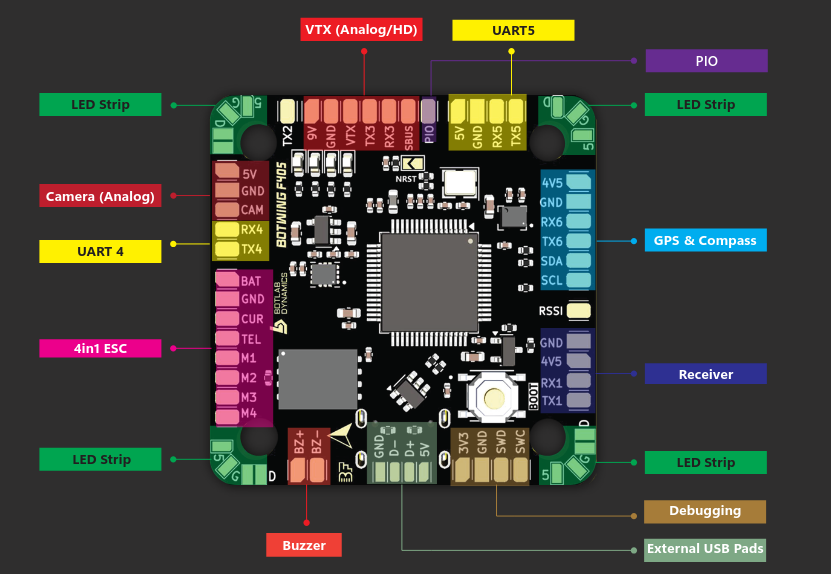
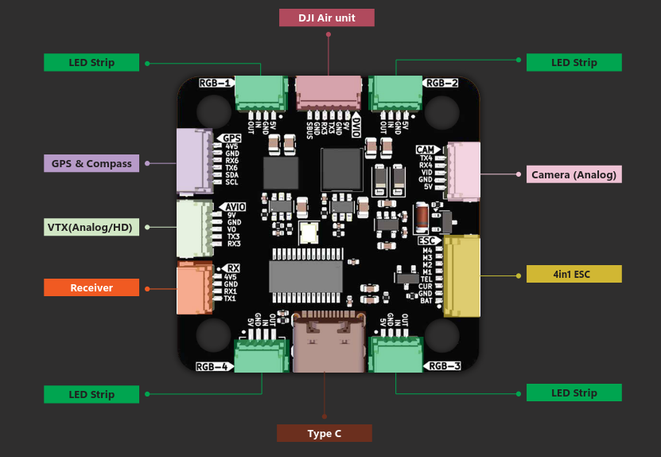
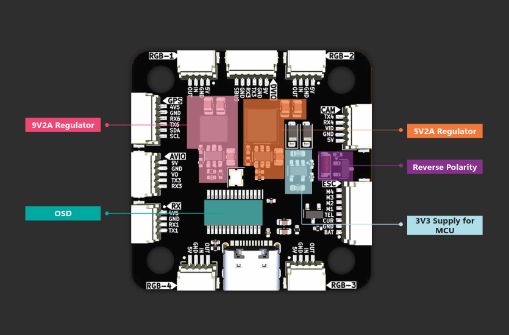
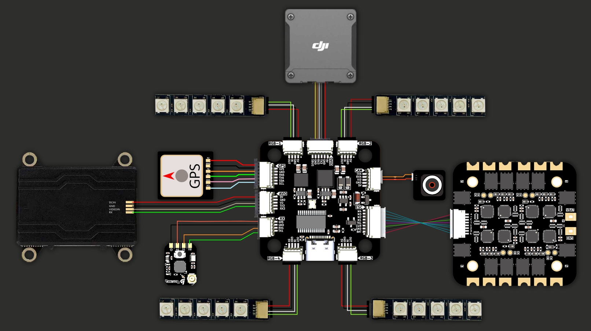

# BOTWINGF405 Flight Controller

The BOTWINGF405 is a compact, high-performance flight controller developed for fixed-wing and FPV applications. Designed for reliability and flexibility, it integrates essential sensors and features for smooth flight and rich telemetry, produced by [BOTLAB DYNAMICS](https://www.botlabdynamics.store/).










## Features

### Processor

* STM32F405RGT6, 168 MHz, 1MB flash
* 24MHz external crystal

---

### Sensors

* ICM42688P Accelerometer/Gyroscope
* DPS310 Barometer
* Optional External Compass (AK8963 supported)

---

### Power

* 2S–6S LiPo input with onboard voltage and current monitoring
* BEC Outputs:
  * 5V @ 2.0A
  * 9V @ 2.0A 

---

### Storage

* 32MB onboard dataflash for logging
* JEDEC-compatible SPI Flash (W25Q256)

---

### Interfaces

* 6x UARTs (for GPS, telemetry, RC, camera, etc.)
* I2C port for barometer and external compass
* USB OTG port (USB connector)
* 5 configured PWM outputs (4 for motors, 1 for RGB LED)
* 1x RC input (SBUS, PPM or CRSF/ELRS selectable)

---

### External Connections

* 6-pin JST-GH for GPS/Compass
* 6-pin JST-GH for DJI or other peripherals
* 8-pin JST-GH for ESC
* 4-pin JST-GH for Receiver
* 5-pin JST-GH for Analog VTX
* 5-pin JST-GH for Camera
* 4 x 4-pin JST-GH for LED Strip-NEOPIXEL

---

## Wiring Diagram



---

## UART Mapping

The UARTs follow standard ArduPilot SERIAL port assignments:

* SERIAL0 -> USB
* SERIAL1 -> USART1 (RX tied to inverted SBUS RC input, but can be used as normal UART if :ref:`BRD_ALT_CONFIG =1` ) 
* SERIAL2 -> USART2 (ESC Telemetry)
* SERIAL3 -> USART3 (Analog/Digital Video or VTX)
* SERIAL4 -> UART4  (Camera)
* SERIAL5 -> UART5  (other peripherals)
* SERIAL6 -> USART6 (GPS) 

---

## RC Input

Two modes supported:

* **SBUS Mode (Inverted):**
  * RC signal to PB7 
* **CRSF/ELRS Mode:**
  * Direct USART1 TX/RX (PB6/PB7)

For FPort, a bi-directional inverter and `SERIAL1_OPTIONS = 4` are required.

---

## OSD Support

The BOTWINGF405 includes an internal AT7456E OSD via SPI3, enabled with `OSD_TYPE = 1`. External options like DJI or DisplayPort are available via UART5 or other free UARTs.

---

## PWM Outputs

* PWM1–PWM4: Motor Outputs (M1–M4)
* PWM5: RGB LED

Group rules apply; outputs within a group must share the same protocol (PWM or DShot).

---

## Battery Monitoring

Integrated voltage and current sensing:

* Voltage up to 6S LiPo

Recommended parameters:

```
BATT_MONITOR        = 4
BATT_VOLT_PIN       = 11
BOARD_RSSI_ANA_PIN  = 12
BATT_CURR_PIN       = 13
BATT_VOLT_MULT      = 11.0
BATT_AMP_PERVLT     = 37
```

---

## Compass

There is no onboard compass. External compass modules, such as the AK8963, connect via I2C (PB8/PB9). Automatic external compass detection is enabled.

---

## VTX Power Control

* GPIO81 (PB1) controls 9V BEC output
* Set GPIO high to enable 9V for connected devices

---

## LEDs and Buzzer

* PC0: LED0 (GPIO0)
* PC5: LED1 (GPIO1)
* PB0: Buzzer (GPIO80)

---

## Logging

* 32MB onboard SPI flash for data logging
* Uses JEDEC-compatible `AP_Logger_Flash_JEDEC` driver

---

## Firmware Loading

Firmware available at [ArduPilot Firmware Server](https://firmware.ardupilot.org).

### Initial Load

1. Hold boot button while connecting USB to enter DFU mode
2. Flash `BOTWINGF405_bl.hex` using DFU utilities

### Firmware Updates

* Use Mission Planner or compatible GCS to load `.apj` firmware via USB

---

**Note:** SWD access for development/debugging available on PA13/PA14.
