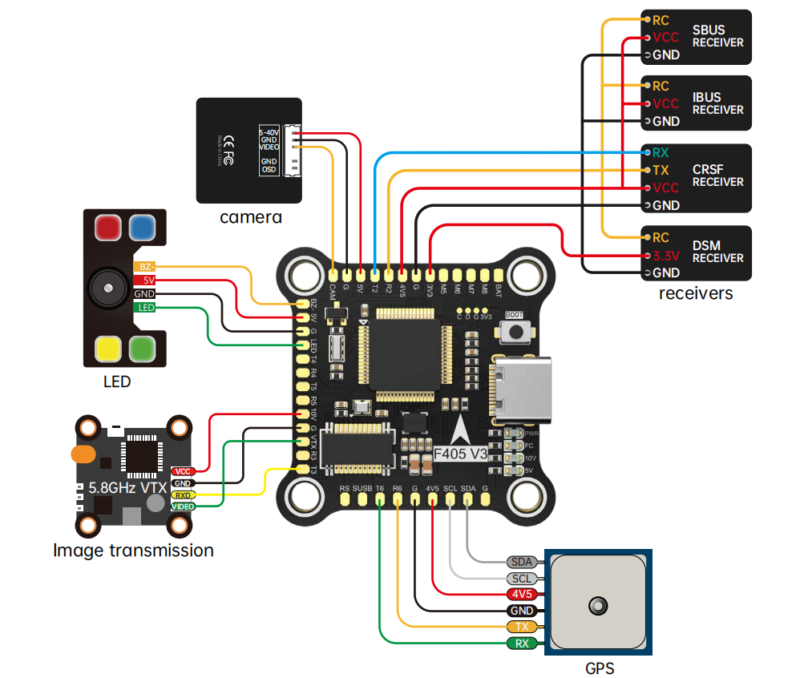
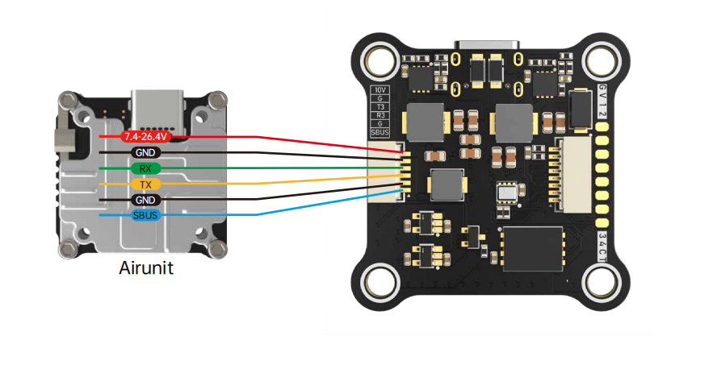
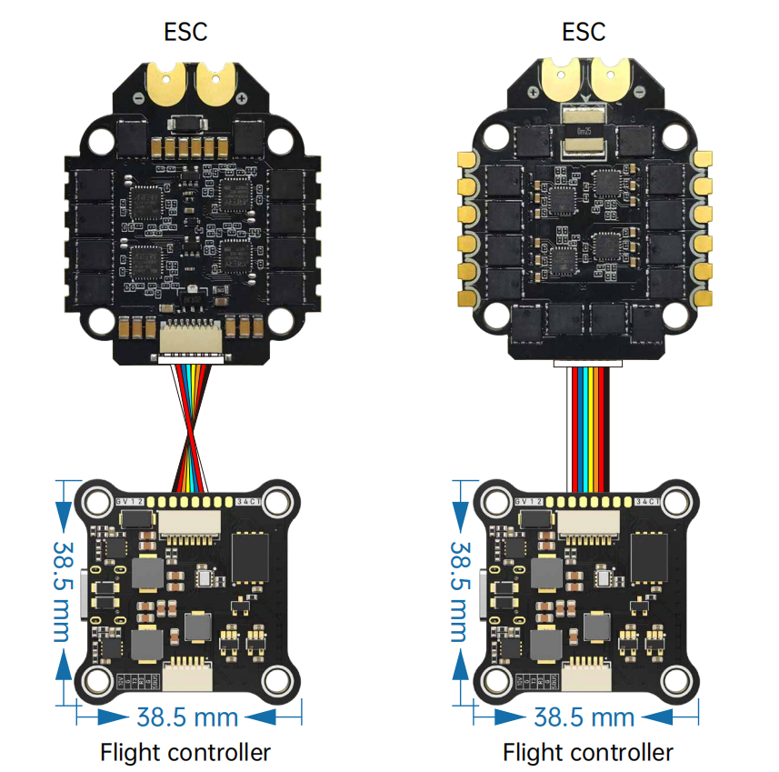

# BROTHERHOBBYF405v3 Flight Controller

The BROTHERHOBBYF405v3 is a flight controller produced by [BROTHERHOBBY](https://www.brotherhobbystore.com/).

## Features

 - STM32F405 microcontroller
 - ICM42688P IMU
 - SPL06 barometer
 - AT7456E OSD
 - 10V 2A BEC; 5V 2A BEC
 - 16Mb Onboard Flash
 - 6 UARTs
 - 8 PWM outputs

## Pinout

## UART Mapping

 - SERIAL0 -> USB
 - SERIAL1 -> UART1 (RX1 only and is inverted from SBUS pin in HD VTX connector)
 - SERIAL2 -> UART2 (RX, DMA-enabled)
 - SERIAL3 -> UART3 (DJI)
 - SERIAL4 -> UART4 
 - SERIAL5 -> UART5 (ESC Telemetry)
 - SERIAL6 -> UART6 (GPS)

## RC Input

The default RC input is configured on UART2, all ArduPilot compatible protocols, except PPM and SBUS, are supported. SBUS support is provided via the HD VTX connector on SERIAL1 and requires the protocol be set to :ref:`SERIAL1_PROTOCOL<SERIAL1_PROTOCOL>` = "23" and change SERIAL2 _Protocol to something other than '23'.

* PPM is not supported
* FPort requires an external bi-directional inverter (see :ref:`common-fport-receivers`)
* CRSF requires connection to TX2 and automatically supports telemetry
* DSM/SRXL connects to the RX2 pin, but SBUS would still be connected to SBUS.
* SRXL2 requires a connection to TX2 and automatically provides telemetry. Set :ref:`SERIAL2_OPTIONS<SERIAL2_OPTIONS>` to “4”.

## FrSky Telemetry
 
FrSky Telemetry can be supported using a spare UART transmit pin. You need to set the following parameters to enable support for FrSky S.PORT on SERIAL4
 
  - :ref:`SERIAL4_PROTOCOL<SERIAL4_PROTOCOL>` 10
  - :ref:`SERIAL4_OPTIONS<SERIAL4_OPTIONS>` 7

## OSD Support

The BROTHERHOBBYF405v3 supports OSD using OSD_TYPE 1 (MAX7456 driver). Simultaneously, DisplayPort HD VTX connections can be made to UART3 (included on the HD VTX connector) by setting OSD_TYPE2 = 5.

## VTX Support

The SH1.0-6P connector supports a standard DJI HD VTX connection. Pin 1 of the connector is 10v so be careful not to connect
anything that could be damaged by this voltage.

## PWM Output

The BROTHERHOBBYF405v3 supports up to 9 PWM outputs. Outputs 1-4 are on the ESC connector, while the others are available via solder pads.

Channels 1-8 support DShot.
Channels 1-4 support bi-directional DShot.

PWM outputs are grouped into 5 groups and every group must use the same output protocol:
 - PWM 1-2  in group1
 - PWM 3-4  in group2
 - PWM 5-6  in group3
 - PWM 7-8  in group4
 - PWM 9    in group5 (LEDs)

## Battery Monitoring

The board has a internal voltage sensor and connections on the ESC connector for an external current sensor input.
The voltage sensor can handle up to 6S LiPo batteries.

The default battery parameters are:

 - :ref:BATT_MONITOR<BATT_MONITOR> = 4
 - :ref:BATT_VOLT_PIN<BATT_VOLT_PIN__AP_BattMonitor_Analog> = 10
 - :ref:BATT_CURR_PIN<BATT_CURR_PIN__AP_BattMonitor_Analog> = 11
 - :ref:BATT_VOLT_MULT<BATT_VOLT_MULT__AP_BattMonitor_Analog> = 11
 - :ref:BATT_AMP_PERVLT<BATT_AMP_PERVLT__AP_BattMonitor_Analog> = 25.9 (will need to be adjusted for whichever current sensor is attached)

## RSSI

 - ADC Pin 15 -> RSSI voltage monitoring

## Compass

The BROTHERHOBBYF405v3 does not have a built-in compass, but you can attach an external compass using I2C on the SDA and SCL connector.

## Firmware
Firmware for the BROTHERHOBBYF405v3 can be found `here <https://firmware.ardupilot.org>`_ in sub-folders labeled “BROTHERHOBBYF405v3".

## Loading Firmware

Initial firmware load can be done with DFU by plugging in USB with the bootloader button pressed. Then you should load the "with_bl.hex" firmware, using your favorite DFU loading tool.

Once the initial firmware is loaded you can update the firmware using any ArduPilot ground station software. Updates should be done with the "*.apj" firmware files.
