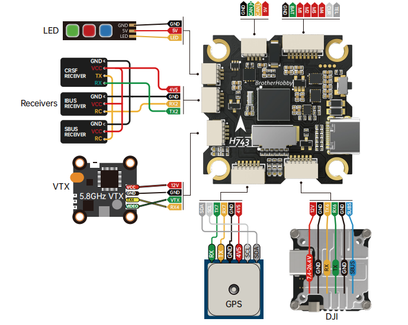
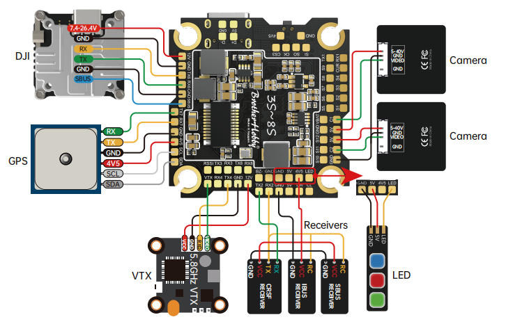

# BROTHER HOBBY H743 Flight Controller

The BROTHERHOBBYH743 is a flight controller produced by [BROTHERHOBBY](https://www.brotherhobbystore.com/).

## Features

 - STM32H743 microcontroller
 - ICM42688P IMU
 - SPL06 barometer
 - AT7456E OSD
 - 12V 3A BEC; 5V 3A BEC
 - SDCard
 - 7 UARTs
 - 13 PWM outputs

## Pinout

## UART Mapping

 - SERIAL0 -> USB
 - SERIAL1 -> UART1 (ESC Telemetry)
 - SERIAL2 -> UART2 (RX/SBUS, DMA-enabled)
 - SERIAL3 -> UART3 (Spare, DMA-enabled)
 - SERIAL4 -> UART4 (Spare)
 - SERIAL6 -> UART6 (DJI, DMA-enabled)
 - SERIAL7 -> UART7 (GPS, DMA-enabled)
 - SERIAL8 -> UART8 (Spare)

## RC Input

The default RC input is configured on the UART2_RX inverted from the SBUS pin.  All unidirectional ArduPilot compatible protocols, except PPM, are supported. Receivers using bi-directional protocols such as CRSF/ELRS should be tied to the TX2 and RX2 pins.

 
* FPort requires connection to TX2 . See :ref:`FPort Receivers<common-Fport-receivers>`.
* CRSF/ELRS also requires a TX2 connection, in addition to RX2, and automatically provides telemetry.
* SRXL2 requires a connection to TX2 and automatically provides telemetry. Set :ref:`SERIAL2_OPTIONS<SERIAL2_OPTIONS>` to “4”. 

## FrSky Telemetry
 
FrSky Telemetry can be supported using the T1 pin (UART1 transmit). You need to set the following parameters to enable support for FrSky S.PORT
 
  - SERIAL1_PROTOCOL 10
  - SERIAL1_OPTIONS 7
  
## OSD Support

The BROTHERHOBBYH743 supports using its internal OSD (MAX7456 driver). Simultaneous DisplayPort OSD operation  is also pre-configured on SERIAL 6. See :ref:`common-msp-osd-overview-4.2` for more info.

## VTX Support

The SH1.0-6P connector supports a standard DJI HD VTX connection. Pin 1 of the connector is 12v so be careful not to connect incorrectly.

## PWM Output

The BROTHERHOBBYH743 supports up to 13 PWM outputs.

Channels 1-8 support bi-directional DShot.
All outputs except 11/12 support DShot.

PWM outputs are grouped and every group must use the same output protocol:
 - PWM 1-2   in group1
 - PWM 3-4   in group2
 - PWM 5-6   in group3
 - PWM 7-10  in group4
 - PWM 11-12 in group5 - servo 1/2
 - PWM 13    in group6 - LED strip

## Battery Monitoring

The board has a internal voltage sensor and connections on the ESC connector for an external current sensor input.
The voltage sensor can handle up to 6S LiPo batteries.

The default battery parameters are:

 - :ref:BATT_MONITOR<BATT_MONITOR> = 4
 - :ref:BATT_VOLT_PIN<BATT_VOLT_PIN__AP_BattMonitor_Analog> = 10
 - :ref:BATT_CURR_PIN<BATT_CURR_PIN__AP_BattMonitor_Analog> = 11
 - :ref:BATT_VOLT_MULT<BATT_VOLT_MULT__AP_BattMonitor_Analog> = 11
 - :ref:BATT_AMP_PERVLT<BATT_AMP_PERVLT__AP_BattMonitor_Analog> = 40.2

## RSSI

 - ADC Pin 8 -> RSSI voltage monitoring

## Compass

The BROTHERHOBBYH743 does not have a built-in compass, but you can attach an external compass using I2C on the SDA and SCL connector.

## VTX power control

GPIO 81 controls the VTX BEC output to pins marked "10V". Setting this GPIO low removes voltage supply to pins.
By default RELAY2 is configured to control this pin and sets the GPIO high.

## Camera control

GPIO 82 controls the camera output to the connectors marked "CAM1" and "CAM2". Setting this GPIO high switches the video output from CAM1 to CAM2. By default RELAY3 is configured to control this pin and sets the GPIO low.

## Loading Firmware

Initial firmware load can be done with DFU by plugging in USB with the bootloader button pressed. Then you should load the "with_bl.hex" firmware, using your favorite DFU loading tool.

Once the initial firmware is loaded you can update the firmware using any ArduPilot ground station software. Updates should be done with the "\*.apj" firmware files.

Firmware for these boards can be found at https://firmware.ardupilot.org in sub-folders labeled "BROTHEHOBBYH743".
