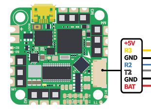

# iFlight Beast F7 45A AIO Flight Controller

https://shop.iflight-rc.com/index.php?route=product/product&product_id=1377

The Beast F7 AIO is a flight controller produced by [iFlight](https://shop.iflight-rc.com/).

## Features

 - MCU: BGA-STM32F745
 - Gyro: MPU6000
 - 8Mb Onboard Flash
 - BEC output: 5V 2.5A 
 - Barometer: BMP280
 - OSD: AT7456E
 - 5 UARTS: (UART1, UART2, UART3, UART4, UART7)
 - 5 PWM outputs (4 motors and 1 LED)

## Pinout

## UART Mapping

The UARTs are marked Rn and Tn in the above pinouts. The Rn pin is the
receive pin for UARTn. The Tn pin is the transmit pin for UARTn.
|Name|Pin|Function|
|:-|:-|:-|
|SERIAL0|COMPUTER|USB|
|SERIAL1|RX1/TX1|UART1 (Telem1 / Alt RC Input/Output)|
|SERIAL2|TX2/RX2|UART2 (DJI)|
|SERIAL3|RX3|UART3 (DJI RC Input)|
|SERIAL4|TX4/RX4|UART4 (GPS)|
|SERIAL7|TX7/RX7|UART7|

UART1 supports RX and TX DMA. UART2, UART3 and UART4 support RX DMA. UART7 supports TX DMA

## RC Input
 
RC input is configured on the (UART3_RX) pin which forms part of the DJI connector. It supports all RC protocols.
For RC input/output use UART1 with SERIAL1_PROTOCOL as 23 and set SERIAL3_PROTOCOL set to -1
  
## OSD Support

The Beast F7 AIO supports OSD using OSD_TYPE 1 (MAX7456 driver).

## PWM Output

The Beast F7 AIO supports up to 4 PWM outputs. The pads for motor output ESC1 to ESC4 on the above diagram are for the 4 outputs. All 4 outputs support DShot as well as all PWM types.

The PWM are in in two groups.

Channels within the same group need to use the same output rate. If
any channel in a group uses DShot then all channels in the group need
to use DShot.

## Battery Monitoring

The board has a builtin voltage sensor. The voltage sensor can handle up to 6S
LiPo batteries.

The correct battery setting parameters are:

 - BATT_MONITOR 4
 - BATT_VOLT_PIN 12
 - BATT_VOLT_MULT around 10.9
 - BATT_CURR_PIN 13
 - BATT_CURR_MULT around 28.5

These are set by default in the firmware and shouldn't need to be adjusted

## Compass

The Beast F7 AIO does not have a builtin compass and you cannot attach an external compass due to the lack of an external I2C connector.

## NeoPixel LED

The board includes a NeoPixel LED on the underside which is pre-configured to output ArduPilot sequences. This is the fifth PWM output.

## Loading Firmware

Initial firmware load can be done with DFU by plugging in USB with the
bootloader button pressed. Then you should load the "with_bl.hex"
firmware, using your favourite DFU loading tool.

Once the initial firmware is loaded you can update the firmware using
any ArduPilot ground station software. Updates should be done with the
*.apj firmware files.
