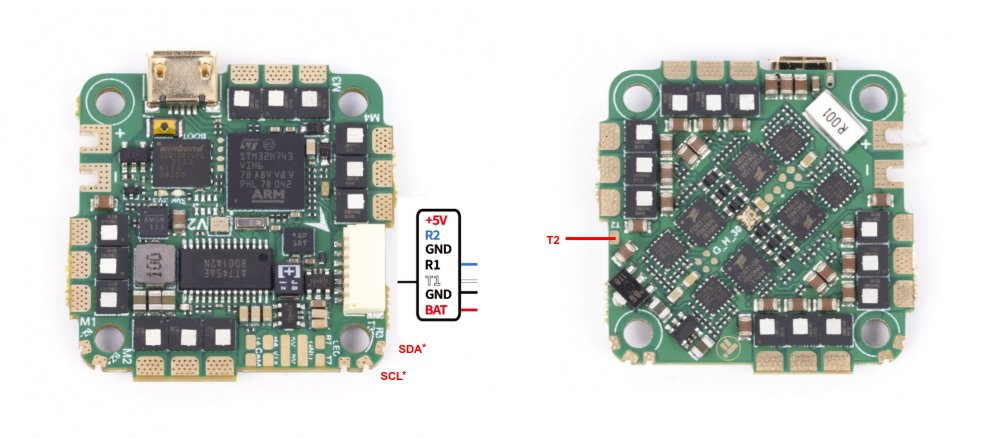

# iFlight Beast H7 v2 55A AIO Flight Controller

https://shop.iflight-rc.com/Beast-H7-V2-55A-AIO-MPU6000-25.5-25.5-pro1588

The Beast H7 AIO is a flight controller produced by [iFlight](https://shop.iflight-rc.com/).

## Features

 - MCU: BGA-STM32H743
 - Gyro: BMI270
 - 16Mb Onboard Flash
 - BEC output: 5V 2.5A
 - Barometer: DPS310 or None
 - OSD: AT7456E
 - 5 UARTS: (UART1, UART2, UART3, UART4, UART7)
 - I2C for external compass. UART3 pins are used for I2C (BRD_ALT_CONFIG=1)
 - 5 PWM outputs (4 motors and 1 LED)

## Pinout

## UART Mapping

The UARTs are marked Rn and Tn in the above pinouts. The Rn pin is the
receive pin for UARTn. The Tn pin is the transmit pin for UARTn.
|Name|Pin|Function|
|:-|:-|:-|
|SERIAL0|COMPUTER|USB|
|SERIAL1|RX1/TX1|UART1 (DJI connector)|
|SERIAL2|TX2/RX2|UART2 (DJI connector, TX is on the back side of board)|
|SERIAL3|TX3/RX3|UART3|
|SERIAL4|TX4/RX4|UART4|
|SERIAL7|TX7/RX7|UART7 (GPS)|

All UARTS support DMA.

## RC Input

RC input is configured on the (UART2_RX/UART2_TX) pins which forms part of the DJI connector. It supports all RC protocols.

## OSD Support

The Beast H7 v2 AIO supports OSD using OSD_TYPE 1 (MAX7456 driver).

## PWM Output

The Beast H7 AIO supports up to 4 PWM outputs. The pads for motor output ESC1 to ESC4 on the above diagram are for the 4 outputs. All 4 outputs support DShot as well as all PWM types.

The PWM are in in two groups.

Channels within the same group need to use the same output rate. If
any channel in a group uses DShot then all channels in the group need
to use DShot.

## Battery Monitoring

The board has a builtin voltage sensor. The voltage sensor can handle up to 6S
LiPo batteries.

The correct battery setting parameters are:

 - BATT_MONITOR 4
 - BATT_VOLT_PIN 12
 - BATT_VOLT_MULT around 10.9
 - BATT_CURR_PIN 13
 - BATT_CURR_MULT around 28.5

These are set by default in the firmware and shouldn't need to be adjusted

## Compass

The Beast H7 v2 AIO does not have a builtin compass, but you can attach an external compass to I2C pins. Default configuration does not have I2C bus enabled. You need to set BRD_ALT_CONFIG=1 to make I2C use RX3/TX3 pins.

## NeoPixel LED

The board includes a NeoPixel LED on the underside which is pre-configured to output ArduPilot sequences. This is the fifth PWM output.

## Loading Firmware

Initial firmware load can be done with DFU by plugging in USB with the
bootloader button pressed. Then you should load the "with_bl.hex"
firmware, using your favourite DFU loading tool.

Once the initial firmware is loaded you can update the firmware using
any ArduPilot ground station software. Updates should be done with the
*.apj firmware files.
