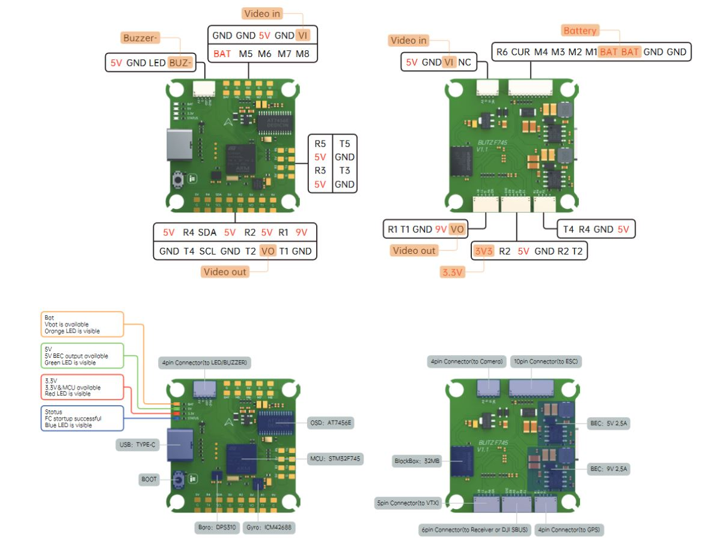

# iFlight BLITZ F745 Flight Controller

https://shop.iflight.com/electronics-cat27/BLITZ-F745-Flight-Controller-Pro2141

The BLITZ F745 is a flight controller produced by [iFlight](https://shop.iflight-rc.com/).

## Features

 - MCU: BGA-STM32F745, 216MHz
 - Gyro: ICM42688
 - 32Mbytes Onboard Flash
 - BEC output: 5V 2.5A
 - Barometer: DPS310
 - OSD: AT7456E
 - 6 UARTS: (UART1, UART2, UART3, UART4, UART5, UART6)
 - I2C for external compass.
 - 9 PWM outputs (8 motor outputs and 1 LED output)

## Pinout

## UART Mapping

The UARTs are marked Rn and Tn in the above pinouts. The Rn pin is the
receive pin for UARTn. The Tn pin is the transmit pin for UARTn.
|Name|Pin|Function|
|:-|:-|:-|
|SERIAL0|COMPUTER|USB|
|SERIAL1|RX1/TX1|UART1 (DJI connector)|
|SERIAL2|TX2/RX2|UART2 (RX, DMA-enabled)|
|SERIAL3|TX3/RX3|UART3 (GPS, DMA-enabled)|
|SERIAL4|TX4/RX4|UART4|
|SERIAL5|TX5/RX5|UART5|
|SERIAL6|RX6|UART6 (ESC telemetry)|

Note:UART3 is used for GPS not UART4 as shown in typical wiring diagram

## RC Input

RC input is configured on the (UART2_RX/UART2_TX). It supports all serial RC protocols.

## OSD Support

The BLITZ F745 supports OSD using OSD_TYPE 1 (MAX7456 driver).

## PWM Output

The BLITZ F745 has 9 PWM outputs. The pads for motor output are M1 to M8 on the board and M1-M4 are also in the ESC connector housing. All 9 outputs support DShot and the first four outputs support bi-directional DShot as well as all PWM types. Output 9 is the "LED" pin and is configured for serial LED by default.

The PWM are in three groups:

 - PWM 1-4 in group1
 - PWM 5-8 in group2
 - PWM 9 in group3

Channels within the same group need to use the same output rate. If
any channel in a group uses DShot then all channels in the group need
to use DShot.

## Battery Monitoring

The board has a builtin voltage sensor and a current sensor input tied to its 4 in 1 ESC current sensor. The voltage sensor can handle up to 6S
LiPo batteries.

The correct battery setting parameters are:

 - BATT_MONITOR 4
 - BATT_VOLT_PIN 12
 - BATT_VOLT_MULT 11
 - BATT_CURR_PIN 13
 - BATT_CURR_MULT 50

These are set by default in the firmware and shouldn't need to be adjusted

## Compass

The BLITZ F745 does not have a builtin compass, but you can attach an external compass to I2C pins.

## NeoPixel LED

The board includes a NeoPixel LED on the underside which is pre-configured to output ArduPilot sequences. This is the fifth PWM output.

## Loading Firmware

Initial firmware load can be done with DFU by plugging in USB with the
bootloader button pressed. Then you should load the "with_bl.hex"
firmware, using your favourite DFU loading tool.

Once the initial firmware is loaded you can update the firmware using
any ArduPilot ground station software. Updates should be done with the
*.apj firmware files.
