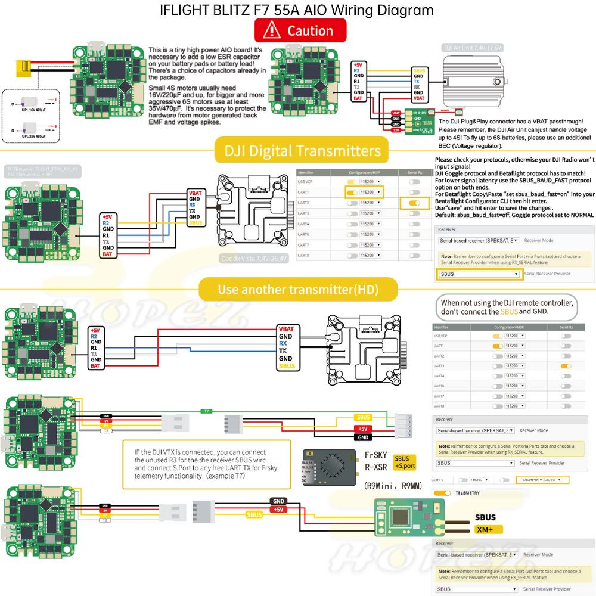

# iFlight BLITZ Whoop F7 AIO Flight Controller

https://shop.iflight-rc.com/BLITZ-Whoop-F7-AIO-Pro1927

The Blitz F7 AIO is a flight controller produced by [iFlight](https://shop.iflight-rc.com/).

## Features

 - MCU: BGA-STM32F745, 216MHz
 - Gyro: BMI270 or ICM42688
 - 16Mb Onboard Flash
 - BEC output: 5V 2.5A
 - Barometer: DPS310 or None
 - OSD: AT7456E
 - 5 UARTS: (UART1, UART2, UART3, UART4, UART7)
 - I2C for external compass.
 - 5 PWM outputs (4 motor outputs used internally for integrated 4-in-1 ESC and 1 integrated LED)
 - Integrated 55A 4-in-1 BLHeli_S / BlueJay ESC

## Pinout

## UART Mapping

The UARTs are marked Rn and Tn in the above pinouts. The Rn pin is the
receive pin for UARTn. The Tn pin is the transmit pin for UARTn.
|Name|Pin|Function|
|:-|:-|:-|
|SERIAL0|COMPUTER|USB|
|SERIAL1|RX1/TX1|UART1 (DJI connector, DMA-enabled)|
|SERIAL2|TX2/RX2|UART2 (DJI connector RX, DMA-enabled, TX is on the back side of board)|
|SERIAL3|TX3/RX3|UART3 (Alt RX or GPS, DMA-enabled)|
|SERIAL4|TX4/RX4|UART4|
|SERIAL7|TX7/RX7|UART7|

## RC Input

RC input is configured on the (UART2_RX/UART2_TX) pins which forms part of the DJI connector. It supports all RC protocols.

## OSD Support

The BLITZ Whoop F7 AIO supports OSD using OSD_TYPE 1 (MAX7456 driver).

## PWM Output

The BLITZ Whoop F7 AIO has 4 PWM outputs internally connected to its 4-in-1 ESC. The pads for motor output are M1 to M4 on the board. All 4 outputs support bi-directional DShot and DShot, as well as all PWM types. The default configuration is for bi-directional DShot using the already installed BlueJay firmware.

The PWM are in in two groups:

 - PWM 1-4 in group1
 - PWM 5   in group2

Channels within the same group need to use the same output rate. If
any channel in a group uses DShot then all channels in the group need
to use DShot.

## Battery Monitoring

The board has a builtin voltage sensor and a current sensor input tied to its 4 in 1 ESC current sensor. The voltage sensor can handle up to 6S
LiPo batteries.

The correct battery setting parameters are:

 - BATT_MONITOR 4
 - BATT_VOLT_PIN 12
 - BATT_VOLT_MULT 10.9
 - BATT_CURR_PIN 13
 - BATT_CURR_MULT 50

These are set by default in the firmware and shouldn't need to be adjusted

## Compass

The BLITZ Whoop F7 AIO does not have a builtin compass, but you can attach an external compass to I2C pins.

## NeoPixel LED

The board includes a NeoPixel LED on the underside which is pre-configured to output ArduPilot sequences. This is the fifth PWM output.

## Loading Firmware

Initial firmware load can be done with DFU by plugging in USB with the
bootloader button pressed. Then you should load the "with_bl.hex"
firmware, using your favourite DFU loading tool.

Once the initial firmware is loaded you can update the firmware using
any ArduPilot ground station software. Updates should be done with the
*.apj firmware files.
