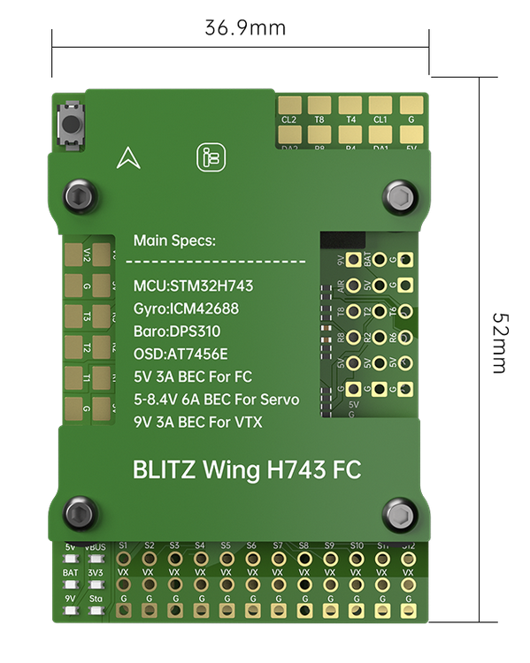
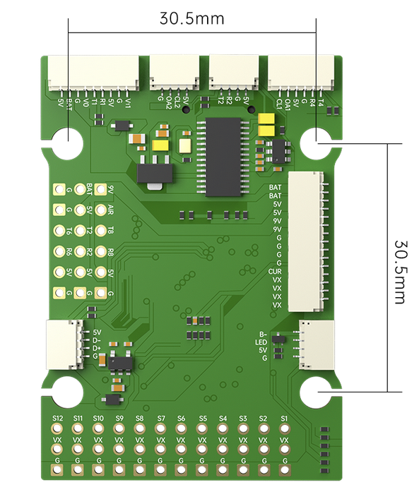
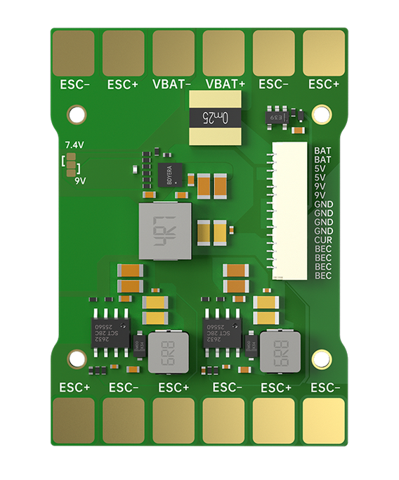

# iFlight BLITZ Wing H743 Flight Controller

The BLITZ Wing H743 is a flight controller produced by [iFlight](https://shop.iflight.com/electronics-cat27/BLITZ-Wing-H743-Flight-Controller-Pro2174).

## Features

 - MCU - STM32H743 32-bit processor running at 480 MHz
 - Gyro: ICM42688
 - SDCard for logging
 - 5V 3A BEC for Flight Controller
 - 9V 3A BEC for VTX
 - 5-8.4V 6A BEC for Servo
 - Barometer: DPS310
 - OSD: AT7456E
 - 7x UARTs
 - 13x PWM Outputs (12 Motor Output, 1 LED)
 - Battery input voltage: 2S-8S
 - 2x I2C for external compass, airspeed, etc.
 - CAN port

## Physical
 - Mount pattern: 30.5*30.5mm/?4
 - Dimensions: 36.9*52mm
 - Weight: 35g

## Pinout

## UART Mapping

The UARTs are marked Rn and Tn in the above pinouts. The Rn pin is the
receive pin for UARTn. The Tn pin is the transmit pin for UARTn.
|Name|Pin|Function|
|:-|:-|:-|
|SERIAL0|COMPUTER|USB|
|SERIAL1|RX1/TX1|UART1 (DJI connector, DMA-enabled)|
|SERIAL2|TX2/RX2|UART2 (RX, DMA-enabled)|
|SERIAL3|TX3/RX3|UART3 (DMA-enabled)|
|SERIAL4|TX4/RX4|UART4 (GPS, DMA-enabled)|
|SERIAL6|TX6/RX6|UART6|
|SERIAL7|TX7/RX7|UART7|
|SERIAL8|TX8/RX8|UART8 (ESC Telemetry)|

## RC Input

RC input is configured on the (UART2_RX/UART2_TX) pins which forms part of the DJI connector. It supports all serial RC protocols.

## OSD Support

The BLITZ Wing H743 supports OSD using OSD_TYPE 1 (MAX7456 driver). Simultaneously, DisplayPort HD OSD is enabled by default and available on the HD VTX connector.

## PWM Output

The BLITZ Wing H743 has 13 PWM outputs. The first 8 outputs support bi-directional DShot and DShot, as well as all PWM types. Outputs 9-10 support DShot, as well as all PWM types and outputs 11-12 only support PWM.

The PWM are in in five groups:

 - PWM 1-2 in group1
 - PWM 3-6 in group2
 - PWM 7-10 in group3
 - PWM 11-12 in group4
 - PWM 13 in group5

Channels within the same group need to use the same output rate. If
any channel in a group uses DShot then all channels in the group need
to use DShot.

## Video Power Control

The 9V video power can be turned off/on  using GPIO 81 which is already assigned by default to RELAY2.  This relay can be controlled either from the GCS or using a transmitter channel (See :ref:`common-auxiliary-functions`)

## Camera Switch

The camera output can be switched using GPIO 82 which is already assigned by default to RELAY3.  This relay can be controlled either from the GCS or using a transmitter channel (See :ref:`common-auxiliary-functions`)

## Analog Airspeed Input

The analog airspeed pin is "4"

## Battery Monitoring

The board has a built-in voltage sensor and  current sensor. The voltage sensor can handle up to 8S
LiPo batteries.

The correct battery setting parameters are:

 - BATT_MONITOR 4
 - BATT_VOLT_PIN 10
 - BATT_VOLT_MULT 11
 - BATT_CURR_PIN 11
 - BATT_CURR_MULT 50

These are set by default in the firmware and shouldn't need to be adjusted

## Compass

The BLITZ Wing H743 does not have a builtin compass, but you can attach an external compass to I2C pins.

## Loading Firmware

Initial firmware load can be done with DFU by plugging in USB with the
bootloader button pressed. Then you should load the "with_bl.hex"
firmware, using your favourite DFU loading tool.

Once the initial firmware is loaded you can update the firmware using
any ArduPilot ground station software. Updates should be done with the
*.apj firmware files.
