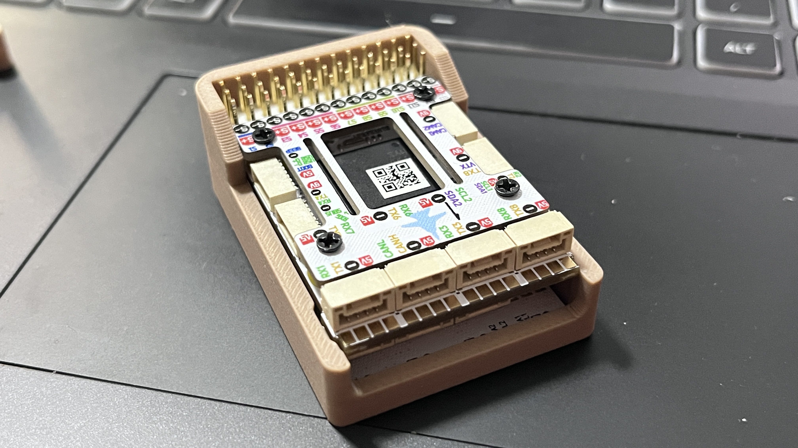
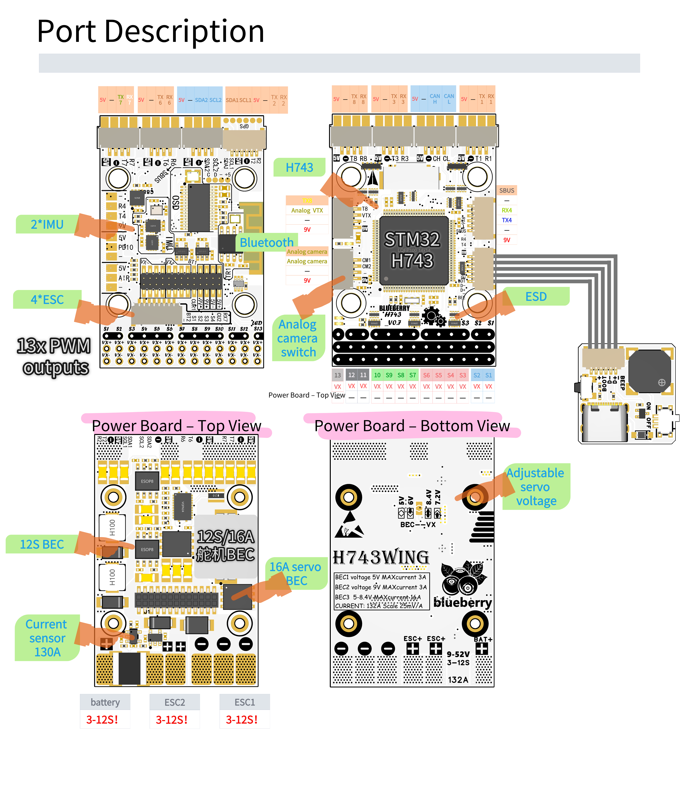
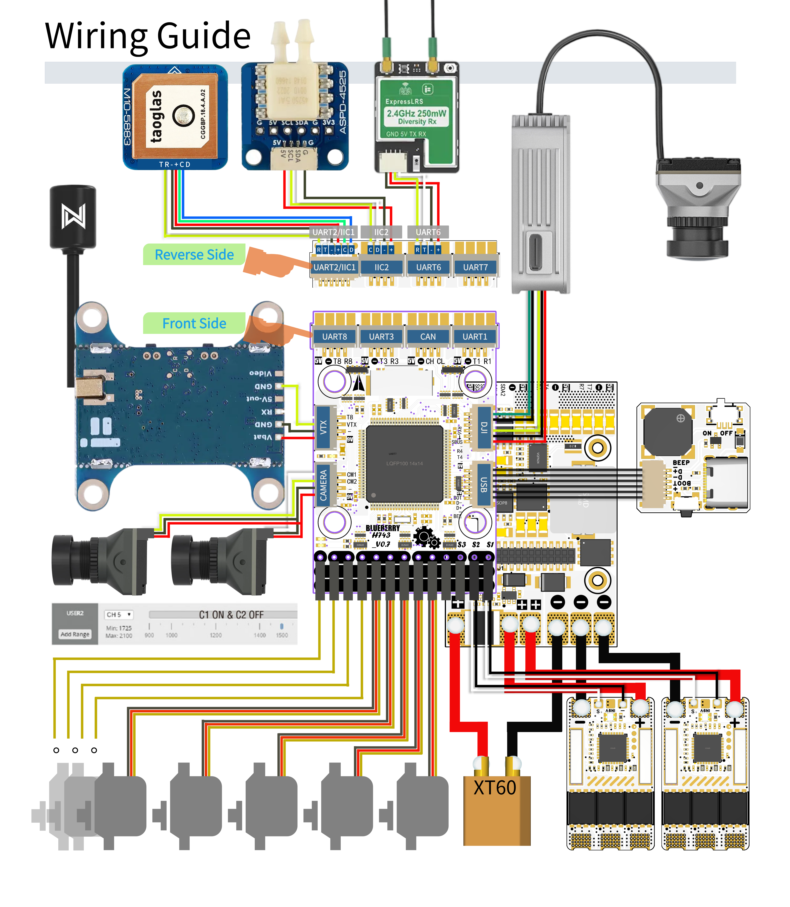

# BlueBerry_H743 Flight Controller

The BlueBerry_H743 is a flight controller designed and produced by blueberry
[purchase link](https://m.tb.cn/h.81JLIfI4wSSfHzo)

## Features

- STM32H743 microcontroller
- Dual ICM42688/ICM42605 IMUs
- 12 PWM / Dshot outputs, plus a PWM-only LED output
- 7 UARTs, one dedicated to the on-board BT module
- 1 CAN
- Dedicated remote USB board with buzzer and boot switch
- DPS310 or SPL06 barometer
- 5V/6V/7.2V/8.4V 16A Servo rail BEC provided
- 9V 3A BEC for VTX
- 5V 3A BEC
- MicroSD Card Slot
- GPIO switchable dual analog camera inputs
- AT7456E OSD
- 2 external I2C ports (I2C2 is shared with the on-board barometer)

## Physical

## Pinout

## Mechanical

- Dimensions: 34 x 51 x 15 mm
- Weight: 40g

## Power supplies

The BlueBerry_H743 supports 3-12s Li battery input. It provides 3 on-board BEC regulators. Please see the table below.

| Power symbol | Power source | Max power (current) |
|--------------|--------------|---------------------|
| 5V | from 5V BEC | 15W (3A) |
| 9V | from 9V BEC | 27W (3A) |
| VX | Servo rail VX BEC, default 5V, can be changed to 6V or 7.2V or 8.4V | 80W (16A) |

## Firmware

Firmware for this board can be found [here](https://firmware.ardupilot.org) in sub-folders labeled "BlueBerryH743".

## Loading Firmware

Initial firmware load can be done with DFU by plugging in USB with the bootloader button pressed. Then you should load the "xxx_with_bl.hex" firmware, using your favorite DFU loading tool, such as the STM32CubeProgrammer.

Once the initial firmware is loaded you can update the firmware using any ArduPilot ground station software. Updates should be done with the "\*.apj" firmware files.

Supports SWD for program downloading, can be used for debugging and secondary development, with program download speed significantly better than DFU.

## UART Mapping

All UARTs are DMA capable.

- SERIAL0 -> USB
- SERIAL1 -> UART1 (MAVLink2, dedicated to the Integrated Bluetooth module)
- SERIAL2 -> UART2 (GPS)
- SERIAL3 -> UART3 (GPS2)
- SERIAL4 -> UART4 (HD-VTX DisplayPort OSD; RX4/TX4 are on the HD VTX connector, and also brought out as the R4/T4 pads on the top face)
- SERIAL5 -> USB (MAVLink2)
- SERIAL6 -> UART6 (RCIN)
- SERIAL7 -> UART7 (MAVLink2, hardware flow control available on the CTS/RTS pins, enable with BRD_SER7_RTSCTS = 1)
- SERIAL8 -> UART8 (SmartAudio VTX control by default; TX8 is also brought out on the analog VTX connector, and the full UART8 on its own 5V/G/T8/R8 connector — change SERIAL8_PROTOCOL to use it as a general-purpose UART)

## RC Input

RC input is provided on UART6 for all ArduPilot supported protocols except PPM. The SBUS pin on the HD VTX connector is tied to RX6. See [RC Systems](https://ardupilot.org/plane/docs/common-rc-systems.html) for details for each protocol type.

## OSD Support

The BlueBerry_H743 supports onboard analog OSD using a AT7456 chip. The analog VTX should connect to the VTX pin. Simultaneous DisplayPort OSD operation for an HD-VTX (DJI/Caddx/OpenIPC/etc) is also pre-configured on SERIAL4/UART4.

Note: if SERIAL4_PROTOCOL is ever changed from MSP DisplayPort, OSD_TYPE2 must be set to 0, or a pre-arm failure will result.

## PWM Output

The BlueBerry_H743 supports up to 13 PWM outputs.

All the channels except output 13 support DShot.

Outputs are grouped and every output within a group must use the same output protocol:

1, 2 are Group 1;

3, 4, 5, 6 are Group 2;

7, 8, 9, 10 are Group 3;

11, 12 are Group 4;

13(LED) is Group 5;

Output 13, marked LED, has no DMA available on this board, so it can only be used as a plain PWM output — it cannot drive DShot or a WS2812/NeoPixel LED string.

## Battery Monitoring

The board has two internal voltage sensors and one integrated current sensor, and a second external current sensor input.

The voltage sensors can handle up to 12S LiPo batteries.

The first voltage/current sensor is enabled by default and the pin inputs and voltage scale for the second, unenabled, sensor are also set by default. The second current input has no fixed hardware behind it, so you need to set BATT2_AMP_PERVLT yourself to match whatever sensor you connect, same as any other analog current input with no fixed hardware behind it.

- BATT_MONITOR 4
- BATT_VOLT_PIN 10
- BATT_CURR_PIN 11
- BATT_VOLT_MULT 21
- BATT_AMP_PERVLT 40
- BATT_AMP_OFFSET 0.126
- BATT2_VOLT_PIN 18
- BATT2_CURR_PIN 7
- BATT2_VOLT_MULT 21
- BATT2_AMP_PERVLT 40 (inherited default, adjust to match the external current sensor)
- BATT2_AMP_OFFSET 0.126 (inherited default, adjust to match the external current sensor)

## Analog airspeed input

- Analog Airspeed sensor uses ARSPD_PIN = 4, on the pad marked AIR

## Compass

The BlueBerry_H743 has no built-in compass. An external compass can be attached to either set of SDA/SCL pins or via DroneCAN.

## CAN

The BlueBerry_H743 has one CAN bus, available on the CAN connector. The CAN1 transceiver silent (listen-only) mode pin is available as GPIO 70.

## Camera Switch

The BlueBerry_H743 supports up to 2 cameras, connected to pins CM1 and CM2. You can select which camera is used by an RC channel. Set the parameters below (RC 6 used in the example):

- RELAY2_FUNCTION = 1
- RELAY2_PIN = 82
- RC6_OPTION = 34

## VTX Power Control

The pad marked PD10 (GPIO 81) is a control output for switching an external VTX power supply — the on-board 9V BEC is always on and is not switched by this pad. Connect PD10 to your external power switch's control input.

The pad is pre-configured as Relay 1: RELAY1_PIN defaults to 81 and the relay function is enabled automatically. The board ships with RELAY1_DEFAULT = 2 (No Change): at boot the firmware leaves PD10 in the low state held by the bootloader until the relay is first commanded, so the external switch is never disturbed at startup, whichever polarity it has. By default a relay command of "on" drives the pad high; if your external switch is active-low (enabled when PD10 is low), set RELAY1_INVERTED = 1 so "on" drives the pad low. Note that RELAY1_INVERTED also inverts RELAY1_DEFAULT — if you would rather have a defined power state at every boot, set RELAY1_DEFAULT to 0 (off) or 1 (on) accordingly.

The relay can be switched by an RC channel (RC 7 used in the example):

- RC7_OPTION = 28

## GPIOs

The output pads can be used as GPIOs when their PWM output is disabled:

- GPIO 32 is the buzzer pin (PA15)
- Outputs 1-13 are GPIO 50-62
- GPIO 70 is the CAN1 transceiver silent (listen-only) mode pin
- GPIO 81 is the pad marked PD10, the external VTX power switch control (pre-configured as Relay 1)
- GPIO 82 is the camera switch control pad (PD11), used by the Camera Switch feature

## Bluetooth

The BlueBerry_H743 support both legacy bluetooth SPP and BLE serial. The bluetooth uses UART1 for its serial port. Search for `BLE` or `SPP` to connect. Be careful NOT to use UART1 for other uses.
