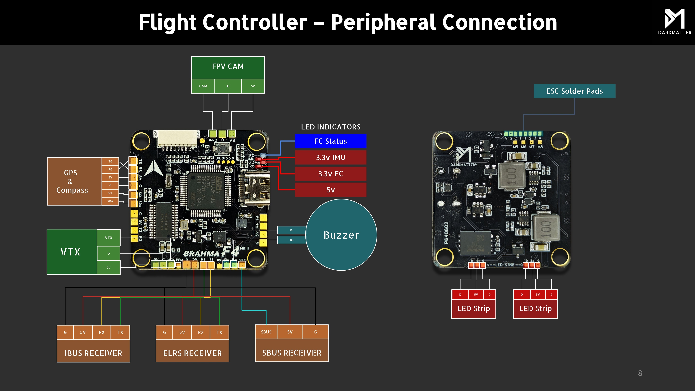

# Brahma F4 Flight Controller

Brahma F4 is a flight controller manufactured by [Darkmatter®](https://thedarkmatter.in)

## Features

- MCU: STM32F405RGT6, 168MHz
- Gyro: BMI270
- 32MB Onboard Flash (32 Megabyte)
- BEC output: 5V, 2A@4V
- Barometer: BMP280
- OSD: AT7456E
- 4 UARTS: (UART1, UART3, UART4, UART6)
- 9 PWM Outputs (includes 1 neopixel out can be used for pwm)
- 5V Power Out: 2.0A max
- 9V Power Out: 2.0A max

## Pinout for BRAHMA F405

## UART Mapping

The UARTs are marked Rx and Tx in the above pinouts.

| Name     | Pad      | Port    |     Function        |
| :------- | :------- | :------ | :------------------ |
| SERIAL 0 | DM/DP    | USB     |  Mavlink            |
| SERIAL 1 | RX1/TX1  | USART 1 | (DMA)   (Reciever)  |
| SERIAL 2 | RX3/TX3  | USART 3 | (NODMA) (MAVLINK)       |
| SERIAL 3 | RX4/TX4  | USART 4 | (NODMA) (GPS2)      |
| SERIAL 4 | RX6/TX6  | USART 6 | (DMA)   (GPS)       |

USART1 and USART6 supports RX and TX DMA.  
UART2 and UART4 do not support DMA.  
ESC Telemetry need to be manually configured based upon esc.

## RC Input

 RC input is configured by default on the R1 T1 (UART1) pads (CRSF or ELRS).  
 SBUS inverted pad is available  
 (PPM is disabled currently)  

## OSD
- ANALOG OSD (MAX7456) (SPI1) (Preconfigured)  
- DIGITAL OSD (MSP)    (UART4 can be used for MSP Displayport by chnaging SERIAL2_
PROTOCOL to "42")  

## PWM Output

The PWM is in 5 groups:

- PWM 1,2 in group1
- PWM 3,4 in group2 
- PWM 5   in group3
- PWM 6-8 in group4
- PWM 9   in group5

 Pads for PWM 1-8 are available on bottom side of pcb  
 ESC port is a jst-sh V-G-C-R3-1-2-3-4  

*NOTE*
 Channels within the same group need to use the same output rate.  
 All channels in specific Timer groups are configured either as DSHOT or PWM,  
 mixing of protocols within groups is not possible.  
 Channel 9 is configured as NeoPixel can be configured for extra pwm.  

## Battery Monitoring

The board has a builtin voltage sensor, voltage sensor supports up to 6S LiPo.  
The default battery configuration is:  

- BATT_MONITOR 4
- BATT_VOLT_PIN 14
- BATT_VOLT_MULT 11
- BATT_CURR_PIN 13
- BATT_CURR_MULT 37

## Compass & Baro

 Internal DPS310 Baro.  
 No Internal Compass.  
 External on I2C BUS1.  

## Loading Firmware

 Initial firmware and bootloader load can be done via DFU by plugging in USB while the bootloader button is held.  
 Then flash the "*_with_bl.hex" or "AP_Bootloader.hex", using your preferred DFU programming tool.  

 Once the initial firmware or bootloader is flashed you can update the firmware using "Mission Planner" or "QGroundControl".  
 Future updates should be done via the *.apj firmware files.
