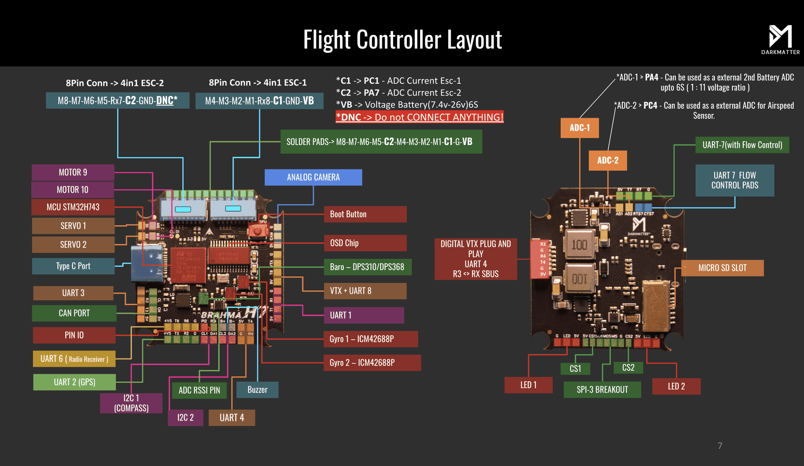
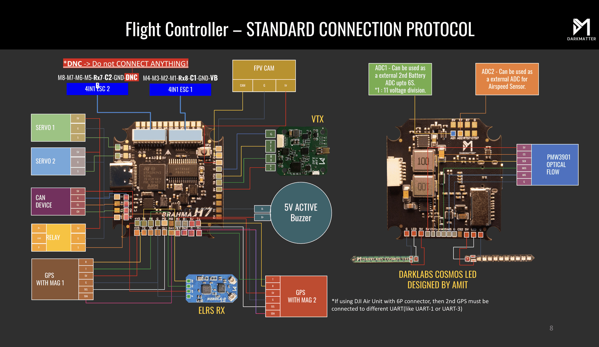

# Brahma H7 Flight Controller

The Brahma H7 is a flight controller produced by [Darkmatter](https://thedarkmatter.in), featuring an STM32H743 processor, dual ICM42688 IMUs for redundancy, and a full suite of interfaces including 7 UARTs, CAN bus, and analog OSD.

## Features

- MCU - STM32H743VIH6 32-bit processor running at 480 MHz
- Two ICM42688-P IMUs
- DPS310 barometer
- OSD - AT7456E
- microSD card slot
- 7x UARTs
- CAN support
- 13x PWM Outputs (12 Motor Output, 1 LED)
- Battery input voltage: 2S-6S
- BEC 5V 3A for peripherals
- BEC 9V 3A for video (user switchable via GPIO)

## Pinout

## UART Mapping

The UARTs are marked Rn and Tn in the above pinouts. The Rn pin is the
receive pin for UARTn. The Tn pin is the transmit pin for UARTn.

- SERIAL0 -> USB (MAVLink2)
- SERIAL1 -> USART1 (MAVLink2, DMA-enabled)
- SERIAL2 -> USART2 (GPS, DMA-enabled)
- SERIAL3 -> USART3 (Spare, DMA-enabled), R3 is also on the HD VTX connector
- SERIAL4 -> UART4 (DisplayPort, DMA-enabled), on the HD VTX connector and the R4/T4 pads
- SERIAL6 -> USART6 (RC Input, DMA-enabled)
- SERIAL7 -> UART7 (MAVLink2, DMA and flow-control enabled), R7 is also on the ESC2 connector
- SERIAL8 -> UART8 (ESC Telemetry), R8 is on the ESC1 connector, T8 is on the VTX pads

A second GPS can be attached to the R3/T3 pads by setting :ref:`SERIAL3_PROTOCOL<SERIAL3_PROTOCOL>` = 5. If an HD VTX is not used, UART4 may be used for the second GPS instead.

A second 4in1 ESC's telemetry is on R7 of the ESC2 connector. To use it set :ref:`SERIAL7_PROTOCOL<SERIAL7_PROTOCOL>` = 16.

## RC Input

The default RC input is configured on USART6. RC could be applied instead to a different UART port and set
the protocol to receive RC data :ref:`SERIALn_PROTOCOL<SERIALn_PROTOCOL>` = 23 and change :ref:`SERIAL6_PROTOCOL<SERIAL6_PROTOCOL>`
to something other than '23'. For RC protocols other than unidirectional, the USART6_TX pin will need to be used:

- :ref:`SERIAL6_PROTOCOL<SERIAL6_PROTOCOL>` should be set to "23".
- FPort would require :ref:`SERIAL6_OPTIONS<SERIAL6_OPTIONS>` be set to "15".
- CRSF would require :ref:`SERIAL6_OPTIONS<SERIAL6_OPTIONS>` be set to "0".
- SRXL2 would require :ref:`SERIAL6_OPTIONS<SERIAL6_OPTIONS>` be set to "4" and connects only the TX pin.

The SBUS output of a DJI air unit arrives on R3 of the HD VTX connector. To use it set :ref:`SERIAL3_PROTOCOL<SERIAL3_PROTOCOL>` = 23 and change :ref:`SERIAL6_PROTOCOL<SERIAL6_PROTOCOL>` to something other than '23'.

## FrSky Telemetry

FrSky Telemetry is supported using an unused UART, such as the Tx pin of UART3.
You need to set the following parameters to enable support for FrSky S.PORT:

- :ref:`SERIAL3_PROTOCOL<SERIAL3_PROTOCOL>` 10
- :ref:`SERIAL3_OPTIONS<SERIAL3_OPTIONS>` 7

## OSD Support

The Brahma H7 supports OSD using OSD_TYPE 1 (MAX7456 driver) and simultaneously DisplayPort using UART4 on the HD VTX connector.

## VTX Support

The HD VTX connector (R3, G, R4, T4, G, 9V) supports a DJI Air Unit / HD VTX connection. Protocol defaults to DisplayPort. The 9V pin of
the connector is the switched VTX BEC so be careful not to connect this to a peripheral that can not tolerate this voltage.

## PWM Output

The Brahma H7 supports up to 13 PWM or DShot outputs. M1-M4 are on the ESC1 connector and M5-M8 on the ESC2 connector,
and M1-M8 are also on solder pads. M9 and M10 are on pads marked "Motor 9" and "Motor 10", PWM 11-12 are on the pads
marked S1/S2 and PWM 13 is on the LED pad.

The ESC1 connector pinout is M4-M3-M2-M1-R8-C1-GND-VB. The ESC2 connector pinout is M8-M7-M6-M5-R7-C2-GND-DNC, the
last pin must not be connected.

The PWM is in 5 groups:

- PWM 1-2   in group1 (TIM3)
- PWM 3-6   in group2 (TIM5)
- PWM 7-10  in group3 (TIM4)
- PWM 11-12 in group4 (TIM15) Marked as S1/S2
- PWM 13    in group5 (TIM1, LED)

Channels within the same group need to use the same output rate. If
any channel in a group uses DShot then all channels in the group need
to use DShot. Channels 1-10 support bi-directional dshot. PWM 13 is Serial LED by default.

## Battery Monitoring

The board has a internal voltage sensor and connections on the ESC connector for an external current sensor input.
The voltage sensor can handle up to 6S LiPo batteries.

The default battery parameters are:

- :ref:`BATT_MONITOR<BATT_MONITOR>` = 4
- :ref:`BATT_VOLT_PIN<BATT_VOLT_PIN__AP_BattMonitor_Analog>` = 10
- :ref:`BATT_CURR_PIN<BATT_CURR_PIN__AP_BattMonitor_Analog>` = 11 (C1 on the ESC1 connector)
- :ref:`BATT_VOLT_MULT<BATT_VOLT_MULT__AP_BattMonitor_Analog>` = 11.0
- :ref:`BATT_AMP_PERVLT<BATT_AMP_PERVLT__AP_BattMonitor_Analog>` = 78.4 (adjust to match ESC)

Pads for a second analog battery monitor are provided. The voltage input is the AD1 pad on the back of the board (1:11 divider, up to 6S)
and the current input is C2 on the ESC2 connector. To use:

- :ref:`BATT2_MONITOR<BATT2_MONITOR>` 4
- :ref:`BATT2_VOLT_PIN<BATT2_VOLT_PIN__AP_BattMonitor_Analog>` 18
- :ref:`BATT2_CURR_PIN<BATT2_CURR_PIN__AP_BattMonitor_Analog>` 7
- :ref:`BATT2_VOLT_MULT<BATT2_VOLT_MULT__AP_BattMonitor_Analog>` 11.0
- :ref:`BATT2_AMP_PERVLT<BATT2_AMP_PERVLT__AP_BattMonitor_Analog>` as required

## Analog RSSI input

Analog RSSI uses :ref:`RSSI_PIN<RSSI_PIN>` 8 and connects to the RSI pad.

## Analog AIRSPEED inputs

Analog Airspeed sensor would use ARSPD_PIN 4 and connect to the AD2 pad on the back of the board.

## CAN

The Brahma H7 has a CAN port for DroneCAN peripherals such as GPS, compass, airspeed, and rangefinder.

## Compass

The Brahma H7 does not have a builtin compass, but you can attach an external compass using I2C on the DA1/CL1 or DA2/CL2 pads.

## Optical Flow

The SPI3 breakout on the back of the board supports a PMW3901 optical flow sensor using the CS1 pad. Set :ref:`FLOW_TYPE<FLOW_TYPE>` = 2 to use it.

## VTX power control

GPIO 81 controls the VTX BEC output to pins marked "9V" and is included on the HD VTX connector. Setting this GPIO low removes
voltage supply to this pin/pad. By default RELAY1 is configured to control this pin and sets the GPIO high.

## PINIO control

GPIO 82 controls the 3.3V output on the pad marked "PI2". By default RELAY2 is configured to control this pin and sets the GPIO low.

## Loading Firmware

Firmware for these boards can be found at [firmware.ardupilot.org](https://firmware.ardupilot.org) in sub-folders labeled "BrahmaH7".

Initial firmware load can be done with DFU by plugging in USB with the
bootloader button pressed. Then you should load the "with_bl.hex"
firmware, using your favourite DFU loading tool.

Once the initial firmware is loaded you can update the firmware using
any ArduPilot ground station software. Updates should be done with the
*.apj firmware files.
