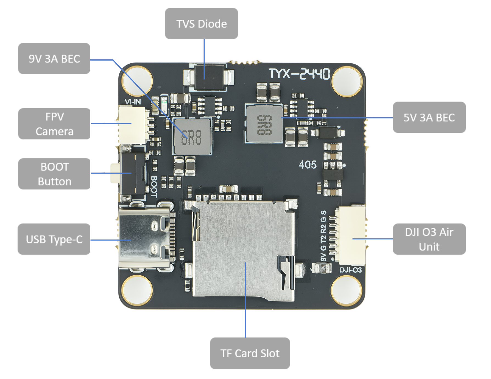

# CORVON405V2.1 Flight Controller

The CORVON405V2.1 is a flight controller produced by CORVON.

## Features

 - STM32F405 microcontroller
 - BMI088 IMU
 - SPL06 barometer
 - AT7456E OSD
 - 9V 3A BEC; 5V 3A BEC
 - SDCard
 - 6 UARTs
 - 10 PWM outputs
 - 1 SWD

## Physical

## UART Mapping

 - SERIAL0 -> USB
 - SERIAL1 -> UART1 (MAVLink 2,DMA-enabled)
 - SERIAL2 -> UART2 (DJI - VTX, TX only is DMA Enabled)
 - SERIAL3 -> UART3 (GPS)
 - SERIAL4 -> UART4 (MAVLink2,TX only is DMA Enabled)
 - SERIAL5 -> UART5 (ESC Telemetry,RX 5 only pinned out)
 - SERIAL6 -> UART6 (RCin, RX6 is inverted from SBUS pin, RX only is DMA Enabled)

## RC Input

The default RC input is configured on the UART6_RX input which is inverted from the SBUS pin. Other RC  protocols  should be applied at UART1 which has DMA, and set the :ref:`SERIAL1_PROTOCOL<SERIAL1_PROTOCOL>` ='23' and change :ref:`SERIAL6_PROTOCOL<>SERIAL6_PROTOCOL` to something other than '23'.

* CRSF/ELRS also requires a TX1 connection, in addition to RX1, and automatically provides telemetry.
* FPort requires connection to TX1 and :ref:`SERIAL1_OPTIONS<SERIAL1_OPTIONS>` set to "7". See :ref:common-FPort-receivers.
* SRXL2 requires a connection to TX2 and automatically provides telemetry. Set :ref:`SERIAL1_OPTIONS<SERIAL1_OPTIONS>` to “4”.

## OSD Support

The CORVON405V2.1 supports  internal analog OSD MAX7456. Simultaneous external HD OSD support is preconfigured on SERIAL6. See :ref:`common-msp-osd-overview-4.2` for more info.

## VTX Support

Both Analog and HD VTX connectors are provided. Pin 1 of the connector is 9v so be careful not to connect this to a peripheral requiring 5v. 

## PWM Output

The CORVON405V2.1 supports up to 10 PWM outputs.

Channels 1-8 support DShot. Channels 1-4 support bi-directional DShot.

PWM outputs are grouped and every  group must use the same output protocol:
1,2,5,6 are group1
3, 4 are group 2
7,8 are group 3
9,10 are in group 4

## Battery Monitoring

The board has a internal voltage sensor and connections on the ESC connector for an external current sensor input.
The voltage sensor can handle up to 6S LiPo batteries.

The default battery parameters are:

* :ref:`BATT_MONITOR<BATT_MONITOR>` = 4
* :ref:`BATT_VOLT_PIN<BATT_VOLT_PIN__AP_BattMonitor_Analog>` = 10
* :ref:`BATT_CURR_PIN<BATT_CURR_PIN__AP_BattMonitor_Analog>` = 11 (CURR pin)
* :ref:`BATT_VOLT_MULT<BATT_VOLT_MULT__AP_BattMonitor_Analog>` = 21.2
* :ref:`BATT_AMP_PERVLT<BATT_AMP_PERVLT__AP_BattMonitor_Analog>` = 40.2

## Compass

The CORVON405V2.1 does not have a built-in compass, but you can attach an external compass using I2C on the SDA and SCL connector.

## Ports Connector

## Loading Firmware
Firmware for these boards can be found at https://firmware.ardupilot.org in sub-folders labeled CORVON405V2.1.

Initial firmware load can be done with DFU by plugging in USB with the bootloader button pressed. Then you should load the "with_bl.hex" firmware, using your favorite DFU loading tool.

Once the initial firmware is loaded you can update the firmware using any ArduPilot ground station software. Updates should be done with the "*.apj" firmware files.
