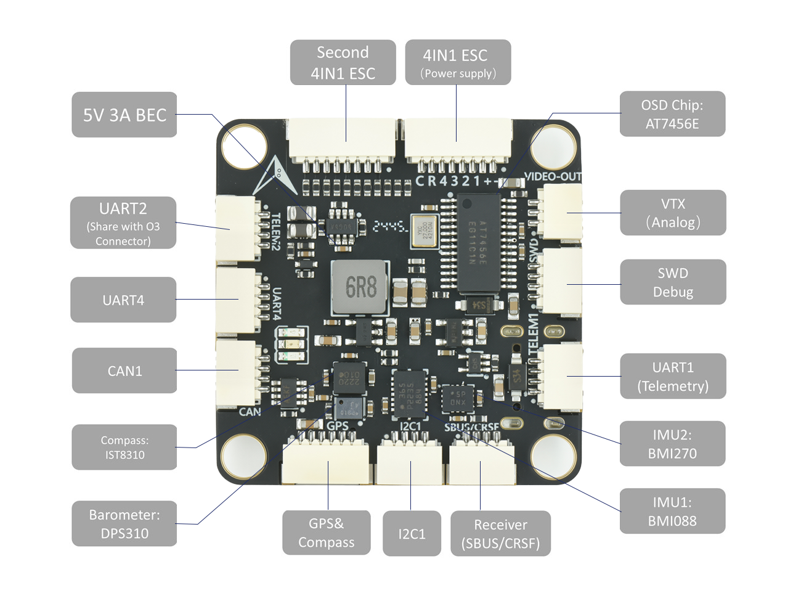
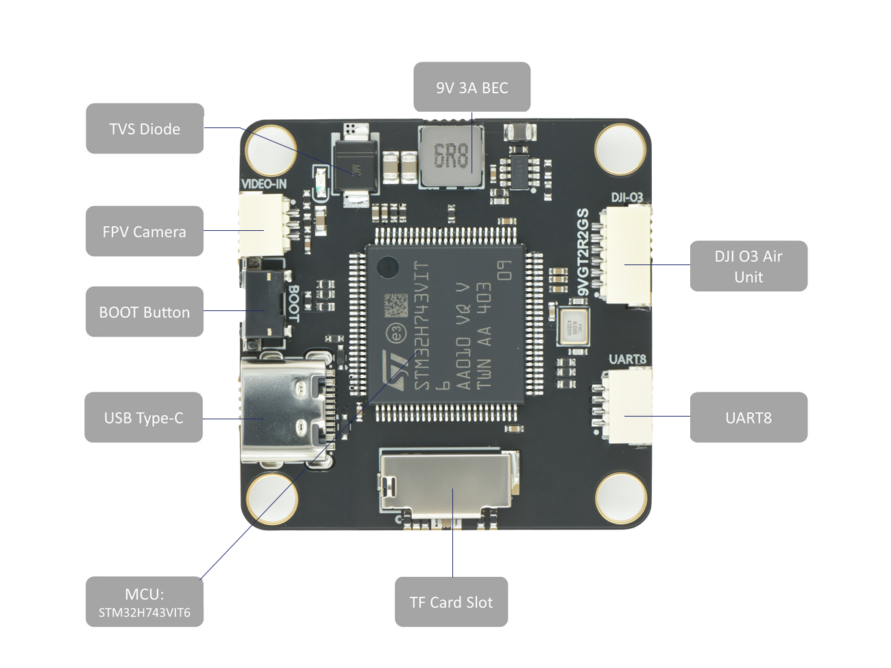
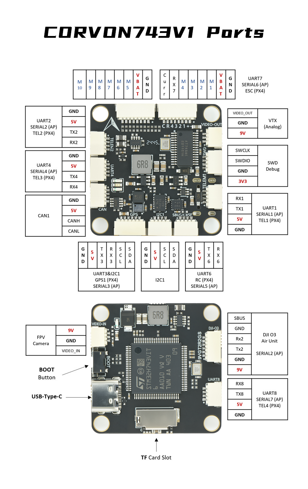

# CORVON743V1 Flight Controller

The CORVON743V1 is a flight controller designed and produced by [CORVON]

## Features

 - STM32H743 microcontroller
 - BMI088/BMI270 dual IMUs
 - DPS310 barometer
 - IST8310 magnetometer
 - AT7456E OSD
 - 9V 3A BEC; 5V 3A BEC
 - MicroSD Card Slot
 - 7 UARTs
 - 10 PWM outputs
 - 1 CAN
 - 1 I2C
 - 1 SWD

## Physical

## UART Mapping

 - SERIAL0 -> USB
 - SERIAL1 -> UART1 (MAVLink2, DMA-enabled)
 - SERIAL2 -> UART2 (DisplayPort, DMA-enabled)
 - SERIAL3 -> UART3 (GPS, DMA-enabled)
 - SERIAL4 -> UART4 (MAVLink2, DMA-enabled)
 - SERIAL5 -> UART6 (RCIN, DMA-enabled)
 - SERIAL6 -> UART7 (RX only, ESC Telemetry, DMA-enabled)
 - SERIAL7 -> UART8 (User, DMA-enabled)

## RC Input

The default RC input is configured on the UART6. The SBUS pin is inverted and connected to RX6. Non SBUS, single wire serial inputs can be directly tied to RX6 if SBUS pin is left unconnected. RC could  be applied instead to a different UART port such as UART1, UART4 or UART8, and set the protocol to receive RC data ``SERIALn_PROTOCO`` =23 and change :ref:`SERIAL5 _PROTOCOL <SERIAL5 _PROTOCOL>` to something other than '23'. For rc protocols other than unidirectional, the TX6 pin will need to be used:

 - :ref:`SERIAL5_PROTOCOL<SERIAL5_PROTOCOL>` should be set to "23".
 - FPort would require :ref:`SERIAL5_OPTIONS<SERIAL5_OPTIONS>` be set to "15".
 - CRSF would require :ref:`SERIAL5_OPTIONS<SERIAL5_OPTIONS>` be set to "0".
 - SRXL2 would require :ref:`SERIAL5_OPTIONS<SERIAL5_OPTIONS>` be set to "4" and connects only the TX pin.

## OSD Support

The CORVON743V1 supports onboard OSD using OSD_TYPE 1 (MAX7456 driver). Simultaneously, DisplayPort OSD is available on the HD VTX connector, See below.

## VTX Support

The SH1.0-6P connector supports a DJI Air Unit / HD VTX connection. Protocol defaults to DisplayPort. Pin 1 of the connector is 9v so be careful not to connect this to a peripheral that can not tolerate this voltage.

## PWM Output

The CORVON743V1 supports up to 10 PWM outputs. All outputs support PWM, DShot, and Bi-Directional DShot.

PWM outputs are grouped and every group must use the same output protocol:

1, 2, 3, 4 are Group 1;

5, 6 are Group 2;

7, 8, 9, 10 are Group 3;

## Battery Monitoring

The board has a internal voltage sensor and connections on the ESC connector for an external current sensor input.
The voltage sensor can handle up to 6S LiPo batteries.

The default battery parameters are:

 - :ref:BATT_MONITOR<BATT_MONITOR> = 4
 - :ref:BATT_VOLT_PIN<BATT_VOLT_PIN__AP_BattMonitor_Analog> = 10
 - :ref:BATT_CURR_PIN<BATT_CURR_PIN__AP_BattMonitor_Analog> = 11 (CURR pin)
 - :ref:BATT_VOLT_MULT<BATT_VOLT_MULT__AP_BattMonitor_Analog> = 21.12
 - :ref:BATT_AMP_PERVLT<BATT_AMP_PERVLT__AP_BattMonitor_Analog> = 40.2

## Compass

The CORVON743V1 has a built-in compass sensor (IST8310), and you can also attach an external compass using I2C on the SDA and SCL connector.

## Mechanical

 - Mounting: 30.5 x 30.5mm, Φ4mm
 - Dimensions: 36 x 36 x 8 mm
 - Weight: 9g

## Ports Connector

## Loading Firmware

Firmware for these boards can be found `here <https://firmware.ardupilot.org>`__ in sub-folders labeled "CORVON743V_1".

Initial firmware load can be done with DFU by plugging in USB with the bootloader button pressed. Then you should load the "with_bl.hex" firmware, using your favorite DFU loading tool.

Once the initial firmware is loaded you can update the firmware using any ArduPilot ground station software. Updates should be done with the "*.apj" firmware files.
