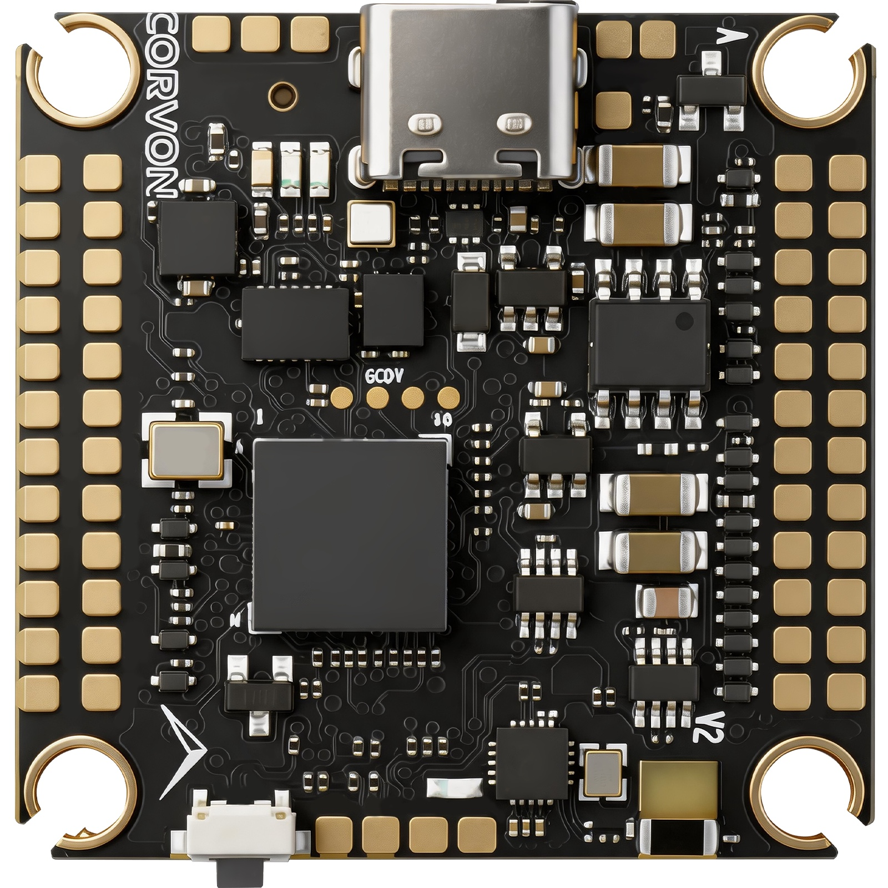
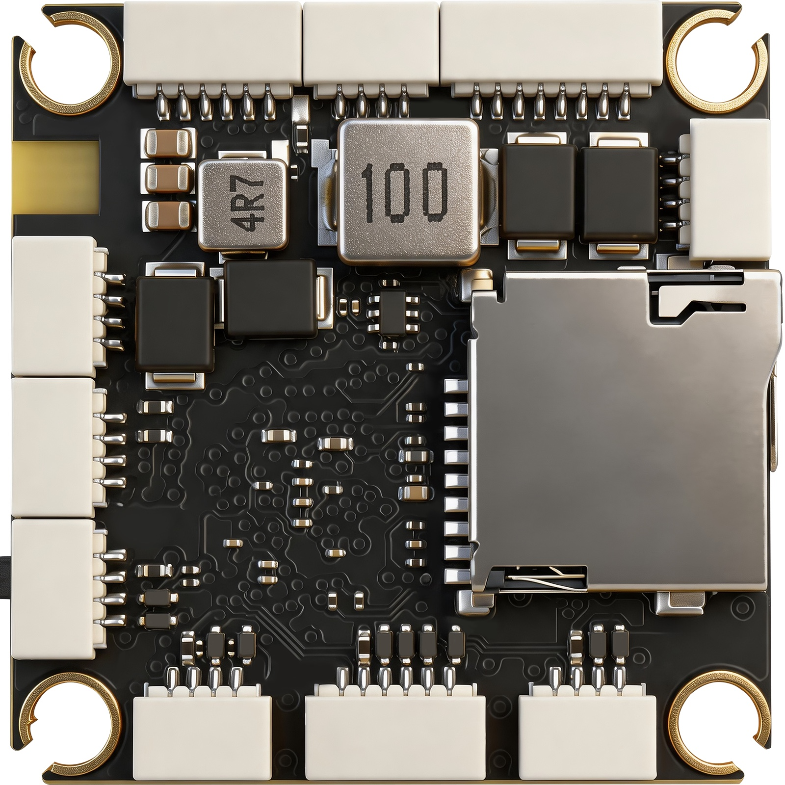

# CORVON 743V2 Flight Controller

The CORVON 743V2 is a flight controller with 10 motor outputs and 2 servo
outputs, built around the STM32H743VIH6 (TFBGA100, 2 MB Flash, 1 MB RAM,
Cortex-M7 @ 480 MHz).

## Features

- MCU: STM32H743VIH6 (Cortex-M7 @ 480 MHz, 2 MB Flash, 1 MB RAM)
- IMU: ICM-42688P + BMI088 on SPI3
- Barometer: BMP581 on internal I2C2
- Compass: IST8310 on internal I2C2
- 10 × DShot motor outputs (bidirectional DShot on outputs 1-8) + 2 × PWM servo outputs
- 8 UARTs + USB + FDCAN1 (DroneCAN)
- Dual analog battery monitoring
- Analog airspeed input
- Analog RSSI input
- microSD (SDMMC1, 4-bit) for onboard logging
- Passive piezo buzzer
- RGB status LED + WS2812 serial LED (NeoPixel) output
- 4 user GPIO pads (SW1-SW4)

## Physical





## UART Mapping

| Port    | UART   | Default Protocol         | Connector       |
|---------|--------|--------------------------|-----------------|
| SERIAL0 | USB    | MAVLink2                 | USB-C           |
| SERIAL1 | USART1 | MAVLink2                 | TELEM1          |
| SERIAL2 | USART2 | MSP DisplayPort (DJI O4) | O4-AIR          |
| SERIAL3 | USART3 | GPS                      | GPS             |
| SERIAL4 | UART4  | MAVLink2                 | TELEM2          |
| SERIAL5 | UART5  | None (user aux)          | UART5 pads      |
| SERIAL6 | USART6 | RCIN                     | RCIN            |
| SERIAL7 | UART7  | ESC telemetry            | UART7 pads      |
| SERIAL8 | UART8  | MAVLink2 @ 115200        | Bluetooth       |

The O4-AIR connector is a 6-pin header that plugs straight into a DJI O4 / O3
Air Unit: USART2 carries the MSP DisplayPort link, the SBUS pin is wired to the
RC input on USART6 (see RC Input), and the remaining pins supply power and ground.

SERIAL8 (UART8) is the onboard Bluetooth module (Bluetooth Classic / SPP),
configured as MAVLink2 at 115200 baud by default.

## RC Input

RC input is on the RCIN connector (USART6) and supports SBUS, CRSF, ELRS,
and other UART-based protocols. See
[RC systems](https://ardupilot.org/copter/docs/common-rc-systems.html) for
the full list.

## OSD Support

The default configuration sets `OSD_TYPE = 5` (MSP DisplayPort) on
SERIAL2 (O4-AIR), so a DJI O4 / O3 Air Unit renders the OSD overlay
without any additional setup. The board has no onboard analog OSD chip and
no SPI bus broken out for one, so analog video OSD is not supported.

## PWM Output

The CORVON 743V2 provides 12 motor/servo outputs in four timer groups, plus a
serial-LED output:

- PWM 1-4 (TIM1, motors): DShot, bidirectional
- PWM 5-6 (TIM3, motors): DShot, bidirectional
- PWM 7-10 (TIM4, motors): DShot, bidirectional on PWM 7-8 (PWM 9-10 output-only)
- PWM 11-12 (TIM12, servos): standard PWM only (no DMA)
- PWM 13 (TIM2): WS2812 serial LED / NeoPixel (see LEDs)

Bidirectional DShot on outputs 1-8 provides ESC RPM telemetry. Channels in the
same timer group must share the same output rate and DShot mode.

## LEDs

The board has a GPIO-driven RGB status LED used by the ArduPilot notify system.

A WS2812 serial LED (NeoPixel) output is broken out on the
`LED+ / LED_STRIP / LED-` header: `LED+` is 5V, `LED_STRIP` is the data signal
(PWM 13, TIM2_CH1) and `LED-` is ground. It is enabled by default
(`SERVO13_FUNCTION = 120` with the NeoPixel bit set in `NTF_LED_TYPES`), so a
strip lights up out of the box; set `NTF_LED_LEN` to the number of LEDs on your
strip (default 1).

## GPIOs

The motor/servo outputs and the four `SW` pads are available as ArduPilot GPIOs
(for relays, PINIO, etc.). `SW1`-`SW4` are general-purpose user pads, not a
dedicated safety switch.

| Label | GPIO |
|-------|------|
| M1    | 50   |
| M2    | 51   |
| M3    | 52   |
| M4    | 53   |
| M5    | 54   |
| M6    | 55   |
| M7    | 56   |
| M8    | 57   |
| M9    | 58   |
| M10   | 59   |
| M11   | 60   |
| M12   | 61   |
| M13   | 62   |
| SW1   | 70   |
| SW2   | 71   |
| SW3   | 72   |
| SW4   | 73   |

## Battery Monitoring

The board has two independent analog battery inputs for voltage and current,
broken out as the `BV`/`BI` pads (BATT1) and `B2V`/`B2I` pads (BATT2), with main
input power on the `B+`/`5VIN` pads. Default parameters:

- `BATT_MONITOR = 4` (analog voltage and current)
- `BATT_VOLT_PIN = 10`, `BATT_CURR_PIN = 11`
- `BATT_VOLT_MULT = 21.12`, `BATT_AMP_PERVLT = 40.2`
- `BATT2_MONITOR = 4`
- `BATT2_VOLT_PIN = 4`, `BATT2_CURR_PIN = 8`
- `BATT2_VOLT_MULT = 21.12`, `BATT2_AMP_PERVLT = 40.2`

The voltage and current scales should be tuned to match the specific power
module connected.

## Analog Inputs

In addition to the two battery monitors, the board exposes:

- Analog airspeed input on the `AS` pad (ADC1, analog pin 18; set `ARSPD_TYPE = 2` to enable)
- Analog RSSI input on the `RS` pad (ADC1, `RSSI_ANA_PIN = 3`; set `RSSI_TYPE = 1` to enable)

## Compass

The board has a built-in IST8310 magnetometer on the internal I2C2 bus. Users
normally disable this compass and use an external compass to avoid electrical
interference from the power system. External compasses on the GPS
connector (I2C1) are auto-detected via ArduPilot's normal compass probing.

## CAN

A single FDCAN1 interface is exposed on the CAN connector for DroneCAN
peripherals.

## Ports Connector


## Solder Pads


## Loading Firmware

Firmware images for this board are published under the `CORVON743V2`
sub-folder of [firmware.ardupilot.org](https://firmware.ardupilot.org).

The board ships with an ArduPilot bootloader, so `*.apj` firmware can be
flashed from any ArduPilot ground station. To update the bootloader itself,
flash `arducopter_with_bl.hex` (or the equivalent for your vehicle type) over
DFU using STM32CubeProgrammer.

## Building

```sh
./waf configure --board CORVON743V2
./waf copter      # or plane / rover / sub
```
