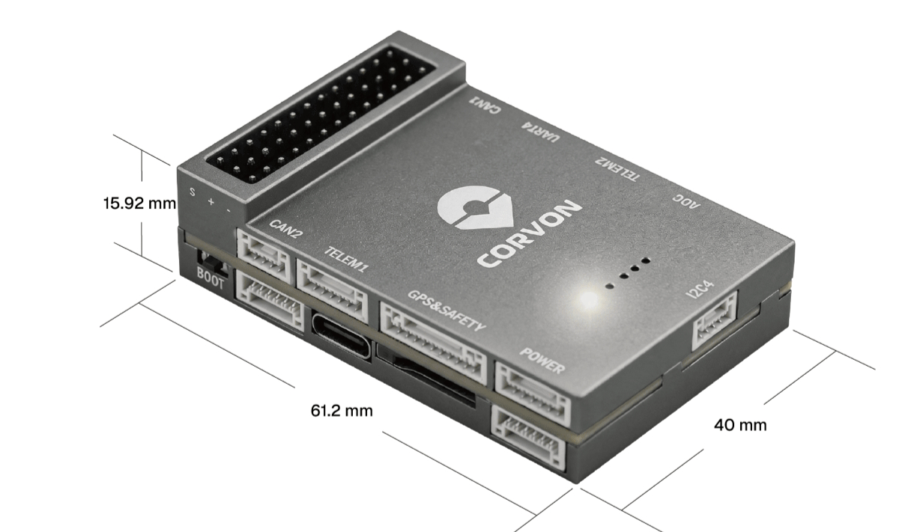
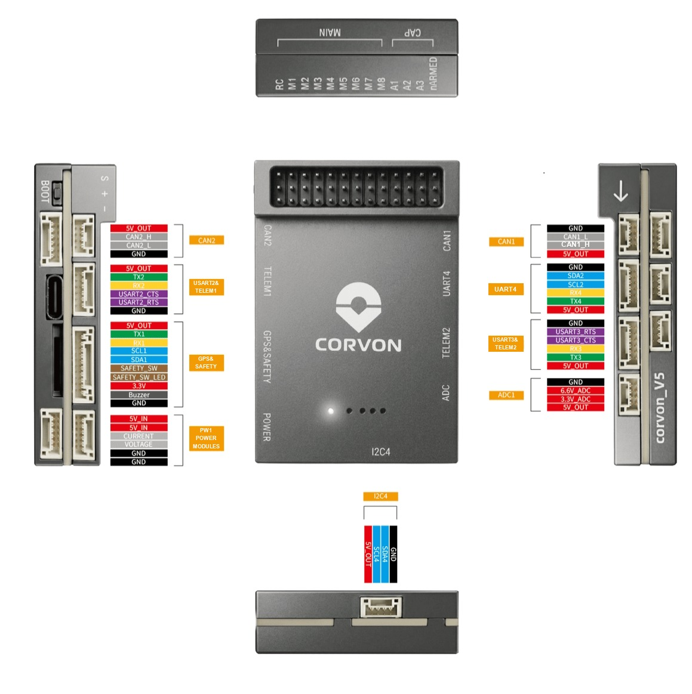
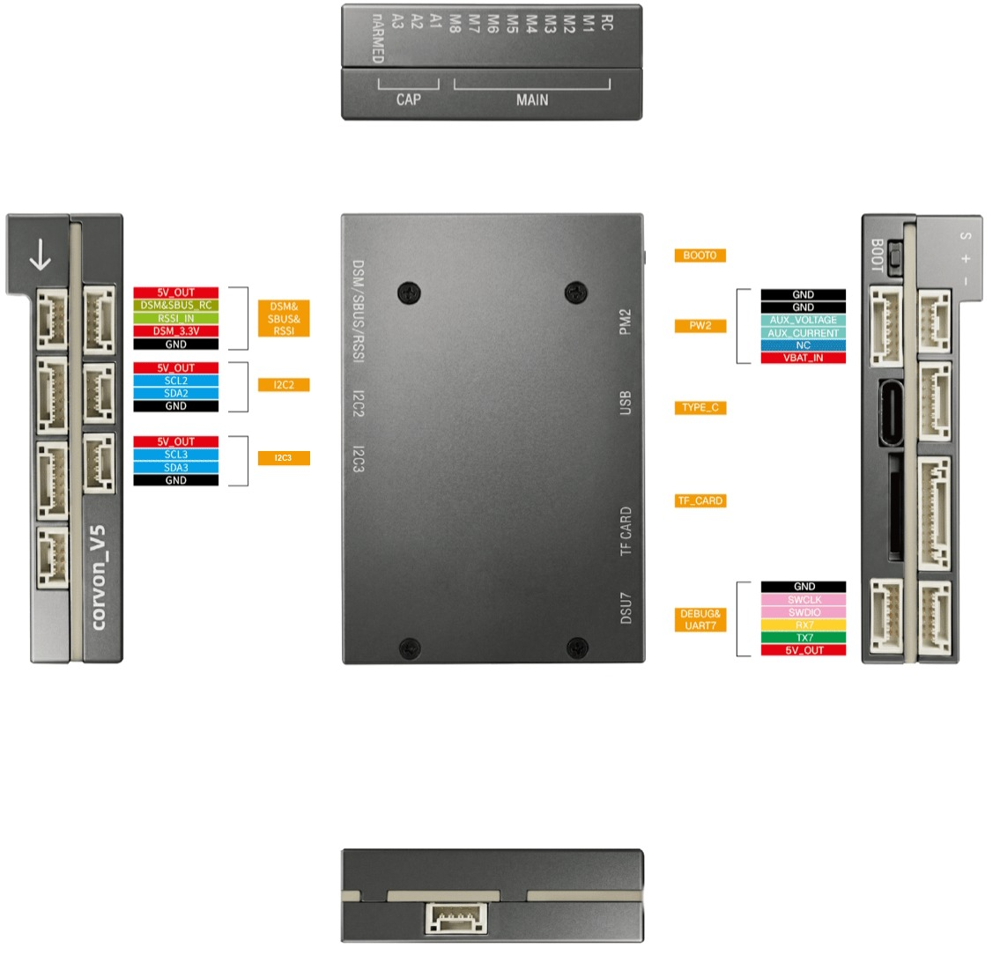

# CORVON V5 Flight Controller

The CORVON V5 is a flight controller built to the Pixhawk FMUv5 design
standard, around the STM32F765 (Cortex-M7 @ 216 MHz, 2 MB Flash,
512 KB RAM). It follows the FMUv5 "nano" layout and has no IOMCU.

## Features

- MCU: STM32F765IIK6 (Cortex-M7 @ 216 MHz, 2 MB Flash, 512 KB RAM)
- Three IMUs: ICM-20689, ICM-20602 and BMI088 (SPI1)
- Barometer: MS5611
- Compass: IST8310 (internal I2C)
- 32 KB FRAM (RAMTRON) for parameter storage
- 8 main PWM outputs plus 3 auxiliary PWM channels (TIM2)
- 7 serial ports (2 over USB)
- 2 CAN buses (DroneCAN)
- Dual analog battery monitoring (voltage and current)
- Analog RSSI input
- microSD card slot for logging
- Safety switch, passive buzzer, RGB and A/B status LEDs

## UART Mapping

| Port    | UART   | Default Protocol | Connector             |
|---------|--------|------------------|-----------------------|
| SERIAL0 | USB    | MAVLink2         | USB-C                 |
| SERIAL1 | USART2 | MAVLink2         | TELEM1 (flow control) |
| SERIAL2 | USART3 | MAVLink2         | TELEM2 (flow control) |
| SERIAL3 | USART1 | GPS              | GPS1                  |
| SERIAL4 | UART4  | GPS              | GPS2 / I2C            |
| SERIAL6 | UART7  | None             | Debug console         |
| SERIAL7 | USB    | MAVLink2         | Secondary USB         |

TELEM1 (USART2) and TELEM2 (USART3) have CTS/RTS flow control; the other
ports do not. Only USART2 and USART3 have DMA capability.

## RC Input

RC input is on the RC pin, which is also brought out on the DSM/SBUS/RSSI
connector. It supports unidirectional ArduPilot RC protocols (PPM, SBUS,
DSM/Spektrum, etc.). A Spektrum/DSM satellite can be powered from the
board (power is switchable).

For bi-directional protocols, like CRSF/ELRS, the receiver must be
connected to a UART with DMA, like USART2 or USART3. See
[RC Systems](https://ardupilot.org/plane/docs/common-rc-systems.html) for
more information on setup.

## PWM Output

The CORVON V5 has 8 main PWM outputs in three groups (labeled M1-M8),
plus 3 auxiliary outputs (labeled A1-A3):

- M1-4 group1
- M5-6 group2
- M7-8 group3
- A1-3 group4

Channels in the same group must use the same output rate. DShot is
available on M1-6 and A1-3; M7-8 are PWM-only.

## GPIOs

The PWM output pads can also be used as GPIOs (relays, camera triggers,
etc.) using the GPIO numbers below:

| Pin | GPIO | Pin | GPIO |
|-----|------|-----|------|
| M1  | 50   | M7  | 56   |
| M2  | 51   | M8  | 57   |
| M3  | 52   | A1  | 58   |
| M4  | 53   | A2  | 59   |
| M5  | 54   | A3  | 60   |
| M6  | 55   |     |      |

The nARMED pad (next to A3) is high while disarmed and driven low when
the vehicle is armed.

## Battery Monitoring

The board has two analog battery inputs for voltage and current. Set
`BATT_MONITOR = 4` (and `BATT2_MONITOR = 4` for the second input) to
enable analog voltage and current; the board defaults the sense pins
and scales:

- `BATT_VOLT_PIN = 0`, `BATT_CURR_PIN = 1`
- `BATT2_VOLT_PIN = 2`, `BATT2_CURR_PIN = 3`
- `BATT_VOLT_MULT = 18.0`, `BATT_AMP_PERVLT = 24.0`

The scales should be tuned to the power module actually fitted.

## Compass

The board has a built-in IST8310 magnetometer on the internal I2C bus.
Users normally disable this internal compass and fit an external compass
to avoid magnetic interference from the power wiring. External compasses
on the GPS connectors are auto-detected.

## Analog Inputs

- Analog RSSI input on PB0 (`RSSI_ANA_PIN = 8`); set `RSSI_TYPE = 1` to
  enable.
- Battery voltage and current sense (see Battery Monitoring).

## CAN

Two CAN buses are exposed for DroneCAN peripherals, each with a
switchable silent control.

## Physical

## Pinout

## Loading Firmware

The board ships with an ArduPilot-compatible bootloader, so `*.apj`
firmware files can be flashed from any ArduPilot-compatible ground
station.

Firmware images are published under the `CORVON_V5` folder of
[firmware.ardupilot.org](https://firmware.ardupilot.org).
