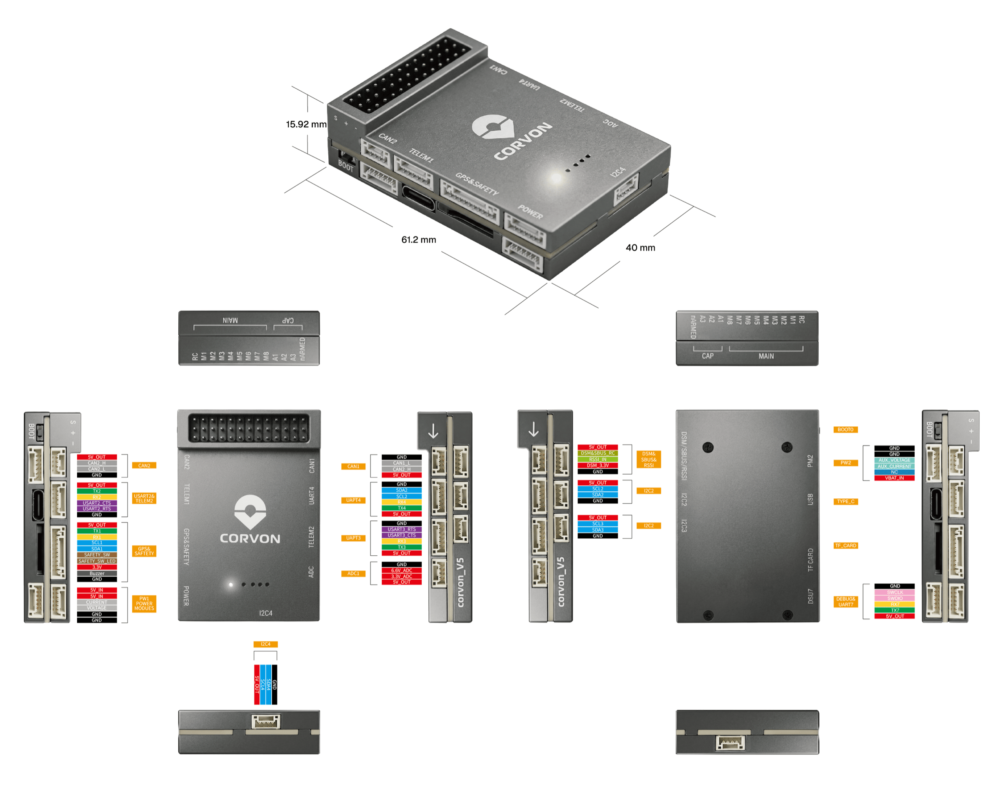

# CORVON V5 Flight Controller

The CORVON V5 is a flight controller built to the Pixhawk FMUv5 design
standard, around the STM32F765 (Cortex-M7 @ 216 MHz, 2 MB Flash,
512 KB RAM). It follows the FMUv5 "nano" layout and has no IOMCU.


## Features

- MCU: STM32F765IIK6 (Cortex-M7 @ 216 MHz, 2 MB Flash, 512 KB RAM)
- Three IMUs: ICM-20689, ICM-20602 and BMI088 (SPI1)
- Barometer: MS5611
- Compass: IST8310 (internal I2C)
- 32 KB FRAM (RAMTRON) for parameter storage
- Onboard IMU heater
- 8 main PWM outputs plus 3 auxiliary PWM channels (TIM2)
- 8 serial ports (2 over USB)
- 2 CAN buses (DroneCAN)
- Dual analog battery monitoring (voltage and current)
- Analog RSSI input
- microSD card slot for logging
- Safety switch, passive buzzer, RGB and A/B status LEDs

## UART Mapping

| Port    | UART   | Default Protocol | Connector             |
|---------|--------|------------------|-----------------------|
| SERIAL0 | USB    | MAVLink2         | USB-C                 |
| SERIAL1 | USART2 | MAVLink2         | TELEM1 (flow control) |
| SERIAL2 | USART3 | MAVLink2         | TELEM2 (flow control) |
| SERIAL3 | USART1 | GPS              | GPS1                  |
| SERIAL4 | UART4  | GPS              | GPS2 / I2C            |
| SERIAL5 | USART6 | None             | spare, TX only        |
| SERIAL6 | UART7  | None             | Debug console         |
| SERIAL7 | USB    | MAVLink2         | Secondary USB         |

TELEM1 (USART2) and TELEM2 (USART3) have CTS/RTS flow control; the other
ports do not. As this is a no-IOMCU variant, USART6 (SERIAL5) only has its
TX pin wired and is exposed as a transmit-only spare port.

## RC Input

RC input is on the RC connector, wired to the dedicated RC input pin. It
supports all the usual ArduPilot RC protocols (PPM, SBUS, DSM/Spektrum,
SRXL2, CRSF, etc.). A Spektrum/DSM satellite can be powered from the board
(power is switchable).

## PWM Output

The CORVON V5 has 8 main PWM outputs in three groups, plus 3 auxiliary
channels on TIM2:

- PWM 1-4 (TIM1)
- PWM 5-6 (TIM4)
- PWM 7-8 (TIM12, no DMA)
- PWM 9-11 (TIM2, auxiliary)

Channels in the same group must use the same output rate. DShot is
available on the DMA-capable groups (PWM 1-6); PWM 7-8 are PWM-only as
TIM12 has no DMA option.

## GPIOs

The PWM output pads can also be used as GPIOs (relays, camera triggers,
etc.) using the GPIO numbers below:

| Pin  | GPIO | Pin   | GPIO |
|------|------|-------|------|
| PWM1 | 50   | PWM7  | 56   |
| PWM2 | 51   | PWM8  | 57   |
| PWM3 | 52   | PWM9  | 58   |
| PWM4 | 53   | PWM10 | 59   |
| PWM5 | 54   | PWM11 | 60   |
| PWM6 | 55   |       |      |

## Battery Monitoring

The board has two analog battery inputs for voltage and current. Set
`BATT_MONITOR = 4` to enable analog voltage and current; the board
defaults the sense pins and scales:

- `BATT_VOLT_PIN = 0`, `BATT_CURR_PIN = 1`
- `BATT2_VOLT_PIN = 2`, `BATT2_CURR_PIN = 3`
- `BATT_VOLT_MULT = 18.0`, `BATT_AMP_PERVLT = 24.0`

The scales should be tuned to the power module actually fitted.

## Compass

The board has a built-in IST8310 magnetometer on the internal I2C bus.
Users normally disable this internal compass and fit an external compass
to avoid magnetic interference from the power wiring. External compasses
on the GPS connectors are auto-detected.

## Analog Inputs

- Analog RSSI input on PB0 (`RSSI_ANA_PIN = 8`); set `RSSI_TYPE = 1` to
  enable.
- Battery voltage and current sense (see Battery Monitoring).

## CAN

Two CAN buses are exposed for DroneCAN peripherals, each with a
switchable silent control.

## Connectors



## Pinout

The full pin map is in [CORVON_V5_Pinout.xlsx](CORVON_V5_Pinout.xlsx).

## Loading Firmware

The board ships with an ArduPilot-compatible bootloader, so `*.apj`
firmware files can be flashed from any ArduPilot-compatible ground
station. To update the bootloader itself, flash
`arducopter_with_bl.hex` (or the equivalent for your vehicle type) over
DFU using STM32CubeProgrammer.

Firmware images are published under the `CORVON_V5` folder of
[firmware.ardupilot.org](https://firmware.ardupilot.org).

## Building

```sh
./waf configure --board CORVON_V5
./waf copter      # or plane / rover / sub
```
