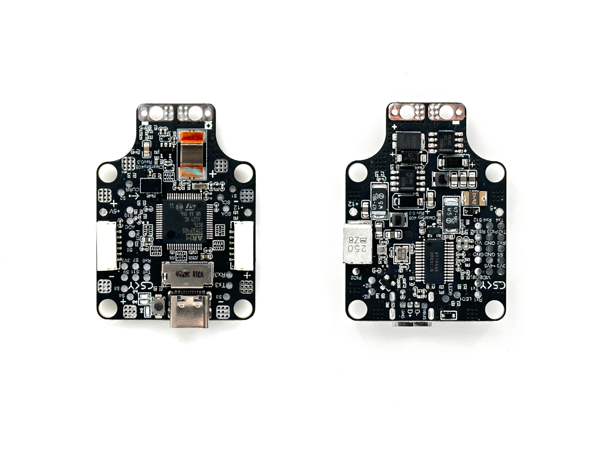
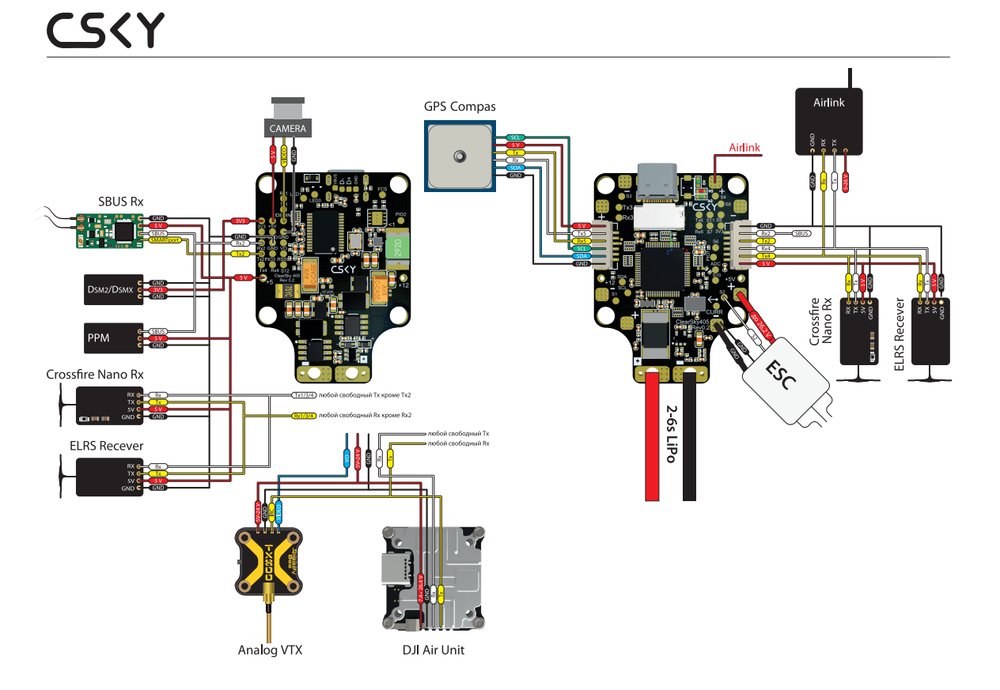

# CSKY405 Flight Controller

The CSKY405 is a flight controller produced by [ClearSky](http://csky.space/products/csky_405).

## Features
    Processor
        STM32F405 168Mhz, 1MB 32-bit processor
        AT7456E OSD
    Sensors
        BMI088 Acc/Gyro
        BMP390 barometer
    Power
        2S - 6S Lipo input voltage with voltage monitoring
        90A Cont., 215A peak current monitor
        12V, 2A BEC for powering Video Transmitter controlled by GPIO
        5V, 2.5A BEC for internal and peripherals
    Interfaces
        10x PWM outputs DShot capable
        1x RC input
        6x UARTs/serial for GPS and other peripherals
        I2C port for external compass, airspeed, etc.
        microSDCard for logging, etc.
        USB-C port
  
## Overview

## Wiring Diagram

## UART Mapping

The UARTs are marked Rn and Tn in the above pinouts. The Rn pin is the
receive pin for UARTn. The Tn pin is the transmit pin for UARTn.

 - SERIAL0 -> USB
 - SERIAL1 -> UART4  (MAVLink2 telem)
 - SERIAL2 -> USART1 (Serial RC input) (DMA capable)
 - SERIAL3 -> UART5  (GPS)
 - SERIAL4 -> USART3 (User) (TX DMA capable)
 - SERIAL5 -> USART6 (User) (TX DMA capable)
 - SERIAL6 -> USART2(DMA Capable) (RX2 normally only used for single wire RC inputs (SBUS)PPM,etc.)t, but can be used as normal UART if :ref:`BRD_ALT_CONFIG<>` =1) 

## RC Input

RC input is configured on the RX2 pin (inverted and sent to UART2_RX). It supports all single wire RC
protocols except serial protocols such as CRSF, ELRS, etc. Instead, these devices can be connected using both TX2 and RX2 if if :ref:`BRD_ALT_CONFIG<BRD_ALT_CONFIG>` =1 and :ref:`SERIAL6_PROTOCOL<SERIAL6_PROTOCOL>` set to "23".

   
## OSD Support

The CSKY405 supports using its internal OSD using OSD_TYPE 1 (MAX7456 driver). External OSD support such as DJI or DisplayPort is supported using USART6 or any other free Uaet. See :ref:`common-msp-osd-overview-4.2` for more info.

## PWM Output

The CSKY405 supports up to 10 PWM outputs. All outputs support DShot.

The PWM is in 5 groups:

 - PWM 1 in group1
 - PWM 2 in group2
 - PWM 3,4 in group3
 - PWM 5,6,10 in group4
 - PWM 7 in group5
 - PWM 8,9 in group6

## Battery Monitoring

The board has a builting voltage and current sensors. The current
sensor can read up to 90A continuosly, 215 Amps peak. The voltage sensor can handle up to 6S
LiPo batteries.

The correct battery setting parameters are set by default and are:

 - BATT_MONITOR 4
 - BATT_VOLT_PIN 14
 - BATT_CURR_PIN 7
 - BATT_VOLT_MULT 21.0
 - BATT_AMP_PERVLT 10.35

## Compass

The CSKY405 does not have a built-in compass, but you can attach an external compass using I2C on the SDA and SCL pads.

## VTX power control

GPIO 84 controls the VTX BEC output to pins marked "12V". Setting this GPIO high removes voltage supply to pins.

## Loading Firmware
Firmware for these boards can be found at https://firmware.ardupilot.org in sub-folders labeled CSKY405.

Initial firmware load can be done with DFU by plugging in USB with the
boot button pressed. Then you should load the "CSKY405_bl.hex"
firmware, using your favourite DFU loading tool.

Subsequently, you can update firmware with Mission Planner.

