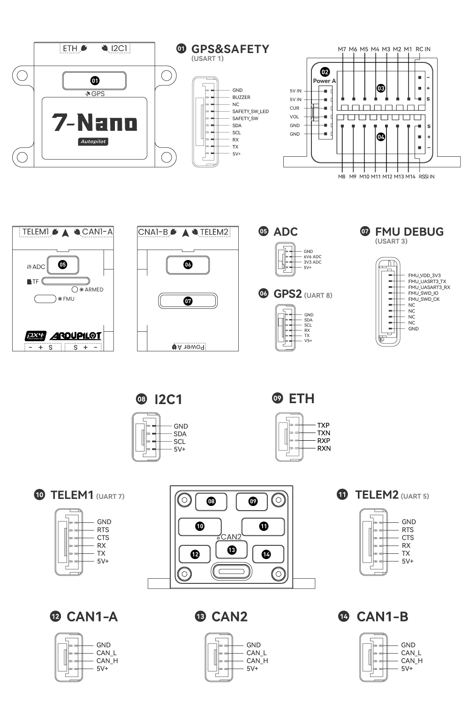

# CUAV-7-Nano Flight Controller

The CUAV-7-Nano flight controller produced by [CUAV](https://www.cuav.net).

## Features

- STM32H753 microcontroller
- 2 IMUs: IIM42652 and BMI088
- builtin IST8310 magnetometer
- 2 barometers: BMP581 and ICP20100
- microSD card slot
- USB-TypeC port
- 1 ETH network interface
- 5 UARTs plus USB
- 14 PWM outputs
- 3 I2C ports
- 3 CAN ports (two of which share a CAN bus and one is an independent CAN bus)
- Analog RSSI input
- 3.3V/5V configurable PWM output voltage

## Pinout

## UART Mapping

- SERIAL0 -> USB
- SERIAL1 -> UART7 (TELEM1)
- SERIAL2 -> UART5 (TELEM2)
- SERIAL3 -> USART1 (GPS&SAFETY)
- SERIAL4 -> UART8 (GPS2)
- SERIAL5 -> USART3 (FMU DEBUG)

The TELEM1 and TELEM2 ports have RTS/CTS pins, the other UARTs do not have RTS/CTS. All have full DMA capability.

## RC Input

RC input is configured on the RCIN pin, at one end of the servo rail, marked RCIN in the above diagram. All ArduPilot supported unidirectional RC protocols can be input here including PPM. For bi-directional or half-duplex protocols, such as CRSF/ELRS a full UART will have to be used.

## PWM Output

The CUAV-7-Nano flight controller supports up to 14 PWM outputs.

The 14 PWM outputs are in 6 groups:

- PWM 1-4 in group1 (TIM5)
- PWM 5 and 6 in group2 (TIM4)
- PWM 7 and 8 in group3 (TIM1)
- PWM 9, 10 and 11 in group4 (TIM8)
- PWM 12 in group5 (TIM15)
- PWM 13 and 14 in group6 (TIM12)

Channels within the same group need to use the same output rate. If any channel in a group uses DShot then all channels in the group need to use DShot. Outputs 1-4 support BDShot.

First first 8 PWM outputs of CUAV-7-Nano flight controller support switching between 3.3V voltage and 5V voltage output. It can be switched to 5V by setting GPIO 80 high by setting up a Voltage-Level Translator to control it.

## Battery Monitoring

The board has a dedicated power monitor ports on 6 pin connectors(POWER A). The correct battery setting parameters are dependent on the type of power brick which is connected.

## Compass

The CUAV-7-Nano has an IST8310 builtin compass, but due to interference the board is usually used with an external I2C compass as part of a GPS/Compass combination.

## Analog inputs

The CUAV-7-Nano has 6 analog inputs.

- ADC Pin9 -> Battery Voltage
- ADC Pin8 -> Battery Current Sensor
- ADC Pin5 -> Vdd 5V supply sense
- ADC Pin13 -> ADC 3.3V Sense
- ADC Pin12 -> ADC 6.6V Sense
- ADC Pin10 -> RSSI voltage monitoring

## Loading Firmware

Firmware for these boards can be found at https://firmware.ardupilot.org in sub-folders labeled "CUAV-7-Nano".

The board comes pre-installed with an ArduPilot compatible bootloader, allowing the loading of *.apj firmware files with any ArduPilot compatible ground station.
