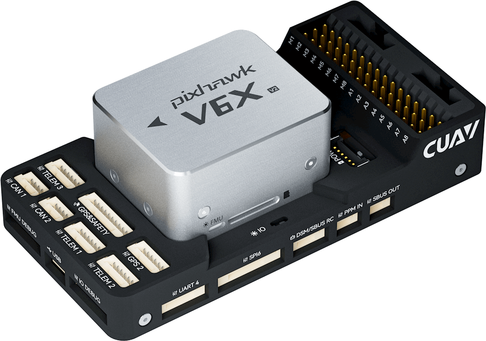
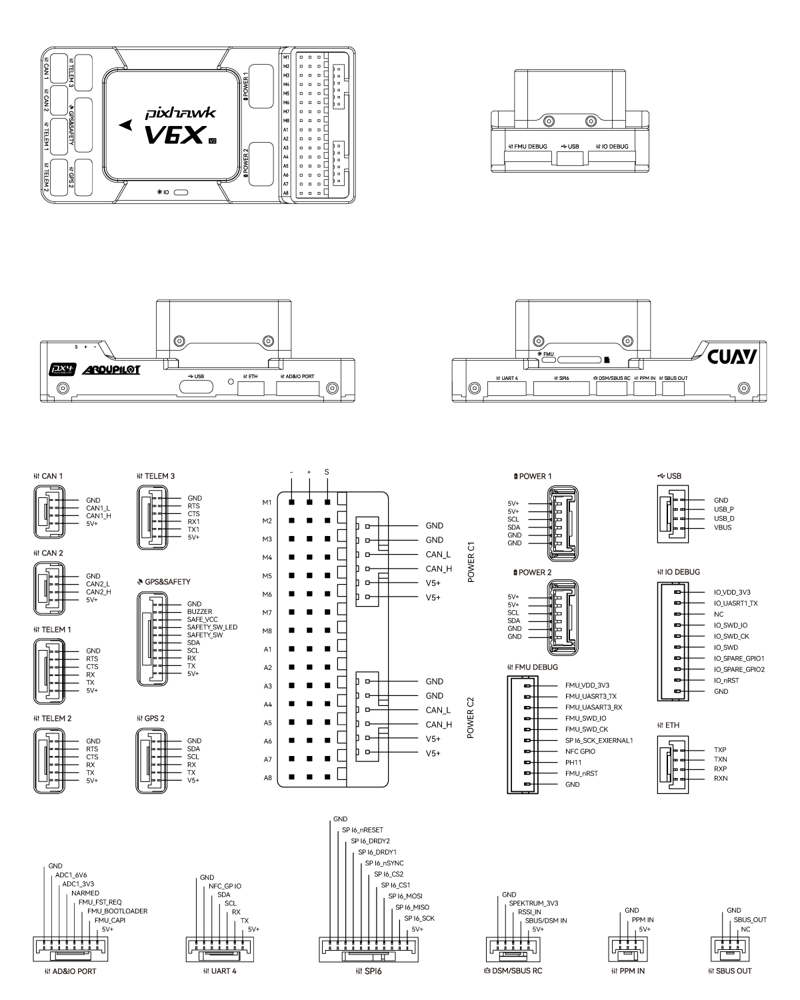

# CUAV-V6X-v2 Flight Controller

The CUAV-V6X-v2 flight controller produced by [CUAV](https://www.cuav.net).

The CUAV-V6X-v2 is based on the Pixhawk​​® Autopilot FMUv6X Standard, Autopilot Bus Standard, and connector Standard.

The CUAV-V6X-v2 is an upgraded version of CUAV-V6X flight controller. It has the following differences:

- First 8 PWM outputs support switching between 3.3V voltage and 5V voltage.
- Replace one of the ICP20100 barometer with BMP581.
- Replace ICM42688P with IIM42652 and ICM20649 with ICM45686.

## Pinout

## Features

- STM32H753 microcontroller
- 3 IMUs: IIM42652 and BMI088 and ICM45686
- builtin RM3100 magnetometer
- 2 barometers: BMP581 and ICP20100
- microSD card slot
- USB-TypeC port
- 1 ETH network interface
- 7 UARTs plus USB
- 16 PWM outputs
- 5 I2C ports (three I2C buses with five ports)
- 2 CAN ports (two independent CAN buses)
- Analog RSSI input
- 3.3V/5V configurable PWM output voltage

## UART Mapping

Default mapping and protocols are shown below.

- SERIAL0 -> USB
- SERIAL1 -> UART7 (TELEM1, MAVLink2)
- SERIAL2 -> UART5 (TELEM2, MAVLink2)
- SERIAL3 -> USART1 (GPS&SAFETY)
- SERIAL4 -> UART8 (GPS2)
- SERIAL5 -> USART2 (TELEM3, MAVLink2)
- SERIAL6 -> UART4 (UART4, None)
- SERIAL7 -> USART3 (FMU DEBUG, None)

The TELEM1, TELEM2 and TELEM3 ports have RTS/CTS pins, the other UARTs do not
have RTS/CTS.

The USART3 connector is labelled debug, but is available as a general purpose UART with ArduPilot.

## RC Input

RC input is configured on the port marked DSM/SBUS RC and PPM IN for all unidirectional protocols. For bi-directional or half duplex, a full UART should be used. See :ref:`common-rc-systems` for details for each protocol.

## PWM Output

The CUAV-V6X-v2 supports up to 16 PWM outputs. First 8 outputs (labelled M1 to M8) are the "main" outputs. It controlled by a dedicated STM32F103 IO controller. All support Bi-Directional DShot.

The remaining 8 outputs (labelled A1 to A8) are the "auxiliary" outputs. These are directly attached to the STM32H753 and support all PWM protocols. The first 6 of the auxiliary PWM outputs support BDShot.

The 8 main PWM outputs are in 3 groups:

 - PWM 1 and 2 in group1 (TIM2)
 - PWM 3 and 4 in group2 (TIM4)
 - PWM 5, 6, 7 and 8 in group3 (TIM3)

The 8 auxiliary PWM outputs are in 3 groups:

- PWM 1, 2, 3 and 4 in group1 (TIM5)
- PWM 5 and 6 in group2 (TIM4)
- PWM 7 and 8 in group3 (TIM12)

Channels within the same group need to use the same output rate. If any channel in a group uses DShot then all channels in the group need to use DShot.

The 8 main PWM outputs of CUAV-V6X-v2 flight controller support switching between 3.3V voltage and 5V voltage output. It can be switched to 5V by setting GPIO 81 high by setting up a Voltage-Level Translator to control it (set the :ref:`BRD_PWM_VOLT_SEL<BRD_PWM_VOLT_SEL>` parameter in ArduPilot).

## Battery Monitoring

The board has two dedicated power monitor ports on 6 pin connectors. The correct battery setting parameters are dependent on the type of power brick which is connected.

Digital DroneCAN/UAVCAN battery monitoring is enabled by default

## Compass

The CUAV-V6X-v2 has a RM3100 builtin compass, you can also attach external compass using I2C port.

## GPIOs

The auxiliary PWM ports and some pin can be used as GPIOs (relays, buttons, RPM etc). 

The numbering of the GPIOs for PIN variables in ArduPilot is:

- AUX1 50
- AUX2 51
- AUX3 52
- AUX4 53
- AUX5 54
- AUX6 55
- AUX7 56
- AUX8 57
- FMU_CAP1 58
- NFC_GPIO 60
- MAIN(1) 101
- MAIN(2) 102
- MAIN(3) 103
- MAIN(4) 104
- MAIN(5) 105
- MAIN(6) 106
- MAIN(7) 107
- MAIN(8) 108

## Analog inputs

The CUAV-V6X-v2 has 3 analog inputs

- ADC Pin13 -> ADC 3.3V Sense
- ADC Pin12 -> ADC 6.6V Sense
- ADC Pin103 -> RSSI voltage monitoring. Set :ref:`RSSI_TYPE<RSSI_TYPE>` = 1 and :ref:`RSSI_ANA_PIN<RSSI_ANA_PIN>` to 103 to analog RSSI input.

## CAN

The CUAV-V6X-v2 has two independent CAN buses.

## Loading Firmware

Firmware for these boards can be found at https://firmware.ardupilot.org in sub-folders labeled "CUAV-V6X-v2".

The board comes pre-installed with an ArduPilot compatible bootloader, allowing the loading of \*.apj firmware files with any ArduPilot compatible ground station.

## Further info

- [CUAV Docs](https://doc.cuav.net/)
- [Pixhawk Autopilot FMUv6X Standard](https://github.com/pixhawk/Pixhawk-Standards/blob/master/DS-012%20Pixhawk%20Autopilot%20v6X%20Standard.pdf)
- [Pixhawk Autopilot Bus Standard](https://github.com/pixhawk/Pixhawk-Standards/blob/master/DS-010%20Pixhawk%20Autopilot%20Bus%20Standard.pdf)
- [Pixhawk Connector Standard](https://github.com/pixhawk/Pixhawk-Standards/blob/master/DS-009%20Pixhawk%20Connector%20Standard.pdf)
