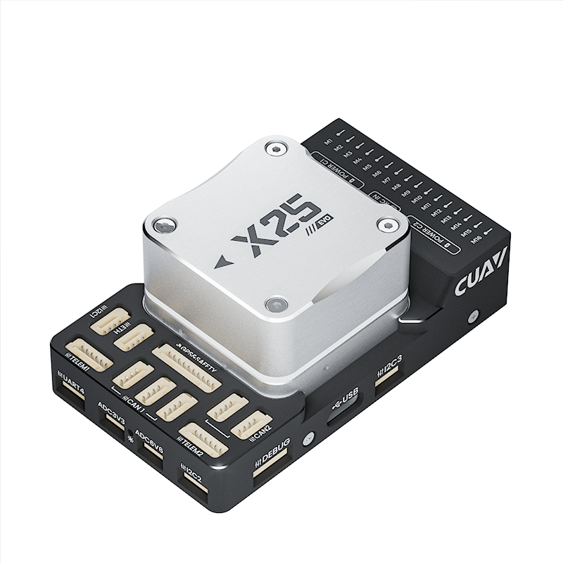
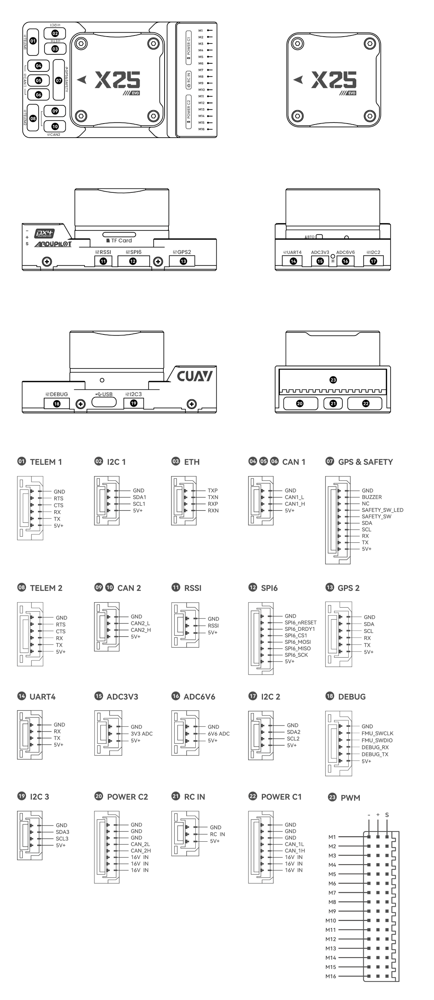

# CUAV-X25-EVO Flight Controller

The CUAV-X25-EVO flight controller produced by [CUAV](https://www.cuav.net).

## Features

- STM32H743 microcontroller
- 3 IMUs: one IIM42652 with an external crystal oscillator and two IIM42653
- builtin RM3100 magnetometer
- 2 barometers: BMP581 and ICP20100
- microSD card slot
- USB-TypeC port
- 1 ETH network interface
- 6 UARTs plus USB
- 16 PWM outputs
- 5 I2C ports (three I2C buses with five ports)
- 1 SPI port
- 5 CAN ports (three of which share a CAN bus and two for another CAN bus)
- 2 IMU heater
- builtin RGB LED
- builtin ARMED indication LED
- Analog RSSI input
- voltage monitoring for servo rail and Vcc
- 3.3V/5V configurable PWM output voltage

## Pinout

## UART Mapping

- SERIAL0 -> USB
- SERIAL1 -> UART7 (TELEM1)
- SERIAL2 -> UART5 (TELEM2)
- SERIAL3 -> USART1 (GPS1&SAFETY)
- SERIAL4 -> USART2 (GPS2)
- SERIAL5 -> UART4 (None, labelled UART4)
- SERIAL6 -> USART3 (None, labelled FMU DEBUG)
- SERIAL7 -> OTG2 (SLCAN)

The TELEM1 and TELEM2 ports have RTS/CTS pins, the other UARTs do not have RTS/CTS. All have full DMA capability.

The USART3 connector is labelled debug, but is available as a general purpose UART with ArduPilot.

## RC Input

All ArduPilot supported unidirectional RC protocols can be input on the port marked RC IN, including PPM. For bi-directional or half-duplex protocols, such as CRSF/ELRS a full UART will have to be used set to ``SERIALLx_PROTOCOL`` = 23. See :ref:`common-rc-systems` for more details.

## PWM Output

The CUAV-X25-EVO flight controller supports up to 16 PWM outputs.

The 16 PWM outputs are in 5 groups:

- PWM 1-4 in group1 (TIM5)
- PWM 5-8 in group2 (TIM4)
- PWM 9-11 in group3 (TIM1)
- PWM 12-14 in group4 (TIM8)
- PWM 15-16 in group5 (TIM12)

Channels within the same group need to use the same output rate. If any channel in a group uses DShot then all channels in the group need to use DShot. Outputs 1-8 support BDShot. Channel 15 and 16 only support PWM.

1-8 PWM outputs of CUAV-X25-EVO flight controller support switching between 3.3V voltage and 5V voltage output. It can be switched to 5V by setting GPIO 80 high by setting up a Voltage-Level Translator to control it (set the :ref:`BRD_PWM_VOLT_SEL<BRD_PWM_VOLT_SEL>` parameter in ArduPilot).

## Battery Monitoring

The board has two dedicated power monitor ports on 6 pin connectors.

Digital DroneCAN/UAVCAN battery monitoring is enabled by default.

## RSSI

CUAV-X25-EVO has an analog RSSI voltage monitoring input. Set parameter :ref:`RSSI_TYPE<RSSI_TYPE>` to 1 and :ref:`RSSI_ANA_PIN<RSSI_ANA_PIN>` to 10 to  use this. RC protocols which embed RSSI would use :ref:`RSSI_TYPE<RSSI_TYPE>` = 3.

## Compass

The CUAV-X25-EVO has an RM3100 builtin compass. If interference is experienced from nearby power circuitry, you can also attach an external compass using the I2C port and disable this internal compass.

## IMU

The CUAV-X25-EVO has 3 IMUs. one IIM42652 with an external crystal oscillator and two IIM42653. All these IMUs have heater.

## Analog inputs

The CUAV-X25-EVO has 3 analog inputs.

- ADC Pin13 -> ADC 3.3V sense
- ADC Pin12 -> ADC 6.6V sense
- ADC Pin10 -> RSSI voltage monitoring

## CAN

The CUAV-X25-EVO has two independent CAN buses. CAN1 has three ports and CAN2 has two ports.

## Loading Firmware

Firmware for these boards can be found at https://firmware.ardupilot.org in sub-folders labeled "CUAV-X25-EVO".

The board comes pre-installed with an ArduPilot compatible bootloader, allowing the loading of \*.apj firmware files with any ArduPilot compatible ground station.
